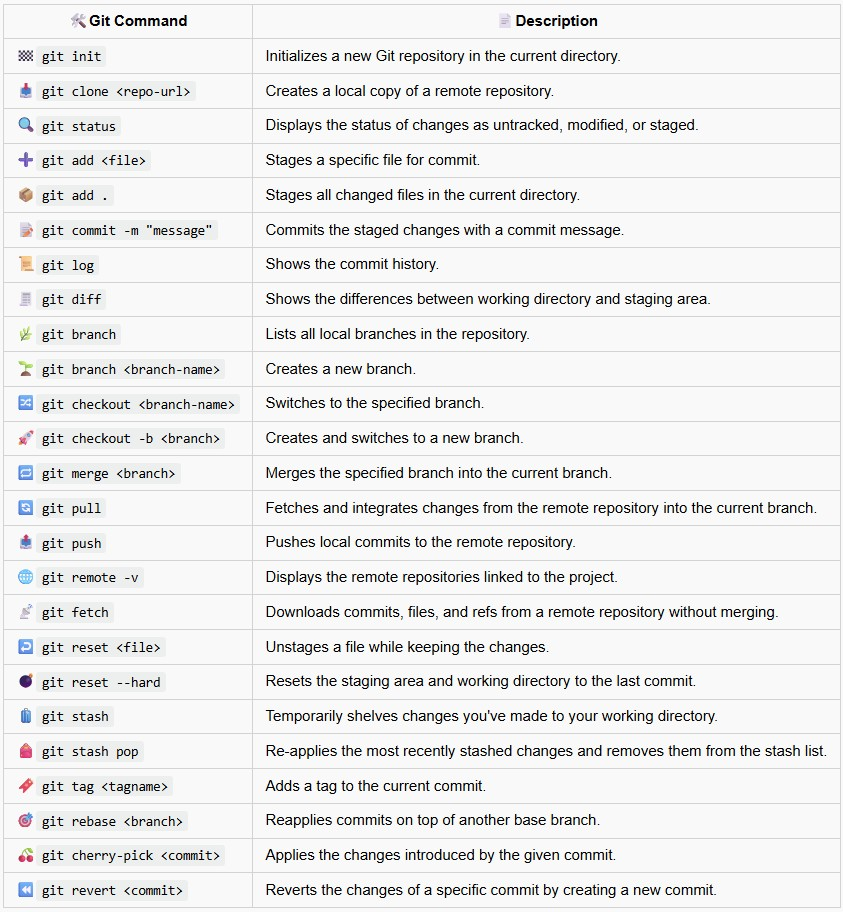
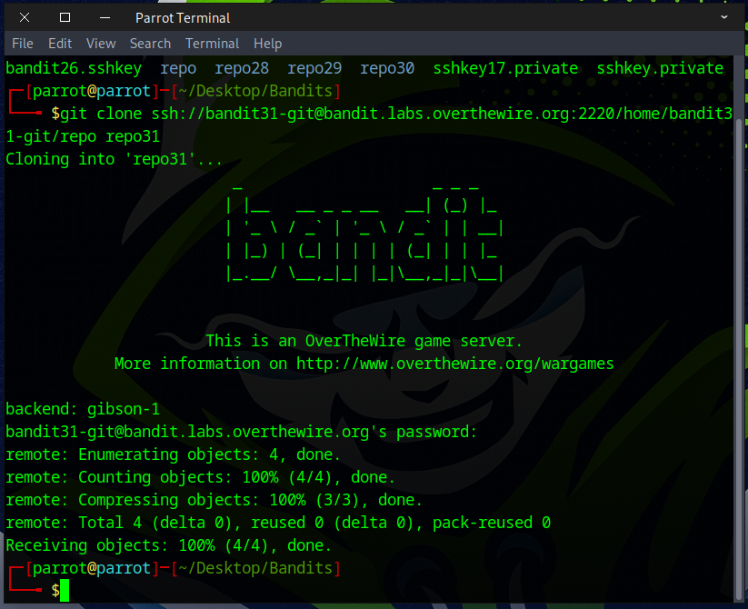

# Bandit Level 31 → Level 32

## Level Goal

There is a git repository at ssh://bandit31-git@bandit.labs.overthewire.org/home/bandit31-git/repo via the port 2220. The password for the user bandit31-git is the same as for the user bandit31.

Clone the repository and find the password for the next level.

## Commands you may need to solve this level

    git


### 🔑 Solution

### 📋 Useful Git Command


Navigate to the folder where you want to work using `cd`, and then use `git clone` to clone the *Bandit31* repository.
```
git clone ssh://bandit31-git@bandit.labs.overthewire.org:2220/home/bandit31-git/repo repo31
```


Input the password from the previous stage. It should function correctly, but if any errors occur, carefully review the message and your command.



For this challenge, you need to make a file named `key.txt` with the content ``"May I come In?"`` and upload it to the `master` branch of the *Bandit31* repository.


To achieve our goal for this challenge use the following command
```
echo "May I come in?" > key.txt
git add -f key.txt
git commit -m "Add key.txt"
git push origin master
```


Enter the password from the previous stage.


The flag for the next challenge should be visible to you.


Well done — you’ve discovered the flag needed for the next challenge.

