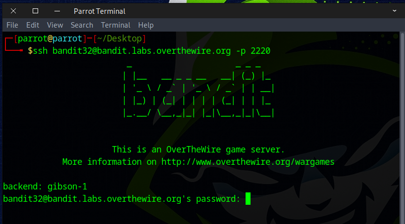
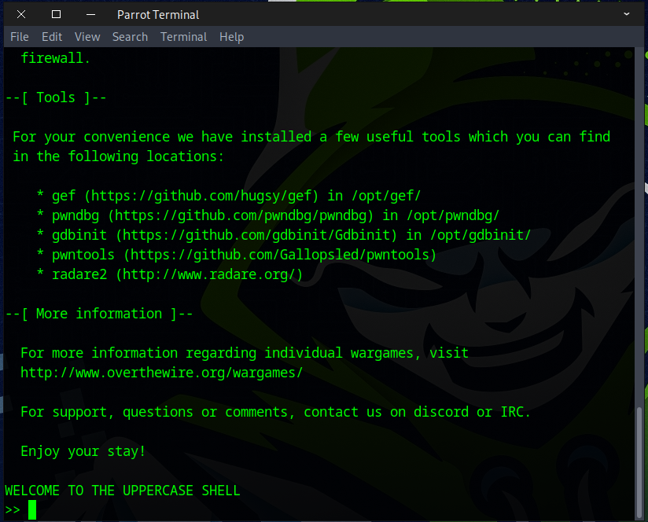
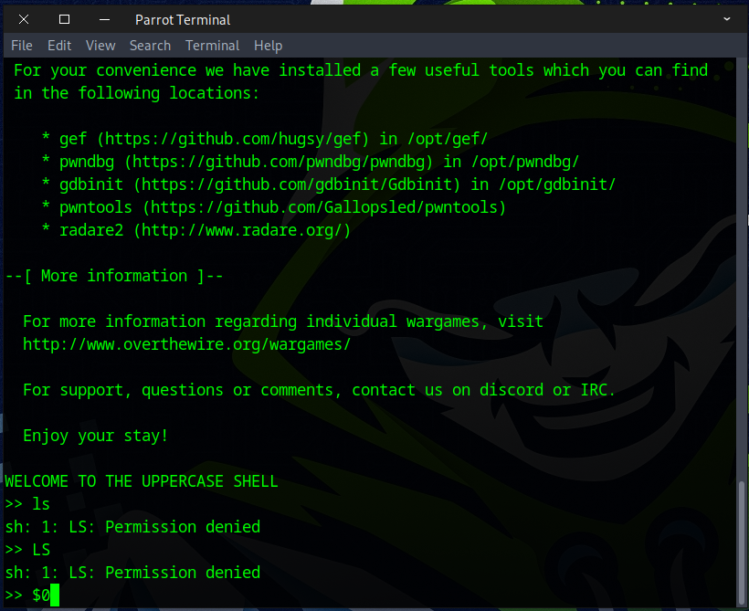
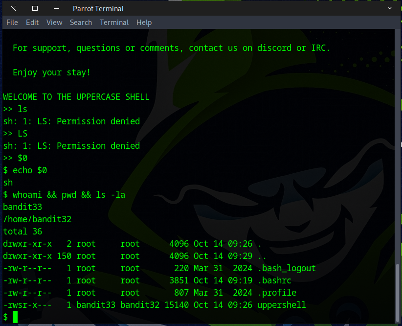
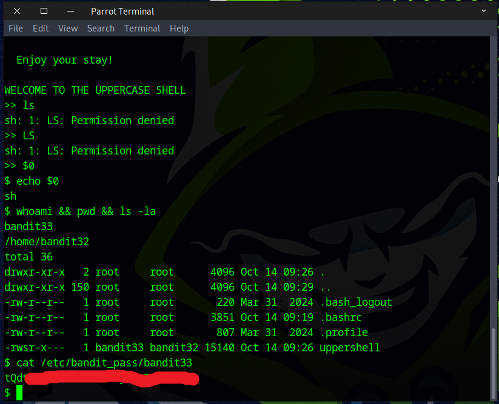
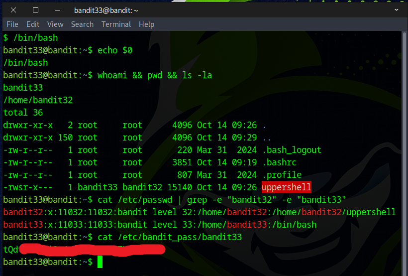
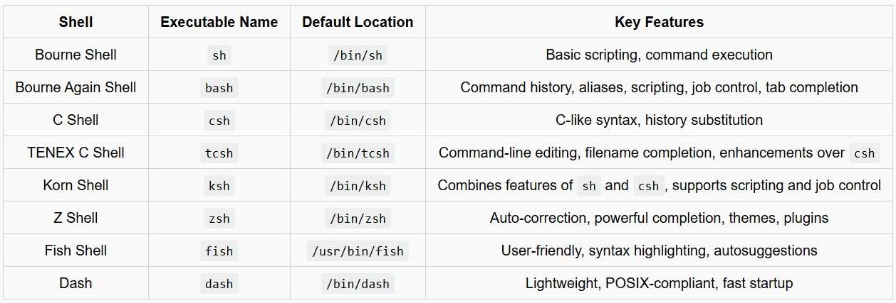
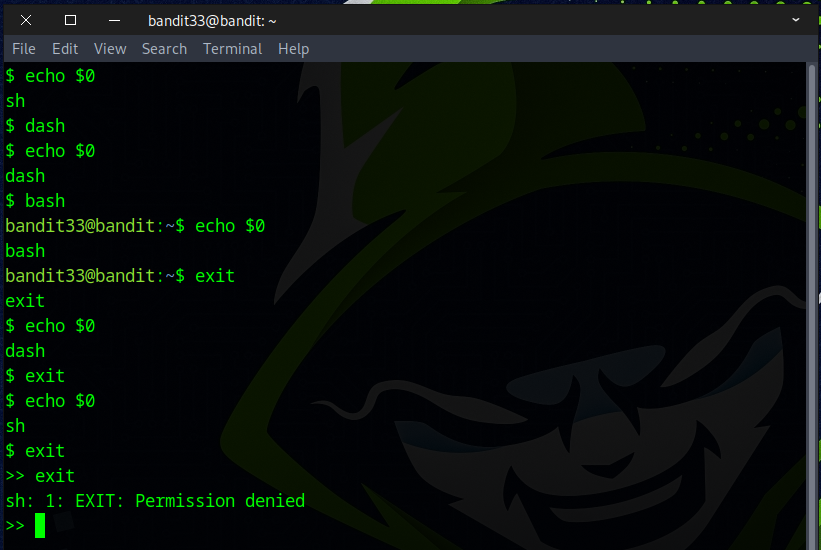

# Bandit Level 32 → Level 33

## Level Goal

After all this git stuff, it’s time for another escape. Good luck!

## Commands you may need to solve this level

    sh, man


### 🔑 Solution

```
ssh bandit32@bandit.labs.overthewire.org -p 2220
```
Then enter the password obtained from the previous challenge.



You should see the message WELCOME TO THE UPPERCASE SHELL. After that, we tried all kinds of commands, but nothing worked.



Next, try ``$0`` to enter the Bourne shell.
```
$0
```
In a Unix or Linux shell (like `bash`, `zsh`, etc.), ``$0`` has a special meaning — it represents the name of the currently running script or shell.

When you run a script, ``$0`` expands to the name or path of that script.

When you’re typing commands directly in the shell, ``$0`` usually expands to the name of the shell itself (e.g., `bash` or `zsh`).



Next, run the following command to check
```
whoami && pwd && ls -la
```


Since we are already logged in as the Bandit33 user, run the following command to retrieve the flag.
```
cat /etc/bandit_pass/bandit33
```


You could also use the `Bash` shell instead to get the flag.



🐚common Linux shells & its features


Below are additional examples showing how ``$0`` works in various shells.  
The command `cat /etc/shells` shows all shells installed on the system.



## Congratulations on finishing the Bandit challenge on OverTheWire! 🥳💻 You’ve reached the final challenge as of October 2025. 🚀


