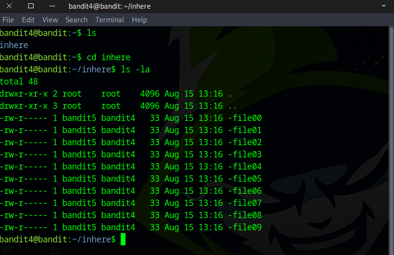
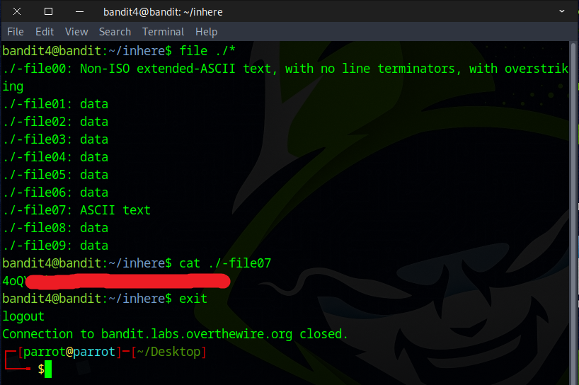

# Bandit Level 4 → Level 5

## Level Goal

The password for the next level is stored in the only human-readable file in the inhere directory. Tip: if your terminal is messed up, try the “reset” command.

## Commands you may need to solve this level

    ls , cd , cat , file , du , find


### 🔑 Solution

```
ssh bandit4@bandit.labs.overthewire.org -p 2220
```
Proceed by submitting the password acquired from the prior challenge.

First, use the `ls` command to list all files. Then, navigate into the inhere directory using `cd inhere`, and run `ls -al` to display detailed information about all files. The challenge is to identify the file that is human-readable.


We could check each file one by one, but that's inefficient. A better approach is to use the `file ./*` command, which quickly tells you the type of each file in the directory.
```
file ./*
```
There are several ways to view the contents of a file that start with -, as you've already learned from the previous challenge.
```
cat ./-file07
or
cat -- -file07
or
cat <-file07
```


You’ve got the flag — on to the next challenge!


