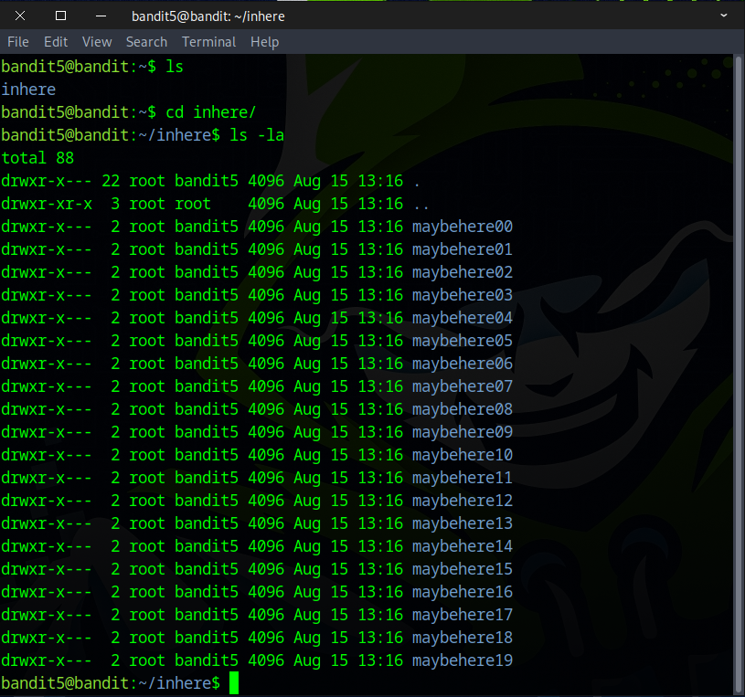
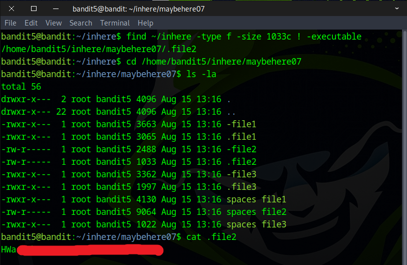

# Bandit Level 5 → Level 6

## Level Goal

The password for the next level is stored in a file somewhere under the inhere directory and has all of the following properties:

    human-readable
    1033 bytes in size
    not executable

## Commands you may need to solve this level

    ls , cd , cat , file , du , find

### 🔑 Solution

```
ssh bandit5@bandit.labs.overthewire.org -p 2220
```
Then enter the **password** obtained from the previous challenge.

First, use the `ls` command to list all files. Then, navigate into the inhere directory using `cd inhere`, and run `ls -al` to display detailed information about all files. The challenge is to identify the file that is human‑readable, 1033 bytes in size, and not executable.


To find the file, use the following command
```
find ~/inhere -type f -size 1033c ! -executable
or
find /home/bandit5/inhere -type f -size 1033c ! -executable
```
``~/inhere`` The directory to search. ``~`` mean current home directory which equivalent to ``/home/bandit5/inhere``  
``-type f`` Restricts results to regular files (not directories, symlinks, device files, etc.).  
``-size 1033c`` Matches files whose size is exactly 1033 bytes. The trailing c means "bytes" (characters)  
``! -executable`` Negates -executable — so this matches files that are not executable for the user running the command.  
The matching file is ``/home/bandit5/inhere/maybehere07/.file2``  
```
cat /home/bandit5/inhere/maybehere07/.file2
or
cd /home/bandit5/inhere/maybehere07/
cat .file2
```


Congratulations! You’ve found the flag for the next challenge.


