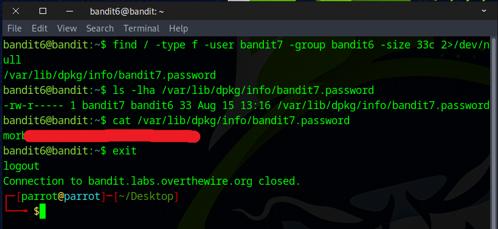

# Bandit Level 6 → Level 7

## Level Goal

The password for the next level is stored somewhere on the server and has all of the following properties:

    owned by user bandit7
    owned by group bandit6
    33 bytes in size

## Commands you may need to solve this level

    ls , cd , cat , file , du , find , grep

### 🔑 Solution

```
ssh bandit6@bandit.labs.overthewire.org -p 2220
```
Proceed by submitting the **password** acquired from the prior challenge.

The challenge is to locate a file anywhere on the server that is owned by user **bandit7**, belongs to group **bandit6**, and is exactly **33 bytes** in size.
To find it, use the following command:
```
find / -type f -user bandit7 -group bandit6 -size 33c 2>/dev/null
```
``find /`` Start searching from the root directory (/), meaning it will search the entire filesystem.  
``-type f`` Only look for regular files (not directories, symlinks, etc.).  
``-user bandit7`` Only return files owned by the user bandit7.  
``-group bandit6`` Only return files that belong to the group bandit6.  
``-size 33c`` Only return files that are exactly 33 bytes in size. `c` stands for bytes (characters). Without the `c`, `find` interprets size in 512-byte blocks.  
`2>/dev/null` Suppresses error messages (like “Permission denied”) by redirecting them to ``/dev/null``.  
The result of the command returns the file ``/var/lib/dpkg/info/bandit7.password``
You can use the cat command to view its contents:
```
cat /var/lib/dpkg/info/bandit7.password
```


Well done — you’ve discovered the flag needed for the next challenge.


