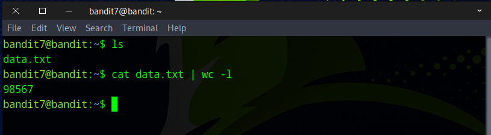
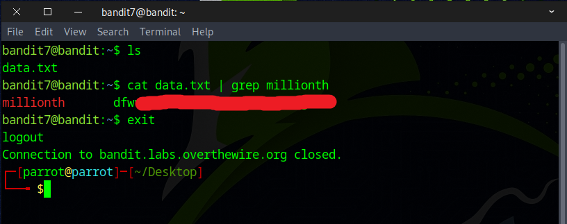

# Bandit Level 7 → Level 8

## Level Goal

The password for the next level is stored in the file data.txt next to the word millionth

## Commands you may need to solve this level

    man, grep, sort, uniq, strings, base64, tr, tar, gzip, bzip2, xxd


### 🔑 Solution

```
ssh bandit7@bandit.labs.overthewire.org -p 2220
```
Then enter the password obtained from the previous challenge.

First, use the `ls` command to list the files. Then, by running `wc -l`, we can see that the file contains 98,567 lines of text. While you could go through the file line by line to search for the word "millionth" and retrieve the flag next to it, that would take all day. Fortunately, there's a much more efficient way to do it.
 

A quicker and more efficient method is to search for the word directly using:
```
cat data.txt | grep millionth
or
grep millionth data.txt
```


Well done — you’ve discovered the flag needed for the next challenge.

