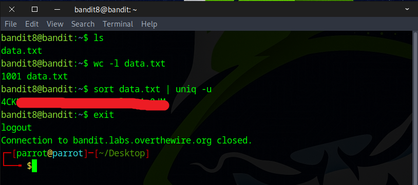

# Bandit Level 8 → Level 9

## Level Goal

The password for the next level is stored in the file data.txt and is the only line of text that occurs only once

## Commands you may need to solve this level

    grep, sort, uniq, strings, base64, tr, tar, gzip, bzip2, xxd

## Helpful Reading Material

    Piping and Redirection


### 🔑 Solution

```
ssh bandit8@bandit.labs.overthewire.org -p 2220
```
Next, input the password you retrieved in the previous challenge.

#### What is Piping in Linux?

In Linux, piping is a way to connect the **output of one command** directly into the **input of another command**. You use a special character called the pipe symbol: |  

Think of it like passing something from one person to another. The first command “says” something, and the second command “listens” and does something with that information.  

Piping is useful because it lets you combine simple commands to do more powerful things without creating extra files or doing things manually.

The challenge is to identify the line of text that appears only once in the file. To do this, we first use the **sort** command to organize the data, then pass it through a pipe to **uniq -u**, which filters out and displays only the lines that occur once.
```
sort data.txt | uniq -u
```


Awesome! You’ve successfully found the flag for the next stage.


