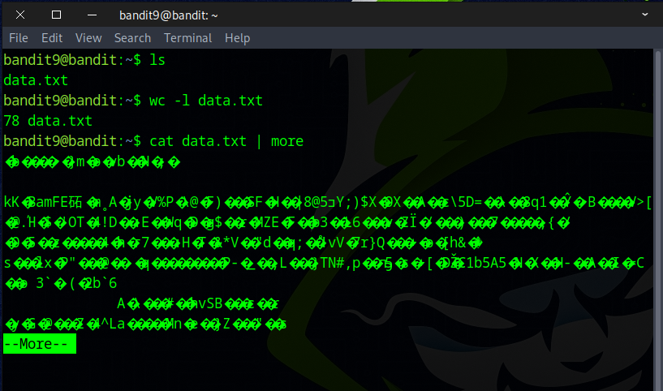
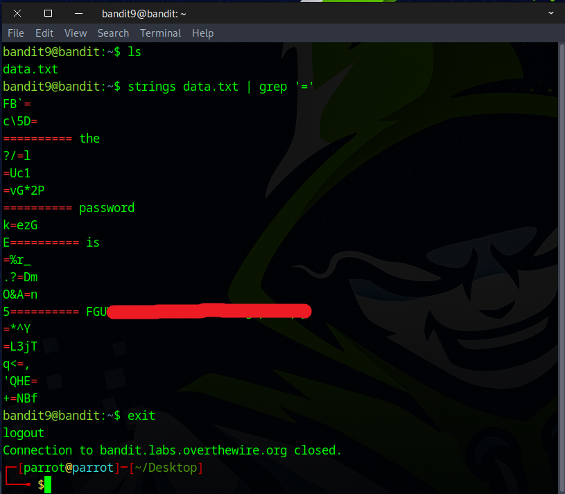

# Bandit Level 9 → Level 10

## Level Goal

The password for the next level is stored in the file data.txt in one of the few human-readable strings, preceded by several ‘=’ characters.

## Commands you may need to solve this level

    grep, sort, uniq, strings, base64, tr, tar, gzip, bzip2, xxd


### 🔑 Solution

```
ssh bandit9@bandit.labs.overthewire.org -p 2220
```
Now type in the password you grabbed from the last challenge.

Start by using the `ls` command to list the files. Then, run `wc -l` to see that the file contains only 78 lines of text. Although the content appears to be gibberish, the answer can be spotted manually. However, there’s a more effective way to approach this problem.



A more efficient way to solve this problem is by using the following command.  
`strings` command is used to extract readable text from the file.  
`|` The pipe takes the output of the *strings* command and sends it as input of *grep* command.  
`grep` searches for lines that contain the equals sign (=).
```
strings data.txt | grep '='
```



Great job! That’s the flag you’ll need for the next challenge.


