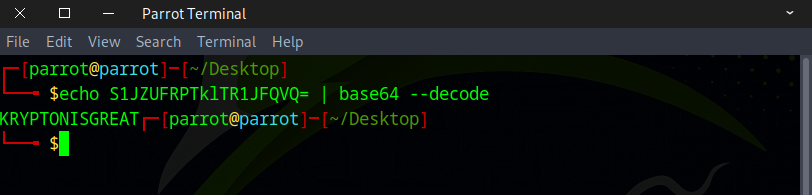
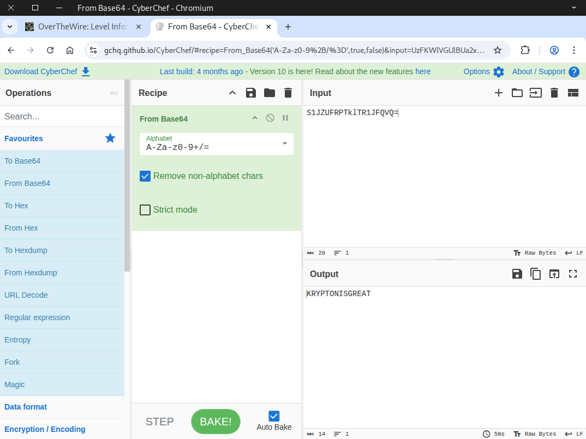

# 🔒 Krypton Level 0 → Level 1

## Level Info

Welcome to Krypton! The first level is easy. The following string encodes the password using Base64:
```
S1JZUFRPTklTR1JFQVQ=
```

Use this password to log in to **krypton.labs.overthewire.org** with username **krypton1** using SSH on port **2231**. You can find the files for other levels in ``/krypton/``

## SSH Information
**Host: krypton.labs.overthewire.org**  
**Port: 2231**  

## 🗝️ Solution

Open your terminal, then run this command:
```
echo S1JZUFRPTklTR1JFQVQ= | base64 --decode
```



Alternatively, you can use the CyberChef online tool.



Great job! Use this flag to advance to the next stage.
