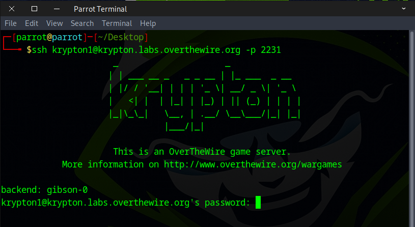
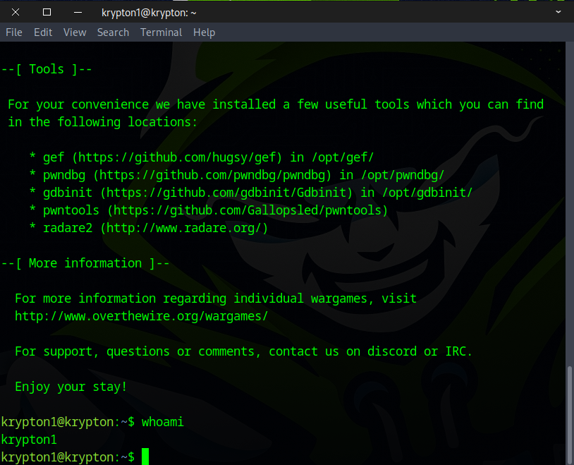
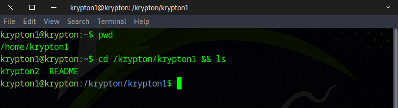
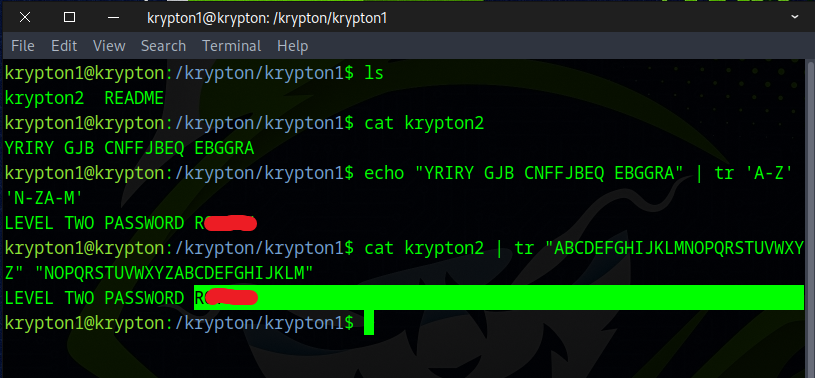
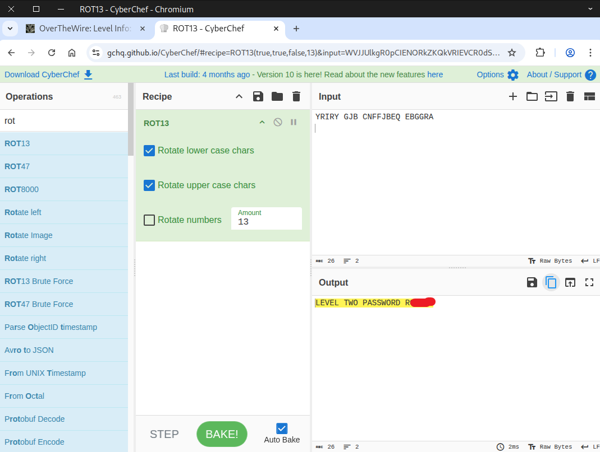

# 🔒 Krypton Level 1 → Level 2

## Level Info

The password for level 2 is in the file ‘krypton2’. It is ‘encrypted’ using a simple rotation. It is also in non-standard ciphertext format. When using alpha characters for cipher text it is normal to group the letters into 5 letter clusters, regardless of word boundaries. This helps obfuscate any patterns. This file has kept the plain text word boundaries and carried them to the cipher text. Enjoy!

## 🗝️ Solution

```
ssh krypton1@krypton.labs.overthewire.org -p 2231
KRYPTONISGREAT
```



This screen will appear once you've logged in successfully.



Next, navigate to the directory specified in the instructions.
```
cd /krypton/krypton1
```



---

### What is ROT13?

The **Caesar cipher** is one of the simplest and oldest encryption techniques. It’s named after **Julius Caesar**, who reportedly used it to send secret messages. **ROT13** is part of the Caesar cipher family.

**ROT13** stands for **"rotate by 13 places"**. It’s a very simple way to encode text so it’s not immediately readable. Here’s how it works:

1. Take each letter of your message.  
2. Shift it **13 letters forward** in the alphabet.  
3. If you go past “Z,” wrap around to the beginning of the alphabet.  

### Example

- Original: `HELLO`  
- ROT13: `URYYB`  

| Original | ROT13 |
|----------|-------|
| H        | U     |
| E        | R     |
| L        | Y     |
| L        | Y     |
| O        | B     |

The cool thing about ROT13 is that **encoding and decoding are the same operation**. If you apply ROT13 again to `URYYB`, you get back `HELLO`.  

ROT13 is often used just for **hiding spoilers or puzzle answers** online—not for real security.

---

Run the following command to decode the message:
```
echo "YRIRY GJB CNFFJBEQ EBGGRA" | tr 'A-Z' 'N-ZA-M'
or
cat krypton2 | tr "ABCDEFGHIJKLMNOPQRSTUVWXYZ" "NOPQRSTUVWXYZABCDEFGHIJKLM"
```


You can also use an online tool such as CyberChef.



Well done! This flag will take you to the next round.
