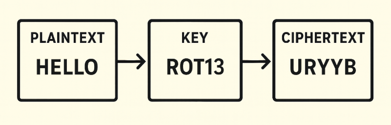
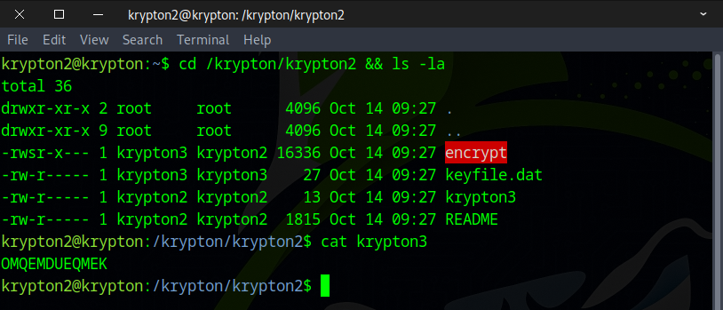
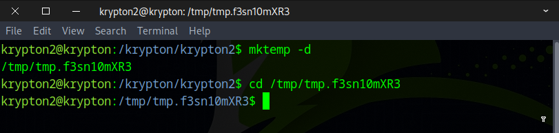
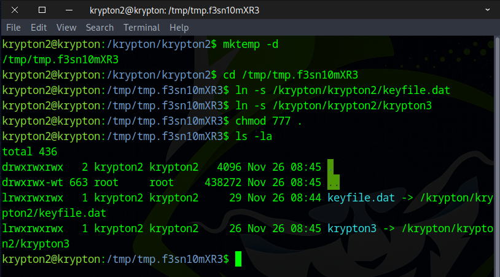
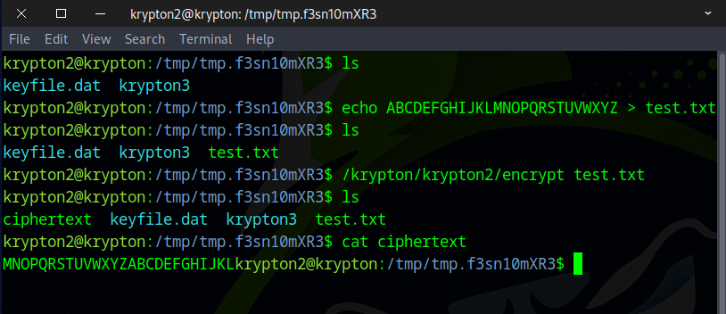
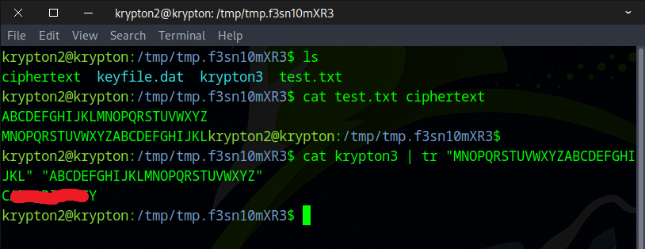
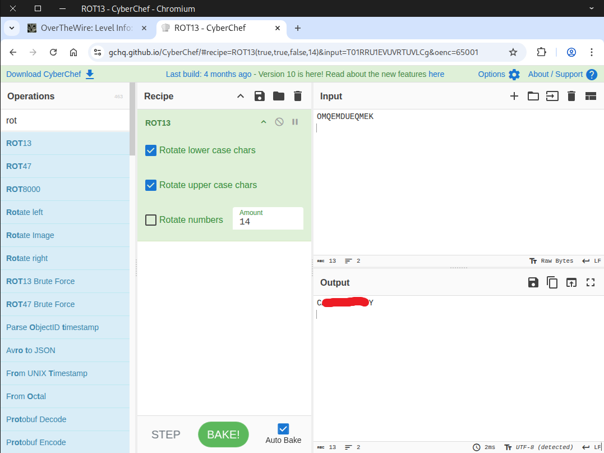

# 🔒 Krypton Level 2 → Level 3

## Level Info

ROT13 is a simple substitution cipher.

Substitution ciphers are a simple replacement algorithm. In this example of a substitution cipher, we will explore a ‘monoalphebetic’ cipher. Monoalphebetic means, literally, “one alphabet” and you will see why.

This level contains an old form of cipher called a ‘Caesar Cipher’. A Caesar cipher shifts the alphabet by a set number. For example:

plain:  a b c d e f g h i j k ...  
cipher: G H I J K L M N O P Q ...

In this example, the letter ‘a’ in plaintext is replaced by a ‘G’ in the ciphertext so, for example, the plaintext ‘bad’ becomes ‘HGJ’ in ciphertext.

The password for level 3 is in the file krypton3. It is in 5 letter group ciphertext. It is encrypted with a Caesar Cipher. Without any further information, this cipher text may be difficult to break. You do not have direct access to the key, however you do have access to a program that will encrypt anything you wish to give it using the key. If you think logically, this is completely easy.

One shot can solve it!

Have fun.

## Additional Information:

The encrypt binary will look for the keyfile in your current working directory. Therefore, it might be best to create a working direcory in /tmp and in there a link to the keyfile. As the encrypt binary runs setuid krypton3, you also need to give krypton3 access to your working directory.

## Here is an example:
```
krypton2@melinda:~$ mktemp -d  
/tmp/tmp.Wf2OnCpCDQ  
krypton2@melinda:~$ cd /tmp/tmp.Wf2OnCpCDQ  
krypton2@melinda:/tmp/tmp.Wf2OnCpCDQ$ ln -s /krypton/krypton2/keyfile.dat  
krypton2@melinda:/tmp/tmp.Wf2OnCpCDQ$ ls  
keyfile.dat  
krypton2@melinda:/tmp/tmp.Wf2OnCpCDQ$ chmod 777 .  
krypton2@melinda:/tmp/tmp.Wf2OnCpCDQ$ /krypton/krypton2/encrypt /etc/issue  
krypton2@melinda:/tmp/tmp.Wf2OnCpCDQ$ ls  
ciphertext  keyfile.dat  
```

## 🗝️ Solution

```
ssh krypton2@krypton.labs.overthewire.org -p 2231
krypton2_password
```


### Basic Encryption Procedure


We identified three files that are of particular interest: `encrypt`, `keyfile.dat`, and `krypton3`.  
- **encrypt**: A program that takes plaintext as input and uses a key to encrypt it.
- **plaintext**: This is the password for krypton3, which is currently unknown ???.
- **keyfile.dat**: The key used by the encrypt program to perform encryption.
- **krypton3**: The ciphertext generated by the encrypt program.



As stated in the instructions, we cannot execute files in the current directory, so we need to create a temporary folder.
```
mktemp -d
```



Next, we create symbolic links for `keyfile.dat` and `krypton3` in the temporary directory and set the permissions to `777`.
```
ln -s /krypton/krypton2/keyfile.dat
ln -s /krypton/krypton2/krypton3
chmod 777 .
```



Now, create a test.txt file to test the functionality of the program.



It appears that there is a **14 character shift** between the original and ciphertext, so we’ll use the following command to decrypt `krypton3`.
```
cat krypton3 | tr "MNOPQRSTUVWXYZABCDEFGHIJKL" "ABCDEFGHIJKLMNOPQRSTUVWXYZ"
or
cat krypton3 | tr "M-ZA-L" "A-Z"
```



You can also use an online tool, like CyberChef, as an alternative.



Awesome! Use this flag to move on to the next level.

