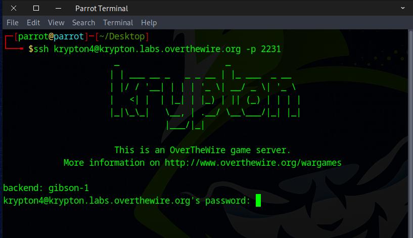
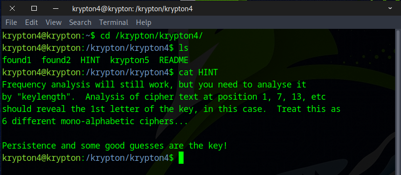
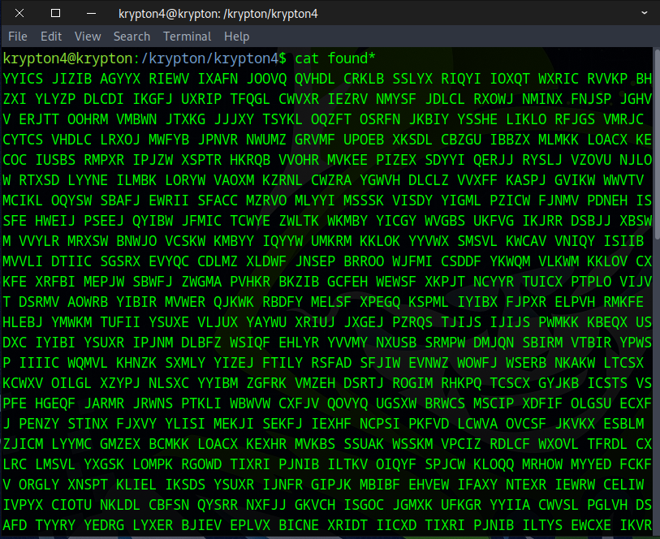
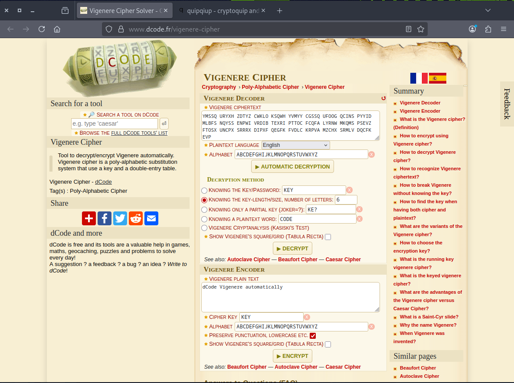
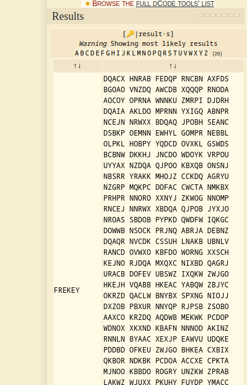
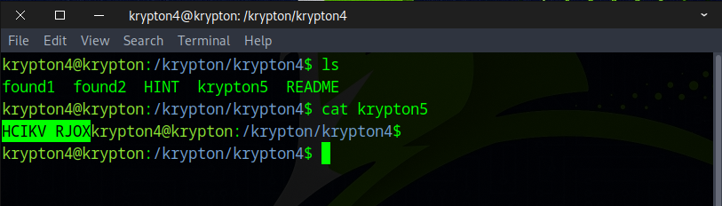
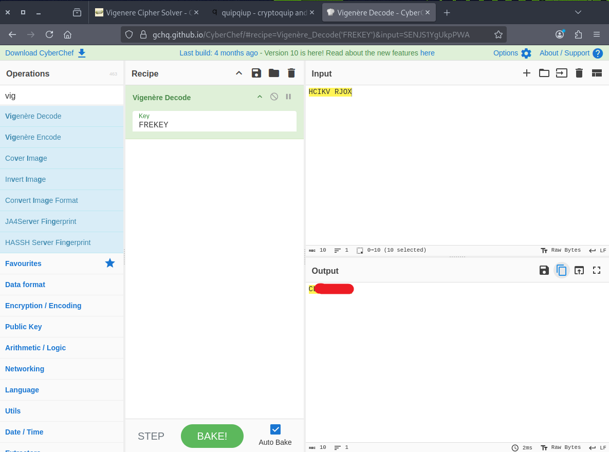

# 🔒 Krypton Level 4 → Level 5

## Level Info

Good job!

You more than likely used some form of FA and some common sense to solve that one.

So far we have worked with simple substitution ciphers. They have also been ‘monoalphabetic’, meaning using a fixed key, and giving a one to one mapping of plaintext (P) to ciphertext (C). Another type of substitution cipher is referred to as ‘polyalphabetic’, where one character of P may map to many, or all, possible ciphertext characters.

An example of a polyalphabetic cipher is called a Vigenère Cipher. It works like this:

If we use the key(K) ‘GOLD’, and P = PROCEED MEETING AS AGREED, then “add” P to K, we get C. When adding, if we exceed 25, then we roll to 0 (modulo 26).

**P** P R O C E E D M E E T I N G A S A G R E E D\
**K** G O L D G O L D G O L D G O L D G O L D G O

becomes:

**P** 15 17 14 2 4 4 3 12 4 4 19 8 13 6 0 18 0 6 17 4 4 3\
**K** 6 14 11 3 6 14 11 3 6 14 11 3 6 14 11 3 6 14 11 3 6 14\
**C** 21 5 25 5 10 18 14 15 10 18 4 11 19 20 11 21 6 20 2 8 10 17

So, we get a ciphertext of:

VFZFK SOPKS ELTUL VGUCH KR

This level is a Vigenère Cipher. You have intercepted two longer, english language messages (American English). You also have a key piece of information. You know the key length!

For this exercise, the key length is 6. The password to level five is in the usual place, encrypted with the 6 letter key.

Have fun!

## 🗝️ Solution

```
ssh krypton4@krypton.labs.overthewire.org -p 2231
krypton4_password
```



---

## Vigenère Cipher

The **Vigenère Cipher** is a method of encrypting alphabetic text using a polyalphabetic substitution system. It was invented by **Blaise de Vigenère** in the 16th century and was used extensively for centuries. The cipher is considered more secure than the simple **Caesar Cipher** because it uses multiple shifting values based on a keyword.

## How It Works

The Vigenère cipher uses a **keyword** to shift the letters of the plaintext. The key is repeated to match the length of the plaintext, and each letter in the plaintext is shifted according to the corresponding letter in the key.

### Steps to Encrypt:
1. Choose a **plaintext message** and a **key**.
2. Repeat the key to match the length of the plaintext.
3. For each letter in the plaintext:
   - Shift it forward by a number corresponding to the position of the letter in the alphabet (A=0, B=1, ..., Z=25) for the key.
4. The result is the **ciphertext**.

### Example

**Plaintext**: HELLO  
**Key**: KEY

1. Repeat the key to match the plaintext:

| Plaintext | H | E | L | L | O |
|-----------|---|---|---|---|---|
| Key       | K | E | Y | K | E |


2. Apply the shifts:

| Plaintext Letter | Key Letter | Key Position | Ciphertext Letter |
|------------------|------------|--------------|-------------------|
| H                | K          | 10           | R                 |
| E                | E          | 4            | I                 |
| L                | Y          | 24           | J                 |
| L                | K          | 10           | V                 |
| O                | E          | 4            | S                 |


3. After applying the shifts, you get the ciphertext:

| Ciphertext | R | I | J | V | S |  
|------------|---|---|---|---|---|  

### Security

- The Vigenère cipher is stronger than a Caesar cipher because it uses multiple shifts, making it more difficult to break through frequency analysis.
- If the key is as long as the message and completely random, the cipher becomes a **one-time pad**, which is theoretically unbreakable.
- A short or repeated key may still be vulnerable to cryptanalysis.

## Conclusion

The Vigenère cipher offers better security than basic substitution ciphers, but its strength depends on the key's length and randomness. While it was once a popular encryption method, modern cryptography has since developed more secure methods for protecting data.

---

First, go to the Krypton4 directory.



Use the command below to display the contents. We could find the key manually as the hint suggests, or use online tools to assist.
```
cat found*
```



```
YYICS JIZIB AGYYX RIEWV IXAFN JOOVQ QVHDL CRKLB SSLYX RIQYI IOXQT WXRIC RVVKP BHZXI YLYZP DLCDI IKGFJ UXRIP TFQGL CWVXR IEZRV NMYSF JDLCL RXOWJ NMINX FNJSP JGHVV ERJTT OOHRM VMBWN JTXKG JJJXY TSYKL OQZFT OSRFN JKBIY YSSHE LIKLO RFJGS VMRJC CYTCS VHDLC LRXOJ MWFYB JPNVR NWUMZ GRVMF UPOEB XKSDL CBZGU IBBZX MLMKK LOACX KECOC IUSBS RMPXR IPJZW XSPTR HKRQB VVOHR MVKEE PIZEX SDYYI QERJJ RYSLJ VZOVU NJLOW RTXSD LYYNE ILMBK LORYW VAOXM KZRNL CWZRA YGWVH DLCLZ VVXFF KASPJ GVIKW WWVTV MCIKL OQYSW SBAFJ EWRII SFACC MZRVO MLYYI MSSSK VISDY YIGML PZICW FJNMV PDNEH ISSFE HWEIJ PSEEJ QYIBW JFMIC TCWYE ZWLTK WKMBY YICGY WVGBS UKFVG IKJRR DSBJJ XBSWM VVYLR MRXSW BNWJO VCSKW KMBYY IQYYW UMKRM KKLOK YYVWX SMSVL KWCAV VNIQY ISIIB MVVLI DTIIC SGSRX EVYQC CDLMZ XLDWF JNSEP BRROO WJFMI CSDDF YKWQM VLKWM KKLOV CXKFE XRFBI MEPJW SBWFJ ZWGMA PVHKR BKZIB GCFEH WEWSF XKPJT NCYYR TUICX PTPLO VIJVT DSRMV AOWRB YIBIR MVWER QJKWK RBDFY MELSF XPEGQ KSPML IYIBX FJPXR ELPVH RMKFE HLEBJ YMWKM TUFII YSUXE VLJUX YAYWU XRIUJ JXGEJ PZRQS TJIJS IJIJS PWMKK KBEQX USDXC IYIBI YSUXR IPJNM DLBFZ WSIQF EHLYR YVVMY NXUSB SRMPW DMJQN SBIRM VTBIR YPWSP IIIIC WQMVL KHNZK SXMLY YIZEJ FTILY RSFAD SFJIW EVNWZ WOWFJ WSERB NKAKW LTCSX KCWXV OILGL XZYPJ NLSXC YYIBM ZGFRK VMZEH DSRTJ ROGIM RHKPQ TCSCX GYJKB ICSTS VSPFE HGEQF JARMR JRWNS PTKLI WBWVW CXFJV QOVYQ UGSXW BRWCS MSCIP XDFIF OLGSU ECXFJ PENZY STINX FJXVY YLISI MEKJI SEKFJ IEXHF NCPSI PKFVD LCWVA OVCSF JKVKX ESBLM ZJICM LYYMC GMZEX BCMKK LOACX KEXHR MVKBS SSUAK WSSKM VPCIZ RDLCF WXOVL TFRDL CXLRC LMSVL YXGSK LOMPK RGOWD TIXRI PJNIB ILTKV OIQYF SPJCW KLOQQ MRHOW MYYED FCKFV ORGLY XNSPT KLIEL IKSDS YSUXR IJNFR GIPJK MBIBF EHVEW IFAXY NTEXR IEWRW CELIW IVPYX CIOTU NKLDL CBFSN QYSRR NXFJJ GKVCH ISGOC JGMXK UFKGR YYIIA CWVSL PGLVH DSAFD TYYRY YEDRG LYXER BJIEV EPLVX BICNE XRIDT IICXD TIXRI PJNIB ILTYS EWCXE IKVRM VXBIC RRHOE ETFHD LGHBG YZCWZ RQXMU ISDIA YKLOQ DWFQD LCIVA KRBYY IDMLB FSNQY STLYT NJUEQ VCFKT SPCTW AYSBB ZXRLG XRBOE LIUSB SRMPF EMJYR WZPCS UMNJG WVXRE RBRVW IBMVV KRBRR HOLCW WIOPJ JJWVS LJCCC LCFEH DSRTR XOXFJ CECXM KKLOM PGIIK HYSUR YAQMV HSHLT KOXSU BYEDX FJPAY YJIUS PSPGI IKODF JXSJW TLASW FXRMN XFJCM YRGBZ PVKMN EXYXF JWSBI QYRRN OGQCE NICWW SBCMZ PSEGY SISKW RNKFI XFJWM BIQNE GOCMZ IXKWR JJEBI QTGIM YJNRV DLYYP SETPJ WIBGM TBINJ MTUEX HRMVR ISSBZ PVLYA VEFIP DXSYH ZWVEU JYXKH YRRUC IKWCI FRDFC LXINX FJKMX AMTUQ KRGXY SEPBH VVDEG SCCGI CUZJI SSPZP VIBFG SYVBJ VVKRB YYIXQ WORAC AMZCH BYQYR KKMLG LXDLC QZSXA CSKEG EWNEX YXFJW SBIQY RRNJM ZEHRM QTNRC YNUVV KRBSF SXICA VVURC BNLKX GYNEC JMWYI NMBSK QORRN FRSXY SUXRI QHRVO GPTNJ YYLIR XBICK LPVSD SLXCE LIWMV PCIUS BSRMP WLEQP VXGMR MKLOQ QTKLK XQMVA YYJIE SDFCM LRQVW KFVKP MSXXS QCXYI DLMZX LDXFN JAKWT JICUM LIRRN XFTLK RXDZC SPXFJ JGKVC HISGF SYJLO PYZXL OHFJR VDMJD RXDLC FNOGE PINEI MLBYM MLRMV TYSPH IIKXS WVTSG IJUYZ XFJEY DWFNJ TKHBJ ULKRB XNIBI QTTPE QQDRR NXFJE YDWUJ IICSQ RRPVX FFKLO HPTGT OHYQD SCXYX DEXCY XYIZY RNEXR IZFJO OXZZK XRIQH RVOGP TNHSH LTKQS RBMFA VSLLZ XDSMP YMWXM KZPVX FJSEC OCYWS BMRJE ELPCI YMWXM PVIZE UFPJB SKYYI PMPJR WRIDJ RVOHY XGEBO KNXLD KCYZR DSFNJ WDVYB RRNFS WELSQ SUJSR IIJGX KKMTU HSWRF EGOEU FPJBS KYYIP PYRVW KRBTE PIGYR VROEP YFGYZ CWUSB SRMPA SXFII CVIYA VWGLC SJLOP YDUSG RRTJP OINYY ICIIJ GXRIP AVVIW LZXEX HUFIQ KRBXY ICPCU KWYYL ICCER RNCQY VLNEK GLCSZ XGEQI RCVME MKXRI ENIPL ERMVH RIPKR GOMLF CMDXJ JIMZT JNEKL VMTBE XHQTF RKJRJ IXRIW FCPCX YWKIN XMBRV NXFJV QOVYQ UGSXW YYMCA YXKSL IYSVZ ORRKL PNEWK FVDLC YIEFI JJIWD LCDYE NLYWU PIFCJ EAKPI NEKKR FTLVG LCSKL OCQFN FOJMW VXRIK FXVOE RIZXM LRMRX MVMXJ INXFJ ISKHY SUHSZ GIVHD LCKFV OWRFJ JKVYX KLOCA TLPNW CJFRO MRMVV CMBJZ XGEQF MIBCU NUINM RHYEX HUMVR DLCDT VOTRZ GXYXF JVHQI YSUPY SIJUM XXMNK XRIWH FYVHQ JVMDA YXRPC STJIC NICUR RNXFJ IIGIP JDEXC ZNXNK KEJUV YGIXR XDLCG FXDSK YYICM BJJAO VCXFW DICUK LKXLT EIYJR MVQMS SQUGV MKGUS GRYSU JYVYR FQORR NKWOI KJUXR ERYYI SVHTL VXIWR LWDIL INLKX QMRPV ACIFE COCIU SBSRM PHOWN FZVSR EQPMR ETJEX DLCKR MXXCX KMNIY XRMNX FJKMX AMTUQ KRYSU XRIJN FRCLM TBLSW QMRKQ CKFEI KRBQF SUIBY YSEKF YWYVF SYKLO WAFII MVMBJ ESHUJ TEXRM YWPIX FFKMC GCWKE SRLJZ XRIPH RRGIA QZQLH MBEMX XMYYM CKPJR XNMRH YXRIP JWSBI GKNIM ELSFX TYKUF ZOVGY NIWYQ YJXYT UMVVO ACFII SXFNE OSGMZ CHTYK UFZOV GYJES HRMVG YAYWU PIPGT EEPXC WDIKW SWZRQ XFJUM CXYST IMEPJ WYVPW NELSW KNEHD LCSNI KVCFC PBMEM KEXWU JIINX FJJGK VCHIS GJMWP SEGYS TEBVW ZJEVP MAVVY RWTLV LEAPF ROERF KMWIU JCPSP JYICS XQFZH DLCQZ SXAFT NMVPE TWMBW RNNMV PBJTP KVCIK LOWAF IIMVM BWSBM DDFYP SSSUX RERDF YMSSQ URYXH ZDTYZ CWKLO KSQWH YVMYY CGSSQ UFOOG QCINS PYYID MLBFS NQYSS ENPWI VRDIB TEXRI PTTOC FCQFA LYRNW MKQMS PSEVZ FTOSX UNCPX SRRRX DIPXF QEGFK FVDLC KRPVA MZCHX SRMLV DQCFK EVP
```

Paste our ciphertext into the website, set the key length to 6, and then click **Automatic Decryption**.
```
https://www.dcode.fr/vigenere-cipher
```



After a few seconds, the results appear, and we discover that our key is **FREKEY**.



Now open the Krypton5 password ciphertext and go to CyberChef to decode it.
```
cat krypton5
```



Select Vigenère Decode, enter FREKEY as the key, and the flag should appear.




Nice work! Proceed to the next round by using this flag.