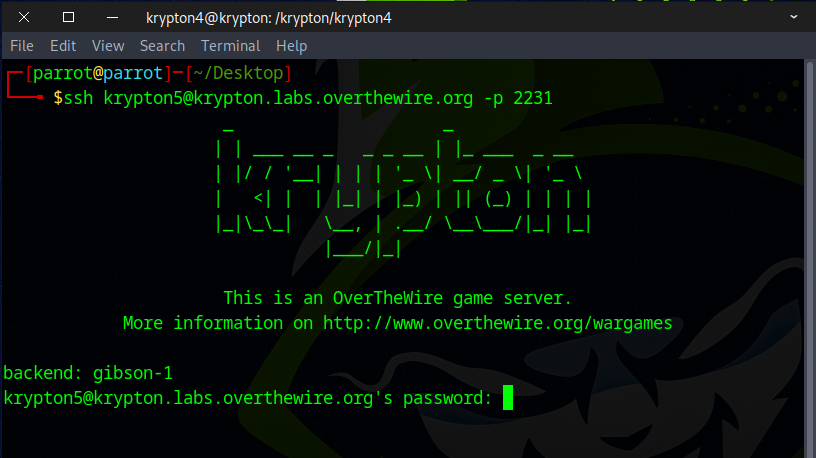
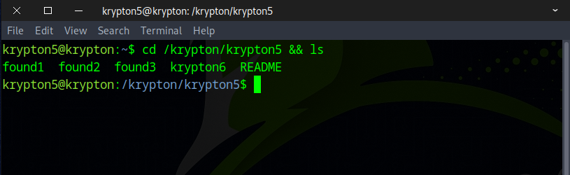
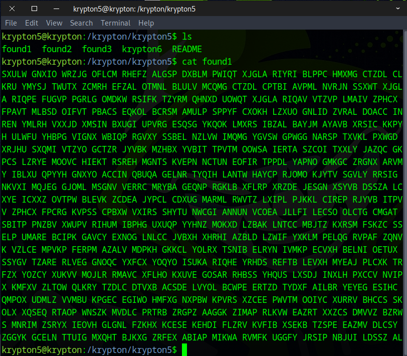
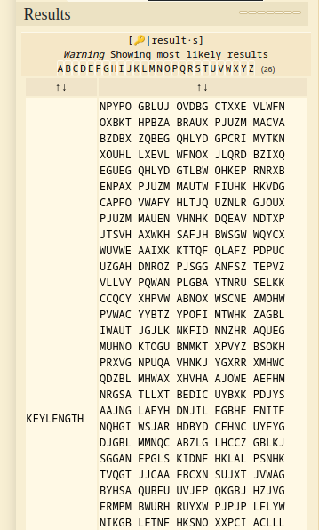
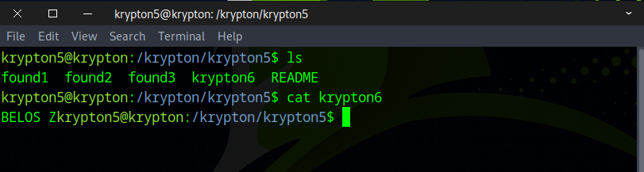
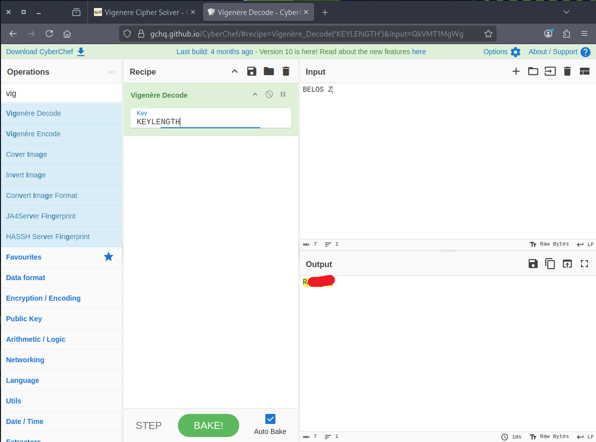

# 🔒 Krypton Level 5 → Level 6

## Level Info

FA can break a known key length as well. Lets try one last polyalphabetic cipher, but this time the key length is unknown. Note: the text is writen in American English

Enjoy.

## 🗝️ Solution

```
ssh krypton5@krypton.labs.overthewire.org -p 2231
krypton5_password
### Note: make sure password has no space
```



Navigate to the Krypton5 directory.
```
cd /krypton/krypton5 && ls
```



View the contents of found1 and copy them.
```
cat found1
```



```
SXULW GNXIO WRZJG OFLCM RHEFZ ALGSP DXBLM PWIQT XJGLA RIYRI BLPPC HMXMG CTZDL CLKRU YMYSJ TWUTX ZCMRH EFZAL OTMNL BLULV MCQMG CTZDL CPTBI AVPML NVRJN SSXWT XJGLA RIQPE FUGVP PGRLG OMDKW RSIFK TZYRM QHNXD UOWQT XJGLA RIQAV VTZVP LMAIV ZPHCX FPAVT MLBSD OIFVT PBACS EQKOL BCRSM AMULP SPPYF CXOKH LZXUO GNLID ZVRAL DOACC INREN YMLRH VXXJD XMSIN BXUGI UPVRG ESQSG YKQOK LMXRS IBZAL BAYJM AYAVB XRSIC KKPYH ULWFU YHBPG VIGNX WBIQP RGVXY SSBEL NZLVW IMQMG YGVSW GPWGG NARSP TXVKL PXWGD XRJHU SXQMI VTZYO GCTZR JYVBK MZHBX YVBIT TPVTM OOWSA IERTA SZCOI TXXLY JAZQC GKPCS LZRYE MOOVC HIEKT RSREH MGNTS KVEPN NCTUN EOFIR TPPDL YAPNO GMKGC ZRGNX ARVMY IBLXU QPYYH GNXYO ACCIN QBUQA GELNR TYQIH LANTW HAYCP RJOMO KJYTV SGVLY RRSIG NKVXI MQJEG GJOML MSGNV VERRC MRYBA GEQNP RGKLB XFLRP XRZDE JESGN XSYVB DSSZA LCXYE ICXXZ OVTPW BLEVK ZCDEA JYPCL CDXUG MARML RWVTZ LXIPL PJKKL CIREP RJYVB ITPVV ZPHCX FPCRG KVPSS CPBXW VXIRS SHYTU NWCGI ANNUN VCOEA JLLFI LECSO OLCTG CMGAT SBITP PNZBV XWUPV RIHUM IBPHG UXUQP YYHNZ MOKXD LZBAK LNTCC MBJTZ KXRSM FSKZC SSELP UMARE BCIPK GAVCY EXNOG LNLCC JVBXH XHRHI AZBLD LZWIF YXKLM PELQG RVPAF ZQNVK VZLCE MPVKP FERPM AZALV MDPKH GKKCL YOLRX TSNIB ELRYN IVMKP ECVXH BELNI OETUX SSYGV TZARE RLVEG GNOQC YXFCX YOQYO ISUKA RIQHE YRHDS REFTB LEVXH MYEAJ PLCXK TRFZX YOZCY XUKVV MOJLR RMAVC XFLHO KXUVE GOSAR RHBSS YHQUS LXSDJ INXLH PXCCV NVIPX KMFXV ZLTOW QLKRY TZDLC DTVXB ACSDE LVYOL BCWPE ERTZD TYDXF AILBR YEYEG ESIHC QMPOX UDMLZ VVMBU KPGEC EGIWO HMFXG NXPBW KPVRS XZCEE PWVTM OOIYC XURRV BHCCS SKOLX XQSEQ RTAOP WNSZK MVDLC PRTRB ZRGPZ AAGGK ZIMAP RLKVW EAZRT XXZCS DMVVZ BZRWS MNRIM ZSRYX IEOVH GLGNL FZKHX KCESE KEHDI FLZRV KVFIB XSEKB TZSPE EAZMV DLCSY ZGGYK GCELN TTUIG MXQHT BJKXG ZRFEX ABIAP MIKWA RVMFK UGGFY JRSIP NBJUI LDSSZ AL
```

Go to the website below, paste the content you copied earlier, and click **Automatic Decryption**.
```
https://www.dcode.fr/vigenere-cipher
```


After a few seconds, we should get the key, which is **KEYLENGTH**.



Next, view the ciphertext for the Krypton6 password and head to CyberChef to decode it.
```
cat krypton6
```



Choose Vigenère Decode, enter KEYLENGTH as the key, and the flag should be displayed.



Brilliant! Use the flag to continue to the next level.

