# 🔒 Krypton Level 6 → Level 7

## Level Info

Hopefully by now its obvious that encryption using repeating keys is a bad idea. Frequency analysis can destroy repeating/fixed key substitution crypto.

A feature of good crypto is random ciphertext. A good cipher must not reveal any clues about the plaintext. Since natural language plaintext (in this case, English) contains patterns, it is left up to the encryption key or the encryption algorithm to add the ‘randomness’.

Modern ciphers are similar to older plain substitution ciphers, but improve the ‘random’ nature of the key.

An example of an older cipher using a complex, random, large key is a vigniere using a key of the same size of the plaintext. For example, imagine you and your confident have agreed on a key using the book ‘A Tale of Two Cities’ as your key, in 256 byte blocks.

The cipher works as such:

Each plaintext message is broken into 256 byte blocks. For each block of plaintext, a corresponding 256 byte block from the book is used as the key, starting from the first chapter, and progressing. No part of the book is ever re-used as key. The use of a key of the same length as the plaintext, and only using it once is called a “One Time Pad”.

Look in the krypton6 directory. You will find a file called ‘plain1’, a 256 byte block. You will also see a file ‘key1’, the first 256 bytes of ‘A Tale of Two Cities’. The file ‘cipher1’ is the cipher text of plain1. As you can see (and try) it is very difficult to break the cipher without the key knowledge.

If the encryption is truly random letters, and only used once, then it is impossible to break. A truly random “One Time Pad” key cannot be broken. Consider intercepting a ciphertext message of 1000 bytes. One could brute force for the key, but due to the random key nature, you would produce every single valid 1000 letter plaintext as well. Who is to know which is the real plaintext?!?

Choosing keys that are the same size as the plaintext is impractical. Therefore, other methods must be used to obscure ciphertext against frequency analysis in a simple substitution cipher. The impracticality of an ‘infinite’ key means that the randomness, or entropy, of the encryption is introduced via the method.

We have seen the method of ‘substitution’. Even in modern crypto, substitution is a valid technique. Another technique is ‘transposition’, or swapping of bytes.

Modern ciphers break into two types; symmetric and asymmetric.

Symmetric ciphers come in two flavours: block and stream.

Until now, we have been playing with classical ciphers, approximating ‘block’ ciphers. A block cipher is done in fixed size blocks (suprise!). For example, in the previous paragraphs we discussed breaking text and keys into 256 byte blocks, and working on those blocks. Block ciphers use a fixed key to perform substituion and transposition ciphers on each block discretely.

Its time to employ a stream cipher. A stream cipher attempts to create an on-the-fly ‘random’ keystream to encrypt the incoming plaintext one byte at a time. Typically, the ‘random’ key byte is xor’d with the plaintext to produce the ciphertext. If the random keystream can be replicated at the recieving end, then a further xor will produce the plaintext once again.

From this example forward, we will be working with bytes, not ASCII text, so a hex editor/dumper like hexdump is a necessity. Now is the right time to start to learn to use tools like cryptool.

In this example, the keyfile is in your directory, however it is not readable by you. The binary ‘encrypt6’ is also available. It will read the keyfile and encrypt any message you desire, using the key AND a ‘random’ number. You get to perform a ‘known ciphertext’ attack by introducing plaintext of your choice. The challenge here is not simple, but the ‘random’ number generator is weak.

As stated, it is now that we suggest you begin to use public tools, like cryptool, to help in your analysis. You will most likely need a hint to get going. See ‘HINT1’ if you need a kicktstart.

If you have further difficulty, there is a hint in ‘HINT2’.

The password for level 7 (krypton7) is encrypted with ‘encrypt6’.

Good Luck!

## 🗝️ Solution

```
ssh krypton6@krypton.labs.overthewire.org -p 2231
krypton6_password
### Note: make sure password has no space
```

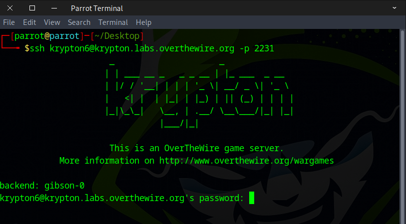

go to krypton6 folder and view the HINT
```
cd /krypton/krypton6 && ls
cat HINT*
```

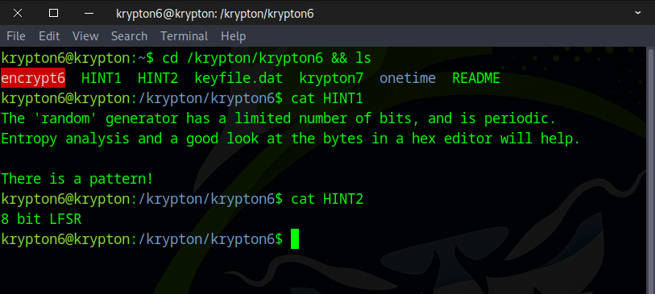

We examined the **onetime** directory and noticed three files — `cipher1`, `key1`, and `plain1` — each with content of identical length.

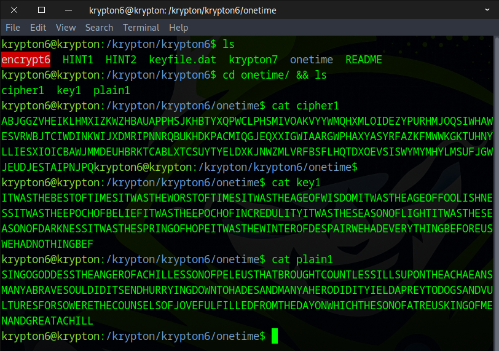

This encryption method is extremely secure, but it’s not practical because the key is too long and difficult to remember.

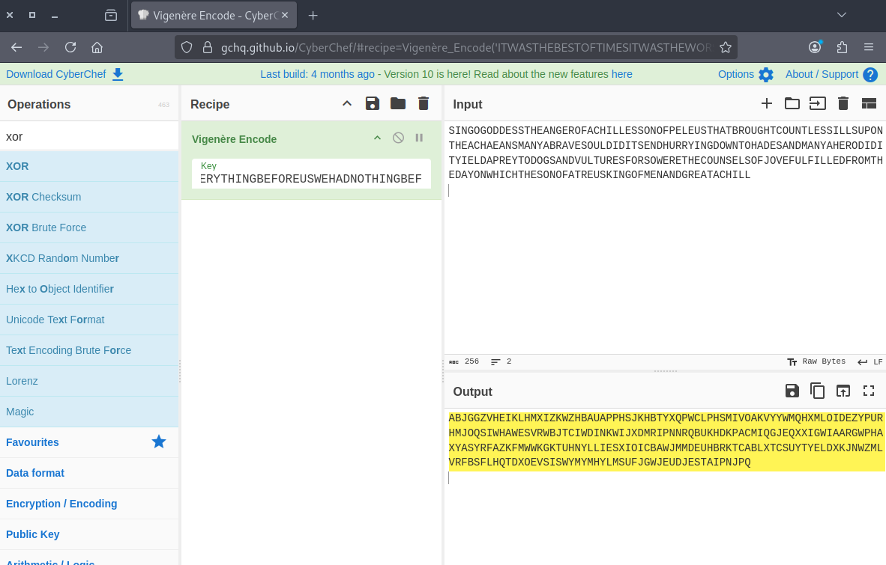

After that, we set up a temporary directory and create symbolic links for `keyfile.dat` and `krypton7`.
```
mktemp -d
cd /tmp/tmp.rg3C0IeDP4
ln -s /krypton/krypton6/keyfile.dat
ln -s /krypton/krypton6/krypton7
chmod 777 .
```

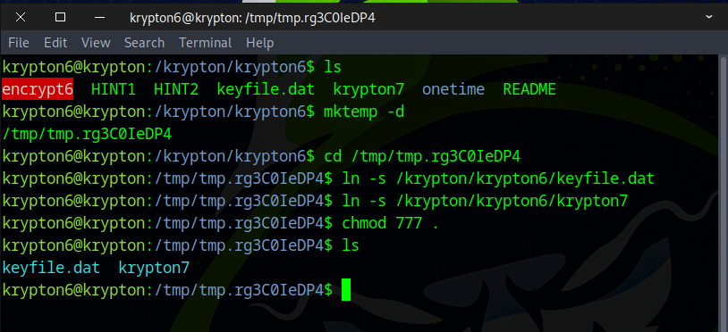

Next, we generate a test.txt file to test the functionality of `encrypt6`.
```
python3 -c 'print("A"*100)' > test.txt
```

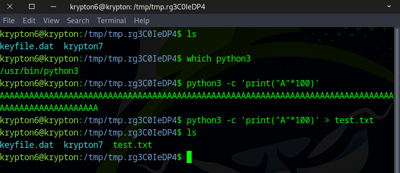

---

### 💭 Why Use Repeated A 100 times?

In this way, the ciphertext is the key in the Vigenère cipher.

| Plaintext Letter | Key Letter | Key Position | Ciphertext Letter |
| ---------------- | ---------- | ------------ | ----------------- |
| A                | K          | 10           | K                 |
| A                | E          | 4            | E                 |
| A                | Y          | 24           | Y                 |
| A                | K          | 10           | K                 |
| A                | E          | 4            | E                 |

---

After running this command, it generates a `ciphertest.txt` file.
```
/krypton/krypton6/encrypt6 test.txt ciphertest.txt
```

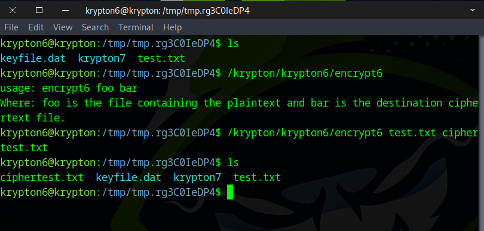

Then we `cat ciphertext.txt` to view its contents.

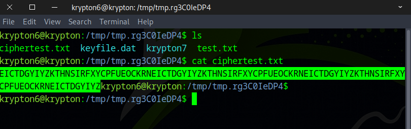

We found repeated patterns in our ciphertext which is the key
```
EICTDGYIYZKTHNSIRFXYCPFUEOCKRN
```

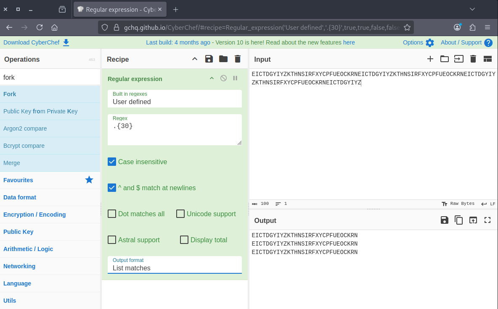

We used the key to decode the `krypton7` file and discovered the flag.

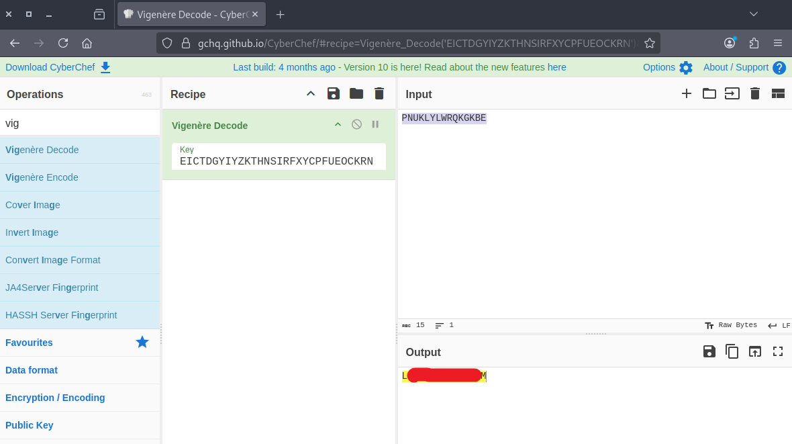

---

## Cipher System Classification
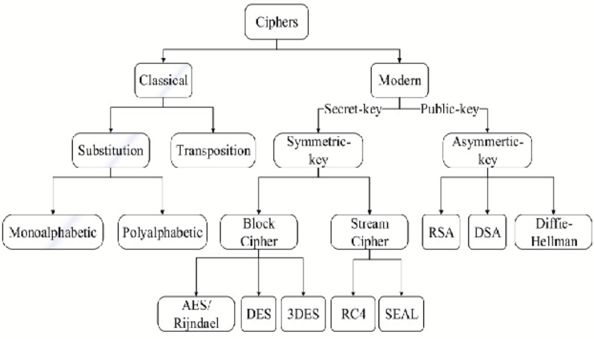


## LFSR (Linear Feedback Shift Register) in Cryptography

An **LFSR (Linear Feedback Shift Register)** is a simple, fast hardware-based mechanism used in some **stream ciphers** to generate pseudorandom sequences of bits.

## 🚀 What is an LFSR?

An LFSR is a **shift register** (a series of bits) where each new bit entering the register is computed as a **linear function** (usually XOR) of some selected bits in the register, called **taps**.

## 🔐 Why is it used in ciphers?

In cryptography—especially classic **stream ciphers**—an LFSR generates a **keystream** (a sequence of bits) that is XORed with plaintext to produce ciphertext. LFSRs are valuable because they are:

- **Fast** (hardware-friendly)
- **Simple to implement**
- **Low-resource** (used in RFID, wireless sensors, older mobile systems like GSM A5/1)

## ⚠️ But: LFSRs Alone Are Not Secure

A single LFSR is **linear**, meaning its output can be predicted if enough bits are observed. To improve security, modern designs use:

- **Multiple LFSRs** combined non-linearly
- **Nonlinear combination functions** or **nonlinear filtering**
- **Irregular clocking** (e.g., A5/1 cipher uses 3 LFSRs with majority-vote clocking)

## 📘 Simple Example

Suppose an LFSR has:

- **Register state**: `1011`
- **Taps at positions** producing feedback: XOR of bits 1 and 4

### Compute new bit:

1 XOR 1 = 0 → shift right → new state: 0101


This output bit becomes part of the **keystream**.

## 🏁 Summary

An **LFSR in ciphers** is:

- A **linear**, fast pseudorandom generator made of shifting bits and XOR feedback
- Often used in **traditional stream ciphers**
- **Not secure alone**; must be combined with nonlinear components for cryptographic security

---

You did it! Use the flag to move on to the next stage.


