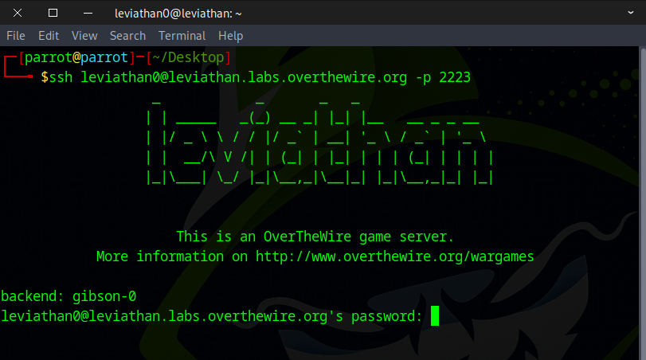
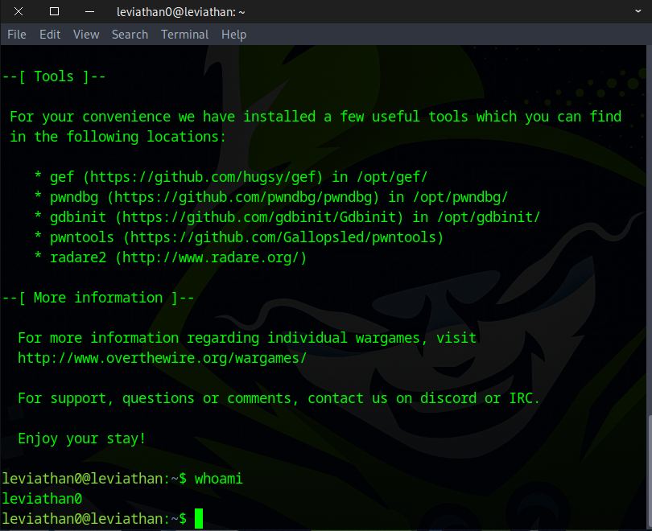
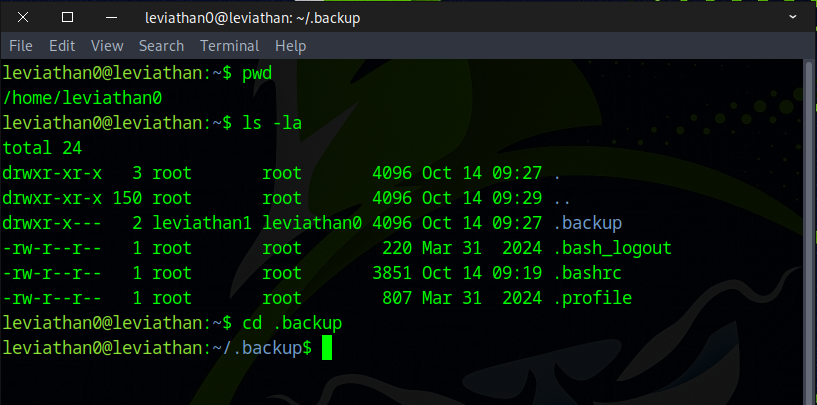
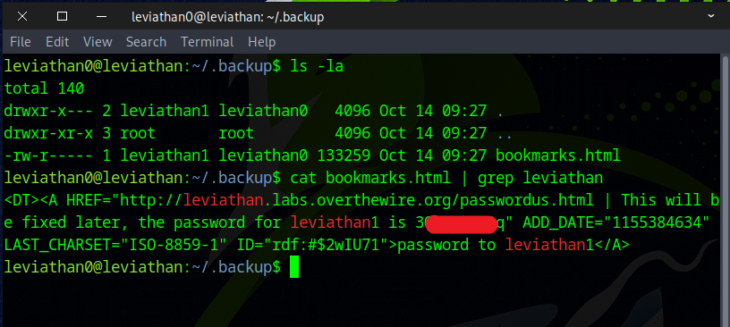

# 🌊 Leviathan Level 0 → Level 1

```
ssh leviathan0@leviathan.labs.overthewire.org -p 2223
leviathan0
```



After you log in successfully, this will appear.



After running the `ls` command, you’ll notice a hidden folder called ``.backup``.
```
ls -la
cd .backup
```



Inside the ``.backup`` folder, you’ll find `bookmarks.html`. Use the following command to grep the flag.
```
cat bookmarks.html | grep leviathan
```



Great job! Use this flag to advance to the next stage.
