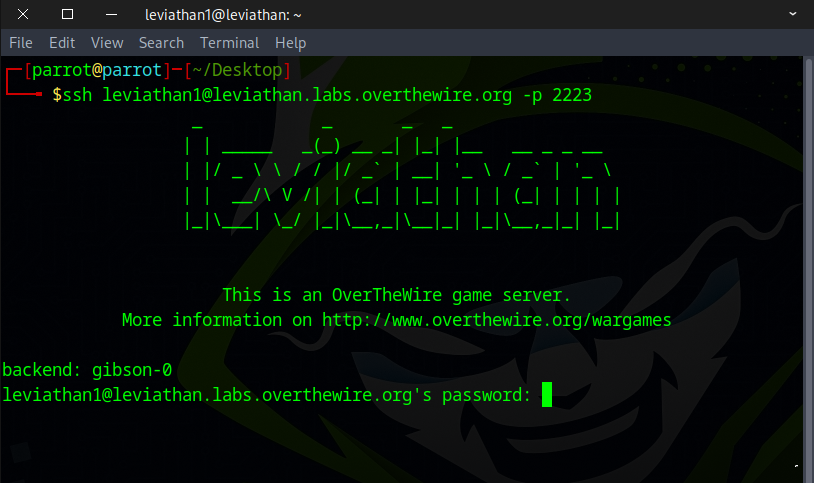
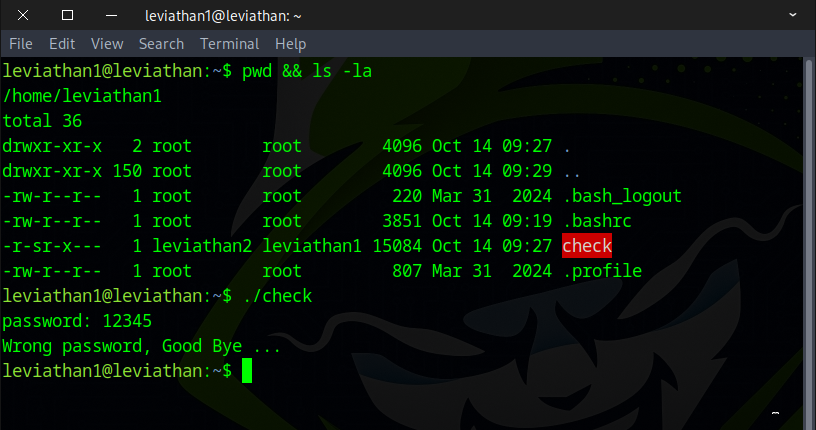
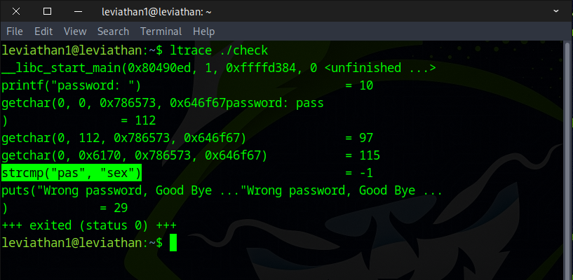
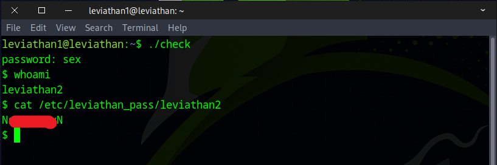

# 🌊 Leviathan Level 1 → Level 2

```
ssh leviathan1@leviathan.labs.overthewire.org -p 2223
leviathan1_password
```



After running the `ls` command, we noticed a file named `check`, and then we executed it.
```
ls -la 
./check
```



Next, we ran `ltrace` to observe how the program operates and noticed it performing a string-comparison function.
```
ltrace ./check
```



After that, we used the word we found to capture the flag.
```
./check
sex
whoami
cat /etc/leviathan_pass/leviathan2
```



Well done! This flag will take you to the next round.
