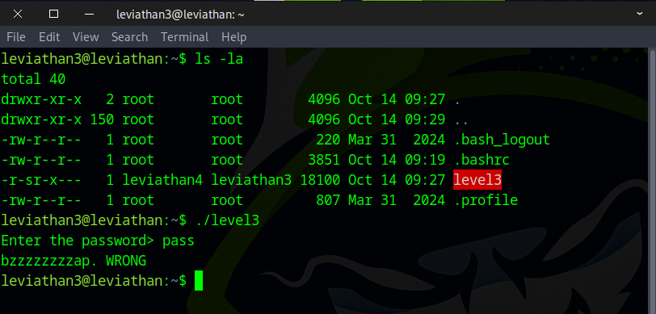
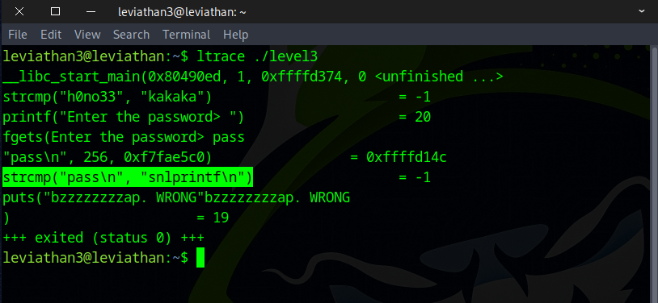
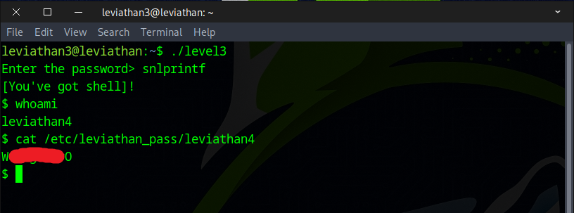

# 🌊 Leviathan Level 3 → Level 4

```
ssh leviathan3@leviathan.labs.overthewire.org -p 2223
leviathan3_password
```


After running the `ls` command, we found a program file named `level3` and executed it.
```
ls -la
./level3
```



Then we executed ltrace to analyze how the program works and saw a string comparison function.
```
ltrace ./level3 
```



After that, we ran level3 again and obtained a shell.
```
./level3
snlprintf
whoami
cat /etc/leviathan_pass/leviathan4
```



Fantastic! This flag will allow you to progress to the next round.
