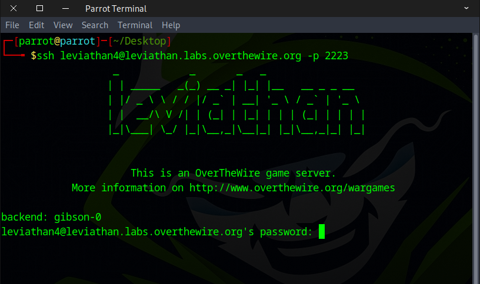
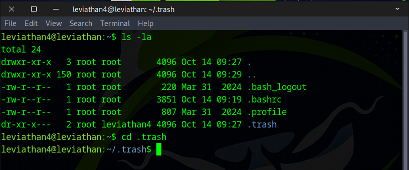
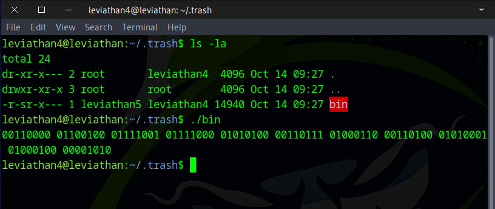
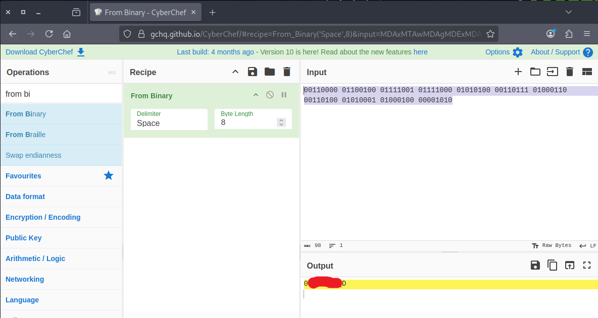
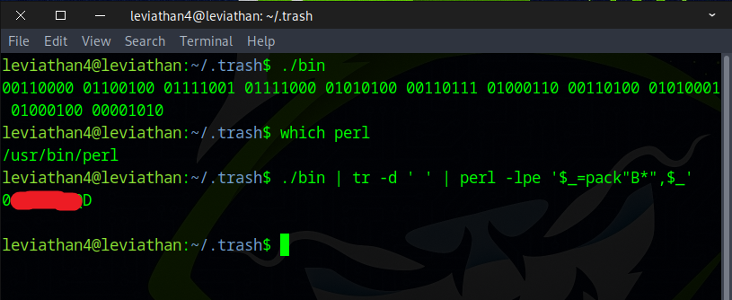

# 🌊 Leviathan Level 4 → Level 5

```
ssh leviathan4@leviathan.labs.overthewire.org -p 2223
leviathan4_password
```



After running the `ls` command, we discovered a hidden folder named ``.trash`` and navigated into it.
```
ls -la
cd .trash/
```



Inside the ``.trash folder``, there was a file named `bin`. We executed it, and it displayed some binary data.
```
./bin
00110000 01100100 01111001 01111000 01010100 00110111 01000110 00110100 01010001 01000100 00001010 
```



Next, we copied the binary to **CyberChef** to decode it.



Alternatively, if Perl is installed on the machine, you can use this command.
```
./bin | tr -d ' ' | perl -lpe '$_=pack"B*",$_'
```



Nice work! Proceed to the next round by using this flag.
