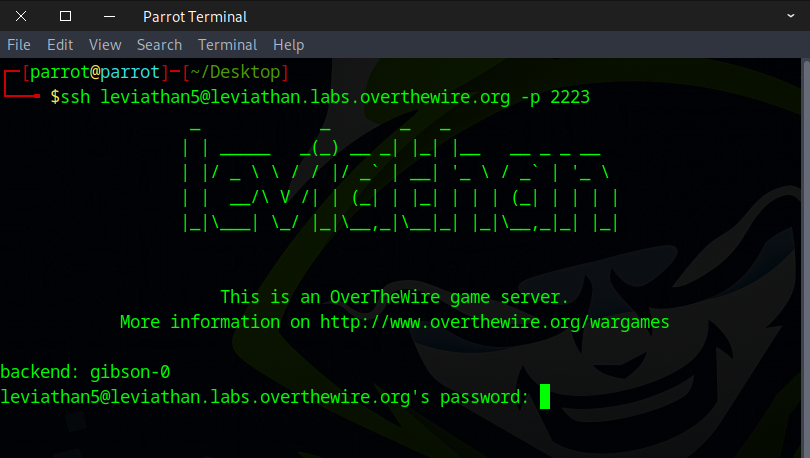
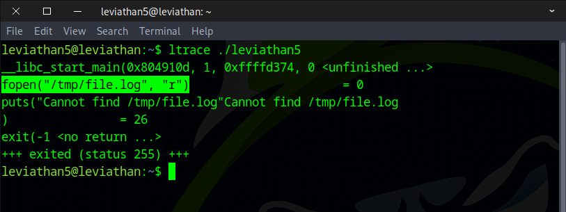
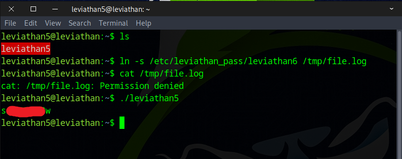

# 🌊 Leviathan Level 5 → Level 6

```
ssh leviathan5@leviathan.labs.overthewire.org -p 2223
leviathan5_password
```



After running the `ls` command, we noticed a file named `leviathan5` and executed it.
```
ls -la
./leviathan5
```


Next, we ran `ltrace` to understand the program’s behavior.
```
ltrace ./leviathan5
```



After that, we created a symbolic link from the next level’s flag to the file that the program reads, and we retrieved the flag.
```
ln -s /etc/leviathan_pass/leviathan6 /tmp/file.log
./leviathan5
```



Perfect! This flag will help you advance to the next phase.
