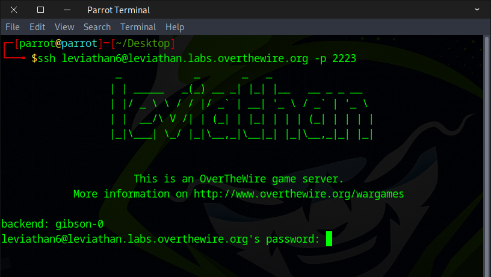
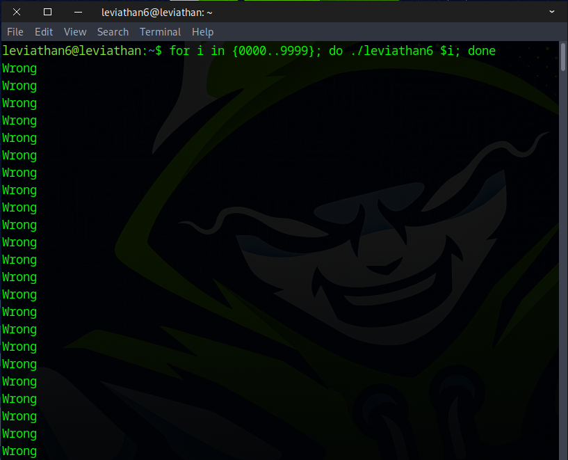
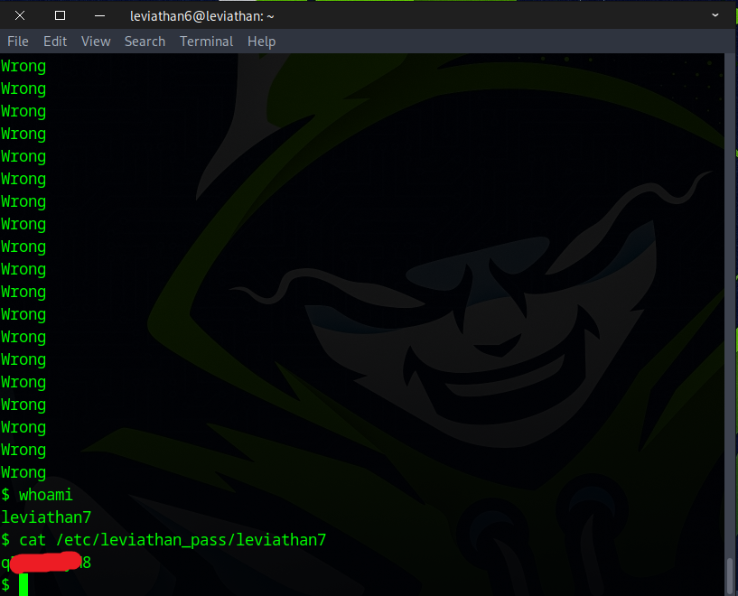

# 🌊 Leviathan Level 6 → Level 7

```
ssh leviathan6@leviathan.labs.overthewire.org -p 2223
leviathan6_password
```



Once we listed the directory with `ls`, we noticed a file called `leviathan6` and ran it.
```
ls -la
./leviathan6
```


Next, we brute‑forced the 4‑digit code using the following command.
```
for i in {0000..9999}; do ./leviathan6 $i; done
```



Eventually, we got a shell and captured the flag.
```
whoami
cat /etc/leviathan_pass/leviathan7
```



Brilliant! Use the flag to continue to the next level.
