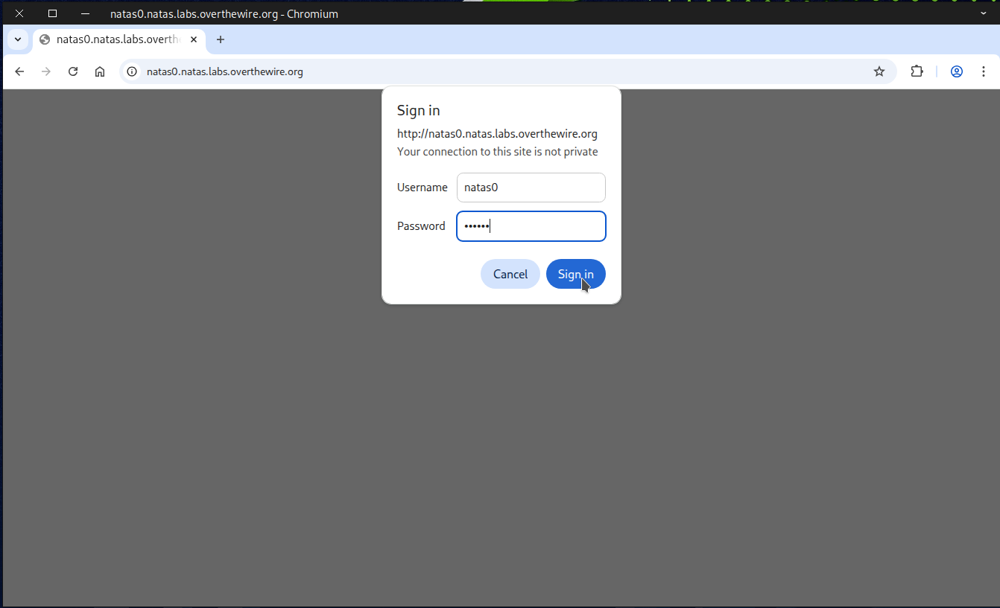
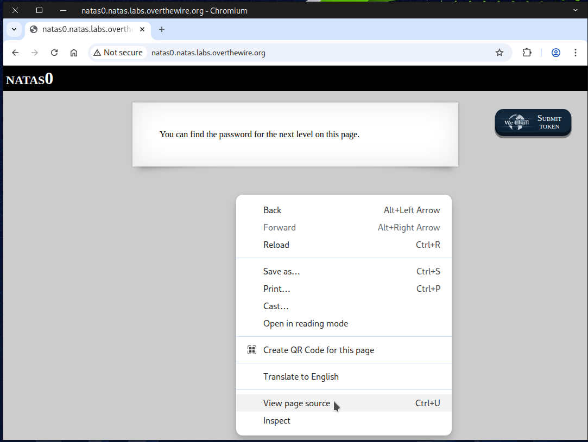
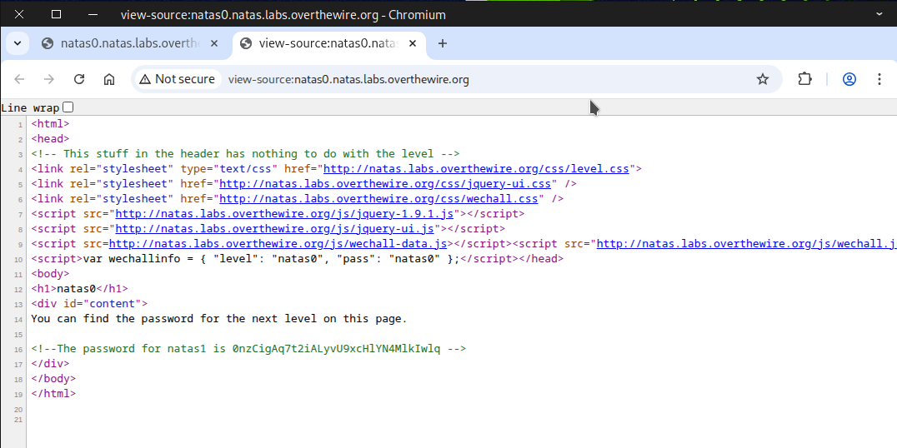

# 🕸️Natas Level 0 → Level 1

```
http://natas0.natas.labs.overthewire.org
```
Username: natas0  
Password: natas0  



Right-click anywhere on the page and select View Page Source.



Once the source page opens, you’ll see your flag.



🎯 Found the flag? Awesome! Save it in a text file on your desktop — you’ll need it for the next challenge.

🎉 Congrats on capturing your first flag! That’s a huge milestone — keep the momentum going!
