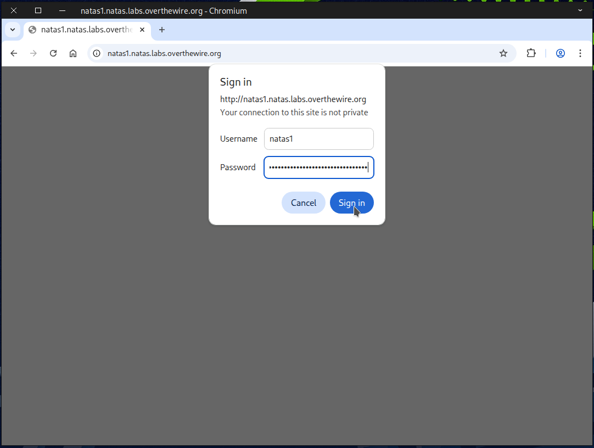
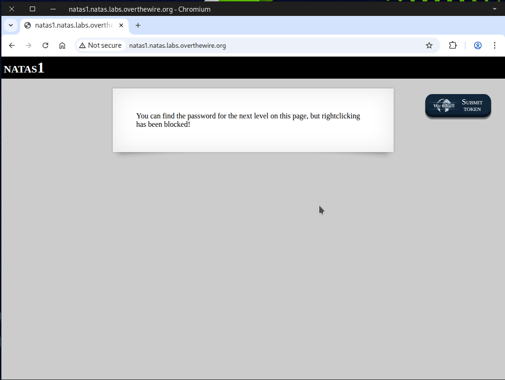
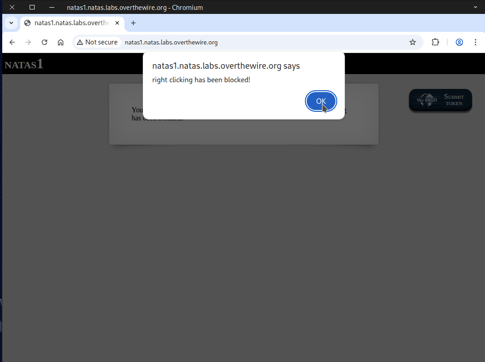
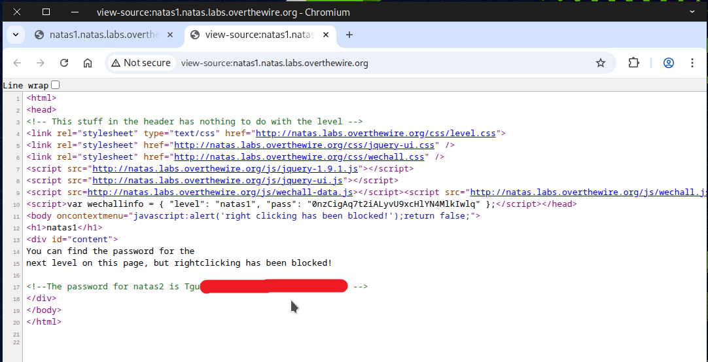

# 🕸️Natas Level 1 → Level 2

```
http://natas1.natas.labs.overthewire.org
```
Username: natas1  
Password: 0nzCigAq7t2iALyvU9xcHlYN4MlkIwlq



This time, you won’t be able to right-click.



To view the source page, you can use the shortcut **Ctrl + U**.



The flag will appear on the source page once it is opened.



Excellent job! This flag will be essential for the next challenge.
