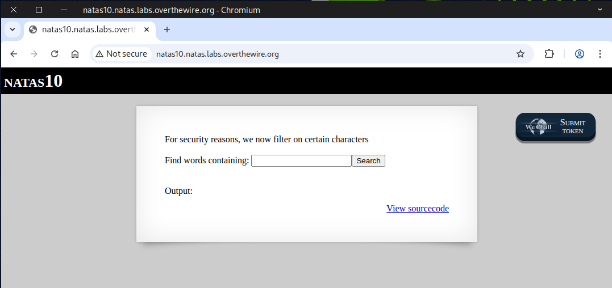
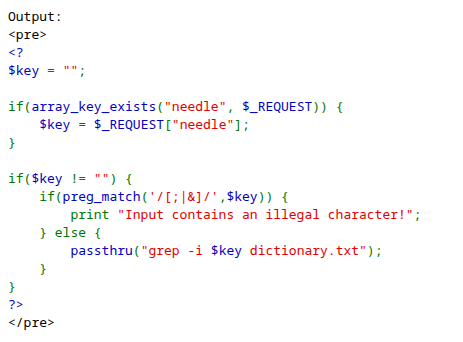
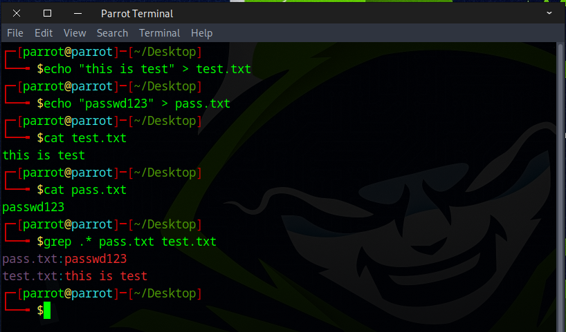
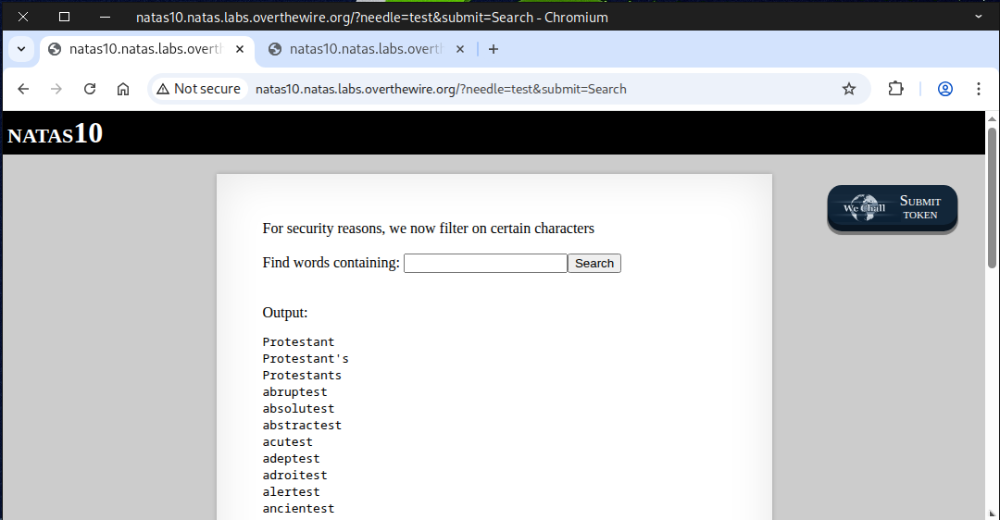
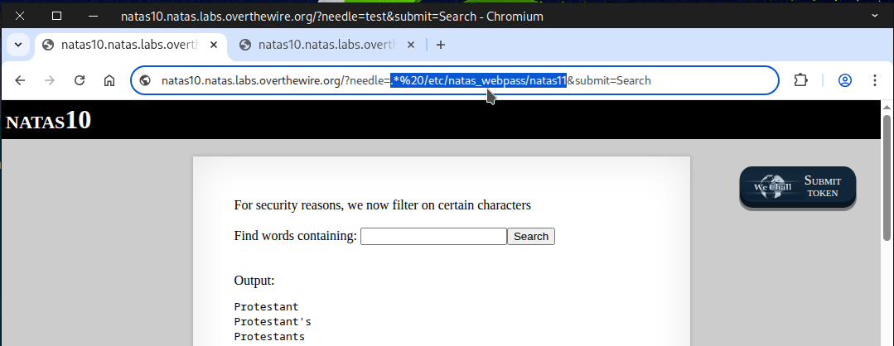
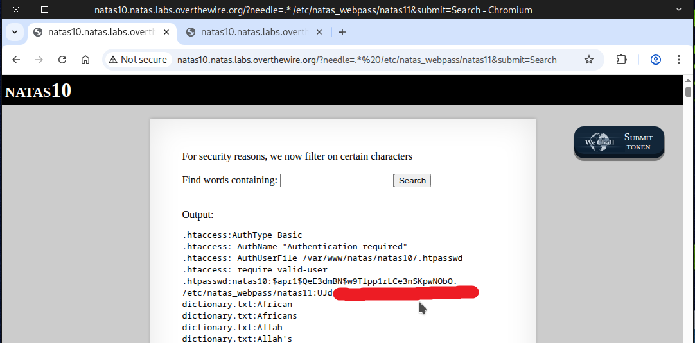

# 🕸️Natas Level 10 → Level 11

```
http://natas10.natas.labs.overthewire.org
```
Username: natas10  
Password: (natas10_password)



After checking the page source, we discovered that the special characters ``/[;|&]/`` were restricted this time.



We can leverage `grep` to access and read the file to finish this challenge — see the examples below.
```
grep .* pass.txt test.txt
```
This is a regular expression (regex) pattern.  
- ``.`` (dot) means “any single character.”  
- ``*`` (asterisk) means “zero or more times.”  
Together, ``.*`` matches any text on a line — effectively, it matches everything.



Next, we enter `test` into the input field and inject our command into the URL



### 🌐 Here are some useful URL encodings.


```
.*%20/etc/natas_webpass/natas11
```


Follow the steps above and the flag should appear.



Fantastic! This flag is your key to the next challenge.
