# 🕸️Natas Level 11 → Level 12

```
http://natas11.natas.labs.overthewire.org
```
Username: natas11  
Password: (natas11_password)

The hint for this challenge indicates that the Cookies are protected with XOR encryption.

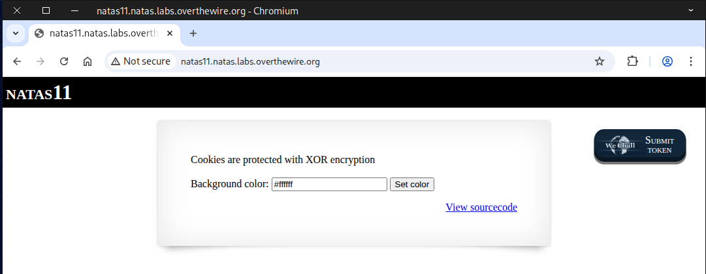

Inspect the page source for anything noteworthy — you’ll spot a variable called ``$defaultdata``, which is quite interesting, along with a function responsible for encrypting the cookie.

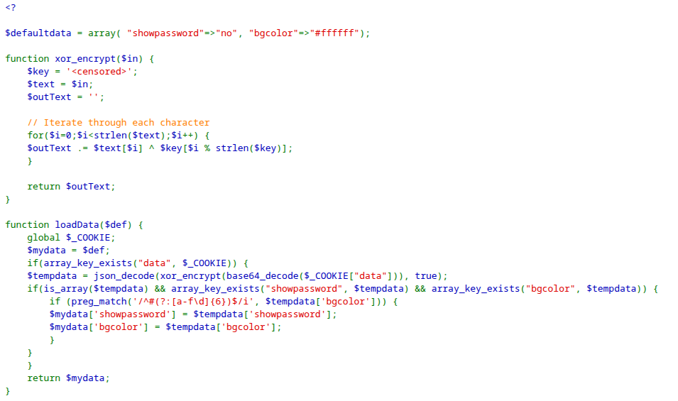
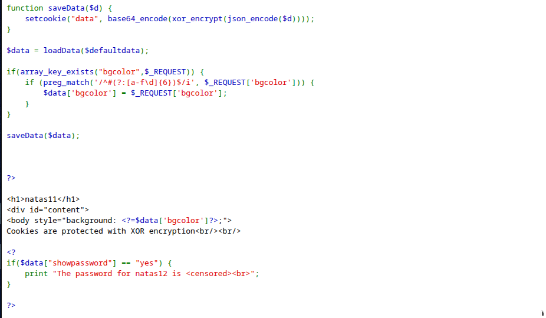

The next step: retrieve the **cookie** for analysis.  
Press `F12` or `Ctrl + Shift + I` to open *Developer Tools*.  
Then go to the *Application Tab*.  
In the left-hand menu, under *Storage*, click *Cookies*.  
🔔 Note: Each browser has its own way of accessing cookies, so the steps may vary.

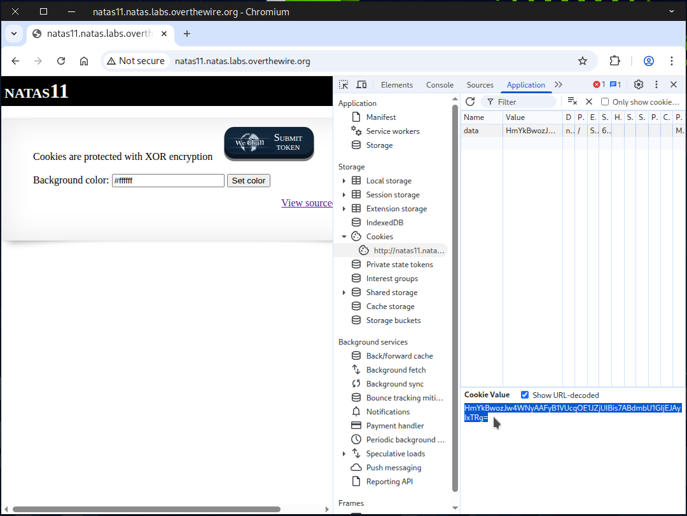

If dealing with the browser interface feels annoying, `curl` can quickly retrieve the cookie for you.
```
curl -c cookie.txt \
-u natas11:UJdqkK1pTu6VLt9UHWAgRZz6sVUZ3lEk \
http://natas11.natas.labs.overthewire.org/
```
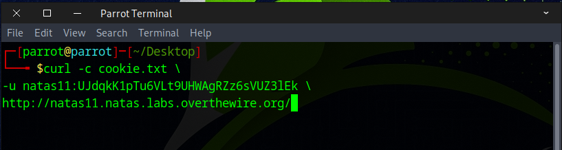

At this point, you should have successfully retrieved your cookie.
```
#URL-encoded
HmYkBwozJw4WNyAAFyB1VUcqOE1JZjUIBis7ABdmbU1GIjEJAyIxTRg%3D
#URL-decoded
HmYkBwozJw4WNyAAFyB1VUcqOE1JZjUIBis7ABdmbU1GIjEJAyIxTRg=
```
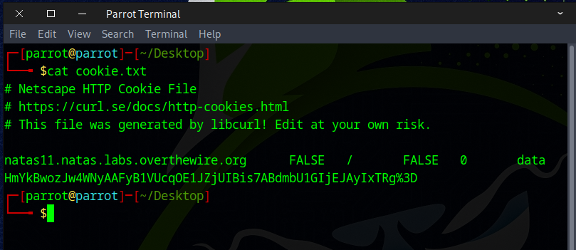

### 🔧Useful curl Commands and URL Encoding 


### ⚡XOR Encryption: A Quick Guide
One of the special properties of **XOR** (exclusive OR) is that the order of operands doesn’t matter.  
For Example:  
A ⊕ B ⊕ C = 0101 ⊕ 0011 ⊕ 0110 = 0001  
B ⊕ C ⊕ A = 0011 ⊕ 0110 ⊕ 0101 = 0001  
✅ Same result — order doesn’t matter!  
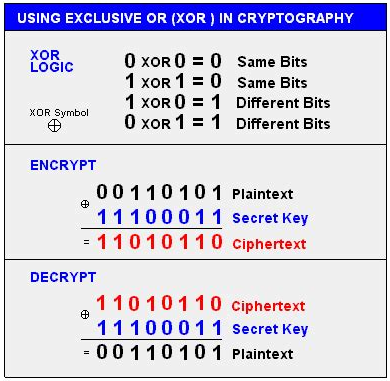

Next, use any online PHP compiler to run this PHP code.
```
<?php
#encode without XOR encode
$defaultdata = array( "showpassword"=>"no", "bgcolor"=>"#ffffff");
echo base64_encode(json_encode($defaultdata))
?>
```
Running the code should produce this output.
```
eyJzaG93cGFzc3dvcmQiOiJubyIsImJnY29sb3IiOiIjZmZmZmZmIn0=
```
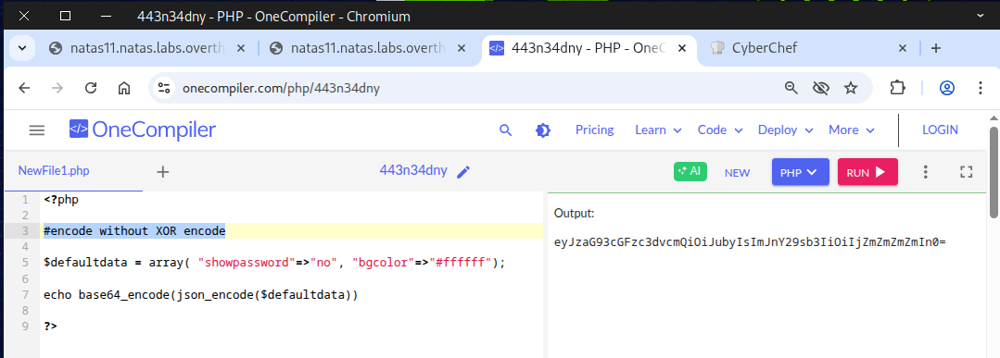

Next, go to **CyberChef**.  
Search for **From Base64** and **XOR**, then drag them into the *recipe*.  
Paste your **cookie** into the input field.  
⚡Remember: in XOR, the order doesn’t matter.  
Also, copy and paste the cookie (without XOR encryption) into the XOR key.  
Set the XOR type to **BASE64**.  
You should then see this output.  
```
eDWoeDWoeDWoeDWoeDWoeDWoeDWoeDWoeDWoeDWoeL  
```
Notice that `eDWo` repeats; this is our 🔑 *secret key*.

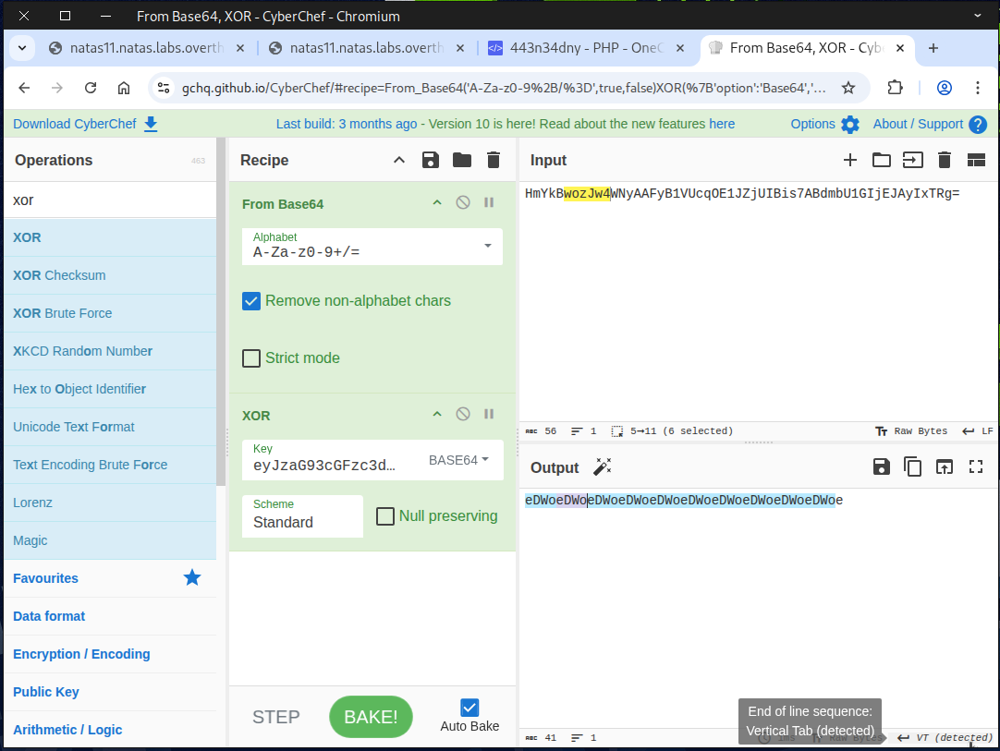

Next, replace the key with `eDWo` and set the key type to `UTF-8`. This reveals the ``$defaultdata`` in plain text.

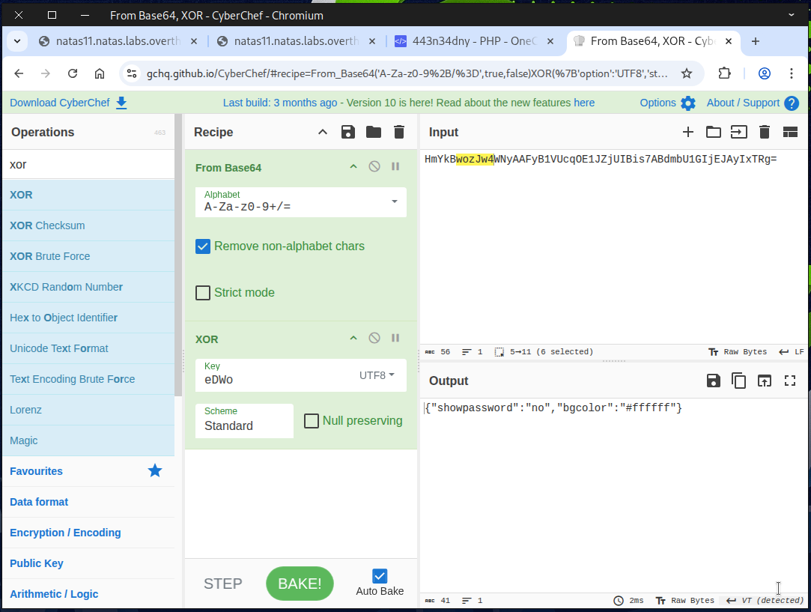

Now, reverse the process.  
Either disable **From Base64** or remove it from the *recipe*.  
Search for **To Base64** and add it to the *recipe*.  
You should then see the *original cookie*.  

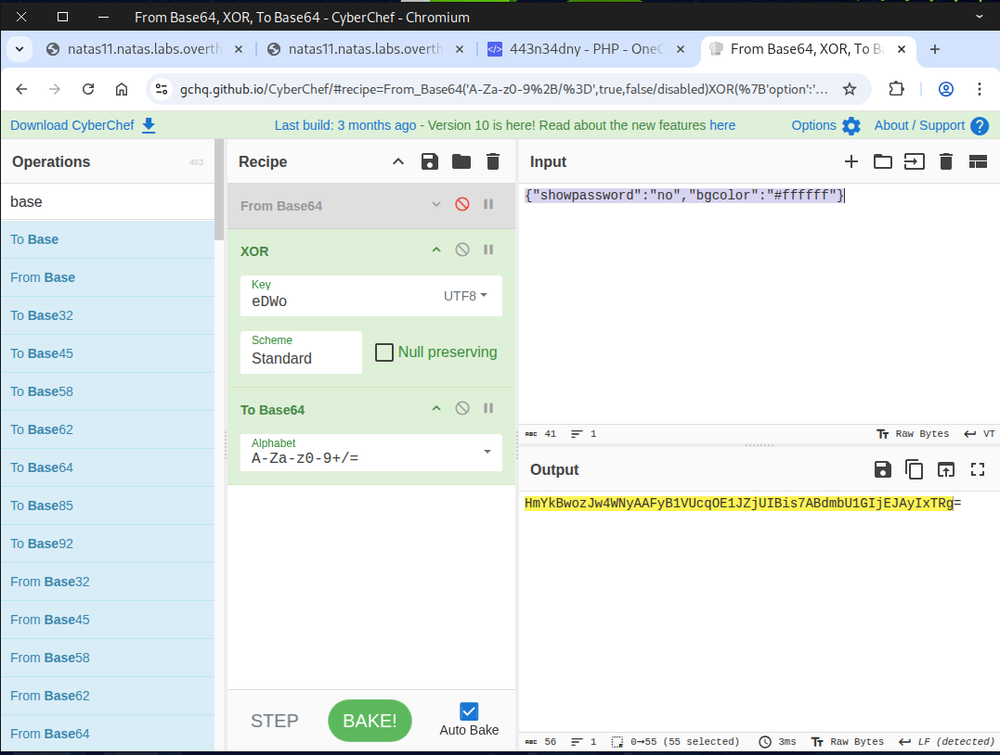

Now it’s time to bake our own cookie 🍪. Simply set the value of `showpassword` to `yes`.
Our homemade cookie 🍪 is ready and good to serve!
```
HmYkBwozJw4WNyAAFyB1VUc9MhxHaHUNAic4Awo2dVVHZzEJAyIxCUc5
```


If you like keeping things simple with the command line, you can use `curl` with the ``-b`` or ``--cookie`` option to send the *homemade cookie*.
```
curl --cookie "data=HmYkBwozJw4WNyAAFyB1VUc9MhxHaHUNAic4Awo2dVVHZzEJAyIxCUc5" \
-u natas11:UJdqkK1pTu6VLt9UHWAgRZz6sVUZ3lEk \
http://natas11.natas.labs.overthewire.org/
```
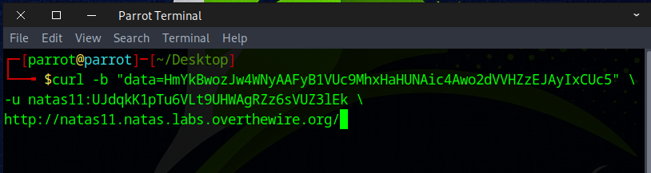

If everything was done correctly, the next level’s flag will be visible.

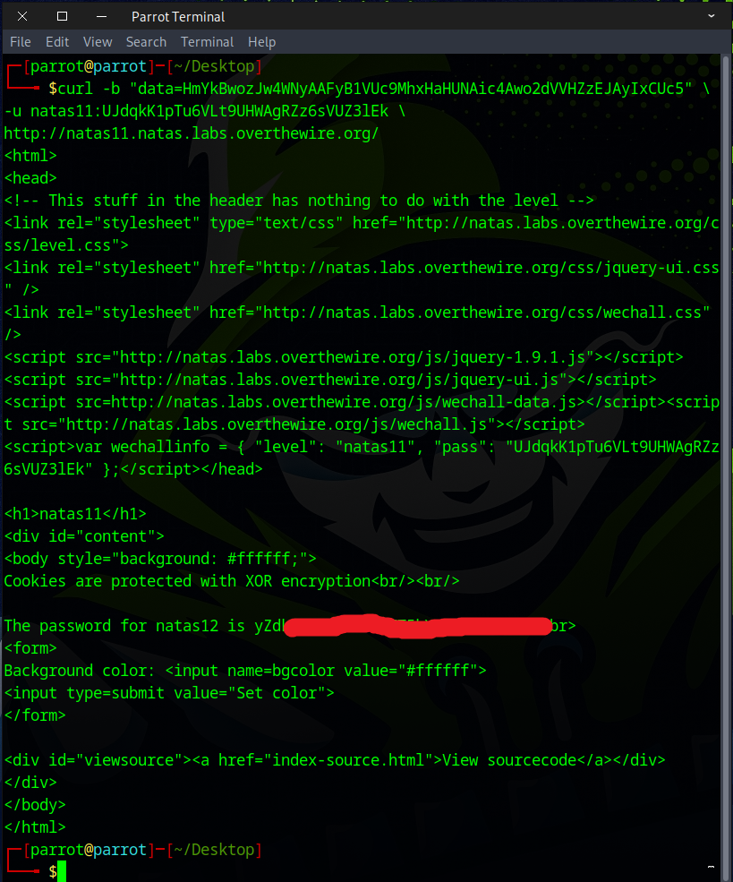

You can also manually insert the *homemade cookie* into the browser and refresh the page.

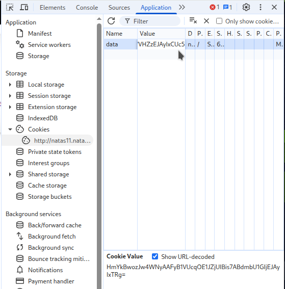

You should now see the flag.  
Note: ⚠️ Security features in your browser or add-ons may interfere with this method.

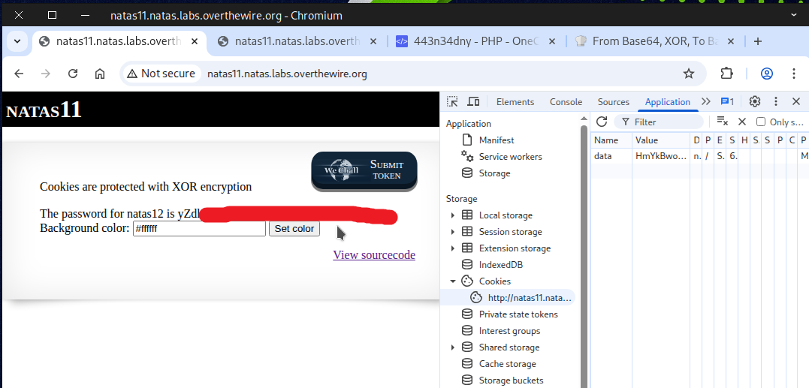

Boom! Flag secured — get ready for the next challenge.


