# 🕸️Natas Level 13 → Level 14

```
http://natas13.natas.labs.overthewire.org
```
Username: natas13  
Password: (natas13_password)

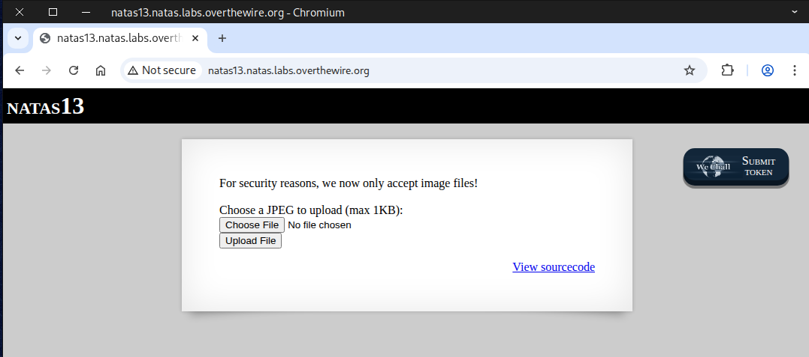

The hint for this challenge is that the server only accepts image files this time.

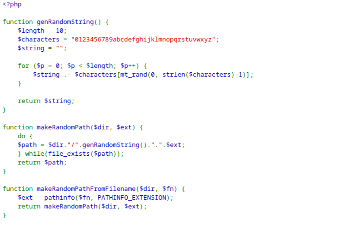
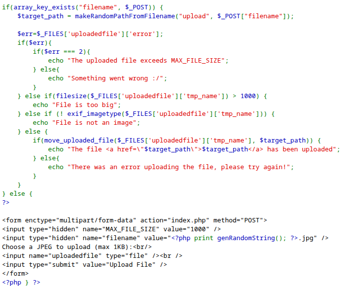

If we attempt to upload a `PHP` file, an error message saying *File is not an image* will appear. Additionally, the file size must still be **under 1KB**.

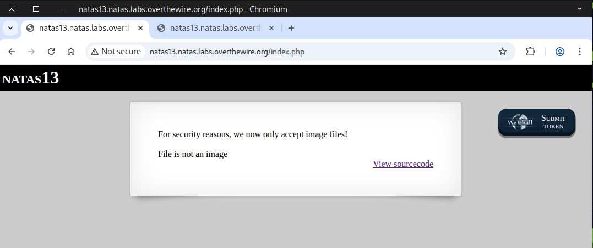

## 🧩 MIME-Type or 🔮 Magic Number Bypass

A **MIME-Type or Magic Number Bypass** is a security-related concept that typically comes up in **web application security**, especially regarding **file upload vulnerabilities**. 

---

## 1. MIME Type
- **MIME type** (Multipurpose Internet Mail Extensions) is a way for a server or browser to identify the type of file being sent.  
- **Example:**
  - `image/png` → PNG image  
  - `application/pdf` → PDF file  
- **Use:** Websites often check the MIME type to allow only certain file types to be uploaded (e.g., only images).

---

## 2. Magic Number
- A **magic number** is a sequence of bytes at the **beginning of a file** that identifies its true file type, independent of its name or extension.  
- **Examples:**
  - PNG: `89 50 4E 47 0D 0A 1A 0A`  
  - PDF: `%PDF-`  
- **Use:** Security checks may read the first few bytes to confirm the file type matches what it claims.

---

## 3. Bypass Concept
A **bypass** happens when an attacker **tricks the system** into accepting a disallowed file type by circumventing MIME type or magic number checks.  

### Common Techniques:
1. **Changing the MIME type in the request**  
   - Example: Uploading a PHP script but setting the MIME type to `image/png`.
2. **Altering the file extension**  
   - Example: Renaming `shell.php` to `shell.php.png` to pass basic extension checks.
3. **Using a double extension**  
   - Example: `shell.php.jpg` – some servers only check the last extension (`.jpg`).
4. **Modifying the magic number**  
   - Adding valid magic numbers at the start of a malicious file to trick checks.
5. **Multipart bypass**  
   - Sending the file in a format that some servers parse differently, e.g., a mix of text and binary content.

---

## 4. Why It Matters
- Allows attackers to **upload malicious files** (like web shells) even when basic file-type restrictions are in place.
- Proper mitigation requires:
  - **MIME type validation**
  - **Magic number validation**
  - **Server-side extension checks**
  - **Strict execution permissions**

---

> ⚠️ Note: Always validate files **server-side**, never rely solely on client-side checks.


### 🖼️ Common Image File Signatures 🔍
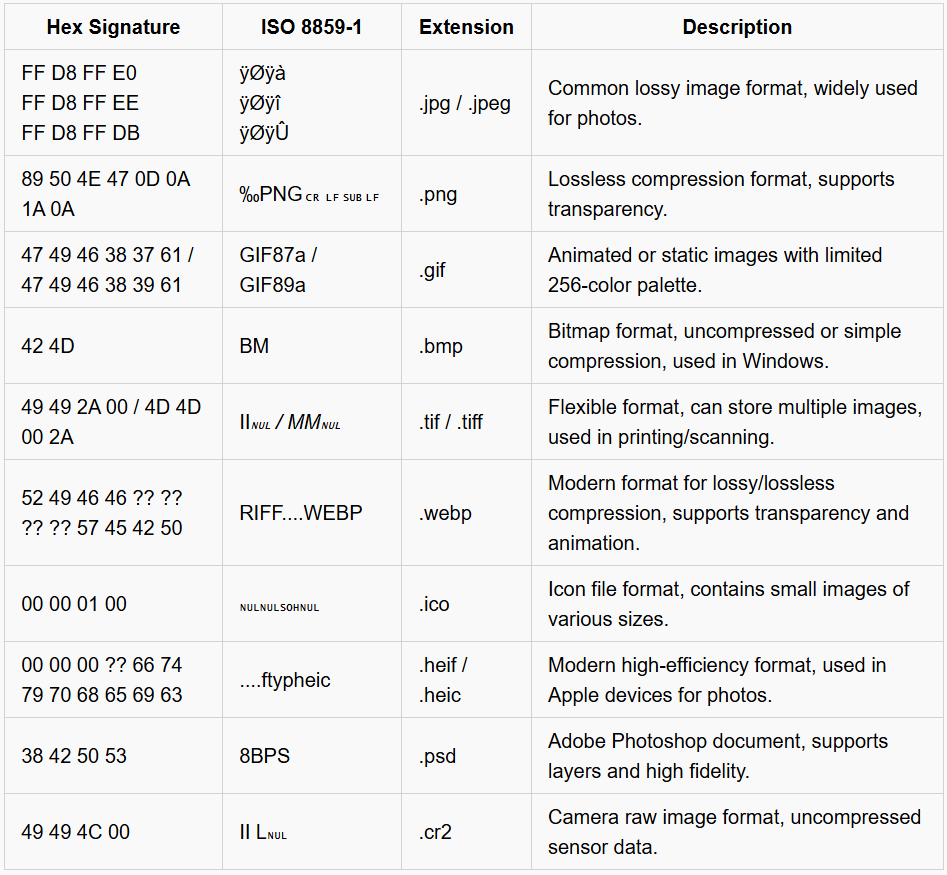

For more file signatures visit:    
<a href="https://en.wikipedia.org/wiki/List_of_file_signatures" target="_blank">
    https://en.wikipedia.org/wiki/List_of_file_signatures
</a>


**To finish this challenge**, you can reach the finish line in a few different ways 🏁 — here I’ll show two straightforward approaches:  
- Method 1 — Text editor ✍️: modify the file using a plain text editor.
- Method 2 — Hex editor 🔧: edit the file’s binary/header bytes directly.

### ✍️ Method 1 — Text editor

First, we select a file type— in this case, a `GIF` file— and copy its signature, either `GIF87a` or `GIF89a`. Next, we paste the signature at the beginning of our `PHP` file. By doing this, we trick the system into recognizing the file as a `GIF` image rather than a `PHP` file, successfully bypassing the check.

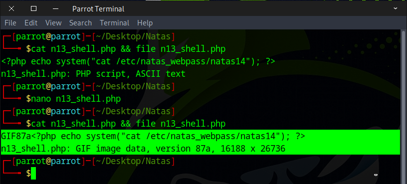

Next, the file was uploaded to the server, and the filename extension was modified from ``.jpg`` to ``.php``

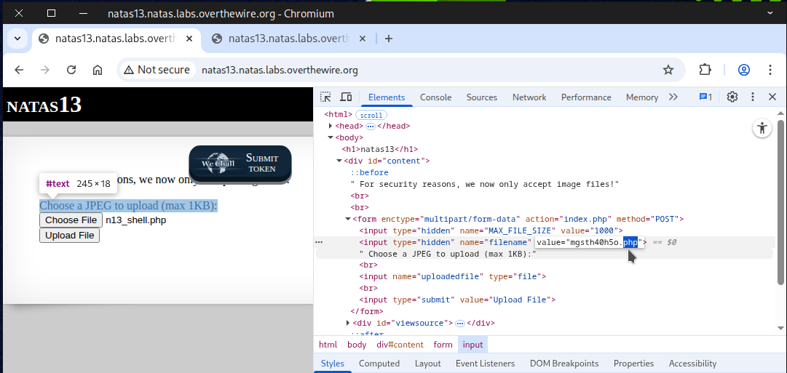

The file was uploaded successfully, bypassing the server’s image verification check.

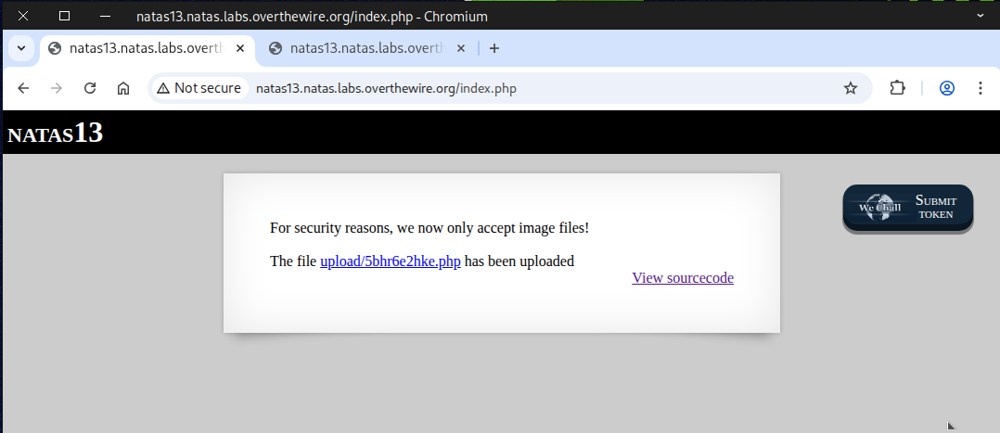

The flag will be revealed when the link is clicked.

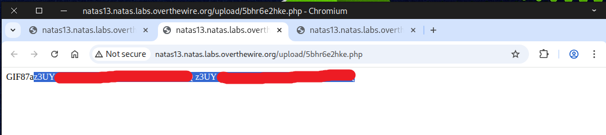

### 🔧 Method 2 — Hex editor

The first method won’t work for `JPEG` files since their file signature can’t be recognized in plain text.
The second method, however, is guaranteed to work if the correct signature is used.
Use the following command to modify the hex of our `PHP` file:
```
ghex n13_shell2.php
```
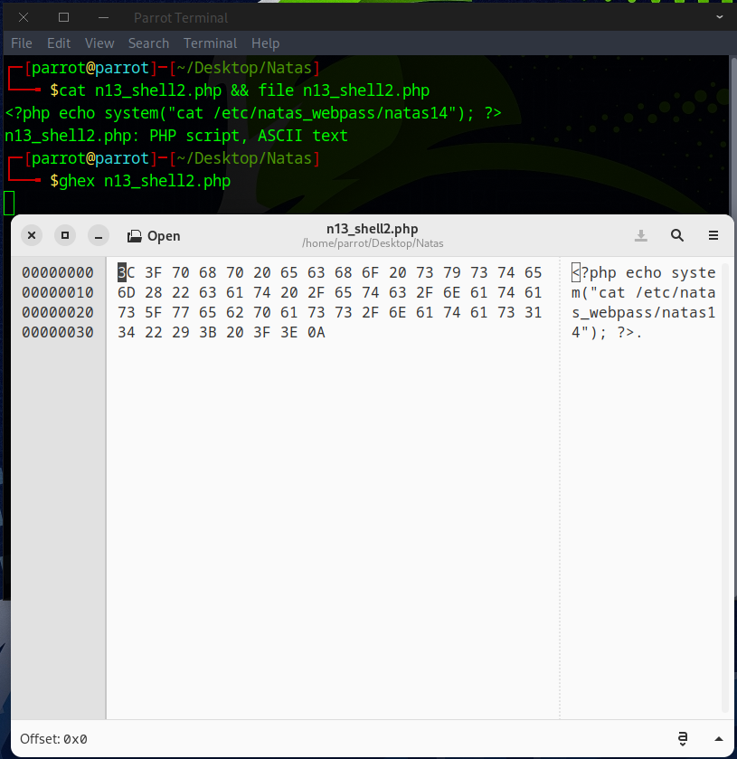

Insert the appropriate image file header into the file; if the initial header doesn’t work, adjust it manually and `Ctrl + S` to save the file.

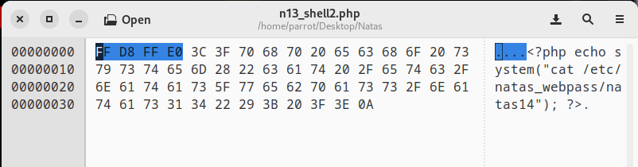

After verification, the system identifies the file as a `JPEG` image.

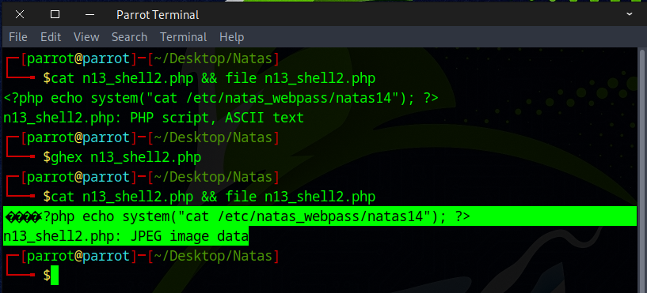

We used `curl` to upload the file to avoid dealing with the browser interface.
```
curl -X POST \
-F "filename=n13_shell2.php" \
-F "uploadedfile=@n13_shell2.php;type=image/jpeg" \
-u natas13:trbs5pCjCrkuSknBBKHhaBxq6Wm1j3LC \
http://natas13.natas.labs.overthewire.org/
```


The file was uploaded successfully. Just run this curl command to view it.
```
curl -u natas13:trbs5pCjCrkuSknBBKHhaBxq6Wm1j3LC \
http://natas13.natas.labs.overthewire.org/upload/her0z143ey.php
```
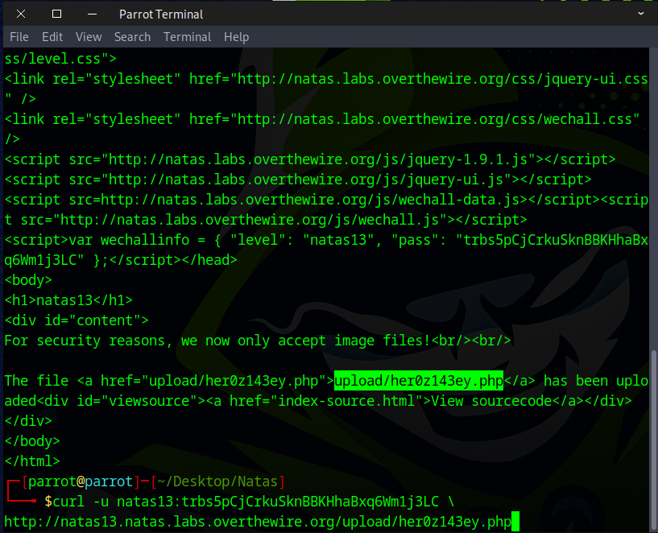

If everything’s done right, you’ll see the flag for the next level.

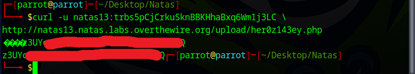

Awesome! You can use this flag to access the next round.


