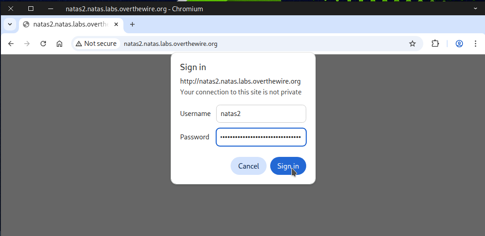
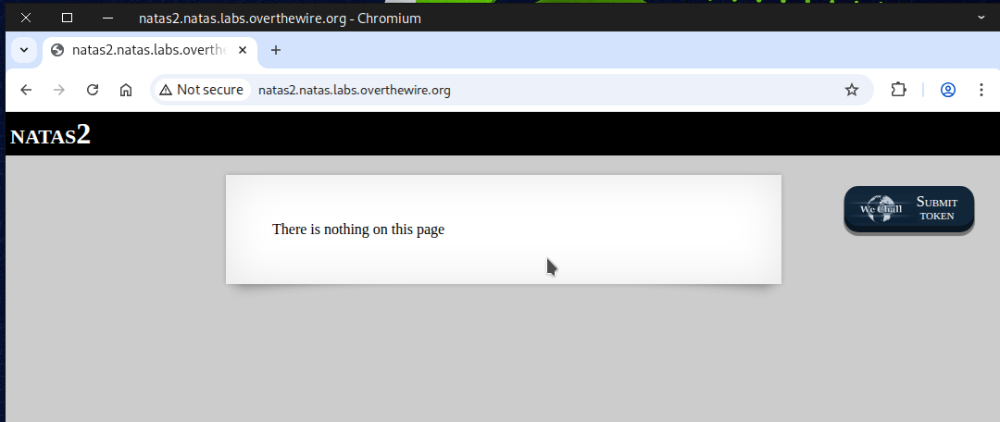
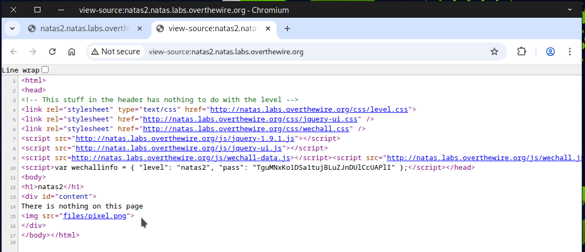
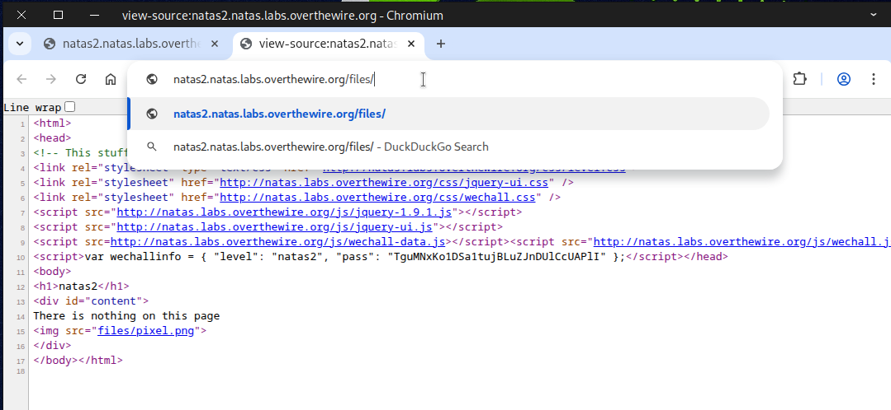
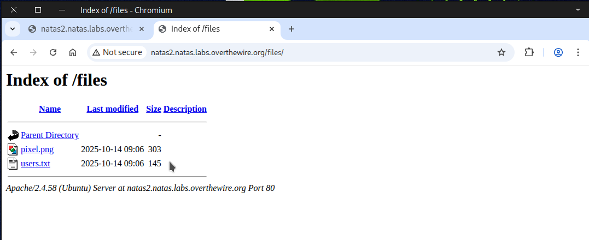

# 🕸️Natas Level 2 → Level 3

```
http://natas2.natas.labs.overthewire.org
```
Username: natas2  
Password: (natas2_password)



Once you log in, you’ll see a message saying there’s nothing on this page. 
Use **Ctrl + U** to view the source page.



In the source code, we noticed a directory called `files` that stores a file named `pixel.png`



So, we tried accessing it through the web browser.



Now we see a file named `users.txt`, so we clicked on it.



You’ll find the flag once you open it.


Boom! Flag secured — get ready for the next challenge.
