# 🕸️Natas Level 22 → Level 23

```
http://natas22.natas.labs.overthewire.org
```
Username: natas22  
Password: (natas22_password)

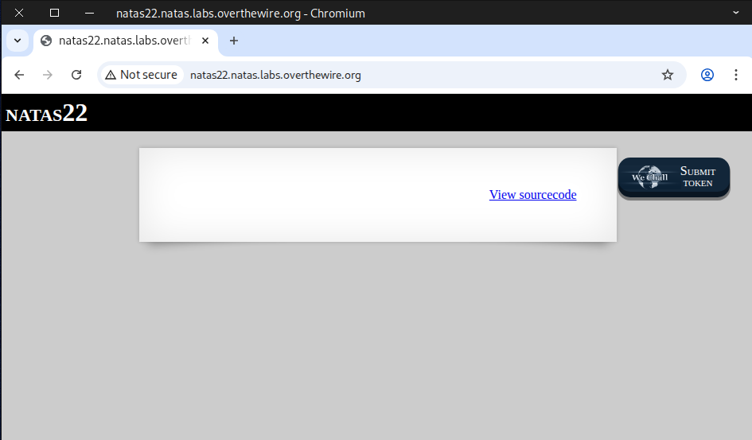

We looked through the source code to spot anything unusual and found **“revelio.”**

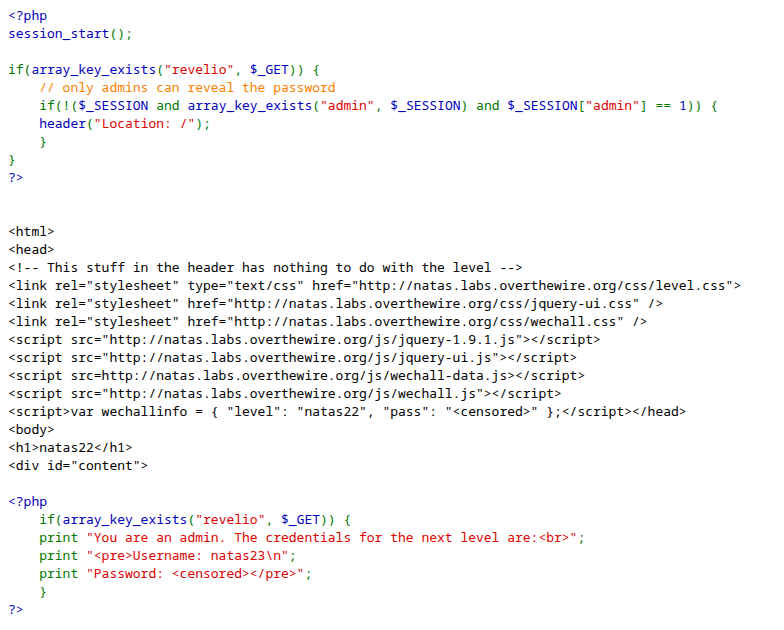

After that, we add ``?revelio&amin=1`` to the end of the URL.

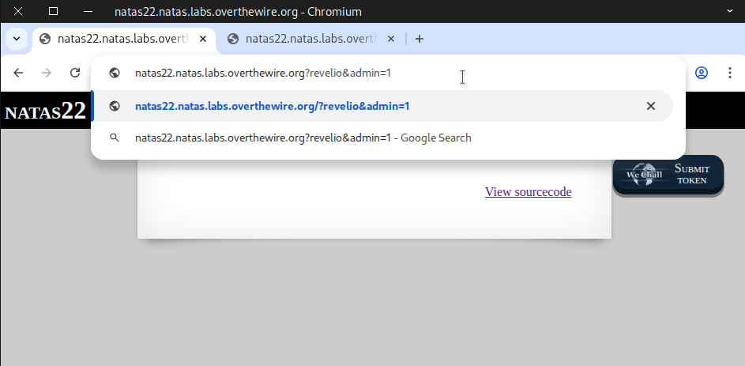

### Using Web Security Testing Tool

The first step was to capture the request packet and **Forward** it to receive the response.

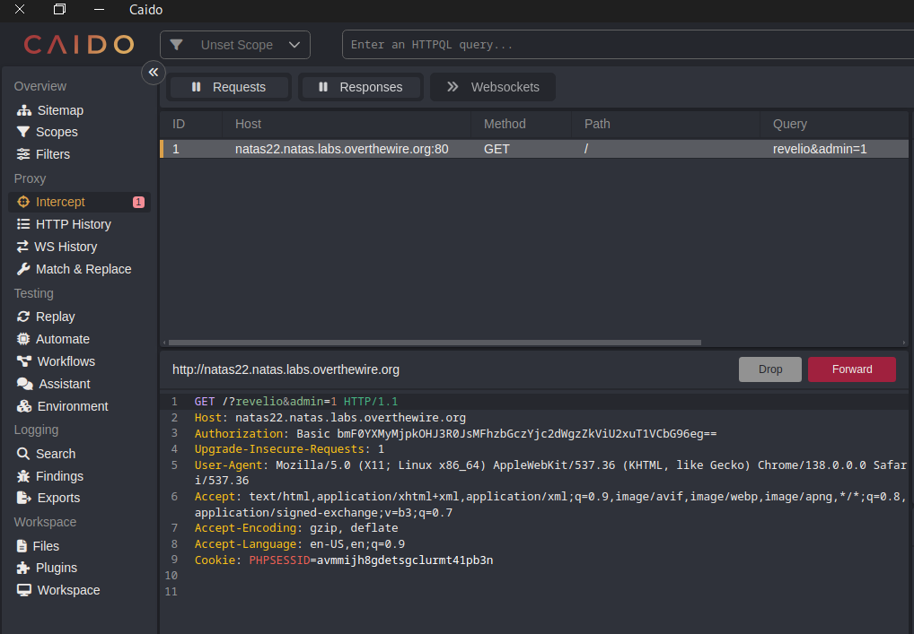

Then we noticed a `302 Found` response, and after scrolling down, we looked at the body message.

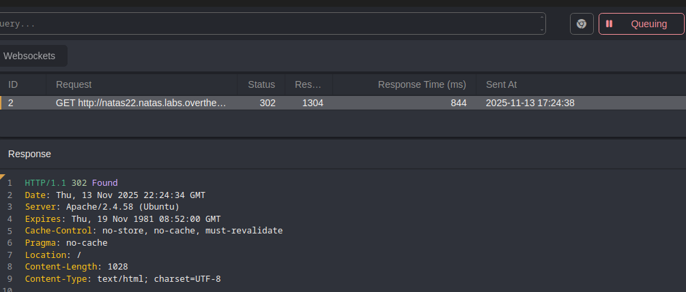

Surprisingly, we found the flag for natas23.

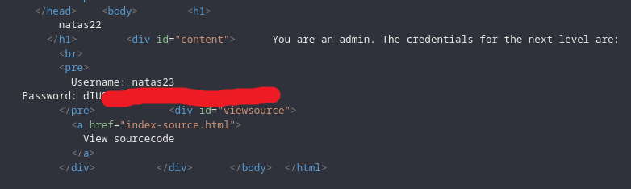

By changing `302 Found` to `200 OK` and forward the request.

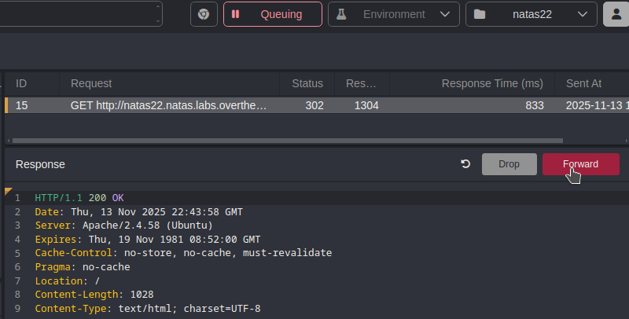

Upon returning to the home page, the flag appeared.

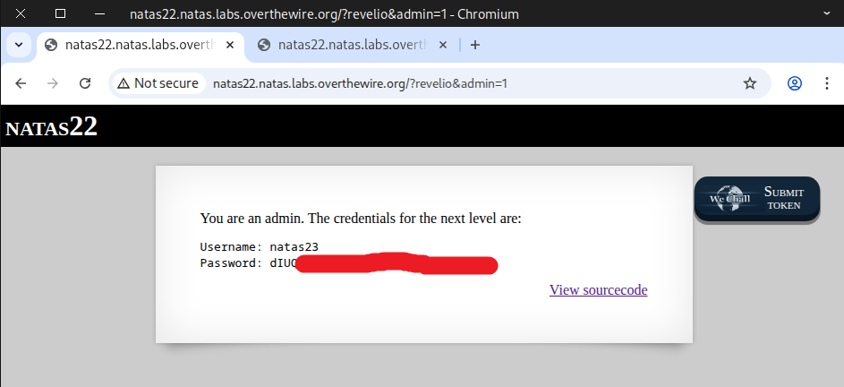

### Useful HTTP Status Code 📘
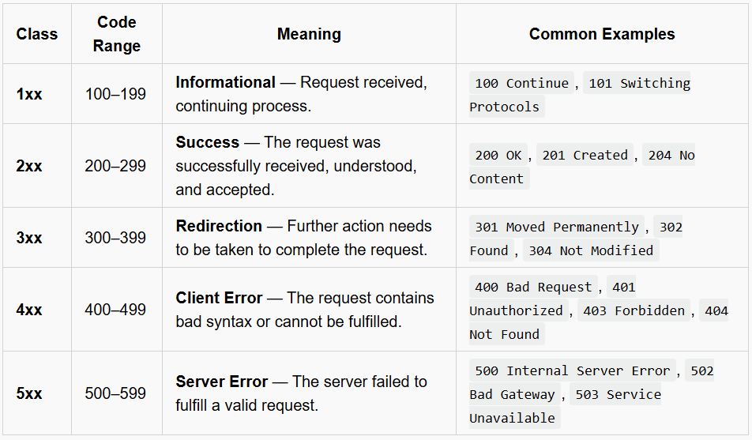

### Using Curl Command

```
curl -u natas22:d8rwGBl0Xslg3b76uh3fEbSlnOUBlozz \
--max-redirs 0 \
http://natas22.natas.labs.overthewire.org?revelio
```
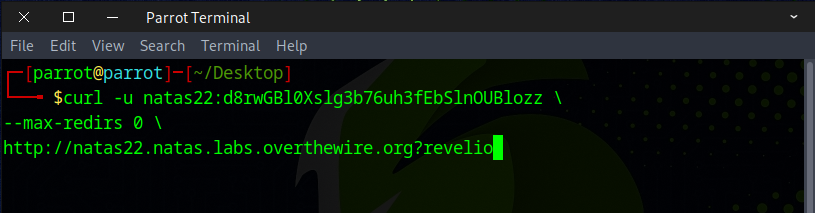

You should see the flag appear.

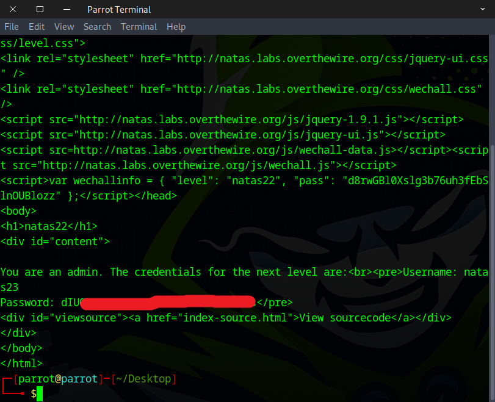

### Using Python Script

```
import requests


# Credentials for natas22
username = "natas22"
password = "d8rwGBl0Xslg3b76uh3fEbSlnOUBlozz"

# Target URL
url = "http://natas22.natas.labs.overthewire.org?revelio"

# Start a session to persist cookies and headers across requests
session = requests.Session()

response = session.get(
    url,
    allow_redirects = False, ## Do not automatically follow HTTP redirects (like 302)
    auth=(username, password)
)

print(response.text)
```

Verify that the file is executable and then execute it.


---

**In real-world scenarios**, you usually won’t have access to the source code and are unlikely to stumble upon something like "revelio" by chance. In those cases, you must rely on web crawlers and directory discovery tools with wordlists to find it.

## 🕷️ Web Crawlers

A **web crawler** (also called a *spider* or *bot*) is an automated tool that systematically visits web pages to discover and collect information.

### Common Uses
- **Search engines:** Index web pages for search (e.g., Googlebot).  
- **Data collection:** Gather public data for research or analytics.  
- **Monitoring:** Check site health, validate links, or create backups.

### How It Works
1. Starts from a list of **seed URLs**.  
2. Fetches pages and **parses links**.  
3. Adds new links to a **queue (frontier)**.  
4. Avoids duplicates and **respects rules in `robots.txt`**.  
5. Repeats periodically to keep data fresh.

### Example Tools
- Scrapy  
- Heritrix  
- Search engine bots (Googlebot, Bingbot)

---

## 🧰 Directory Brute-Force Tools

A **directory brute-force tool** (also called a *content discovery* or *directory/file fuzzer*) attempts to find hidden files, directories, and endpoints on a web server.

### Common Uses
- **Security testing:** Locate unlisted admin panels, backups, or API endpoints.  
- **Reconnaissance:** Enumerate the attack surface during penetration testing.

### How It Works
1. Uses a **wordlist** of common file or directory names.  
2. Sends **HTTP requests** for each possible path.  
3. Checks responses for valid content (e.g., `200 OK` vs `404 Not Found`).  
4. Optionally tests multiple **file extensions** and URL patterns.

### Example Tools
- Gobuster
- DirBuster 
- ffuf 
- wfuzz

---

## Popular GitHub Wordlist Repositories

Clone these to your machine and use them with directory fuzzers, password crackers, and reconnaissance tooling.

- **SecLists** — comprehensive collection for discovery, passwords, payloads, and more  
  `https://github.com/danielmiessler/SecLists`

- **FuzzDB** — payloads, fuzzing data, and wordlists for web app testing  
  `https://github.com/fuzzdb-project/fuzzdb`

- **PayloadsAllTheThings** — security payloads and small useful lists for exploitation & discovery  
  `https://github.com/swisskyrepo/PayloadsAllTheThings`

- **Probable-Wordlists / Weakpass** — various password corpora and probable password lists  
  `https://github.com/berzerk0/Probable-Wordlists`

- **dirb / dirbuster wordlists** — focused directory lists often used by DirBuster/dirb tools  
  `https://github.com/v0re/dirb` *(wordlists are commonly mirrored or bundled in many repos)*

---

## Typical Local Wordlists Locations on Kali Linux & Parrot OS

- **rockyou (compressed)**  
  `/usr/share/wordlists/rockyou.txt.gz`

- SecLists (when installed via package)  
  `/usr/share/seclists/`

Install SecLists (Debian/Ubuntu/Kali/Parrot):
```
## The size is close to 2 GB
sudo apt update
sudo apt install seclists
```

Fantastic! This flag is your key to the next challenge.


