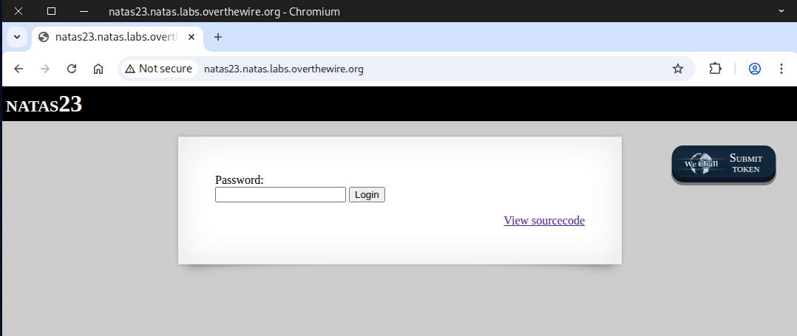
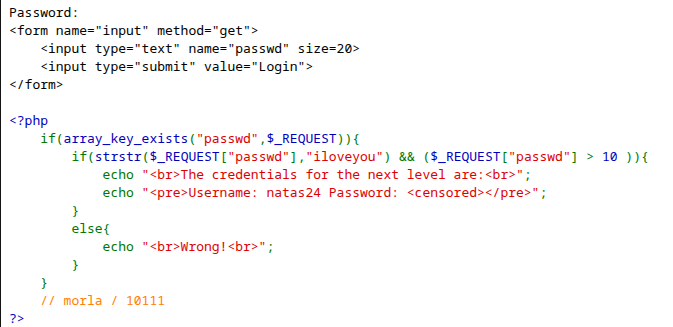
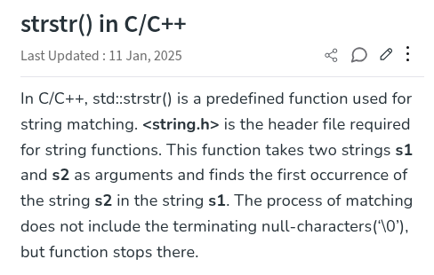
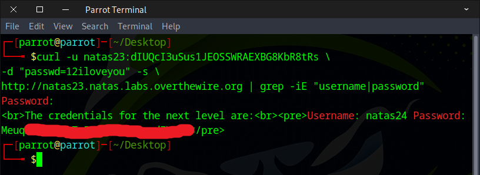

# 🕸️Natas Level 23 → Level 24

```
http://natas23.natas.labs.overthewire.org
```
Username: natas23  
Password: (natas23_password)



We examined the **source code** and observed the use of the ``strstr()`` function to check the password.



We Googled it to find out what the strstr() function does.  
https://www.geeksforgeeks.org/cpp/strstr-in-ccpp/



Next, we attempted to insert our payload.
```
http://natas23.natas.labs.overthewire.org/?passwd=11iloveyou
```


The flag was revealed.


Or, if you prefer the command line, you can use the `curl` command.
```
curl -u natas23:dIUQcI3uSus1JEOSSWRAEXBG8KbR8tRs \
-d "passwd=12iloveyou" -s \
http://natas23.natas.labs.overthewire.org | grep -iE "username|password"
```


### What’s going on here, and why does it work?

# PHP Type Juggling

**PHP type juggling** is PHP’s automatic conversion of values from one data type to another when performing comparisons or arithmetic operations.  
Since PHP is a loosely typed language, it attempts to interpret the type of a variable based on the context, which can sometimes lead to unexpected or insecure behavior.

---

## How Type Juggling Works

### 1. String ↔ Number Conversion

When comparing a string with a number, PHP converts the string into a number.  
Conversion rules:

- PHP stops reading the string at the first non-numeric character.
- If no number is found at the start, the value becomes `0`.

Examples:
```
"123abc" == 123 → true  
"42cats" > 10 → true  
"abc123" == 0 → true  
"hello" > 10 → false  
```

---

### 2. String ↔ Boolean Comparison

Loose comparisons between strings and booleans are especially risky:
```
"0" == false → true  
"" == false → true  
"false" == true → false  
"hello" == true → true  
```

---

### 3. The “Magic Hash” Issue

Strings that look like scientific notation (`0e…`) are converted into floating-point numbers during loose comparison.  
This caused real authentication bypasses.

Examples:
```
"0e12345" == "0e67890" → true  
```

Both values are interpreted as `0`.

---

## Why This Is Dangerous

Type juggling can cause:

- Authentication bypasses
- Incorrect numeric comparisons
- Unexpected logic behavior
- Security vulnerabilities when comparing user input

Example of unsafe comparison:

If a password check allows:
```
password == "0e123456"
```
An attacker could submit another string like ``"0e999999"``  
and it would still be considered equal.

---

## How to Avoid Type Juggling

### Use strict comparison

``=== (identical)``  
``!== (not identical)``

### Validate or cast input manually
```
(int)$value  
(float)$value  
ctype_digit()  
filter_var(..., FILTER_VALIDATE_INT)
```

### Optionally enable strict typing
```
declare(strict_types=1);
```

---

## Summary

PHP type juggling is the automatic type conversion system used by PHP.  
It can be convenient, but it becomes dangerous when loose comparisons are used with user input.  
Use strict comparisons and explicit validation to avoid unexpected behavior.

---


Flag secured! Ready for the next challenge?

