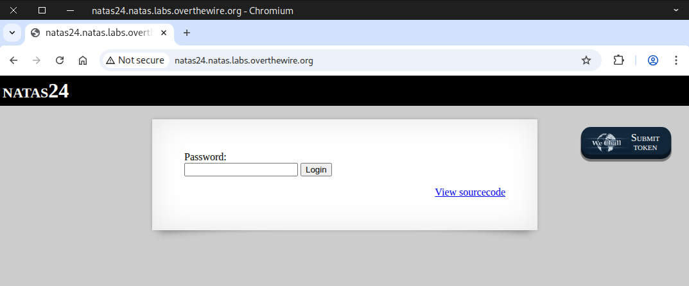
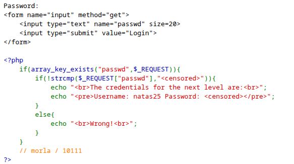
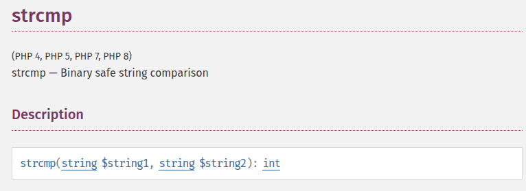
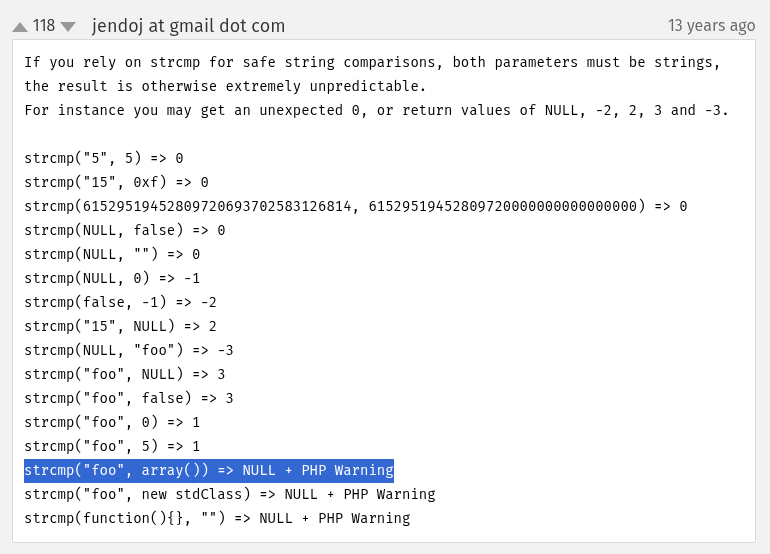
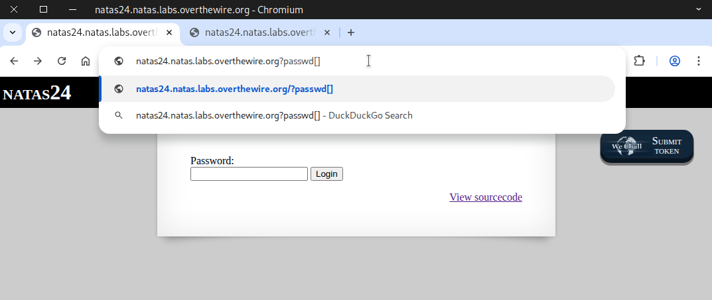
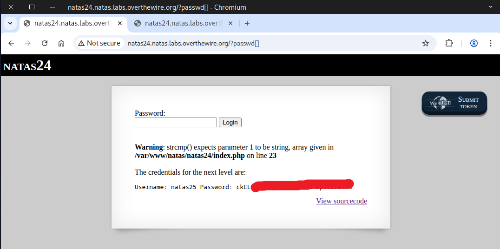
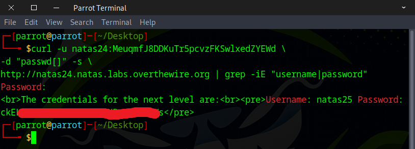

# 🕸️Natas Level 24 → Level 25

```
http://natas24.natas.labs.overthewire.org
```
Username: natas24  
Password: (natas24_password)



We examined the **source page** and noticed that the ``strcmp()`` function is used to verify the password.



We looked it up online to see what the ``strcmp()`` function does.
https://www.php.net/manual/en/function.strcmp.php




Next, we tried using an `array` instead of a `string` to compare and observed how the program reacted.



Then PHP displayed some warnings, and the flag appeared.



Alternatively, you can use the `curl` command if you prefer working from the command line.
```
curl -u natas24:MeuqmfJ8DDKuTr5pcvzFKSwlxedZYEWd \
-d "passwd[]" -s \
http://natas24.natas.labs.overthewire.org | grep -iE "username|password"
```


You got the flag! Let’s see what the next challenge has in store.


