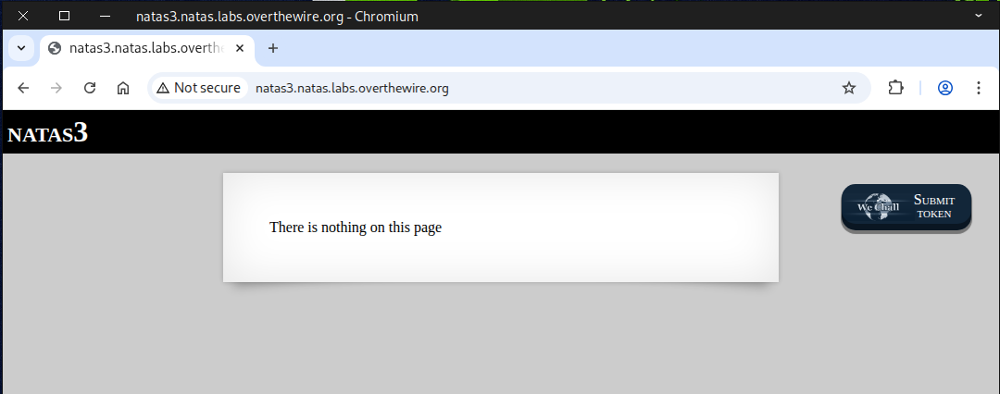
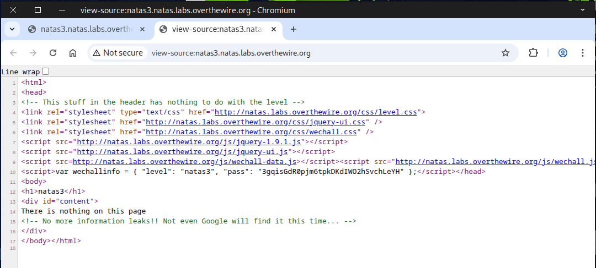
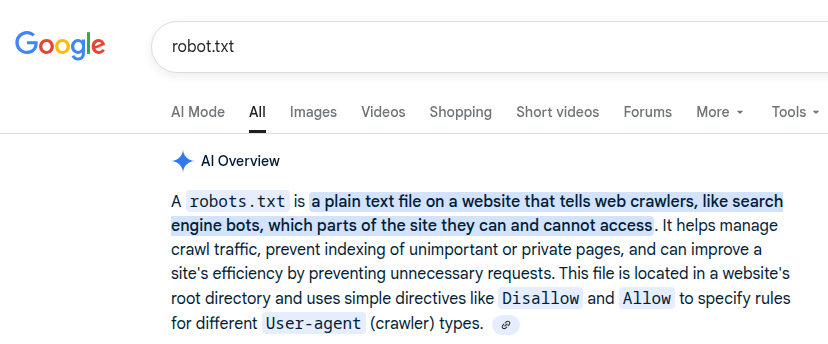
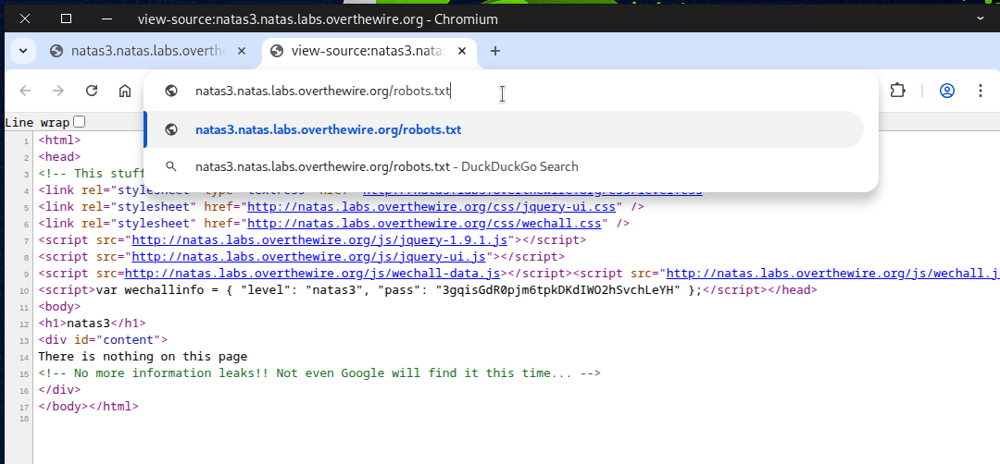
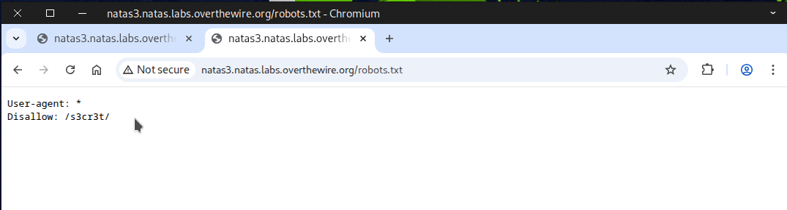
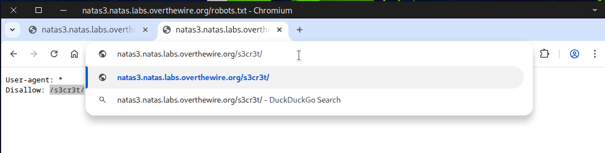
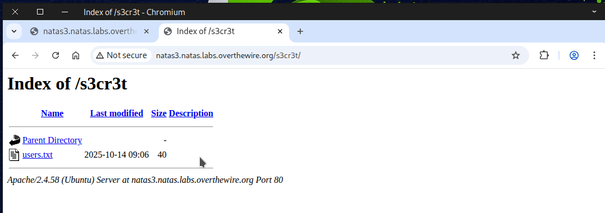
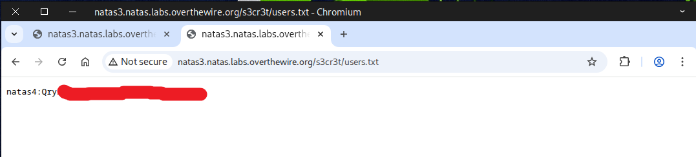

# 🕸️Natas Level 3 → Level 4

```
http://natas3.natas.labs.overthewire.org
```
Username: natas3  
Password: (natas3_password)



The clue says that not even Google will find it this time.



After a bit of digging, we found out what the `robots.txt` file is used for.



We then tried accessing it via the browser.



We discovered a directory named ``/s3cr3t/``.



So, we navigated to it through the browser.



There, we noticed a file called `users.txt`



Once we opened it, we found our flag.



Fantastic! This flag is your key to the next challenge.


